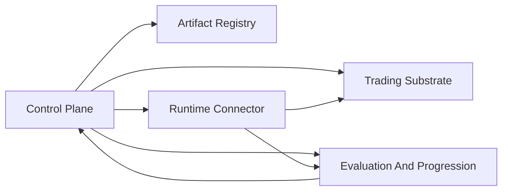

# Architecture

This page is the root technical overview for autokairos.

Product truth lives upstream in [wiki/product/README.md](wiki/product/README.md). Architecture must
not redefine user, market, product category, first wedge, live gate meaning, or bounded-control
posture.

## Technical Thesis

autokairos is a trader-system control plane, not a broad architecture encyclopedia and not the
trader-system backend author.

The active baseline is:

- `TraderSystemCandidate` is the durable candidate identity.
- `TraderSystemSpec` plus `TraderSystemProgram` plus `CapabilityPackage` defines what can be run.
- `TraderSystemProgram` is agent-authored executable behavior, not a human-authored strategy DSL.
- external agents can create or update trader-system artifacts; autokairos registers, deploys,
  observes, gates, evaluates, promotes, and controls them.
- `StageBinding` injects backtest, paper, or live environment values into the same artifact.
- `TraderSystemRuntime` is the deployed logical runtime; `RuntimePlacement` is replaceable physical
  execution.
- `RuntimeControl` covers register, deploy, start, pause, resume, stop, inspect, override, and kill.
- `RuntimeOperatingPolicy` bounds lifecycle, placement, trace, tool/gateway, recovery, stop, and
  audit posture without orchestrating internal trading steps.
- `TraderSystemRuntime` may call provider-backed `AgentSession`s internally through
  `RuntimeProviderAdapter`, but provider sessions do not own product truth.
- durable truth lives outside brain sessions, hands environments, process memory, and provider
  private memory.
- live authority runs through `OrderIntent -> GatewayDecision -> ExecutionAttempt`.
- traces are not counted evidence until external evaluation and evidence sealing.

## System Layers

### Control Plane

Owns durable candidate, artifact, binding, lifecycle, evidence, promotion, execution, operator
action, and audit truth.

### Artifact Registry

Owns `TraderSystemSpec`, `TraderSystemProgram`, `CapabilityPackage`, manifests, validation records,
versions, and provenance.

### Runtime Connector

Maps `TraderSystemRuntime` to `RuntimePlacement`, hands environments, provider sessions, trace
export, lifecycle commands, and physical recovery.

### Evaluation And Progression

Turns traces and run outputs into counted evidence, non-counted context, status meaning, and
promotion decisions.

### Trading Substrate

Owns Binance BTC perpetual futures market, account, risk, order-intent, order, fill, and liveness
surfaces behind stage bindings and gateway limits.

## Current Implementation Path

The current repo posture is a **docs-only reset baseline**. Implementation should start from:

1. [wiki/architecture/00-system-map.md](wiki/architecture/00-system-map.md)
2. [wiki/architecture/08-runtime-authority-model.md](wiki/architecture/08-runtime-authority-model.md)
3. [wiki/architecture/09-trader-system-runtime-operating-model.md](wiki/architecture/09-trader-system-runtime-operating-model.md)
4. [wiki/product/mlp-01/08-greenfield-bootstrap-plan.md](wiki/product/mlp-01/08-greenfield-bootstrap-plan.md)
5. [wiki/architecture/05-bootstrap-tech-spec.md](wiki/architecture/05-bootstrap-tech-spec.md)
6. [wiki/architecture/06-runtime-provider-adapter-feasibility.md](wiki/architecture/06-runtime-provider-adapter-feasibility.md)
7. the focused design note for the implementation concern being changed

## Current Baseline Rules

- Architecture implements product truth; it does not define product meaning.
- autokairos does not author trading logic.
- Specs are active only when current implementation still needs lower-level precision.
- ADRs and historical docs remain history unless explicitly called out as active baseline.
- Full marketplace, full Kubernetes clone, full A2A mesh, multi-venue breadth, and direct
  managed-agent provider lock-in are not MLP-01 baseline.

## Read Next

1. [wiki/product/mlp-01/00-mlp-brief.md](wiki/product/mlp-01/00-mlp-brief.md)
2. [wiki/product/mlp-01/prds/README.md](wiki/product/mlp-01/prds/README.md)
3. [wiki/architecture/README.md](wiki/architecture/README.md)
4. [wiki/architecture/00-system-map.md](wiki/architecture/00-system-map.md)
5. [wiki/architecture/08-runtime-authority-model.md](wiki/architecture/08-runtime-authority-model.md)
6. [wiki/architecture/09-trader-system-runtime-operating-model.md](wiki/architecture/09-trader-system-runtime-operating-model.md)
7. [wiki/architecture/specs/README.md](wiki/architecture/specs/README.md)
