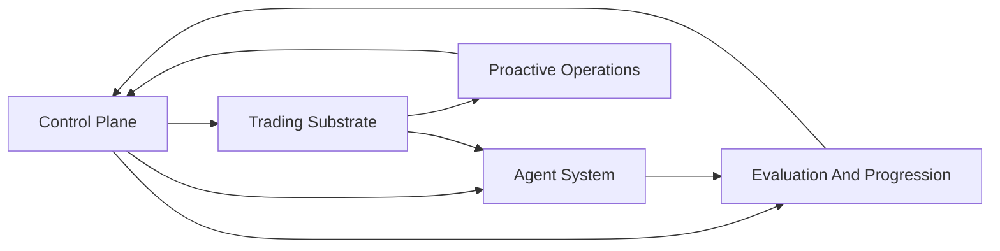

# Architecture

This page is the root technical overview for autokairos.

Product truth lives upstream in [wiki/product/README.md](wiki/product/README.md). Architecture must
not redefine user, market, product category, first wedge, live gate meaning, or autonomy posture.

## Current Architecture Input

The current architecture baseline implements only these locked MLP-01 PRD contracts:

1. [wiki/product/mlp-01/prds/01-trader-system-candidate-becomes-real.md](wiki/product/mlp-01/prds/01-trader-system-candidate-becomes-real.md)
2. [wiki/product/mlp-01/prds/02-candidate-becomes-externally-evaluated.md](wiki/product/mlp-01/prds/02-candidate-becomes-externally-evaluated.md)
3. [wiki/product/mlp-01/prds/03-bounded-live-trading-system-pod.md](wiki/product/mlp-01/prds/03-bounded-live-trading-system-pod.md)
4. [wiki/product/mlp-01/prds/04-live-pod-remains-controllable.md](wiki/product/mlp-01/prds/04-live-pod-remains-controllable.md)

Everything technical should now be read as downstream of those four PRDs.

## Technical Thesis

autokairos is a trading-system control plane, not a broad architecture encyclopedia.

The active baseline is:

- `TraderSystemCandidate` is the durable candidate identity.
- `TradingSystemImage` plus `CapabilityPackage` defines what can be run.
- `StageBinding` injects backtest, paper, or live environment values into the same artifact.
- `TradingSystemPod` is the running composite of image, package, binding, one or more
  `AgentRuntimeUnit` records, tool proxy, and external trace/evidence sinks.
- `AgentRuntimeUnit` owns provider/driver choice, so one pod can mix Codex, Claude Code, Claude
  Managed Agents, OpenClaw/ACP, local drivers, or A2A endpoints.
- Provider/driver choice must map to a concrete callable adapter surface; `Codex` or `Claude` as a
  label is not enough to start implementation.
- `PodCommunicationPolicy` is the single provider-neutral policy for communication, sharing,
  routing, and isolation across those runtime units.
- durable truth lives outside brain sessions and hands environments.
- live authority runs through autokairos gateway limits, not direct unrestricted agent credentials.
- custom tool results, outcomes, and traces are not counted evidence until an external evaluation
  boundary judges them.

## System Layers

### Control Plane

Owns durable `TraderSystemCandidate`, image, package, binding, evidence, promotion, execution,
wake, operator action, and audit truth.

### Agent System

Owns brain-session and harness-adapter behavior for proposing, running, and controlling
candidate-linked trader-system pods without owning durable truth.

### Evaluation And Progression

Turns traces and run outputs into counted evidence, non-counted context, status meaning, and
promotion decisions.

### Trading Substrate

Owns Binance BTC perpetual futures market, account, risk, order-intent, order, fill, and liveness
surfaces behind stage bindings and gateway limits.

### Proactive Operations

Turns live pod conditions into meaningful wake reasons and operator-control moments above runtime
self-report.

## PRD Support Matrix

| PRD | Main supporting subsystems |
| --- | --- |
| PRD 1: Trader-System Candidate Becomes Real | `agent-system + control-plane + foundation` |
| PRD 2: Candidate Becomes Externally Evaluated | `evaluation-and-progression + control-plane + foundation` |
| PRD 3: Bounded Live Trading-System Pod | `trading-substrate + agent-system + control-plane` |
| PRD 4: Live Pod Remains Controllable | `proactive-operations + control-plane + agent-system` |

## Current Implementation Path

The current repo posture is a **docs-only reset baseline**. Implementation should start from:

1. [wiki/product/mlp-01/07-implementation-plan.md](wiki/product/mlp-01/07-implementation-plan.md)
2. [wiki/product/mlp-01/08-greenfield-bootstrap-plan.md](wiki/product/mlp-01/08-greenfield-bootstrap-plan.md)
3. [wiki/architecture/05-bootstrap-tech-spec.md](wiki/architecture/05-bootstrap-tech-spec.md)
4. [wiki/architecture/06-runtime-provider-adapter-feasibility.md](wiki/architecture/06-runtime-provider-adapter-feasibility.md)
5. [wiki/architecture/01-pr1-trader-system-candidate-becomes-real-design.md](wiki/architecture/01-pr1-trader-system-candidate-becomes-real-design.md)
6. [wiki/architecture/02-pr2-candidate-becomes-externally-evaluated-design.md](wiki/architecture/02-pr2-candidate-becomes-externally-evaluated-design.md)
7. [wiki/architecture/03-pr3-bounded-live-trading-system-pod-design.md](wiki/architecture/03-pr3-bounded-live-trading-system-pod-design.md)
8. [wiki/architecture/04-pr4-live-pod-remains-controllable-design.md](wiki/architecture/04-pr4-live-pod-remains-controllable-design.md)

## Current Baseline Rules

- Architecture implements PRDs; it does not define product meaning.
- Specs are active only when current implementation still needs lower-level precision.
- ADRs remain history unless explicitly called out as part of the current baseline.
- Full marketplace, full Kubernetes clone, full A2A mesh, multi-venue breadth, and direct
  managed-agent provider lock-in are not MLP-01 baseline.

## Read Next

1. [wiki/product/mlp-01/00-mlp-brief.md](wiki/product/mlp-01/00-mlp-brief.md)
2. [wiki/product/mlp-01/prds/README.md](wiki/product/mlp-01/prds/README.md)
3. [wiki/architecture/README.md](wiki/architecture/README.md)
4. [wiki/architecture/00-system-map.md](wiki/architecture/00-system-map.md)
5. [wiki/architecture/specs/README.md](wiki/architecture/specs/README.md)
