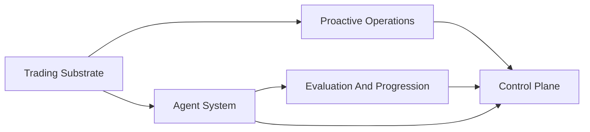

# Architecture

This page is the root technical overview for autokairos.

Product truth lives upstream in [wiki/product/README.md](wiki/product/README.md).

## Current Architecture Input

The current architecture baseline implements only these locked product contracts:

1. [wiki/product/mlp-01/prds/01-hypothesis-to-candidate.md](wiki/product/mlp-01/prds/01-hypothesis-to-candidate.md)
2. [wiki/product/mlp-01/prds/02-candidate-evaluation-and-live-gate.md](wiki/product/mlp-01/prds/02-candidate-evaluation-and-live-gate.md)
3. [wiki/product/mlp-01/prds/03-live-deployment-and-autonomous-execution.md](wiki/product/mlp-01/prds/03-live-deployment-and-autonomous-execution.md)
4. [wiki/product/mlp-01/prds/04-operator-trust-wake-and-intervention.md](wiki/product/mlp-01/prds/04-operator-trust-wake-and-intervention.md)

Everything technical should now be read as downstream of those four PRDs.

After the reduced architecture baseline is understood, implementation should start from
[wiki/product/mlp-01/07-implementation-plan.md](wiki/product/mlp-01/07-implementation-plan.md)
rather than from old subsystem-level implementation plans.

For PR1 specifically, the implementation shape is locked in
[wiki/architecture/01-pr1-path-becomes-real-design.md](wiki/architecture/01-pr1-path-becomes-real-design.md).

## Technical Thesis

autokairos is not currently documenting a broad architecture encyclopedia.

It is documenting the minimum technical baseline needed to implement one believable delegated live
path.

The active baseline is:

- durable truth outside runtime state
- explicit candidate, evidence, promotion, live, and wake boundaries
- one real first-venue trading path on Binance BTC perpetual futures
- bounded live execution within explicit limits
- meaningful wake and control recovery above routine live execution
- adapter-friendly seams without first-cut market broadening

## System Layers

### Trading Substrate

Keeps first-venue market, order, fill, account, risk, and liveness facts continuously available.

### Agent System

Turns governed requests into candidate-linked runtime behavior without owning durable truth.

### Evaluation And Progression

Turns raw history into counted evidence, candidate status meaning, and live-gate rationale.

### Proactive Operations

Owns meaningful wake generation and urgency semantics above the runtime.

### Control Plane

Owns durable candidate, evidence, promotion, execution, wake, operator action, and audit truth.

## PRD Support Matrix

| PRD | Main supporting subsystems |
| --- | --- |
| PRD 1 | `agent-system + control-plane + foundation` |
| PRD 2 | `evaluation-and-progression + control-plane + foundation` |
| PRD 3 | `trading-substrate + agent-system + control-plane` |
| PRD 4 | `proactive-operations + control-plane + agent-system` |

## Current Baseline Rules

- architecture does not redefine user, market, lovable proof, gate meaning, or autonomy posture
- specs are active only when current PRD implementation still needs lower-level precision
- ADRs remain history unless explicitly called out as part of the current baseline
- speculative proactive-standing, rebuild, read-admission, coalescing, and similar families are not
  part of the default read path

## Read Next

1. [wiki/product/mlp-01/00-mlp-brief.md](wiki/product/mlp-01/00-mlp-brief.md)
2. [wiki/product/mlp-01/prds/README.md](wiki/product/mlp-01/prds/README.md)
3. [wiki/architecture/README.md](wiki/architecture/README.md)
4. [wiki/architecture/00-system-map.md](wiki/architecture/00-system-map.md)
5. [wiki/product/mlp-01/07-implementation-plan.md](wiki/product/mlp-01/07-implementation-plan.md)
6. [wiki/architecture/01-pr1-path-becomes-real-design.md](wiki/architecture/01-pr1-path-becomes-real-design.md)
7. the subsystem README that matches the PRD you are implementing
8. [wiki/architecture/specs/README.md](wiki/architecture/specs/README.md) only when needed
9. [wiki/architecture/adrs/README.md](wiki/architecture/adrs/README.md) for decision history
