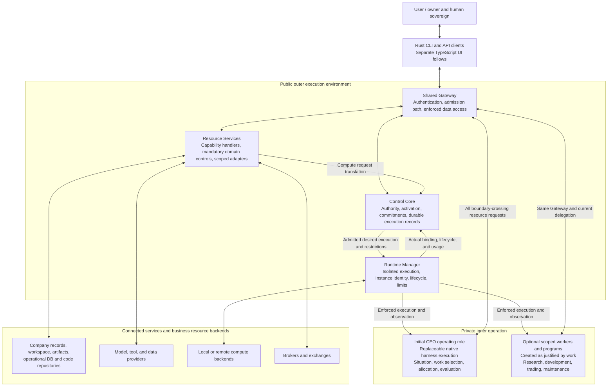

# Ouroboros Architecture

## Authority and Status

This is a proposed architecture and detailed design for review. It is subordinate to the
[Core Doctrine](CORE_DOCTRINE.md), [Sovereign Designation](SOVEREIGN.md),
[Whitepaper](WHITEPAPER.md), and [Product Specification](PRODUCT_SPECIFICATION.md).
Architecture adoption follows the existing reviewing pull-request rules. This document's
presence, review, or successful static checks do not establish adoption, operational delegation,
or permission to implement or deploy a runtime.

The design specifies responsibilities, interfaces in prose, state ownership, request and recovery
flows, an initial reference integration, and acceptance criteria. It creates no executable API,
type, schema, service, credential, repository split, or live financial authority. Its technical
choices remain replaceable under the governing sources. Astra is the intended implementation
agent, not a selected internal operating model.

The first implementation target is a Rust outer environment and Rust CLI, validated through
their API/CLI flow. The user interface is a separate TypeScript client of the same HTTP and event
contracts. This design pass specifies that first connection; it does not create those programs
or require a completed graphical console before the connection can be evaluated.

## 1. One Continuing Firm, Two Responsibilities

The firm is the continuing subject: the owner's economic interest, mandate, actual capital,
work, evidence, knowledge, and outstanding responsibilities. The owner provides initial capital
and decides additional contributions. Private operation allocates available resources within
that mandate, pursuing long-term growth in profits withdrawn and net capital remaining in operation.
Continued use of capital must have an economic case against realistic alternatives after all costs
and obligations, including costs paid separately by the owner.

Contributions and returned principal are not trading gains. Realized gains, unrealized value,
actual withdrawals, retained capital, and valuation uncertainty remain distinct. Withdrawal and
reinvestment allocate the same profit; it cannot be counted both outside and inside the firm.
Additional funding, retained earnings, recovery, or replacement cannot expand authority or reset
losses and obligations. Maintaining a method, waiting, reducing activity, and stopping work can
serve the purpose. Live trading is a condition of the operating product, not a requirement to
trade during every period or to use capital merely to test this environment.

- **Public outer execution environment:** provide controlled execution and resource access;
  enforce valid delegation; preserve attributable observations; support inspection, governed
  activation, effective restriction, and verified recovery.
- **Private inner operation:** select and organize work, allocate resources, research, trade,
  develop, evaluate, learn, and decide what to retain or stop within those conditions.

Private operation is a persistent operating system as well as replaceable agents and programs.
Its plans, organization, knowledge, methods, and economic interpretation outlive any one session.
The outer environment supplies the conditions and evidence for that operation without becoming
its economic decision-maker. Technical conformance, internal performance, and their connected
actual effects are three verification perspectives, not three execution layers.

One deployment represents one independently operated firm. Reusing public code for another firm
requires separate authority, capital, credentials, state, and operation; it does not establish
identical economic viability at another capital scale or cost base. Public source does not expose
company data or grant authority. Private source does not prevent legitimate evidence access.

## 2. Whole-System Structure

The outer environment has four logical components: **Control Core, Shared Gateway, Runtime
Manager, and Resource Services**. Identity, registry, policy, scheduling, and evidence are
responsibilities inside this structure rather than additional platforms to build. The diagram
shows responsibility and runtime interaction, not compulsory process counts or physical locations.

```mermaid
flowchart TB
    USER["User / owner and human sovereign"]
    CLIENT["Rust CLI and API clients<br/>Separate TypeScript UI follows"]
    subgraph OUTER["Public outer execution environment"]
        GATEWAY["Shared Gateway<br/>Authentication, admission path, enforced data access"]
        CORE["Control Core<br/>Authority, activation, commitments, durable execution records"]
        RUNTIME["Runtime Manager<br/>Isolated execution, instance identity, lifecycle, limits"]
        RESOURCE["Resource Services<br/>Capability handlers, mandatory domain controls, scoped adapters"]
        GATEWAY <--> CORE
        GATEWAY <--> RESOURCE
        RESOURCE -->|Compute request translation| CORE
        CORE -->|Admitted desired execution and restrictions| RUNTIME
        RUNTIME -->|Actual binding, lifecycle, and usage| CORE
    end
    subgraph INNER["Private inner operation"]
        WORK["Initial CEO operating role<br/>Replaceable native harness execution<br/>Situation, work selection, allocation, evaluation"]
        JOBS["Optional scoped workers and programs<br/>Created as justified by work<br/>Research, development, trading, maintenance"]
    end
    subgraph EXTERNAL["Connected services and business resource backends"]
        DATA["Company records, workspace, artifacts,<br/>operational DB and code repositories"]
        MODELS["Model, tool, and data providers"]
        COMPUTE["Local or remote compute backends"]
        MARKETS["Brokers and exchanges"]
    end
    USER <--> CLIENT
    CLIENT <--> GATEWAY
    WORK <-->|All boundary-crossing resource requests| GATEWAY
    JOBS <-->|Same Gateway and current delegation| GATEWAY
    RUNTIME -->|Enforced execution and observation| WORK
    RUNTIME -->|Enforced execution and observation| JOBS
    RESOURCE <--> DATA
    RESOURCE <--> MODELS
    RESOURCE <--> MARKETS
    RUNTIME <--> COMPUTE
```

Connected services are a separate dependency area, even when owner-operated on the same machine.
The Core's protected records belong to the execution environment; private business databases and
workspaces are resources accessed through it. A private service on a remote compute backend still
belongs to private operation and must preserve the same execution boundary.

All human and private client access goes through the same logical Gateway, including inspection,
management, internal service invocation, and resource use. Protected outer components use narrow
internal control/storage/observation interfaces; their own I/O is not recursively routed through
Gateway. Those interfaces are not an alternate entrance for users or private code.

| Component | Sole responsibility and boundary |
| --- | --- |
| Control Core | Current verified identity/delegation, restrictions, activation, aggregate commitments, admitted intent, desired execution, and protected records. Enforces allocation conditions without selecting economic allocations. |
| Shared Gateway | Authenticate callers, preserve delegation context, resolve meaningful operations, invoke current admission, and enforce actual resource/stream access. Neither a viewing link nor an agent-supplied name grants authority. |
| Runtime Manager | Execute admitted desired work, bind actual instances, enforce launch/resource/network conditions, observe and stop/fence execution. It alone manages the configured execution backend; it does not implement the agent's planning loop. |
| Resource Services | Implement capability-specific access, required domain enforcement, scoped provider credentials, effect observation, cost attribution, and reconciliation. Compute handlers translate into the Core-to-Runtime path, not a second provisioner. |
| Console and other clients | Present authorized views and submit commands through Gateway. They own neither policy nor a shared administrator identity that replaces the caller. |

## 3. Detail Map and Reading Order

Read the [shared contracts](docs/architecture/CONTRACTS_AND_STATE.md) before implementing a component.
They own common meanings; the following documents own their particular enforcement mechanisms.
A repeated example is explanatory, not a second definition of authority or state.

| Document | Design it owns |
| --- | --- |
| [Contracts and State](docs/architecture/CONTRACTS_AND_STATE.md) | Principal, work, desired execution, actual instance, session, intent, attempt, effect; first routes, result/error classes, SSE cursors, and state-transition meaning. |
| [Control Core](docs/architecture/CONTROL_CORE.md) | Authority and credential changes, relational constraints and writers, atomic admission/reservation, dispatch/revocation ordering, approved wake conditions, and protected recovery state. |
| [Gateway](docs/architecture/GATEWAY.md) | Shared authenticated entry, control/resource routes, enforced data paths, streams, service delegation, and management capacity. |
| [Runtime](docs/architecture/RUNTIME.md) | Launch profiles, actual instance binding, native harness execution, isolation, lifecycle, resource deadlines, and fencing. |
| [Resource Services](docs/architecture/RESOURCE_SERVICES.md) | Workspace, DB, model/MCP, compute and investment semantics, provider effects, scoped credentials, and reconciliation. |
| [Observability and Console](docs/architecture/OBSERVABILITY_AND_CONSOLE.md) | Evidence collection, provenance, retention/redaction, authorized projections, control status, and observation health. |
| [Integration and Deployment](docs/architecture/INTEGRATION_AND_DEPLOYMENT.md) | Rust modules/processes, native integration, actual privilege and credential holders, Mac/Linux placement, dependency qualification, startup, backup and restore. |
| [Validation](docs/architecture/VALIDATION.md) | Requirement coverage, positive workloads, fault injection, expected records and denials, and future implementation acceptance. |

## 4. Authority and Execution Boundary

People, agents, and services use one principal/action/resource authorization model. Human sign-in
and Runtime-bound workload identity differ; authorization follows verified role bindings and
current delegation, conditions, expiry, resource commitments, and domain rules. Roles are scoped
permission sets rather than a numerical rank, and human identity is not a policy bypass.

The sovereign's reserved powers retain the designation and scope requirements of SOVEREIGN.md.
Ordinary role administration cannot create or transfer them. A caller's permission to act does
not imply permission to grant, evaluate, activate, or enlarge that permission. A delegated
service preserves the originating caller's authority context or identifies its separately
admitted standing work; it cannot silently lend a caller its broader service role.

The first human CLI uses mTLS. A validated certificate must have a current explicit binding to
an existing human principal; neither a certificate name nor a trusted CA creates that principal's
grants or sovereign status. Registration, replacement, and credential revocation use the same
Gateway control path and remain distinct from delegation changes. Protected internal services
authenticate separately and cannot substitute their service role for the originating caller.

Runtime binds an actual instance to its package, launch profile, generation, and verified access
channel. A private-supplied actor/session name is not authentication. Each independently assigned
company agent has its own admitted execution environment, work area, session where applicable,
bounded delegation and termination lifecycle. Native helper subagents may share their parent's
environment and restriction boundary; their names do not establish another independent company
agent. The [Runtime contract](docs/architecture/RUNTIME.md#responsibility-and-desired-execution)
owns that distinction. Separate instance bindings and scoped grants remain necessary even when
instances share one logical principal. More children, sessions, accounts, or capital do not create
additional aggregate allowances.

Reuse the frontier provider's native agent loop, sessions, context handling, tools, skills,
subagents, and event interfaces. Keep the harness, private hooks, arbitrary tools, and descendants
inside controlled execution; the trusted outer launcher does not import private code. The native
harness and its compute can occupy separate constrained instances when the integration supports
that distinction. Calling a nested sandbox is a resource request, not permission to obtain backend
administration credentials. Ordinary programs and internal servers follow the same boundary.

The initial profile restricts direct network, DNS, IPv6, metadata, host/sibling access, host mounts,
runtime sockets, and provider credentials. Already delivered working copies and scratch can be
used locally under resource limits. Shared, persistent, and external access remains mediated,
including native model/tools, downloads, background activity, telemetry, and descendants. Native
configuration and cooperative hooks are not the sole enforcement boundary.

The first Docker profile starts with `network none`. A trusted, nonprivileged per-instance bridge
joins only its verified network namespace, exposes a bounded loopback entry, and forwards to a
fixed Gateway Unix socket. It does not share private PID or mount namespaces. Gateway combines
the bridge's kernel peer credentials with Runtime's registered process lifetime, instance,
generation, and channel binding; a copied token or reused PID alone is insufficient. Private code
receives neither the upstream socket nor bridge configuration, provider credentials, or backend
control. [Runtime](docs/architecture/RUNTIME.md) specifies the bootstrap, identity, and isolation checks.

Only the supervisor holds general Docker management authority. An independent trusted guard gets
an already opened kill FD for one unique workload cgroup and a fixed deadline, not the Docker
socket or arbitrary target selection. Its deadline cannot be extended by token renewal, bridge
replacement, or an active session; continuation needs a newly admitted successor. No business code
starts before the guard is armed and identity, input permissions, and isolation are verified.
Termination request, signal delivery, observed process disappearance, and remote obligations stay
separate. Host/VM suspension and kernel failure require explicit qualification; this design does
not assert that a userspace guard solves them.

Gateway can use resource-specific bulk/stream workers; model tokens and file bytes do not pass
through the Core. Returning a usable backend credential, direct storage URL, database connection,
or host mount is not a shortcut around mandatory mediation. Protected connectors keep scoped
credentials and actual target binding outside private execution.

## 5. Connected Operating Flows

### First Work and Resource Use

The owner establishes purpose, accepted boundaries, and valid delegation. Private operation then
selects work under those conditions. Gateway authenticates a request; Core atomically admits its
intent and required shared commitment; Runtime creates and binds the instance; private work uses
permitted resources through Gateway. Material results return with attributable evidence. Private
operation interprets them, chooses subsequent work, and preserves its knowledge and rationale.

The first connected fixture follows this exact path:

1. An already registered human uses the Rust CLI over mTLS to inspect `GET /conditions`, register
   an authorized fixture with `POST /work`, and submit `POST /executions` with fixed profile,
   current delegation, permitted inputs, and bounds. `202` identifies durable acceptance and a
   desired `execution_id`; it does not assert an actual instance exists.
2. Core commits authority checks, shared reservations, the intent, and dispatch record together.
   Runtime obtains its current claim, creates the isolated instance with the bootstrap waiter,
   establishes the bridge and independent guard, and materializes only currently admitted input
   content. It releases the actual Codex App Server after the readiness checks.
3. Codex reads identified workspace input and uses its activated native model path through
   Gateway. The same fixture adds the prepared DB query `read_input`, the transaction
   `record_result`, and one controlled MCP tool; all retain the original caller's authority.
4. The instance creates an upload, transfers its fixed content, then requests a separate workspace
   publication using the expected revision. Staged bytes are not yet published business state.
   The DB write and its protected receipt share a DB commit; publication's manifest and receipt
   share a metadata commit. Core observes those outcomes through their owners.
5. The user inspects work/execution/intent snapshots and their status events, steers or stops the
   named execution, and tests delegation revocation. Accepted restriction is separate from
   observed application. Stopping one execution does not revoke its whole delegation; revoking
   the delegation prevents successors using it.
6. Under remaining valid or explicitly re-established authority, a fresh `POST /executions` with
   the same work and predecessor/checkpoint references resumes the fixture in a new instance.
   Fencing, current read permission, and reconciliation precede recovery. Old attempts, costs,
   result receipts, and obligations are preserved; recovery is not an automatic permission grant.

The [common contract](docs/architecture/CONTRACTS_AND_STATE.md#first-connected-routes) owns exact
paths and result semantics. [Gateway](docs/architecture/GATEWAY.md) maps CLI commands to those paths;
no Console-only administrator route or direct database command is part of this flow.

For effectful resource operations, the assigned worker obtains a current, single-attempt dispatch
claim tied to fixed input, target/account, configuration, and instance. A response can establish
acceptance, a result, or uncertainty. Requests, execution attempts, and the resulting external
resources/obligations have different lifetimes. The shared contract determines retry and release:
no blind new effect after an ambiguous response, and no automatic release of a dispatched
commitment merely because a process, session, or lease ended.

### Persistent Private Operation

Private owns situation assessment, work discovery, allocation, organization, investment decisions,
learning, and method changes. Purpose relevance, actual authority, and a current resource case
remain distinct requirements, including indirect maintenance, research, and recovery. Neither
activity volume nor a running loop earns further resources.

Private can submit bounded timer/event/dependency wake conditions. The outer scheduler persists
and delivers those conditions and rechecks current authority before execution; it does not invent
an agenda or execute private planning logic in Core. Duplicate delivery cannot create fresh
allowances. A successor may make a different justified decision without losing its predecessor's
records. Every trade need not trigger a model call, and long research must not unnecessarily block
independently authorized management of existing obligations.

### Initial Private Operation: One CEO Role

Start private operation with one company-wide operating responsibility, called the **CEO role**.
It is an initial organizational choice, not a legal office, a sovereign principal, an extra outer
component, or a permanently running process. The owner supplies the purpose and valid mandate;
the assigned agent leads day-to-day operation within it. The role can be carried by successive
bounded executions of a native frontier harness. No internal model or fixed staff hierarchy is
selected by this choice.

| Responsibility | Initial arrangement |
| --- | --- |
| Purpose, capital contributions, reserved authority and appointment | The owner establishes the mandate and operating assignment under the governing rules. A CEO title supplies no authority to amend them. |
| Situation, work and allocation | The CEO reads current conditions and company records, identifies needs, chooses justified work, and performs it or delegates within actual authority. |
| Company continuity | Work, decisions, artifacts, costs, knowledge and unresolved responsibilities persist independently of the current agent's memory or native session. |
| Environment and controls | The existing four outer components provide execution, resource access, enforcement and evidence. They do not choose the firm's agenda or evaluate its economic prospects. |

The initial operating cycle is:

1. **Take responsibility:** inspect the current assignment, delegation and limits; reconcile
   company records with actual executions, receipts, obligations and observation gaps. On the
   first start, absent history is an explicit initial condition, not invented prior performance.
2. **Choose:** separate purpose relevance, current permission and the resource case. Select
   bounded work with expected evidence and conditions for review, continuation or cessation.
   Preserve the option to keep a method, wait, reduce activity or stop unnecessary work.
3. **Act:** use available company resources, work directly or request scoped workers through
   Gateway. Additional workers share applicable limits and are created for a demonstrated need;
   the owner need not dispatch each task or approve each already delegated operation.
4. **Assess and retain:** connect results and costs to observed effects, preserve contrary
   evidence, update company knowledge and record the next allocation decision. Successful
   activity, valid learning and favorable owner economics remain different judgments.
5. **Continue or wait:** register a justified, bounded timer/event/dependency condition, or finish
   this execution with explicit pending responsibilities. A wake starts a current-authority
   check; it does not renew the mandate, reset a budget or extend an instance's hard deadline.

The CEO can discover a missing service, prepare an adapter and pursue its verification under the
[same managed adoption path](docs/architecture/RESOURCE_SERVICES.md#agent-led-discovery-adoption-and-operation)
as company-provided tools. Existing connections should be considered before building replacements.
New rights, personal authentication or reserved owner decisions are presented with a concrete
scope and prepared evidence. Routine work continues where its authority and dependencies permit.
Submitted code, coordinator status and agent agreement never substitute for independent acceptance.

One operating coordinator does not serialize every business operation through a CEO model call.
Workers and ordinary programs use their own admitted work and the same Gateway. Their scope,
handoff evidence and stop conditions matter; permanent departments and extra managerial agents
are introduced only when their benefit justifies their cost. An agent may evaluate its business
results, but cannot be the sole verifier and acceptor of its own candidate or control change.

[Operating responsibility and handover](docs/architecture/CONTRACTS_AND_STATE.md#operating-responsibility-and-handover)
defines the current decision writer and retained records. A replacement must not race an old
writer or reinterpret a restored session as authority. Independently authorized child work and
existing obligations retain their own lifetimes; any actually revoked ancestor still fences its
descendants. [Owner oversight](docs/architecture/OBSERVABILITY_AND_CONSOLE.md#operating-responsibility-and-owner-oversight)
connects the CEO's explanation to the underlying evidence and effective controls.

This is the first private operating design after environment qualification. The current API/CLI
fixture remains an environment test, not an implemented CEO or proof of economic operation.
[CEO operating validation](docs/architecture/VALIDATION.md#ceo-operating-profile-validation)
specifies the additional proof, including replacement, before this profile may be claimed to work.

### Generated Artifacts, Admission and Space

Private operation can build the code, tools, data and methods it needs. The outer environment
provides governed storage and execution for that work. The CEO selects justified work and resources;
it neither operates the backend directly nor approves each ordinary file edit or local command.

The connected path is: **request bounded work space -> create and test privately -> retain exact
content -> separately publish a company revision -> admit the intended use -> observe its effects
and retain or retire its resources**. Only the steps required for that use apply. A local experiment
can finish in its existing sandbox; a new managed tool must also complete acceptance and activation.
Internal publication is not public release. An accepted artifact or a free disk does not itself
grant permission to run code, spend capital, expose an endpoint or broaden access.

Use three space lifetimes: instance-local working/scratch space, durable company workspaces, and
separately retained service data. They reuse current Core reservations, Runtime enforcement and
file/DB handlers. The agent receives logical resource references and governed access. Physical
placement comes from the deployment binding, so this contract applies to the owner's current
machine as well as another qualified environment. The company retains useful content and evidence
across executor replacement; stopping a process does not automatically delete or settle its assets.

The current logical retirement path uses the same Gateway and registered file target: an authorized
caller may retire one upload reference, retire one eligible revision or close workspace writes at
an expected head. Policy identity/revision and reason are explicit. Closing a workspace preserves
its contents and holds; only Core's confirmation of that closure returns its writable-workspace
slot. A separate explicit collection request can remove an exact retired binary object and return
its original byte charge only after a matching confirmed receipt. Every progress step requires
current authority; a replay does not automatically retry deletion. The
[retirement contract](docs/architecture/CONTRACTS_AND_STATE.md#logical-reference-retirement)
and [collection contract](docs/architecture/CONTRACTS_AND_STATE.md#explicit-object-collection)
define the API/CLI selectors and receipt recovery. An actual company agent still has its own
admitted runtime environment; a durable workspace is a company resource, not that agent or runtime.

The [artifact-use contract](docs/architecture/CONTRACTS_AND_STATE.md#artifact-use-and-allocated-space)
distinguishes ordinary private execution from managed capability adoption and trusted platform
changes. [Resource Services](docs/architecture/RESOURCE_SERVICES.md#generated-artifact-workflow-and-space)
connect preparation, storage and service data, while
[Runtime](docs/architecture/RUNTIME.md#private-builds-and-artifact-backed-execution) owns actual
execution and confinement. The first proof follows one internally built script from local testing
to a company revision and separate job, then checks that managed tool exposure remains blocked
before acceptance. That full [additional workflow](docs/architecture/VALIDATION.md#generated-artifact-and-space-validation)
remains NOT RUN. The implemented binary storage and
[bounded program subset](docs/architecture/VALIDATION.md#artifact-backed-program-implementation-evidence)
do not by themselves qualify managed capability adoption or persistent service management.

### Observation, Restriction, and Recovery

Management follows one work-centered path: list currently visible work, inspect its linked
artifacts/resources and source evidence, submit the specific permitted decision, observe actual
application, and restrict or retire the exact target when needed. The
[management contract](docs/architecture/CONTRACTS_AND_STATE.md#work-centered-management-contract)
and [CLI mapping](docs/architecture/GATEWAY.md#work-centered-management-client)
connect these steps. There is no universal approve/run/delete command: technical acceptance,
authority, activation, execution and physical reclamation remain different facts. The first
management client is API/CLI; a future console uses the same authenticated commands and evidence.

Company views connect work to principal/instance, intent/attempt, artifacts, provider effects,
usage, costs, and subsequent private interpretation. Native explanations/traces, Runtime
observations, and Gateway/provider confirmation remain distinguishable. Missing, stale, or
contradictory observations are not inactivity, success, zero cost, or restored control.
Observability does not promise access to a model's hidden internal computation.

Control distinguishes requested, accepted, enforcement observed, and remaining effects. Restriction
and observation retain bounded processing capacity so ordinary workload traffic cannot starve
legitimate control. Console failure permits another authenticated client through the same Gateway;
Gateway/Core failure does not open a privileged alternate company API. Runtime follows already
authorized containment, and the infrastructure owner can restrict the host without thereby settling
remote obligations or changing company permissions.

Recovery preserves current authority, commitments, pending effects, source evidence, and actual
configuration; fences old instances; reconciles actual providers; and then admits a successor.
Native sessions/checkpoints assist continuity but cannot restore old permission or erase later
fills, bills, and revocations. An old backup requires current-state reconciliation before dependent
resumption. Outer recovery authority covers existing effects and authorized containment, not new
trading or resource creation. Unaffected authorized work may continue when its prerequisites remain valid.

## 6. Dependencies, Investment Enforcement, and Change

Keep three replaceable seams: native harness integration, execution backend, and resource provider.
Public contracts preserve capability meaning; provider SDKs belong in the relevant integration.
Private operating logic does not depend on outer storage internals or administration APIs.
Native SDK dependencies inside private execution are an intended part of this design.

Investment enforcement is mandatory for actions affecting financial authority, capital, exposure,
or obligations. It binds to real targets/accounts/credentials and meaningful effects, not a tool's
chosen label. Generic HTTP, MCP, SQL, shell, or another connector cannot bypass it. Several routes
to the same account/asset must reconcile aggregate commitments without duplicate balances or costs.
A compatible interface does not establish provider fitness, identical results, or permission.

Registry discovery, package publication, verification, activation, and caller permission are
separate. Core admits configuration changes under current authority and independent evidence;
Runtime and connectors report what actually became active. A candidate or control author cannot
be its sole proposer, evaluator, and acceptor. Votes or multiple agent names do not independently
establish validation. Retain favorable, null, negative, and contradictory evidence with rationale.

Bound dependency retries, resources, credentials, data, and failure propagation. Removing or
replacing a connector does not extinguish its orders, positions, resources, charges, or evidence.
Secret redaction and export controls preserve necessary restricted originals and provenance while
preventing observation from becoming credential distribution. Protected source evidence cannot be
rewritten through a private knowledge edit or a replacement projection.

Economic outcome, AI-led operation, AI contribution, conditional earning ability, and the next
allocation case remain separate judgments. The outer environment can execute evaluation tools and
preserve their outputs; private operation and existing sovereign rules own the economic criteria
and consequential choices. Changes to evaluation and outer enforcement need their own accountable
review. Financial pressure cannot create new authority or a duty to recover past losses.

Retiring the firm is a sovereign decision. Stopping new work, confirming execution and positions,
resolving remaining obligations under valid authority, accounting for costs/capital, and preserving
records are distinct responsibilities. No shutdown or code rollback reverses market history.

## 7. Initial Reference Integration and Evidence Limits

The first design target is native Codex App Server over local stdio, preserving its supported
lifecycle and original model protocol through Gateway. On Mac, use a dedicated Lima VZ Ubuntu
24.04 LTS guest with no development-home sharing and explicit Gateway access. The Linux design
uses the same execution contract on one active host. Docker Engine is the initial execution-backend
candidate; only Runtime's trusted backend machinery controls it. PostgreSQL 18.6 is the current
reference for protected/operational state with separate databases/roles; large artifacts and native
session material use a protected local store. These are reference choices, not installed components.

Persistent storage belongs to the firm deployment and survives removal of a development checkout
or replacement of a worker, native session, or VM installation. The file service enforces content
access, immutable publication, retained references and authorized cleanup; private operation owns
business meaning and retention requests. Git worktrees, build caches and source-audit notes remain
development storage and do not become the firm's historical record by sharing a directory.

The Mac storage proposal uses an explicitly enrolled external APFS runtime volume, isolated from
development-cache capacity, a replaceable VM boot disk, and an independent raw data disk with
separate protected-state and large-content filesystems. Service roots, endpoints, credential
references and capacity are injected through a validated environment binding; the local Mac and
SSD are one profile, not baked-in product defaults. Roots and peers remain fixed within that active
binding, while private code uses logical resource identities. No private workload receives the external volume or whole
store as a writable mount. Host-volume, guest-filesystem and firm/store identities are verified
independently; a missing mount never falls back to an empty local directory.

Retained content requires durable catalog holds. Publication and cleanup serialize against the
same object generation so that concurrent deletion cannot invalidate an accepted result. Storage
growth requires both delegated capacity and verified backing headroom. Cold, coherent recovery
sets and current-authority reconciliation are distinct from snapshots and copied VM images.
The first reference supports interrupted maintenance and verified recovery, not automatic failover.
Read the [persistent storage contracts](docs/architecture/CONTRACTS_AND_STATE.md#persistent-storage-identities-and-lifetimes)
and [deployment storage profile](docs/architecture/INTEGRATION_AND_DEPLOYMENT.md#persistent-storage-deployment-profile)
before changing storage placement. The current local fixture and external SSD connection do not
qualify this lifecycle, large binary streaming, retention, or recovery behavior.

Core, Gateway, Runtime, resource handlers, and CLI are designed as modules in one Rust Cargo
workspace. Tokio, Axum/Tower/Hyper, SQLx, and rustls/tokio-rustls provide the first asynchronous,
HTTP/SSE, PostgreSQL, and TLS foundation. Privilege and credential boundaries determine separate
processes, not the workspace layout. Runtime alone uses a replaceable Bollard adapter against an
explicit Unix socket; environment-discovered endpoints and automatic backend substitution are
not accepted. TypeScript UI code uses only the public contract, never backend or DB types.

Gateway combines narrow company admission/resource handlers with replaceable agentgateway protocol
workers. If required native fields, streams, context or tool behavior cannot be preserved, use the
specified native HTTP forwarding alternative under identical controls; do not call disabling the
required feature a successful integration. No provider/model auto-substitution is a default.

The first native profile requires automatic request/stream replay to be disabled and verified for
the actual harness build. Configuring retry counts to zero is only a candidate: separate connection
recovery, authentication retry, or transport fallback can still send another request. Uncontrolled
replay blocks that profile. Identical prompt bodies do not establish duplicate effect identity,
and neither Rust nor a local request key proves provider-level exactly-once behavior.

The application responsibilities do not imply exactly three processes. Deployment groups code by
credentials, privileges, untrusted execution, dependency conflicts, and failure containment.
Initial availability is interruption followed by verified recovery, not automatic multi-host failover.
A Docker workload shares the Linux kernel with its host; the enclosing Mac VM does not provide a
separate kernel between private workloads and outer services. This limitation is explicit and
requires deployment qualification rather than a blanket production-security claim.

The App Server documentation includes experimental/production-support limitations as well as
supported local interfaces. Therefore it is the first conformance candidate, not an approved live
capital runtime. Required version, support, regional/cost conditions, and remaining qualification
steps are specified in [Integration and Deployment](docs/architecture/INTEGRATION_AND_DEPLOYMENT.md)
and [Validation](docs/architecture/VALIDATION.md). Confirm them for the actual build before activation.

## 8. Acceptance and Handoff

The first connected workload must complete the API/CLI flow above under valid test delegation:
discover resources, obtain files, use the prepared database operations and real native harness,
call the controlled tool, request bounded compute, upload and separately publish an artifact,
expose attributable execution, and stop/revoke/recover with continuing responsibility.
A private reference workload tests the environment; it does not fix the future firm's organization
or strategy. Deterministic effect fixtures precede actual financial integration.

[Validation](docs/architecture/VALIDATION.md) maps required behavior to owning documents and concrete
positive/failure scenarios. It covers equal human/agent authorization, indirect service delegation,
real native capabilities, forced Gateway access, concurrent commitments, uncertain provider effects,
restriction during active work, storage/clock failures, stale restoration, governed change, evidence
access, and whole-firm economic distinctions. Native harness portability requires another actual
harness to pass its relevant checks; Mac/Linux portability likewise requires execution evidence.

It also specifies Gateway-added latency percentiles, throughput, memory, stream backpressure,
and control responsiveness under load, separating provider time from the environment's own cost.
Required budgets and service targets must be accepted before those measurements can qualify a
profile. All implementation scenarios remain **NOT RUN** during this documentation task. Once
the contracts and this review are complete, the next technical step is the first connected
implementation and its conformance tests, subject to the existing adoption rules; a failing
boundary disables its affected profile rather than silently relaxing authority or isolation.

The documentation delivery establishes a reviewable design, not observed runtime behavior or
profitability. Required operational values and model/market/capital choices are explicit inputs;
missing inputs do not create permissive defaults. The public/private code split remains a future
implementation action, not a repository migration performed by these documents.

When publication is requested, use the reviewing pull request for scope, rationale, coverage,
independent review, validation, and adoption status. Document authoring neither requests nor records
adoption. No Issue, PR, commit, deployment, credentials, or financial effects are created by this
local documentation task.

## Local Implementation Boundary

Local implementation has separate owner authorization and does not change the proposal/adoption
status above. The Rust implementation has connected human CLI -> Gateway -> Core admission ->
Runtime container creation -> instance bridge -> Gateway resource access in a dedicated Linux
test environment. Recorded tests include actual pinned Codex execution with synthetic model/MCP
responses, file reads, a prepared DB result/receipt, upload, separate publication, scoped historical
inspection, revocation and observed termination. These results qualify particular local test paths;
they do not establish a fully implemented outer environment or an integrated real provider.

Common actor management, scoped work hierarchy and listing now have connected Linux evidence:
two actual Runtime-created instances sharing one logical principal retained distinct grants,
work scopes and kernel-bound channels. The private CLI exercised management and shared admission;
Gateway denied stopped/revoked instance access while its container still ran, and Runtime then
confirmed termination. The [management evidence](docs/architecture/VALIDATION.md#common-management-implementation-evidence)
records the trusted test-driver boundary and exact scope. These Docker containers share the guest
kernel; the test does not establish separate kernels or a native autonomous agent workflow.

The current local implementation goes beyond the initial slice above. Binary artifacts, workspace
allocation, reference retirement and collection have dedicated code and validation. Native
checkpoint handoff and successor execution have been exercised with the actual Codex binary and
synthetic model responses. Managed adapters and bounded persistent services use the governed
submission/verification/acceptance/activation path; credential use remains in trusted external
workers. These are local test qualifications, not unrestricted provider or production acceptance.
See [native continuation](docs/architecture/VALIDATION.md#native-checkpoint-continuation-after-clean-database-restart),
[service continuity](docs/architecture/VALIDATION.md#service-db-commit-survives-lost-completion-and-instance-replacement),
and the surrounding component evidence for the exact scope and failures retained.

The product service command now renders and installs an exact reviewed bundle, starts and stops
control/Runtime phases, inspects original installation records and reconciles the tested same-boot
interrupted start/stop cases. Its [installation and execution evidence](docs/architecture/VALIDATION.md#installed-bundle-to-actual-native-execution)
is separate from proving that the selected persistent storage and owner authority are ready.

Prepared recovery archives can be encrypted, authenticated, inventory-verified and staged without
applying archived privileges. [Restoration tests](docs/architecture/VALIDATION.md#isolated-staging-and-postgresql-file-restoration)
restored the four current database schemas, retained content and unresolved records. A restricted
[Core/Gateway inspection path](docs/architecture/VALIDATION.md#recovery-inspection-restriction-implementation)
then passed actual mTLS reads, rejected writes/other identities and expiry while preserving those
records. This does not establish current owner authority, fence an old deployment or activate a
recovered company. Ordinary startup from restored data remains unqualified.

The remaining completion work is concentrated in the following boundaries:

| Boundary | Required completion evidence | Current limit |
| --- | --- | --- |
| Selected persistent storage | Host ownership/encryption and guest binding checks pass under the enrolled profile. | Host ownership/encryption now pass. The existing guest has a 256 GiB boot disk and a separate 1 TiB state/content disk. Local infrastructure checks do not enroll a company store or establish APFS development/runtime quota isolation. |
| Coherent backup and independent recovery | Actual source shutdown/cutoff, complete recovery inventory and an enrolled independent encrypted destination with recovery-key custody and a successful restore. | Archive and database/inspection rehearsals pass on disposable data; the independent destination, retention and owner RPO/RTO remain unspecified. |
| Current recovery authority and lineage | An attributable current operator mandate and positive predecessor fencing precede fresh deployment/instance bindings. | Test certificates and a selected inspection fingerprint are not actual owner enrollment. No automatic restoration-to-operation coordinator is qualified. |
| Real subscription workflow | Authorized real Codex model use through the managed credential path, file/DB/MCP/publication, restriction and current-authority continuation. | Earlier finite call permission is not reusable; final integrated subscription execution remains NOT RUN pending a new bounded allowance. |
| Final acceptance | Requirement-by-requirement evidence, applicable fault qualifications and recorded unsupported cases for this profile. | Component passes must not be aggregated into a full completion claim while a required boundary remains open. |

These limits are part of the existing implementation objective, not proposals for new company
features. Do not extend the work into a UI, investment strategy, new firm organization, universal
secret-provider integration or multi-host operation to avoid resolving the current boundaries.
No local build/test result publishes a release, adopts the architecture or grants new authority.

## Sequential Outer Implementation

### Outcome and Stable Structure

The immediate product is a usable outer environment in which an authorized human, agent or generated
program can request work, obtain company resources, run and replace isolated execution, use managed
services without receiving credentials, and inspect and restrict the resulting activity. Company
records and unresolved effects must continue across those changes. Private operation remains
responsible for choosing the work and judging its economic value. A test task exercises this
environment; it does not define the company's future organization or strategy.

Keep four logical components and evolve their existing implementation:

| Component | Continuing responsibility |
| --- | --- |
| Shared Gateway | Authenticate the actual caller, mediate entry and resource traffic, and apply current Core decisions to people and execution instances. |
| Control Core | Own authority, work and execution identity, shared reservations, admission, lifecycle decisions and attributable control records. |
| Runtime | Run the native harness or admitted private code in the selected isolated profile, enforce instance identity and limits, and observe termination. |
| Resource Services | Own company content and data, managed service connections, protected credential use, and authoritative effect receipts. |

Human clients and private execution enter through the Gateway. Core admission connects to Runtime
and Resource Services; external providers remain beyond the managed service boundary. Observation
and CLI operations accompany every component. This responsibility structure does not require a new
service, database or abstraction for each feature.

### Direct Conversation Requirement

The owner must be able to talk directly with agents, and multiple humans and multiple agents must
be able to participate in the same conversation: assign work, exchange reports, ask questions and
change direction within existing authority. A continuing conversation must survive instance and
native-session replacement, retain user messages and attributed answers, and distinguish queue,
delivery and answer state. Implement this with the shared Gateway and the
[conversation contract](docs/architecture/CONTRACTS_AND_STATE.md#direct-conversation-and-work-continuity)
as part of execution continuity. Native steer/interrupt controls alone do not satisfy it.
The first API/CLI path precedes a chat UI using the same contract; no separate public reasoning
agent or bypass channel is introduced.

### Delivery Order

The following are product increments, not claims of completed implementation. The starting code is
retained. Each increment includes its usable API/CLI, state and failure handling, focused tests and
an updated implementation-status record before dependent work proceeds.

| Order | Usable capability | Implementation seam and completion evidence |
| --- | --- | --- |
| 1 | Common work management for people and execution instances | Connect verified human and instance authentication to one authorization context. Add scoped work listing and management through Gateway, retaining instance binding, delegation ancestry, request identity and current access checks. An authorized instance can create work and request an execution within explicit scope; equivalent human and instance requests have equivalent policy results. Forged context, cross-work access, duplicate commands and revocation races are tested. |
| 2 | Durable company artifacts and allocated space | Extend Catalog upload/publication to bounded binary content, logical workspaces, immutable revisions and retention references. Account for staging and overlapping copies, preserve receipts after lost responses, and reclaim capacity only after confirmed disposal. API/CLI users can retain and retrieve code/data, explicitly publish a revision and retire eligible space; concurrent usage, interrupted transfer and storage-binding failure are tested. |
| 3 | General isolated work and continuation | Add exact code/input/checkpoint references to execution, materialize them with current read authority, and support native start, steer, interrupt and successor creation. Reconcile actual execution resource use without erasing unknown external effects. Add bounded delegated wake conditions. A new instance continues the same work from retained records under current authority; old identity/checkpoints, duplicate wakes and partial failures cannot restore revoked rights or duplicate effects. |
| 4 | Protected real external connections | Add a small encrypted credential store and a trusted outbound worker which uses opaque references to authenticate or sign authorized operations. Connect native model/MCP paths without persisting secrets or unrestricted provider bodies. Preserve streams and record requested versus provider-confirmed model/effort, attempts and usage. Test with controlled providers, then qualify the actual Codex subscription through the product path under a confirmed finite usage allowance. |
| 5 | Governed company tools and services | Implement immutable submission, scoped technical acceptance, connection activation, per-use delegation, replacement and retirement. Administrator-provided and agent-proposed artifacts use the same lifecycle with distinct provenance. Submitted executable adapters remain isolated and secretless, using the trusted sender from increment 4. One accepted adapter and one bounded persistent service exercise actual discovery/use/control, protected data continuity and rejection of sole self-certification, unauthorized self-activation or authority expansion. |
| 6 | A recoverable local outer product | Complete coherent inspection/control and startup, shutdown, backup and restore procedures for the supported local profile. Carry earlier recovery behavior into cross-component failures and stale deployments. Run the complete API/CLI reference workflow, faults and bounded load measurements; record supported behavior, observable gaps and precise unsupported conditions. |

Increment 1 is required before private code can use later management features itself. Artifacts and
general isolated execution precede loading submitted adapters or hosting services. Increment 4 uses
an explicitly enrolled and authorized connection with a fixed trusted implementation; it must not
create a hidden registration or activation bypass while the general lifecycle is built in increment
5. Both converge on the same connection identity, current authority and revocation checks. No step
may load submitted code into a privileged worker merely to shorten this sequence.

Successful continuation does not require pretending every external obligation is settled. Increment
3 must establish which execution resources can actually be released and which unresolved effects
block dependent work, while retaining their ownership and records. Ending a process neither proves
the work succeeded nor justifies clearing reservations. The successor gate requires a recorded
compute return matching a settled original compute reservation, rather than a successful work
outcome. Other obligations remain recorded and resource-specific conflict checks still apply.

### First Implementation Slice

Start in the existing contracts, Gateway and Core. Resolve human certificate identity and the
Runtime-bound instance into a server-owned actor context; carry actual instance/generation and
delegation constraints through every management operation. Do not trust identity headers supplied
by private code, turn work authorship into authority, or use a service's identity to enlarge the
original caller's scope. Reuse current admission transactions, stable request keys and receipts.
If creating or managing another work item requires a grant absent from the current delegation,
deny it; implementing the route does not create that grant.

The first slice covers work creation/list/detail, scoped execution requests, observation and
permitted stop/revocation through the existing API/CLI. Principal enrollment, sovereign designation
and new operational authority are outside this slice. Verify equivalent permissions using distinct
authenticated human and actual instance paths, including shared-limit concurrency, descendant
scope, historical-result access, SSE access changes and stale/forged instance rejection. Unit tests
alone do not establish the actual bridge path. Finish this capability before expanding the artifact
interface; do not rewrite the native agent loop.

### Detail Only When Needed

Before each increment, inspect its current code and settle only the affected contract, state owner,
transaction boundary and normal/failure tests in the existing component documents. Then implement,
test, independently review and update the evidence. Do not design every endpoint, role or schema for
later increments in advance. Unimplemented details in the current proposal are working hypotheses;
revise them explicitly when implementation evidence supports a simpler approach. Preserve the
governing purpose, authorization, isolation, credential and continuity boundaries throughout.

The target is the first supported local profile with a native Codex harness, Rust API/CLI, durable
company resources and a bounded managed connection/service path. A graphical Console, autonomous
CEO organization, trading strategy, live financial actions, arbitrary provider compatibility,
multi-host scheduling and a universal encryption-provider framework are outside this implementation
goal. They are not prerequisites for making the outer environment usable.

Use injected runtime, storage, build/cache and test locations, with bounded capacity and cleanup;
do not add personal paths or duplicate existing environments unnecessarily. Preserve the current
dirty worktree and ignored research. Local implementation and tests do not authorize commits,
Issues, PRs, publication or production deployment. New credential/account operations and actual
model use must stay within explicit owner authorization; the earlier short subscription probe is
not an open-ended usage allowance and no paid-API fallback is permitted.

Completion requires working product paths, reproducible commands and case-specific test results:
the native reference task uses files, DB, MCP and an authorized real model through Gateway, publishes
its result separately, is observable/restrictable through API/CLI, and continues in a new instance
with current authority and preserved records. A company tool follows the governed lifecycle and
can be used without revealing credentials. Record backup/recovery and resource-control coverage
for the selected profile. A successful fixture, design review or login alone cannot complete this
goal; unrun required cases remain incomplete and unsupported behavior remains explicit.
