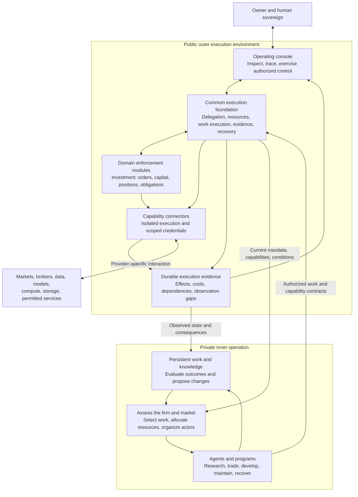

# Ouroboros Architecture

## Authority and Status

This is a proposed, provisional architecture for review. It is subordinate to the
[Core Doctrine](CORE_DOCTRINE.md), [Sovereign Designation](SOVEREIGN.md),
[Whitepaper](WHITEPAPER.md), and [Product Specification](PRODUCT_SPECIFICATION.md).
Architecture adoption must be recorded in the reviewing pull request; the presence of this
document does not establish adoption or permission to implement or operate the product.

This proposal defines responsibilities, dependency boundaries, behavioral contracts, and
acceptance scenarios. It does not introduce a runtime, API, schema, repository split, deployment,
credential, or operational delegation. Any sovereign-only decision remains subject to
SOVEREIGN.md. Methods described here remain replaceable under the governing sources.

## 1. One Firm, Two Implementation Responsibilities

The continuing subject is the firm: its owner's economic interest, mandate, actual capital,
work, evidence, knowledge, and outstanding responsibilities. Agents and programs undertake work
on its behalf; their sessions and organization do not define its lifetime.

The owner provides initial capital and decides additional contributions. Inner operation
allocates the available resources within the mandate, pursuing long-term growth in profits
withdrawn by the owner and net capital remaining in operation. Firm-wide costs and obligations,
including owner-paid costs, remain attributable across either implementation. Funding, returned
principal, earned results, unrealized value, and withdrawals retain their distinct meanings.

The two implementation responsibilities are:

- **Public outer execution environment:** enforce delegation and resource conditions; provide
  execution, observation, evidence, governed activation, and recovery capabilities.
- **Private inner operation:** determine what work is justified, allocate resources, organize
  actors, research, trade, develop, evaluate, learn, and decide what to retain or stop.

The deployment unit is one independently operated firm. Another owner may reuse the public code
with separate authority, capital, state, and operation. This proposal does not introduce a shared
service hosting several owners' firms. Public source does not publish deployment data or grant
authority. Private source does not obstruct evidence access by the sovereign or authorized
evaluators. Reuse does not establish economic viability at another capital scale or cost base.

Both implementations contain persistent systems. Private operation is more than transient AI
workers: work coordination, knowledge, operating methods, and judgment must outlive them. The
outer environment supplies enforcement and evidence without becoming the firm's economic
decision-maker. Their connected records are not a third execution layer.

## 2. Whole-System Structure

The diagram shows runtime interactions, not source-code imports, process counts, or compulsory
steps through a single workflow.

```mermaid
flowchart TB
    OWNER["Owner and human sovereign"]
    subgraph PRIVATE["Private inner operation"]
        DECIDE["Assess the firm and market<br/>Select work, allocate resources, organize actors"]
        WORK["Agents and programs<br/>Research, trade, develop, maintain, recover"]
        LEARN["Persistent work and knowledge<br/>Evaluate outcomes and propose changes"]
        DECIDE --> WORK
        WORK --> LEARN
        LEARN --> DECIDE
    end
    subgraph PUBLIC["Public outer execution environment"]
        CONSOLE["Operating console<br/>Inspect, trace, exercise authorized control"]
        CORE["Common execution foundation<br/>Delegation, resources, work execution, evidence, recovery"]
        DOMAIN["Domain enforcement modules<br/>Investment: orders, capital, positions, obligations"]
        ADAPTER["Capability connectors<br/>Isolated execution and scoped credentials"]
        RECORD["Durable execution evidence<br/>Effects, costs, dependencies, observation gaps"]
        CONSOLE <--> CORE
        CORE <--> DOMAIN
        CORE --> ADAPTER
        DOMAIN --> ADAPTER
        CORE --> RECORD
        ADAPTER --> RECORD
        RECORD --> CONSOLE
    end
    OWNER <--> CONSOLE
    WORK -->|Authorized work and capability contracts| CORE
    CORE -->|Current mandate, capabilities, conditions| DECIDE
    RECORD -->|Observed state and consequences| LEARN
    ADAPTER <-->|Provider-specific interaction| WORLD["Markets, brokers, data, models,<br/>compute, storage, permitted services"]
```

The direct foundation-to-connector path is for capabilities whose applicable controls are
satisfied there. It is not a route around domain enforcement: every action affecting investment
authority, capital, exposure, or obligations must pass the investment controls relevant to its
effects, including actions initiated through general tools or another connector.

### Outer Responsibilities

| Component | Responsibility |
| --- | --- |
| Common execution foundation | Resolve current delegation, enforce resources and applicable controls, run bounded work, attribute effects, preserve evidence, and support revocation, activation, and recovery. It has no dependency on a particular broker, model, SDK, or strategy. |
| Domain enforcement modules | Supply the meaning and validation required for a domain. The investment module interprets orders, fills, positions, capital, valuation uncertainty, aggregate exposure, costs, and obligations. Its mandatory rules participate in every relevant execution path. |
| Capability connectors | Adapt a provider's authentication, protocol, results, and failure semantics to a capability contract. A connector supplies attributable observations; it does not originate authority, certify its own correctness, or choose the firm's economic purpose. |
| Evidence and state services | Preserve execution and control evidence, reconcile observations with actual external state, expose uncertainty, and retain responsibility across failure or replacement. Recorded assertions are distinguishable from confirmed effects. |
| Operating console | Expose company-wide state and supporting detail, and invoke separately authorized controls. Enforcement and evidence survive the console's failure. |

The common foundation and investment enforcement are separate modules inside the outer
responsibility. Generic mechanics do not make financial semantics optional. Installing a new
domain module cannot change the firm's purpose or authorize unrelated activity.

### Inner Responsibilities

| Function | Responsibility |
| --- | --- |
| Situation assessment | Interpret market evidence, actual firm state, existing obligations, data quality, available capabilities, costs, and uncertainty. |
| Opportunity and work selection | Originate candidate trading, research, development, maintenance, and recovery work. Separately establish purpose fit, valid authority, and a current resource case. |
| Firm-wide allocation | Compare competing commitments of capital, compute, data, verification effort, and operating capacity. Include cumulative commitments, dependencies, alternatives, and reasons to wait, reduce, or stop. |
| Organization and execution | Select suitable agents and ordinary programs, assign responsibility, coordinate dependencies, and manage handovers. The number of actors, their titles, and their coordination method remain mutable. |
| Investment operation | Reconcile strategy proposals with the firm's combined positions, exposure, liquidity, and obligations before requesting execution. Local allowances or results do not constitute independent pools of firm capital. |
| Learning and development | Preserve evidence and conditional knowledge, evaluate outcomes, and develop changes to strategies, models, tools, code, organization, and evaluation. |

Firm-wide selection and allocation need an accountable mechanism, but not a permanent CEO model.
Parallel workers must justify their coordination and resource costs. Agent-native operation also
includes retaining a useful deterministic method or stopping unnecessary activity.

## 3. Capability Contracts and Dependency Isolation

### Dependency Direction

Code depends on the contracts needed for its responsibility, not on a connected provider's
implementation. The foundation defines its extension and execution contracts; domain modules
define their domain contracts; adapters implement the relevant contracts. The composition that
selects approved implementations does not put provider-specific branches in the foundation.

Private operating logic uses capability and domain contracts rather than importing provider SDKs,
outer persistence internals, or privileged execution code. Provider libraries and credentials
remain in their adapters and authorized execution contexts. The console uses inspection and
control contracts; it does not own enforcement logic. Internal storage and model choices are
also dependencies to isolate, not exceptions to this direction.

Contracts preserve the meaning of the work. Order execution, data retrieval, model inference,
and storage need different semantics; an opaque universal execute call is insufficient for
enforcement and accountable outcomes. Provider-specific capabilities and limitations remain
explicit rather than being silently reduced to a misleading common denominator. Extend a
contract when a demonstrated distinction requires it; do not prebuild adapters for hypothetical
businesses or assume interface compatibility establishes fitness.

This follows the separation of application meaning from external technology described in
[Ports and Adapters](https://alistair.cockburn.us/hexagonal-architecture). That source supports
dependency direction and isolated testing, not the additional claim that module boundaries alone
enforce permissions or contain faults. Ouroboros needs the runtime boundaries below as well.

### Isolation Responsibilities

| Boundary | Required behavior |
| --- | --- |
| Code and packages | Keep provider SDKs and transitive dependencies in the relevant adapter. Replacing or updating one must not require unrelated operating logic to import it. |
| Execution and failure | Bound each dependency's latency, retries, concurrency, and resource consumption. Contain failures where independent operation is possible; propagate unavailable prerequisites to dependent work. Code packaging alone is not isolation. |
| Authority and credentials | Give a connector only the accounts, operations, information, and resources needed under the mandate. Inner actors and sibling connectors may not obtain those credentials or bypass the execution boundary through another route. |
| Resources and costs | Attribute usage, reservations, and unresolved charges to work and dependencies while enforcing aggregate firm constraints. Individual limits do not authorize their combined use beyond the firm's mandate. |
| Data and state | Preserve provenance, observation time, uncertainty, and relevant raw evidence separately from normalized results and inner interpretation. Connectors cannot arbitrarily edit other domains' state or privileged control records. |
| Change and lifetime | Distinguish installation, verification, activation, update, restriction, and revocation. Retain material evidence and outstanding effects after a component is removed or replaced. |

Maintain the dependency relationships of work, capabilities, deployed components, and outstanding
responsibilities. When a dependency becomes unavailable, the firm must identify affected work,
unaffected work, and the evidence and authority required for a substitute. Dependency status must
be inspectable without the failing connector being its sole reporter.

Isolation does not erase economic connections. Several connectors can reach the same account,
asset, or obligation. The investment module must reconcile such overlap rather than sum duplicate
balances, count the same cost twice, or let multiple local limits conceal combined exposure.
Likewise, shared model, data, storage, and observation costs remain part of firm economics.

Installation and technical connectivity grant no execution authority. Activation requires a
compatible capability contract, verified behavior, current delegation, scoped access, and known
cost and resource conditions. The process may be automated within existing authority. An extension
that interprets or enforces protected rules is itself part of the protected control boundary;
ordinary connector maintenance cannot replace or disable those rules.

### Contracts Between the Two Responsibilities

These are behavioral obligations, not new wire formats or public APIs.

| Contract | Information and behavior that must cross the boundary |
| --- | --- |
| Operating conditions | Current mandate, available and committed resources, usable capabilities, costs, constraints, uncertainty, and changes that invalidate dependent assumptions. |
| Work and responsibility | Work origin, purpose, delegated scope, actors and descendants, dependencies, resource commitments, handovers, stopping, and responsibility for effects still in progress. |
| Execution and result | Intent, attributable execution, distinction between a retry and a new action, observed results, unresolved outcomes, and remaining obligations. |
| Observation and evidence | Links among work, decision explanations, inputs, tool execution, artifacts, actual effects, costs, evaluation, and subsequent choices. |
| Change and succession | Candidate identity, applicable evaluation and authorization, deployment eligibility, actual activation state, handover, restrictions, and effective revocation. |

External interfaces differ in their retry and confirmation guarantees. Preserve action identity
across appropriate retries and reconcile uncertain effects rather than blindly start again.
A local identifier alone cannot guarantee that an external action occurs exactly once. The
[AWS retry analysis](https://aws.amazon.com/builders-library/making-retries-safe-with-idempotent-APIs/)
illustrates why caller intent, delayed requests, parameter changes, and retention matter; each
connector still needs evidence for its provider's actual behavior.

## 4. Persistent Operation and Company State

Four functional flows operate at different speeds while remaining connected to the same firm:

| Flow | Responsibility and relation to the others |
| --- | --- |
| Trading and obligation management | Execute within the current mandate, observe consequences, and manage remaining exposure. Long research or model replacement must not unnecessarily block this responsibility. |
| Firm operation and allocation | Assess opportunities, performance, costs, and constraints; select work and allocate resources across trading, research, development, and maintenance. |
| Learning and change | Generate and test alternatives, preserve knowledge, and retain or replace operating methods. Candidate work is distinguishable from current operation. |
| Control and recovery | Enforce delegation, observe exceptions, restrict consequences, revoke, and re-establish trustworthy state using already-authorized responses. |

These are not four additional execution layers or a fixed serial workflow. Work can branch,
delegate, wait for evidence, change direction, or stop. Every trade need not trigger a new model
call. Fast execution remains governed and attributable; slower inquiry remains accountable for
its resource use. No loop earns resources merely by staying active.

The firm persists the following distinct kinds of state:

| State | Meaning |
| --- | --- |
| Current authority | What is validly permitted now, including restrictions and revocations. Remembered permission is not authoritative. |
| Observed economic and operational facts | Actual effects, capital flows, costs, obligations, and explicit uncertainty, grounded in attributable observations and reconciliation. |
| Ongoing work | Purpose, responsible actors, dependencies, artifacts, commitments, progress, and the conditions for another decision. |
| Knowledge and interpretation | What the firm currently believes, with evidence, contradictions, conditions of relevance, and demonstrated use of learning. |
| Active configuration and candidates | What is actually operating, what is under evaluation, and the evidence and authority behind an activation or replacement. |

These kinds of state need not share one database or physical location. Material evidence and
inspection cannot depend on one inner session, connector, or model. Access respects legitimate
information boundaries, while the sovereign and authorized evaluators retain the evidence needed
for their responsibilities. Confidential data does not become public because the outer code is.

A successor reconstructs current work, reconciles actual state, obtains valid delegation, and
demonstrates fitness for its responsibility. It may reach a different justified decision; it
does not inherit a duty to repeat its predecessor's methods or recover past losses. Additional
capital, agent replacement, or a storage migration does not reset the firm's history.

## 5. Observation and Effective Owner Control

The outer environment must let the owner and authorized evaluators inspect the whole operation,
including research, development, allocation, evaluation, and agent delegation before any trade.
Company-wide views must lead to the relevant underlying records, not just agent summaries.

| View | What it must make inspectable |
| --- | --- |
| Whole-firm economics | Contributions and withdrawals, net capital, costs, exposure, outstanding obligations, and valuation uncertainty. |
| Current work | What is happening and why, responsible actors and descendants, progress, dependencies, resources, failed or stopped work, and next decision conditions. |
| Execution lineage | Inputs, decision explanations, tools, artifacts, requests, observed effects, and subsequent evaluation, with their relationships and uncertainty. |
| Organization and authority | Active actors, responsibility, current delegation, restrictions, and the actual effect of revocation. |
| Learning and change | Claims, supporting and contradictory evidence, candidates, active configurations, and the rationale and authorization for changes. |
| Dependencies and observation health | Actual providers, scoped accounts and configurations, availability, costs, affected work, last observation, delays, missing evidence, and inconsistencies. |

Obtain execution evidence from the environment and providers as well as work explanations from
the inner operation. Inner self-report is not the sole source of completion, cost, or effect.
Agents may not unilaterally disable required observation, erase adverse evidence, or change the
rules that judge their visibility. Connector output remains evidence to assess, not unquestionable
truth. Unknown or stale state must not be displayed as inactivity, success, or restored control.

Observation, retention, and export must not distribute usable credentials or confer execution
authority. Connector errors, inputs, outputs, and configuration records need the same protection
as direct credential access. Ordinary views must redact secrets; retain necessary restricted
originals only under separately scoped access, with provenance and verifiability preserved.
Redaction must not silently hide material effects or make an incomplete view appear complete.

Visibility concerns meaningful work, decisions, inputs, outputs, actions, and consequences. It
does not assume access to every hidden internal computation of a model. A decision explanation is
an attributable explanation, not proof of the model's complete internal reasoning or of economic
causation. Retention and observation detail must preserve material evidence within applicable
access obligations and justified costs; record volume is not a success measure.

Inspection and intervention are separately authorized. The console invokes controls whose effects
are independently recorded and checked. Inner failure must not remove legitimate evidence access
or the sovereign's control path. Console failure must not disable enforcement, evidence collection,
or an authorized recovery path. Notifications alone are insufficient where consequences can
outpace human response; use already-authorized bounded responses.

Tracing proves neither profitability nor AI contribution. Keep AI-led operation, actual owner
outcomes, AI contribution, conditional earning ability, and the next allocation case separately
assessable. Controls are judged for conformance, inner operation for performance, and their actual
connection for attributable outcomes; these are verification perspectives, not execution layers.

## 6. Governed Change, Degraded Operation, and Exit

Changes carry distinct responsibilities for proposing, testing, authorizing, activating,
observing, and retaining or withdrawing a candidate. A candidate cannot solely control this
complete chain. Evaluator changes and changes to outer controls require the same separation of
accountability; a different label, agent, or majority vote does not establish independence.

Candidate work and active operation retain distinct state, costs, authority, and evidence.
Experiments may use isolated representations or historical evidence, but simulation cannot reset
the live market or certify future returns. Technical tests and an internal score do not establish
live trading value. Ordinary changes can be automated where evaluation and the current mandate
permit; new authority remains a sovereign decision.

During replacement, identify which actor is responsible for ongoing effects and prevent stale
actors or descendants from resuming revoked work. A replacement model, connector, or provider must
be fit for the capability actually required, including its costs and failure semantics. Compatible
syntax is insufficient. Automatic substitution requires existing authority and validated meaning.

Replacing a broker connection does not move or extinguish its existing positions and orders.
Removing a connector is distinct from resolving its obligations. Restoring old code is distinct
from reversing market effects: retain actual losses, costs, execution, unresolved results, and
effective revocations throughout handover or recovery.

Treat internal crashes, unavailable providers, stale data, exhausted resources, uncertain orders,
observation failure, and control updates as conditions the firm must handle. Identify what is
unknown and which actions depend on it. Do not resume consequential action requiring unresolved
authority or capital state. Authorized investigation, unaffected work, and management of existing
obligations can continue where their prerequisites remain valid. Isolation must not conceal a
shared dependency or imply that all work can continue through every failure.

Waiting, reducing activity, or stopping unjustified work may be legitimate autonomous operation.
Retirement remains a sovereign decision. Exit must distinguish stopping new work, confirming
orders and positions, settling or otherwise resolving obligations under valid authority,
accounting for costs and capital, and preserving required records. Shutdown, restart, or new
funding does not erase unresolved responsibilities.

## 7. Architecture Acceptance Scenarios

These scenarios define evidence required from subsequent designs and implementation. Passing a
document review does not claim that these behaviors have already been built or proven.

| Scenario | Required result |
| --- | --- |
| Trading, research, and development compete for resources | The allocation has a firm-wide rationale; combined use, reservations, and obligations remain within the mandate, including evaluation and owner-paid costs. |
| Several strategies or connectors act on the same asset or account | Preserve strategy attribution while reconciling overlapping balances, costs, positions, execution conflicts, and aggregate exposure without double-counting. |
| Substitute a provider for the same capability | Keep unrelated operating logic independent of the SDK; verify meaningful differences in capabilities, costs, results, access, and failure behavior before activation. |
| Add a different capability | Use an appropriate contract and module without provider-specific branches in the foundation or an opaque path that bypasses domain controls. |
| A connector fails, retries indefinitely, or exhausts resources | Bound its consequences and costs; identify dependent and unaffected work; retain inspectable failure and dependency evidence. |
| A connector tries another account, a sibling credential, or protected records | Reject access beyond delegation, preserve evidence, and prevent alternate tools or descendants from bypassing the boundary. |
| A connector error, configuration, or trace contains a usable credential | Keep the secret out of ordinary inspection and export; preserve necessary restricted evidence and provenance without turning observation into execution authority. |
| Communication fails after an external action, followed by agent or connector replacement | Preserve intent and unresolved effects, reconcile external state, avoid blind duplicate execution, and hand over existing responsibility. |
| Internal evaluation improves while whole-firm costs increase | Distinguish technical progress, valid learning, owner outcomes, AI contribution, earning ability, and the case for further resources. |
| Agents change organization, tools, evaluators, or control modules | Distinguish candidates from actual operation; preserve evidence and responsibility; the candidate or control author cannot authorize its own complete acceptance chain. |
| Inner reporting omits work or observation becomes unavailable | Detect and expose the observation gap rather than infer inactivity; retain independent execution evidence and limit dependent action where needed. |
| Inner operation or the console fails | Maintain enforcement, material evidence, and legitimate sovereign control independently of the failed component; do not imply guaranteed availability. |
| An unrelated capability is installed | Installation does not establish purpose fit, resource justification, or execution authority. |
| A connector is removed while external positions or charges remain | Keep the obligations visible and attributable, and retain a valid path to investigate and resolve them. |
| Capital is added, profits are withdrawn, or the firm reduces activity or retires | Preserve losses, costs, current authority, and outstanding obligations; distinguish capital flows and earned results without counting withdrawn profit again in remaining capital. |

## 8. Design Handoff and Evidence Limits

This proposal selects independent firm operation, the two implementation responsibilities,
common mechanics separated from domain enforcement and provider adapters, the behavioral
contracts, and the isolation and continuity obligations above. It does not select a plugin
standard, broker, market, operating model, agent count, return formula, database, deployment
technology, public API, or wire schema. These later choices must satisfy the applicable contracts
before they govern dependent implementation or actual operation; missing choices create no
default permission.

The current repository remains the home of this architecture proposal. Public/private code
repositories are an intended implementation direction, not an existing split. Astra remains the
planned implementation agent, not a selected internal operating model. Do not build a general
platform as a separate product objective or preimplement unrelated domain modules.

Use the reviewing pull request for the change rationale, requirement coverage, independent review,
repository validation, unresolved decisions, and adoption status. Do not infer approval from this
document or from successful static checks. Runtime, security, and actual economic evidence will
require their own validation after architecture approval.

External examples inform individual choices rather than establish the whole design.
[Anthropic's research system](https://www.anthropic.com/engineering/multi-agent-research-system)
reports parallel research benefits alongside coordination, cost, and recovery challenges.
[AlphaEvolve](https://deepmind.google/blog/alphaevolve-a-gemini-powered-coding-agent-for-designing-advanced-algorithms/)
demonstrates candidate generation coupled to automated evaluation in measurable computational
domains. Neither establishes autonomous-firm profitability or safety in a non-resettable market.
Ouroboros's application and the proposed boundaries require their own evidence.
