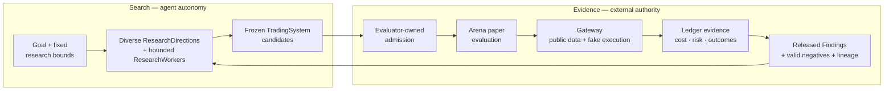

# Ouroboros

[](https://github.com/openboa-ai/ouroboros/actions/workflows/ci.yml)

**Ouroboros is an evidence-governed agent research loop that turns hypotheses into externally tested, cumulative progress—using trading as its first proving ground.**

> [!IMPORTANT]
> The current boundary is public-data `BTCUSDT` Binance USD-M futures paper trading with fake accounts, execution, and Ledgers; there is no private or live authority.

## Why Ouroboros

Stronger generation does not, by itself, create trustworthy progress. The missing system is the durable contract around the agent: the goal, allowed mutation, budget, frozen candidate identity, evaluator, persistent record, stop condition, and progression authority.

Ouroboros exists to make that contract executable. Its weak-to-strong research question is explicit: can a bounded system use increasingly capable agents to discover better candidates without allowing the generator to decide what counts as progress?

## The unit of progress is the loop

A model proposal is not research evidence. Hard research is path-dependent: the useful next action depends on observations that exist only after the previous attempt. A fixed one-shot pipeline can repeat prescribed steps; a bounded agent can inspect logs and artifacts, diagnose a failure, run a cheap de-risking check, and choose the next experiment worth running. Today this is bounded to adaptive tool actions, edits, checks, submission timing, and explicit selection among completed snapshots within one ResearchWorker session—not unconstrained multi-experiment sequencing. The compact mental model is `goal -> attempt -> evidence -> next attempt`.

That loop becomes cumulative when released Findings, valid negative results, exact duplicates, and lineage prevent later generations from starting from the same ignorance or repeating the same dead end. Provider, evaluator, infrastructure, and setup failures remain platform-attributed failures, not research knowledge.

This approach draws design pressure from [Karpathy Autoresearch](https://github.com/karpathy/autoresearch), [Anthropic Automated Weak-to-Strong Researcher](https://alignment.anthropic.com/2026/automated-w2s-researcher/), [Anthropic Loop Engineering](https://claude.com/blog/getting-started-with-loops), [NVIDIA NeMo Autoresearch](https://developer.nvidia.com/blog/how-to-run-an-autoresearch-workflow-with-rl-agent-skills-and-nvidia-nemo/) and [Auto-FL](https://developer.nvidia.com/blog/accelerating-federated-learning-research-with-ai-agents-and-nvidia-flare-auto-fl/), OpenAI [Goal](https://learn.chatgpt.com/use-cases/follow-goals)/[scored loops](https://learn.chatgpt.com/use-cases/iterate-on-difficult-problems)/[Codex loop](https://openai.com/index/unrolling-the-codex-agent-loop/), and OpenAI [weak-to-strong](https://openai.com/index/weak-to-strong-generalization/): sources of method, not proof of Ouroboros results.

## Autonomy in search. Authority in evidence.

> AI-agent hill-climbing is useful only when the evaluator is harder to exploit than the search is to run.

Within a precommitted ResearchDirection, hypothesis, and method, a ResearchWorker may choose next tool actions, checks, edits, submission timing, and a completed snapshot. The surrounding system owns every authority-bearing boundary: the problem contract, resource budget, allowed mutation surface, frozen candidate identity, evaluation policy, stop conditions, durable history, and progression authority. A generating agent cannot grade, admit, qualify, promote, erase history, or grant itself trading authority.

| Layer | Repeating cycle | Responsibility |
| --- | --- | --- |
| Inner agent loop | model <-> tools <-> observations | Codex today; later agents only when supported |
| Experiment loop | hypothesis -> artifact -> run -> measure -> diagnose | bounded and recorded by Ouroboros |
| Research loop | diverse directions -> external evidence -> Findings/lineage -> next generation | core Ouroboros product |

Ouroboros leverages rather than rebuilds the inner agent loop; frontier labs may improve that intelligence supply. Codex is the current non-fixture provider path, Claude Code is not implemented today, and better agents expand search without ever becoming the judge.



- ResearchWorkers do not grade or admit themselves.
- TradingSystems reach public market data and fake execution only through Gateway.
- One paper window cannot carry both `research_feedback` and `qualification` purposes. Precommitted `research_feedback` may feed later generations; qualification evidence stays sealed until terminal closure and may enter later Research only through a separate post-close `PaperTradingComparisonResearchRelease`, which materializes only Finding and Lineage and grants no promotion or live authority.
- Paper evidence never grants private or live authority.

## Why trading is the first proving ground

Trading is the first domain, not the philosophy. It is non-stationary and competitive: future outcomes, fees, funding, slippage, execution, risk, regime changes, and noisy, path-dependent PnL expose claims that a persuasive narrative can hide. That makes trustworthy evaluation difficult, requiring frozen identity, precommitted evidence purpose, comparable conditions, and prospective paper evidence. Trading is useful here not because profit is easy, but because trustworthy evaluation is hard.

The current boundary remains public-data `BTCUSDT` Binance USD-M futures paper trading with fake accounts, execution, and Ledgers; there is no private or live authority.

## Quickstart

### Open and inspect

First-run prerequisites are Node.js 24 and npm; Rust and Cargo for native Tauri Desktop development; Linux `glib-2.0`, `gtk+-3.0`, and `webkit2gtk-4.1` pkg-config modules; and macOS only for packaged/open/verify Desktop release commands.

```bash
npm install
npm run dev:operator-desktop
```

```bash
curl -fsS http://127.0.0.1:4173/health
./bin/ouroboros status
```

For headless operation, use two terminals:

```bash
# Terminal 1
./bin/ouroboros runtime serve

# Terminal 2
./bin/ouroboros arena status
```

Desktop opens the operator and starts or reuses the local runtime. On a clean first run it does not issue a new `arena start`; a persisted running state may resume. `./bin/ouroboros` is checkout-local, and Web is a browser development surface.

### Run agent research

Running agent research requires Docker Sandboxes `sbx` 0.35.0 or later, a host-local `codex` CLI on `PATH`, an account able to complete device login, and an already-running runtime. `npm install` does not install those tools.

```bash
./bin/ouroboros agent setup codex
./bin/ouroboros agent login codex
./bin/ouroboros agent probe codex
./bin/ouroboros researcher provider set codex
./bin/ouroboros arena start
./bin/ouroboros arena status
```

`arena start` starts the bounded generated-candidate research and paper loop without granting private or live authority.

## Product loops and operator views

Two cooperating product loops turn research effort into inspectable paper evidence:

- **Research** bounds candidate-generation sessions, freezes and selects submissions, owns external admission, and retains released memory.
- **Arena** queues and runs already-admitted TradingSystems in isolated paper sessions and compares their paper evidence.

Research and Arena are separate views. Research now reads a bounded materialized operations
projection and exact persisted session detail from the authoritative allocation, commitment,
checkpoint, admission, and terminal-tick graph. Provider stdout and stderr are intentionally not
persisted; the detail reports that absence instead of presenting synthetic logs. The domain keeps
`OperatorReadModel.research_operations` optional only for producer/consumer version-skew
compatibility, while the current Operator service always emits either the available projection or
its fail-closed unavailable state.

The five operator views expose those loops from different operational angles:

- **Research:** candidate-generation side within its current visibility boundary.
- **Arena:** admitted systems, isolated paper sessions, and comparable results.
- **Trading:** selected-system paper handoff, evaluation, and review state.
- **Evidence:** evaluations, Gateway and Ledger-chain status, lineage, authority, and command provenance.
- **System:** runtime, provider, Gateway, and operational state.

The Desktop app is the primary interactive operator surface.
CLI remains the complete baseline for headless operation and automation.
Desktop, CLI, TUI, and Web share the same runtime/store-backed session data and product command/read contract.

The canonical vocabulary is:

```text
Candidate Arena -> Trading System -> System Code -> research preflight -> selected Paper Trading -> Gateway -> Ledger
```

## What exists today

### Built

- Codex-first bounded ResearchWorker sessions with bounded tools, workspaces, explicit submission timing, and snapshot selection.
- Bounded materialized Research operations plus canonical-ID exact session detail in the Operator
  Research workspace, including explicit degraded and restart-recovery evidence.
- Immutable SystemCode identity, external admission, and paper-handoff conformance.
- Isolated public-data `BTCUSDT` USD-M futures paper operation through Gateway with fake accounts, execution, and Ledgers.
- Recorded fees, funding, slippage, risk, provenance, and append-only paper evidence.
- Shared Desktop, CLI, TUI, and browser-development surfaces.
- Paper-only authority boundaries.

### Still to prove

- Causal economic improvement from adaptive agent research under fair controls.
- Long-horizon real-market generalization and profitability.
- Production-duration autonomy, complete soak evidence, and multi-host operation.
- Private exchange access, signed/live authority, and completed weak-to-strong success.

Replay and backtest are research feedback rather than final economic evidence authority.

## How the system is structured

| Boundary | Responsibility |
| --- | --- |
| Research | bounds agent sessions, freezes and selects submissions, owns external admission, and retains released memory |
| Arena | queues and runs admitted systems in isolated paper evaluation |
| Gateway | owns public market data, validation, and fake execution |
| Ledger | records append-only paper decisions, costs, risk, and outcomes |

| Group | Paths | Ownership |
| --- | --- | --- |
| Core contracts | `packages/domain`, `packages/application` | domain records, use cases, ports, controllers, and read models |
| Persistence | `packages/local-store` | filesystem-backed durable state |
| External integrations | `packages/adapters` | Codex, Binance public data, fixtures, and Sandbox adapters |
| Composition | `apps/runtime` | local runtime and shared operator API |
| Interfaces | `apps/operator-desktop`, `apps/operator-web`, `apps/cli`, `apps/operator-tui` | native, browser-development, headless, and terminal surfaces |
| Project workflow | `docs`, `.agents`, `scripts` | canonical design, agent policy, validation, and operational helpers |

## Operate and develop

### Common commands

```bash
./bin/ouroboros status
./bin/ouroboros arena start
./bin/ouroboros arena stop
./bin/ouroboros tui

npm run package:operator-desktop
npm run open:operator-desktop
npm run verify:operator-desktop-release
```

### Develop and validate

Python 3.12 and `gitleaks` are contributor validation tools, not first-run prerequisites. For a README or other documentation change, run:

```bash
bash scripts/check-docs.sh
npm run check:architecture
npm run check:naming
bash scripts/check-env-files.sh --tracked
bash scripts/check-secrets.sh
git diff --check
```

Runbooks for Docker Sandboxes `sbx`/`sdx`, S5 audits, recovery helpers, fixture compatibility, and
full-cycle research are developer/detail surfaces. Use the relevant npm script `--help` output and
Linear workflow notes when that work is explicitly in scope.

For implementation changes, add the relevant tests and run `npm test`, `npm run typecheck`, and `npm run build`. For native launch, the packaged macOS path, and release verification, see [Operator Desktop Performance And Release](docs/operator-desktop-performance-release.md).

## Read next

- [Project Direction](docs/project-direction.md) and [Ouroboros Doctrine](docs/ouroboros-doctrine.md) — thesis and governing rules.
- [Research And Arena Product Loop](docs/research-arena-product-loop.md) — product flow.
- [CandidateArena And Research Goal](docs/candidate-arena-research-goal.md) — research target and open claims.
- [CandidateArena Evaluation Protocol](docs/candidate-arena-evaluation-protocol.md) — research-feedback and qualification-evidence separation.
- [Autonomy Model](docs/autonomy-model.md) — authority progression.
- [Architecture](ARCHITECTURE.md) — technical boundaries.
- [API And Command Contract](docs/api-command-contract.md) — executable interfaces.
- [Development Workflow](docs/development-workflow.md) — repository delivery.

Contribution guidance and licensing terms are not yet published.
