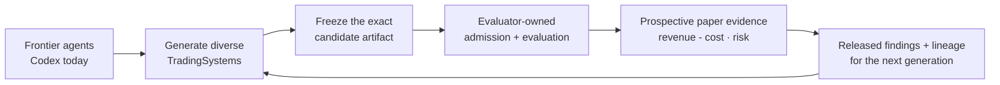

# Ouroboros

[](https://github.com/openboa-ai/ouroboros/actions/workflows/ci.yml)

**Ouroboros is a weak-to-strong research system for turning advances in frontier agents into cumulative, externally verified progress—tested first in trading.**

> [!IMPORTANT]
> The current boundary is public-data `BTCUSDT` Binance USD-M futures paper trading with fake accounts, execution, and Ledgers; there is no private or live authority.

## Why Ouroboros

**The problem:** generation is improving faster than trustworthy selection.

**The approach:** use frontier agents as the intelligence layer, then freeze and evaluate their work outside the generating session.

**Why trading:** markets make cost, risk, regime change, and prospective evaluation difficult to hand-wave away.

Ouroboros does not rebuild foundation models or a generic agent harness. It leverages Codex today—the only current non-fixture provider path—and treats Claude Code and future frontier agents as intended intelligence sources. Released results, failures, Findings, and lineage inform the next generation without letting a generator grade itself.

## The research loop



- Researchers do not grade or admit themselves.
- TradingSystems reach public market data and fake execution only through Gateway.
- Paper evidence never grants private or live authority.

## Quickstart

**Start with the native Desktop app; use the CLI when you need a headless surface.**

Prerequisites: Node.js 24 (recommended and CI-tested) and npm; Python 3.11 or later for contributor validation; `gitleaks` for contributor secret scanning; and Rust and Cargo for native Tauri Desktop development. Linux Desktop development also needs the `glib-2.0`, `gtk+-3.0`, and `webkit2gtk-4.1` pkg-config modules. macOS is required for the packaged/open/verify Desktop release path.

Install dependencies and open the source-checkout Desktop app:

```bash
npm install
npm run dev:operator-desktop
```

The Desktop app starts or reuses the local runtime. In another terminal, inspect that runtime and its operator state:

```bash
curl -fsS http://127.0.0.1:4173/health
./bin/ouroboros status
```

For headless operation, use two terminals:

```bash
# Terminal 1
./bin/ouroboros runtime serve

# Terminal 2
./bin/ouroboros arena status
```

`./bin/ouroboros` is the checkout-local CLI; `npm install` does not install a global `ouroboros` binary. Web is a browser development surface, not the primary operator app. Provider setup is required before `arena start`.

## What exists today

### Built

- Codex-first bounded research-worker sessions with bounded tools, workspaces, and explicit submissions.
- External admission and paper-handoff conformance for frozen candidate artifacts.
- Isolated public-data `BTCUSDT` Binance USD-M futures paper operation, with fake accounts, execution, and Ledgers; no private or live authority.
- Recorded fees, funding, slippage, risk, Gateway provenance, and Ledger evidence.
- Shared Desktop, CLI, TUI, and browser-development operator surfaces; Research and Arena remain separate views, while persisted operational detail is currently an Arena surface.
- Paper-only safety: researchers do not grade themselves, and paper evidence is not live promotion.

### Still to prove

- Economic frontier improvement from better agents and a causal agent-leverage effect rather than correlation or one-off success.
- Long-horizon, real-market generalization and profitability.
- Production-duration autonomous operation, complete runtime-soak evidence, and multi-host operation.
- Private exchange access, live authority, or a completed weak-to-strong result.

Replay and backtests are useful research tools, not final authority. Continuous comparable paper evidence gathers proof; it does not unlock private access or live trading.

## System boundaries

| Boundary | Responsibility |
| --- | --- |
| Research | Bounds agent sessions, freezes submissions, and retains findings, lineage, and sanitized inputs. |
| Arena | Runs admitted TradingSystems in isolated paper sessions and records comparable paper evidence. |
| Gateway | Owns public market data, order validation, and fake paper execution. |
| Ledger | Records append-only paper decisions, costs, risk, and outcomes. |

The repository's canonical product vocabulary is `Candidate Arena -> Trading System -> System Code -> research preflight -> selected Paper Trading -> Gateway -> Ledger`.

The Desktop app is the primary interactive operator surface. CLI remains the complete baseline for headless operation and automation. Desktop, CLI, TUI, and Web share the same runtime/store-backed session data and product command/read contract; Web remains a browser development surface with no separate authority.

## Operate and develop

Set up, log in to, probe, and select the Codex provider before starting the full generated-candidate research and paper loop. Docker Sandboxes `sbx` version 0.35.0 or later is also required for that loop.

```bash
./bin/ouroboros agent setup codex
./bin/ouroboros agent login codex
./bin/ouroboros agent probe codex
./bin/ouroboros researcher provider set codex
```

Common source-checkout commands:

```bash
# Inspect the Arena through a running local runtime; run arena start only after provider setup.
./bin/ouroboros status
./bin/ouroboros arena start
./bin/ouroboros arena stop
./bin/ouroboros tui

# Build, open, and verify the local macOS Desktop bundle.
npm run package:operator-desktop
npm run open:operator-desktop
npm run verify:operator-desktop-release
```

Run the repository guards for a README or other documentation change:

```bash
bash scripts/check-docs.sh
npm run check:architecture
npm run check:naming
bash scripts/check-env-files.sh --tracked
bash scripts/check-secrets.sh
git diff --check
```

Runbooks for Docker Sandboxes `sbx`/`sdx`, S5 audits, recovery helpers, fixture compatibility, and
full-cycle research are developer/detail surfaces. Use the relevant npm script `--help` output and
Linear workflow notes when that work is explicitly in scope.

For implementation changes, add the relevant tests and run `npm test`, `npm run typecheck`, and `npm run build`. For native launch, the packaged macOS path, and release verification, see [Operator Desktop Performance And Release](docs/operator-desktop-performance-release.md).

## Repository map

| Path | Purpose |
| --- | --- |
| `apps/runtime` | Local runtime and shared operator API. |
| `apps/operator-desktop` | Primary Tauri Desktop operator application. |
| `apps/operator-web` | Shared browser/development UI source. |
| `apps/cli` and `apps/operator-tui` | Headless and terminal operator surfaces. |
| `packages/domain` | Shared domain contracts and command descriptors. |
| `packages/application` | Use cases, controllers, read models, and ports. |
| `packages/adapters` | Boundary adapters, including Codex, Binance public data, fixtures, and sandbox integration. |
| `packages/local-store` | Filesystem-backed persistence primitives. |

## Read next

- [Project Direction](docs/project-direction.md)
- [Ouroboros Doctrine](docs/ouroboros-doctrine.md)
- [CandidateArena And Research Goal](docs/candidate-arena-research-goal.md)
- [Research And Arena Product Loop](docs/research-arena-product-loop.md)
- [Autonomy Model](docs/autonomy-model.md)
- [Architecture](ARCHITECTURE.md)
- [API And Command Contract](docs/api-command-contract.md)
- [Development Workflow](docs/development-workflow.md)

Contribution guidance and licensing terms are not yet published.
