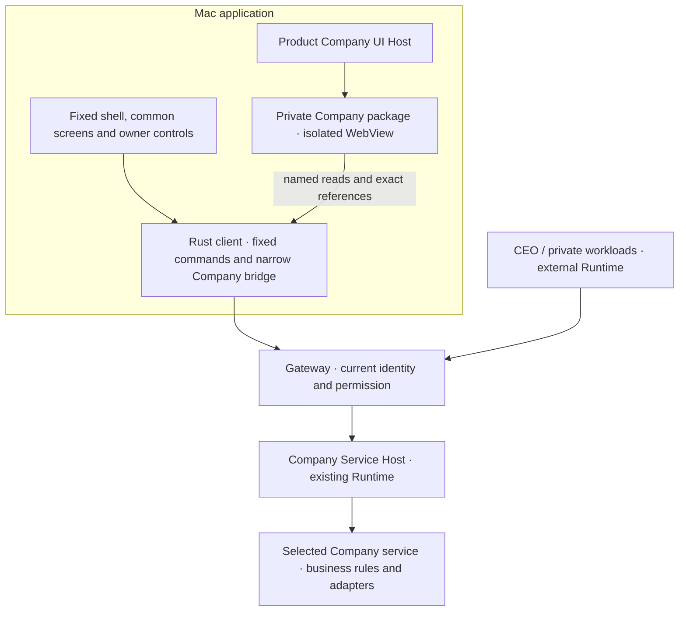
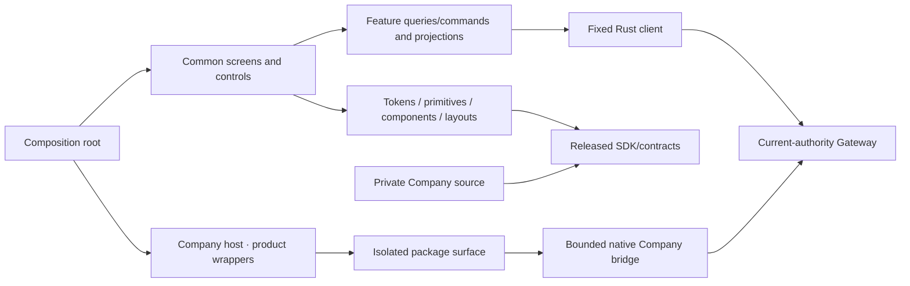

# Application Shell and Views

This is a proposed client design under the [Architecture](../../ARCHITECTURE.md).
It owns the Mac application's screen composition, navigation, contribution boundaries,
and interaction behavior. [Integrated System Design](SYSTEM_DESIGN.md) connects the app to
company source, deployment, data, artifacts and autonomous operation. [Contracts and State](CONTRACTS_AND_STATE.md) owns record and
transition meanings; [Observability and Console](OBSERVABILITY_AND_CONSOLE.md) owns evidence,
authorized inspection, and control feedback. This document does not adopt the architecture,
implement server routes, or grant operating authority.

The application lets an owner understand an autonomously operating company and intervene when
needed. Opening a screen, chatting, or creating work is not required to keep the company operating.
The first company uses Binance USDⓈ-M BTCUSDT perpetual futures with USDT margin. This is a domain
and contract selection, not an account binding, capital allocation, strategy, or trading grant.
Other companies and domains must not require changes to the generic control plane.

The current Mac app design separates a fixed Workspace from company-owned pages/widgets. Humans
and agents build private Company code independently against the released SDK. Exact packages,
verification and protected selected-use records determine what can execute in an isolated native
WebView; the product binary is unchanged by a compatible Company package update. Profile and shared
composition are company data, loaded independently. Publication alone does not select executable
code or change the fixed control plane. The earlier four-destination calibration and app-source
import experiment are historical, not the current delivery or navigation contract.

The user approaches the company as its chair/owner: decide whether the capital, results, risk and
CEO-led operation justify continuing, changing the mandate or intervening. The CEO leads day-to-day
work within that mandate. This is a presentation perspective over existing authority, not a new legal
office or security role. The interface must not make the chair a routine task dispatcher or trader.

For this investment company, investment outcomes lead the experience. Identifiable agents, shared
rooms and retained evidence explain those outcomes and make the company inspectable. Common/domain
code separation does not require equal visual prominence or putting investment behind generic tools.

## User Questions and Projection Rules

Design each projection from a user question and a useful next action before selecting fields or
components. A route, entity table or backend lifecycle is not itself a reason for a screen.

| Chair's question | Information needed first | Useful action and supporting evidence |
| --- | --- | --- |
| Can I continue entrusting capital to this company? | Current capital or clearly scoped available account valuation, period result, present exposure, important uncertainty and whole-operation costs | Inspect how a number was formed, ask the CEO with that context, or open an authorized capital/mandate control |
| What changed, and what explains it? | Actual cash movements, fills, valuation/cost changes, before/after scope and time; separately the CEO's interpretation | Select the change and inspect its related effects, rationale and artifacts without losing the account/period |
| Is the CEO deploying the company usefully? | Current priorities, accountable members, intended outcomes, recent results, blockers, costs and next conditions | Follow a work item, inspect its evidence, discuss direction, or apply a supported precise restriction |
| What do I need to discuss or decide? | Relevant room and participants, contextual messages, an unanswered question or exact pending decision | Continue the same conversation; open the canonical decision in a trusted frame only when required |
| What is the basis for the company's claim? | Findable source/result documents, author, purpose, fixed version, provenance and related work | Preview, follow to the originating activity or conversation, compare available versions and save |

Prioritize outcome and decision relevance over event volume. Every summary has an intelligible label,
scope/time and a path to its supporting detail; the detailed path must return to the originating context.
Show progressively more explanation and technical evidence only as the user follows that path.
Agent narrative and observed facts remain distinguishable. Reading requires no fresh agent response.
These are design criteria, not claims of completed usability testing.

## 1. Position and Responsibility

| Layer | Delivery owner | Responsibilities | Company configuration may change |
| --- | --- | --- | --- |
| Fixed shell and control plane | Installed product | Verified identity, common navigation/observations, owner controls, connection/recovery and shared details | Display preferences within the supported schema; never identity, rights or fixed routes |
| Company UI Host / Company Service Host | Product, using native isolation and existing Gateway/Runtime/resources | Generic package/operation binding, current access, exact references, lifecycle and fixed controls | Select compatible verified packages; cannot alter host boundaries |
| Company UI and services | Private source, independent immutable packages and protected selections | Business pages/widgets, financial meanings and enforcement, queries/operations and exchange adapters | Its own compatible releases through the applicable package/use contract; no unilateral authority changes |

Home, Work, Agents, System, Conversations, Library, Notifications, Settings and Owner controls
remain reachable without a Company page, profile or running CEO. Financial detail and operations
come from selected Company packages, never built-in product investment modules. Generic host
inspection retains service health and exact operation/receipt references when a page fails;
financial functions require their selected Company services. A missing provider or package
is shown as unavailable; the shell does not invent account observations. Personal Home layout is
local, scoped presentation data and cannot alter shared configuration or authority.



Authorship, content verification, acceptance for a use, selection and observed execution are
separate facts. A company author receives neither product React internals nor owner capabilities.
Ordinary authorized presentation changes need no new sovereign decision; changes of authority,
financial effects or trusted product code retain their own controls.

## 2. Fixed Shell and Navigation

### Company and member presentation

The application should convey a company working through its members, rather than a collection of
anonymous jobs. Product-rendered member names and consistent visual identifiers appear in the roster,
work attribution, artifact cards, trace headers and conversation references. Use OpenBoa identity and
component rules; a display identity is not proof of membership or authority. Company membership
comes from the [shared identity contract](CONTRACTS_AND_STATE.md#company-agent-identity-and-membership).

The overview introduces the company, its currently assigned operating lead, real members and their
current work. Selecting a roster member opens the shared full-page detail, with responsibility, current
work and progress summary first, then links to execution history, artifacts, knowledge and handovers. Knowledge means authorized retained references, not a claim to expose a
model's internal memory. A member can be waiting without an active process and still remain a member.

Show actual delegation and collaboration on the selected work: requester, assigned member, child work,
returned result and unresolved responsibility. A fixed department chart, arbitrary staffing count or
decorative relationship graph is not required. Specialist names and responsibilities are actual company
data, not hard-coded research/trading/risk agents invented by the UI. Initial operation may have only
the CEO member until additional independent members have been validly assigned.

Membership grows when useful work justifies it, following
[staffing by work need](CONTRACTS_AND_STATE.md#staffing-by-work-need). Do not show empty HR, Finance
or Researcher slots to fill, default recruitment prompts or headcount growth as a performance measure.
A member may cover several responsibilities. In member/work detail, show the recorded assignment
reason and observable contributions, results and resource costs where available; preserve unknowns
instead of generating an efficiency score. Temporary help, idle members and ongoing specialist work
remain distinguishable. Basic and domain records remain readable without those specialist agents.

The CEO personal room is a convenient entry, alongside personal rooms with other members and group
rooms. A result can be attached to the selected room with its author and execution references. The
owner can inspect any authorized member directly; everyday work does not require a human message.

### Window and destinations

The default window is 1440×900 with a 1100×720 minimum. Fixed left navigation and main content remain
the shell. Record investigation uses the main content with a visible Back/Close path, rather than a
persistent right inspector. Parent pages remain mounted to retain selections, drafts and reading positions.

| Fixed Workspace destination | Purpose |
| --- | --- |
| Home | The owner's selection of workspace/company widgets, with source-linked observations and actionable gaps |
| Work | Purpose, current progress, results and next conditions; related executions and evidence |
| Agents | Continuing member identity, actual executions and activity/Trace; inspect an exact run |
| System | Services, connections, execution resources and retained system events |
| Conversations | Personal and group communication with visible recipients and attached context |
| Library | Find retained material and open its exact published revision |
| Notifications | Find unread source events, inspect their records and mark selected notifications as read |

Home is the default Workspace route. Investment remains prominent through the company's Portfolio
page and available financial widgets; generic/domain separation does not prevent the owner from
putting investment first in their personal Home or create economic values in the common shell.

Company navigation is a separate group derived from the active compatible published configuration,
under `company/<page-id>`. Registered executable module inventory is not itself active navigation.
Fixed routes are in `apps/mac/src/app/routes.ts`; company validation rejects reserved identities.

The sidebar has one Settings entry, with no settings tree. Its main content uses horizontally
scrollable tabs in this order: General, Connections, Company, Modules and Maintenance. The selected
tab is preserved when returning to Settings. Theme selection and the labeled Change company
connection action belong in General, not the sidebar. The source badge sits beside the company
name. Owner controls remains fixed in the sidebar footer and opens its trusted full-page detail.
Company content cannot replace these routes, source identity or control entry points.

Preserve existing working context on return: company/environment, account/contract/period where
applicable, selected record, room/draft and reading position. References retain exact versions, never
authority or secrets. Opening Settings or details needs no agent reply or approval ceremony, and
ordinary navigation does not dispatch work, a model, an order or a stop request.

Company/environment changes clear incompatible observations and scope local state before reading
the new source. Empty company, absent CEO, unavailable module and restricted data each have explicit
states. A Company page failure cannot replace observations with samples or remove fixed navigation
and controls. A visible route does not authorize access to its records.

<a id="3-required-domain-modules-and-contribution-contract"></a>
## 3. Company Contribution Contract

Company packages can be authored by humans or agents and supplied before any CEO runs. For this
company they provide capital flows, costs, accounts, orders, fills, positions and investment
controls. Financial UI, calculations, enforcement and Binance protocol code all belong to Company
source. The product supplies generic hosts, SDK, access/lifecycle and exact operation/evidence
contracts. It can show usage, commitments and Company obligation references without interpreting
financial amounts or shipping an investment fallback.

This firm's selected financial services are required for its enrolled financial connections.
The Company contribution contract supports UI, service queries, named operations and runtime
bindings, each with its own exact package and verification. Removing a UI does not remove required
service enforcement. Service removal or replacement follows deployment/authority controls and preserves access to retained
records and unresolved obligations; deleting a view is not settlement or deactivation of a service.

| Contribution contract | Owner and validation |
| --- | --- |
| Module identity, exact version/digest, compatible app contract | Trusted installation/activation record; author text is informational |
| Company routes and record details | Generic host validates namespace and selected package; no collision with fixed shell or another Company contribution |
| Registered query and detail-reference bindings | Typed client plus authorized Gateway/domain contracts; no arbitrary URL or SQL |
| Semantic fields, units, scales, valuation and coverage rules | Domain contract; components preserve required annotations |
| Supported operation descriptions, schemas and target types | Selected Company service contract plus fixed host validation; presentation does not create capability |
| Readiness, missing dependencies, outstanding obligations | Attributable service observations, not a manifest's success flag |
| Reusable business components | Company source/dependencies; generic OpenBoa primitives come from the product SDK; no financial code is imported into the product |

There is no second product-domain registry containing investment implementations. Company UI and
service releases are independently selected through the same versioned package/use contract;
the Service Host integrates existing Gateway, Runtime and resource owners. Merely granting
permission to configure presentation cannot grant module installation,
credential use, new data scope, or financial activation.

## 4. Screen and Record Map

The following projections retain the owner questions from the earlier calibration, not its four-item
navigation. Work and Agents expose operational records independently; System covers the environment;
investment lives in Company pages/widgets. Related context uses full-page detail with origin history.
Missing data remains explicit. A design row below does not claim live-service implementation.

### Investment and performance — should I continue entrusting capital?

This is the company's investment page, also available through registered Home widgets. Its viewport prioritizes the chair's
economic situation and actual exposure, not agent activity counts, a large price chart or order entry.
Use the following reading order and do not give every backend field an equally prominent card.

| Priority | Information presentation | Interaction |
| --- | --- | --- |
| Orient | Company, live/test environment, account/company scope, chosen period and observation freshness; an actionable exception when present | Change a supported scope/period; open the precise unresolved issue |
| Judge the money | Current capital/value, period economic result and cost coverage, clearly separated from contributions/withdrawals; current exposure and margin information | Select a value to see its source and the components/changes behind it |
| Understand change and exposure | Capital/value history with identifiable cash-flow events when available, current positions/open orders, relevant limits and uncertain effects | Select a change or position to inspect fills, costs, capital movements and the related judgment |
| Hear the CEO's account | A concise retained explanation of the current stance, what changed, why and the next evaluation condition, with source/time | Inspect evidence or ask the CEO with the selected context |
| Act only where needed | Exact pending owner decision or supported capital/mandate/investment control relevant to this situation | Review target/scope and submit through the fixed control panel; follow actual application and remaining obligations |

A company equity aggregate is shown only when available with appropriate coverage. Otherwise label
the available exchange/account valuation as such and disclose that company-wide costs/liabilities are
not fully included. Account growth is not automatically trading profit. Unrealized values, period
results, capital flows and estimated/unconfirmed costs must remain separable in the first-level detail.
No made-up return formula or reassuring risk score fills missing source data.

Prefer a capital/performance trend over a dominant BTC candlestick chart for this owner view. If no
reliable series exists, show current values and the history gap without drawing a fictitious curve.
Present exposure, partial fills and unconfirmed orders in readable rows with the relevant time and
specific uncertainty. No position, no new trade, waiting for a condition and stale observation differ.

Keep period and account choices in place when a value is selected. The detail first explains what the
records show, then offers related rationale, member/work, Trace and artifacts. Confirmed effects and
an agent's causal explanation are labeled independently; absent attribution is not invented.
The period selector applies to results, cash flows, costs and trends. Positions, open orders, margin
and the latest CEO stance are labeled Current with their own observation times. Selecting a past
period must not make today's exposure appear to be that period's closing position. Historical position
views require actual historical observations and an explicit as-of label.
Financial inspection, CEO discussion and supported targeted intervention are available from this
context, without turning the chair's normal entry into a manual trading terminal.

A secondary Transactions view provides the full trade/cash-flow history and search. It reuses the
same account and period; it is not another main menu. The following sections retain the domain's
required fields and evidence relationships.

| Section | Main content | Detail and relationship |
| --- | --- | --- |
| Accounts and balances | Account/connection/environment, asset, source-provided balance categories, available funds, margin use, unrealized result and observation time; net equity only under a defined source calculation | Balance/valuation provenance; capital contributions, principal returns and profit withdrawals as distinct flows; shared-margin coverage and unobserved liabilities |
| Positions and orders | Current account/contract positions, side/quantity, valuation/PnL/margin as available; open orders including partially filled and uncertain submissions | Intent → allowed scope → transmission → exchange response → fills → position/cost; original work/judgment reference when present |
| Trading history and PnL | Orders, actual fills, cancellations, realized results, fees/funding and other recorded cash flows over a chosen period | Timeline, source receipts, associated agent/execution/trace, method/currency/coverage behind each aggregate |

Current BTCUSDT market observation and contract metadata belong alongside positions/orders and in
contract detail. A standalone market-terminal or strategy-builder screen is not necessary for this
inspection app. Preserve provider meanings and unavailable fields rather than inventing a common
liquidation price or exposure calculation. Account equity and investment performance are distinct.
Model/compute/data/owner-paid costs remain visible with attribution and are not omitted merely
because they are outside the exchange balance. Return formula/benchmark remains unset when absent.

BTCUSDT is the initial selected contract, not an excuse to describe filtered holdings as the whole
account. Account balances, shared margin, other exposure, or costs outside the selected contract
remain attributable at their actual scope or explicitly missing. Public observations, fixtures,
and authenticated company/account observations have product-owned source labels. No UI config
can switch a test result to a live result or create default capital, leverage, limits, or authority.

The initial domain integration establishes authorized read/refresh and reconciliation first. Financial
controls stay in the domain contract: new-exposure restriction, cancellation and position reduction
are distinct from agent stop. Offer them only after their backend behavior and current authority are
verified. Unsupported controls display the missing capability; no decorative live-trading buttons.
External/manual trades may lack agent lineage: show the actual source and missing association without
assigning them to the CEO. An order acknowledgement does not establish a fill or profit.

### Work and Agents — is the CEO using the company well?

Lead with the current operating priorities and the CEO's sourced explanation: intended outcome,
why it matters, what actually changed and the next review condition. Then show active or waiting work
with its accountable member, latest meaningful result, blocker and next condition. Put members in
context with their work, rather than using a grid of avatars or execution counts as the main proof.

A compact member roster preserves identities and includes running, waiting, stopped, handing-over and
unobserved participants. Selecting a work/member opens its current responsibility, progress summary,
actual activity and produced evidence. The chair can follow the work or ask in the relevant room.
Routine staffing and work allocation do not require the chair to create tasks.

Keep source time and uncertainties visible in summaries. A waiting condition, missing responsibility
and missing observation must remain distinguishable. Link to the original room, work and artifact.
If a member's explanation is absent, show observable activity and the explanation gap independently.

#### Agents and executions — who is running and what happened before

| Area | Required content and interaction |
| --- | --- |
| Company roster | Stable member identity, profile, current responsibility and actual work; continuing members remain visible across model/session changes, with separate former-member history |
| Current agents | Human-readable member identity, responsibility, current work and concise sourced progress; include running, waiting, stopped, handing-over and unobserved members. Detail exposes assignment/instance, last observation, model, usage and unresolved actions |
| Execution history | Filter by agent, work, status and period; start/end, duration when observed, outcome, cost/usage and artifact count with coverage |
| Work relationships | Origin/parent work, assigned execution and children, why it exists when recorded, next wake condition; no fixed organization chart |
| Execution detail | Purpose, accountable member, expected outcome, latest change and next condition first; expandable actual activity/Trace, artifacts and usage, with exact-target stop reachable |
| Stop | Fixed action for the selected execution, precise target/current version, admission/application/resource-return status and remaining effects |

One logical agent can have multiple historical or overlapping executions; a desired execution is
not proof of a live instance. Native helper names do not imply independent authority or a separately
stoppable runtime. Show the actual bound stopping scope. Agent explanation, native terminal event,
process termination and resource release are separate evidence. Restart/retry is not automatic from
an error row; this first app does not need a general work-authoring or agent-creation console.

#### Company activity history

Activity history under Agents and related Work details supports scoped search across
executions, authority changes, connection changes and operating controls. Filter by work, member,
period and activity type without creating another main screen. This is the audit path when no single
current work item explains the question. An event opens its readable timeline and then technical detail.

#### Trace and history — inspect a causal chain, not only a log stream

Provide a searchable chronological view and a per-execution correlated view. Filters include period,
agent/execution/work, tool/resource, outcome, source, and unresolved effects. Search uses authorized
retained records; it reports missing sources, retention gaps and index freshness.

```text
Work origin / known wake condition
  → responsibility / execution / actual instance
  → recorded native turn or tool call
  → Gateway intent and admission → dispatch attempt → actual result or unknown outcome
  → DB receipt / published artifact / provider effect → usage and cost evidence
  → later work or evaluation reference, when present
```

Only recorded relationships are drawn; absent spans do not become inferred success. Native coverage
may be incomplete, and trace visibility does not promise access to hidden model reasoning. The UI
shows recorded messages, tool calls, arguments/results where permitted, outer observations and
receipts with clear source labels. Redaction is enforced before disclosure, including errors/exports.

An event detail shows occurrence/receipt time, producer, stage, relevant IDs/generations, permitted
request/result summary, evidence references and the observed error or uncertainty. Long payloads
load on demand with bounds. An unresolved call remains unresolved after a timeout or stopped agent.
Owner controls and connection/authority changes share this history but retain their own record types.
Useful pivots are “show this execution,” “show related artifact,” and “show actual financial effect.”

### Rooms — who do I need to talk with, and about what?

Use the existing [conversation contract](CONTRACTS_AND_STATE.md#unified-rooms-and-proactive-messages)
for personal rooms, groups including humans and agents, and agent-to-agent rooms. Show authorized
rooms by readable participants and subject, relevant investment/work references, latest meaningful
message and unread/unanswered context. Keep the CEO personal room easy to reach. Personal/group filters
are secondary; the main content is the selected conversation and a single composer.
Current room scope and recipients remain visible. The owner can speak with the CEO, another member
or a group without switching to a report or proposal workflow.

Agents may initiate a progress update, explain an artifact or propose a change in the same room.
Use authenticated author labels, reply references and exact artifact previews. A long report can be
a linked file. No report categories, submission forms, report revisions or separate response queues
are required. A reference to an actual decision opens the existing fixed control frame; agreeing in
ordinary text does not change authority.

Room membership, stored messages, addressed delivery and replies retain the existing contract.
A group message does not automatically start every participant. Unsupported delivery, unavailable
recipients and restricted attachments remain visible. Conversation history and view position survive
navigation; contextual discussion returns to the same room and messages with its originating reference.

Company/member observation screens show what agents are doing and summarize progress separately.
Selecting a source opens the same conversation, work, Trace or artifact. Communication and observation
remain linked without copying every tool event into chat or depending on chat replies for controls.

Opening a room from a selected investment/work item retains that reference visibly in the composer;
reuse the appropriate existing room rather than creating one per click. Reveal actual recipients before
sending. A reported proposal or progress update remains a message, not a required template or approval
workflow. The chair can read, ask for explanation or convey direction, while protected changes use the
fixed control frame. Returning from chat restores the original investment selection and reading position.

### Library — what did the company rely on and produce?

Start with recent relevant materials and search, showing purpose/related work, author, latest retained
version and actual publication/validation status. Include input sources and created reports, code and
data. The primary action is preview; related work/usage, available versions and saving follow from it.
Keep original file names searchable. Filters by member, work, kind and period refine the view without
requiring a technical execution ID or a separate file-format page.

Files linked from an investment explanation or room open in the shared viewer with that context still
attached. The library is the independent browsing path, not the mandatory intermediate stop for every
link. Activity histories and Trace are reachable from Agents/Work and remain linked from each material.

#### Artifacts — find, inspect and retain what agents produced

| Area | Required content and interaction |
| --- | --- |
| Catalog / list | Name/path, kind, creator and originating execution/work, publisher/receipt, workspace, exact revision/digest, size and independent publication/evaluation/use/retention states; authorized historical search with cursor/coverage |
| Detail and preview | Text/Markdown, JSON, bounded CSV/table, images and supported documents; unsupported types show metadata and authorized save; no execution of report scripts or code |
| History | Available revisions and change lineage; open the exact old revision or compare supported text versions; do not substitute the latest manifest |
| Evidence and use | Publication receipt, related trace/tool call, exact source/build inputs, technical verification, selected use and observed application; author claims remain separate |
| Retention | Current consumers, owner/reason holds, retirement eligibility and confirmed disposal; hiding or omitting an item is not deletion |
| Actions | Open related execution/trace, save an authorized copy, copy stable reference, ask the CEO about this exact artifact |

Stored or uploaded bytes are not a published result. Working files can be shown only when a supported
authorized source exposes them, and must be labeled as working/unpublished; the app never reads an
agent container's filesystem directly. No artifacts, unavailable preview, denied access, deleted
content and unavailable old revision are explicit states. No content is invented from a filename. Creator and publisher are not interchangeable.
A latest-manifest list is partial historical coverage, and loss from that list does not imply disposal.
All preview, save, discuss and notification paths preserve the same exact scoped artifact reference.

Research, rationale and evaluations initially live here as attributed records/reports with related
work and effects. They do not require separate learning dashboards or generated screens. Company
records that are not files remain linked records, without fabricating a Catalog artifact for them.

## Shared Settings, Controls and Details

Common/domain ownership is not the user's navigation task. A position, work item, room and document
can share one investigation context. Keep the originating account/period/record visible, with a named
return action such as Return to BTCUSDT position. One full-page detail replaces the main content and
keeps back history instead of stacking side panels. Fixed navigation and owner controls remain
reachable; Back/Close and opener focus preserve the original selection.

Use specific actions at the point of need: inspect the change, view source, ask the CEO, inspect the
current mandate, or apply the supported exact control. The fixed Owner controls detail exposes
existing authorized controls; a general stop button does not mean financial exposure has been closed.
After a request, show the same action's pending/observed outcome and remaining obligations in context.
Protected requests remain distinct from ordinary chat direction. No new authority follows from the
user-facing chair label.

The single Settings entry opens the body tabs defined in §2. System also links resource observations
to source detail. Owner controls remains reachable in the fixed footer, displays unresolved
decisions/in-flight controls when supplied by the source, and opens current
delegation, supported exact-target actions and their outcomes. Investment/company attention items link to those
same records. Acknowledging an action does not hide it before actual application is established.
Selected agent details also expose their own execution stop action. These detail paths remain available
from every main screen; a company profile or failed domain cannot remove them.

### Connections and resources — can observation and execution work

Settings remains one sidebar entry. Its Connections tab contains the shared connection list and
one selected connection detail with **Overview / Access / Activity** tabs. These are detail tabs,
not new main destinations, a credentials vault browser or a separate approval inbox. System links
actual service/resource observations to this same detail; Conversations carries explanations and
exact requests; Notifications and an optional Home attention widget link actionable changes back.

A connection can be added by the owner or autonomously by an agent. Within current delegation,
cost/resource bounds, qualified modules and required verification, a **new** connection needs no
additional owner approval. Reuse a suitable existing connection when it meets the work need; a new
name or unused provider is not itself an escalation. Ask only for missing personal login, secret
material, authority outside current delegation, or trust in a new protected authentication boundary
not already covered by the applicable policy. A routine automatic addition remains attributable
in work/activity without creating a mandatory review card. An agent proposal in Conversations
explains the need, existing alternatives, minimum operations and expected cost/effect; it links the
same connection request rather than creating another request or treating chat assent as a grant.

| Surface | User question and interaction | Evidence retained |
| --- | --- | --- |
| Connection list | Which means serve this company, and which need attention? Scan purpose, verified account/environment, permitted use and the most relevant current state; select a row or Add connection | Connection identity and observation scope; source labels distinguish actual and synthetic data |
| Overview | What is this for and can its dependent work proceed? Show purpose, provider/account/environment, responsible work, selected connector/service and readiness; inspect dependencies and exact source | Connection/config revision, selected modules, canonical account binding, last checks and known gaps |
| Access | What may use it, with which limits, and what needs me? Compare observed provider permissions with current company grants; show safe credential metadata and supported Authenticate / Replace / Disable use / Revoke actions | Opaque credential/version, current grant and limits, protected authentication module selection, enrollment/change intent and actual outcome |
| Activity | What happened and what remains? Follow admission, authenticated use, renewal/rotation, failure, restriction and provider observations; open the original work or receipt | Original caller/work, connection/module/credential versions, intent/attempt, timestamps, result and unresolved effects; no secret-bearing payloads |
| System / Home / Notifications | What requires attention now? Show affected work and the specific next action; open the same connection or original change request | Source event and primary exact reference, observed time, acknowledged read state and current actionability |

Do not compress the following facts into one Connected or green status. Use the highest-priority
relevant state in a list row and progressively disclose the independent facts in detail, rather
than displaying seven permanent status cards or explanatory paragraphs.

| Independent fact | States and meaning |
| --- | --- |
| Connection identity/configuration | Requested, registered, provider/account/environment verified, conflicting or unknown; a display name is not canonical identity |
| Authentication | Not enrolled, awaiting user, usable, renewal due, expired, locally disabled, provider revocation confirmed or unknown |
| Provider permissions | Observed operations/scopes, denied or not observable; successful login does not establish all requested permissions |
| Company delegation | Current allowed operations, callers, scope and limits; narrower or absent rights remain distinct from provider permission |
| Module qualification/selection | Candidate, qualified for exact use, selected, applied or unavailable; installed code alone is not authority |
| Runtime/readiness | Dependencies observed ready, blocked, degraded or not observed; ready does not mean a business call occurred |
| Actual use/effect | Last admitted/dispatched/confirmed operation, unused, failed or unresolved with receipt/time; no observation is not zero cost or successful use |

#### Use-only enrollment and independent authentication modules

A connection type declares safe configuration, named operation/schema contracts and supported
credential kinds. It does not define a Company-rendered secret form or request raw access to a
secret. API keys, passwords, certificates/private keys, refresh/access/session tokens and other
secret-bearing types follow the same use-only rule: Company UI, agents and ordinary Company
services receive opaque use references and permitted results, never secret bytes or bearer proofs.
Sensitive one-time inputs, cookies and authentication responses are covered as well.

The fixed host launches protected native enrollment or, for provider login, the **system browser**
against the verified issuer. Native enrollment owns callback/challenge state, purpose, expiry and
connection generation; Company WebViews, chat and artifacts never collect these values. The normal
screen shows provider/account purpose and progress, not authorization URLs, token responses or
credential file paths. Unsupported methods show a specific unavailable method and the permitted
module-install path; they do not invite pasting a secret into a generic text field. Cancelling,
losing or duplicating a callback preserves the original enrollment outcome until reconciled.

Protected authentication modules can be independently packaged, installed, qualified and selected
without rebuilding the product app. They are **not Company UI/service code with secret privileges**.
Settings → Modules shows their exact package, host compatibility, qualification/trust basis, selected
version and dependent connections in a distinct protected-module section. Connection Access links
its selected authentication module and any pending change. Existing trust policy and delegation
can cover routine compatible installation/selection; new protected trust outside that policy needs
the designated decision. Installation, selection, credential enrollment and successful use remain
separate. A package-supplied trusted flag or familiar publisher name is not qualification evidence.
The protection mechanisms and authoritative fields remain in the shared connection/custody contracts;
this screen does not invent a module loader with arbitrary native or secret-read capabilities.

#### Connection user journeys and acceptance

The following eleven journeys extend the existing screens. They are target acceptance cases, not
claims that the current native client or provider/authentication modules implement them.

| Journey | Existing screen and action | Observable acceptance |
| --- | --- | --- |
| C-01 · Owner adds a connection | Connections → Add → choose qualified type, purpose/environment and supported authentication → inspect observed account and allowed use | No invented account, scope or budget. Registration, authentication, verification and actual use remain separate; effectful/paid checks use their own permitted bounds |
| C-02 · Agent adds a useful connection | Work/Conversations explains need when useful; Connections/Activity records autonomous addition within current delegation, cost and verification | No routine approval step merely because the connection is new. Reuse or new selection is attributable and does not renew exhausted budgets |
| C-03 · User input is actually required | Exact proposal/request → Connection Access → protected native enrollment or system-browser login | Request only missing personal login, secret, new authority or uncovered protected trust. No secret form in Company UI and no approval inferred from a chat reply |
| C-04 · Same account or wrong environment | Overview compares verified provider account/tenant/environment with existing bindings | Aliases cannot multiply grants, limits or account exposure. Test/operating ambiguity blocks dependent use; unavailable canonical identity is explicit |
| C-05 · Provider grants more than the company | Access compares provider permission with delegated operations/callers/limits and links effect/cost basis | A broad token never expands company grants. Show unknown prices, quotas and external-effect uncertainty; authentication does not authorize a test order, message or charge |
| C-06 · Expiry and automatic renewal | Access/Activity shows renewal or Need sign-in; Notifications links the affected connection only when intervention is needed | Renewal within existing authority is automatic and bounded. Repeated failures update one source problem; dependent uses are blocked as required without inventing renewed authority |
| C-07 · Replace a credential during an unresolved call | Access → Replace → verify same account/scope → select new version; Activity retains old request | Original credential/module/attempt stays attributable. Ordinary same-scope token renewal does not reload the UI/service or invalidate an unchanged owner draft. Dispatched/uncertain responses keep their original attempt; proven-unsent continuation follows the shared renewal contract; account change is a separate binding change |
| C-08 · Disable, revoke, logout or remove | Exact supported action in Access; General handles app logout/connection change | App logout does not stop the company. Local use cutoff, provider logout/revocation and stored-material disposal have distinct outcomes; no assertion that existing orders, charges or sessions disappeared |
| C-09 · Add a type or protected authentication module | Connections identifies missing method → Modules displays independent candidate/qualification/selection → return to Access | Product binary remains unchanged for compatible modules. Current policy may admit the change; uncovered protected trust requires its designated decision. Listing metadata does not execute candidate code |
| C-10 · Recover or reauthenticate | General/recovery → affected Connections → reconcile current bindings and outstanding effects before dependent use | Restored stores/sessions do not restore revoked grants. Missing credentials require the specific supported enrollment, not importing another person's cache; repeated callbacks cannot enroll twice |
| C-11 · Change scope/module during enrollment or review | Switch company/account, replace schema/module or revoke authority while an enrollment/action is pending | Native connection generation and exact binding/schema/change revision are checked. Late results stay with the original request or are rejected; no silent retarget, consent reuse or new effect after stale confirmation |

All steps reuse OpenBoa semantic tokens, shared inputs/buttons/rows/state patterns and full-page
Back/Close context. Dense metadata and audit identities belong in progressive detail, with copyable
safe references. The prominent action follows the actual missing prerequisite; disabled actions
have an adjacent concise reason. Preserve keyboard focus, narrow-window tab access, source labels
and the original work/room when returning from authentication or a connection detail.

Usage/cost details distinguish reservations, measured use, estimated charge, invoice and unresolved
cost. Source/provider/account/charge identity and revision prevent duplicate totals; missing prices
are unknown, not zero. Company financial interpretation supplies its currency/coverage rules.
A provider quota, current company budget and observed spend are different facts. Connection,
credential or module replacement cannot reset those limits. Keep permitted monitoring/reconciliation
and residual duties visible when new dependent effects are restricted.

Current code provides partial Gateway observations, connection/profile selection and a basic
Company package host. These journeys require typed enrollment/connection/credential/module
projections, protected use/rotation/revocation, event mapping and actual native/provider evidence.
The current Connections placeholder, fictional fixtures, successful app build or a displayed login
button are not live enrollment or use-only qualification. Record unexecuted cases as NOT RUN.

### Authority and control — what is permitted and what actually applied

The fixed control panel covers current delegation/restrictions, owner decisions, and links to Agents activity history and related Work. Show exact target,
current version, before/after scope, rationale, evidence, affected work/resources, capital/cost impact
where applicable, and the specific reason a decision requires the user. Accept/reject/request revision
are shown only where supported. Routine delegated work does not create a decision card.

Decision and control history distinguishes requested, accepted, applied, rejected and unresolved
outcomes with receipts and remaining obligations. Execution stop is also reachable from its own
detail and the persistent control panel. A chat message containing “approve” cannot change delegation.
No new authority is inferred from human sign-in or from the visible label “owner.”

### Shared full-page details, conversations and notifications

The shared full-page detail follows references bidirectionally, preserving page/filter/scroll position. It shows
stable IDs in a copyable diagnostic area, while purpose and readable labels form the main experience.
Opening an artifact or trace keeps both the originating context and the exact observed revision.

Contextual discussion from any screen navigates to the same Conversations destination and existing
personal/group rooms, with an explicit return to the source. The user can attach an execution, event, artifact revision, position
or order and ask the CEO, another member or the selected group. Keep the selected room, recipients
and evidence links visible. Direct inspection and controls remain available without a model call.

Resolve the current responsibility assignment and disclose the recipient. Message stored, delivery
to a target assignment, waiting and actual reply are separate states. If responsibility changes, show
the original delivery and any explicit routing outcome; do not silently retarget a pending message.
No CEO assigned, unavailable execution, missing reply and failed delivery remain visible with retained
history. Sending another message or restoring the UI does not silently duplicate a prior request.
Conversation cannot overwrite official decisions, mandate, facts or receipts, and references do not
grant the recipient new access to data. Rich content never acquires control capabilities.

### Current in-app notifications and unread state

Notifications is the seventh fixed Workspace route, after Library. Its source contract is Core
`GET /notifications`: stable event identities, exact source references, current owner read state and
server unread aggregates for message, execution, control and publication categories. All/Unread and
category filters narrow the displayed rows; pagination preserves the source snapshot. Counts describe
the authorized server scope, not only loaded or filtered rows. Company/environment/owner changes
invalidate the prior scope's observations.

The screen and navigation share one notification controller and the same server unread aggregates:

| Menu | Unread source |
| --- | --- |
| Conversations | message |
| Agents | execution |
| System | control |
| Library | publication |
| Work | execution + control |
| Notifications | total |

These menu counts overlap; adding the menu badges does not produce the total. Zero or unavailable
counts show no badge. Company pages, Settings and its tabs have generic badge slots, but no invented
counts before an applicable source contract exists. An unread count is not a count of unresolved
owner decisions, failed controls or outstanding obligations.

`POST /notifications/read` stores read state for the current owner. It accepts only the explicitly
submitted stable IDs, at most 100, with current permissions rechecked by Core. Mark shown as read
submits only loaded, filtered unread IDs within that bound; opening a notification's source attempts
to mark only that notification as read. Ordinary navigation never marks an entire destination read.
Only acknowledged IDs and the server's returned unread aggregates update the client. Reading does
not approve, resolve or replay the underlying action, and neither notification lookup nor read-state
updates call a producer or model. Read state is a company-service record, not an app-local inbox ledger.

This delivery is in-app only; macOS push notifications are not implemented. Connection/authentication
attention, unknown financial effects, observation-health alerts and formal owner decisions require
their own qualified source mapping before they can be claimed as notification coverage. Connection
notifications and Home attention use the primary exact connection/enrollment/change reference, with
related work/module/credential metadata separate. A renewal succeeding later does not erase the
failure or turn unread into unresolved count; source deduplication and current actionability prevent
repeat-alert storms. Settings/Connections badges use those same authorized server aggregates when
implemented, never locally invented totals. Notification transport/preferences are separate from
server read state and company mandate, limits and authority. Verification belongs in the implementation
record; this contract makes no backend test PASS claim.

## 5. Company Code, Published Configuration and Personal Home

The source/build/test/selected-use lifecycle is defined once in
[Integrated System Design](SYSTEM_DESIGN.md#5-main-only-source-package-verification-and-use).
The app presents that lifecycle; it does not create another approval store. Product and private
company source use the selected main-only trunk model. Main commit, built package, tested package,
selected deployment and observed execution remain separate, even if their labels look similar.

| Input | Persistence and effect |
| --- | --- |
| Company/member profile | Independent authorized company-data reference; names and descriptions never supply authority; load without a UI package/config |
| Personal Home selection/order/size | Local source/company/owner preference; Save/Cancel changes presentation only |
| Shared pages/widget composition | Versioned company data choosing already eligible entries; not a native capability or code-activation record |
| Company package | Environment-neutral immutable code/assets/SDK and schema declarations built outside the product checkout |
| Verification and selected use | Exact evidence and protected target/config/data-binding references; required before loading new executable code |

Company sources do not enter the product app build. The product SDK reuses the OpenBoa tokens,
primitives and components; private imports of application source/React contracts are unsupported.
A private page is an isolated HTML/JS entry declared by the package, or a permitted composition
of widgets hosted through that boundary. Ordinary artifact preview never executes it.

Composition validation checks company/schema identity, revisions, unique namespaced entries,
supported sizes, bounds and reserved routes. It may select only eligible entries for this scope.
Unknown entries remain unavailable with their saved references intact. Labels such as `author`,
`approved`, `live` or `main` do not establish trust, current observations or access. Financial
components preserve domain meanings, units, scope, timestamp and partial/missing information.

Settings → Company shows separately the company profile, current composition, candidate changes,
selected package/configuration and actual application result. The package/configuration's exact
source commit, verification and prior compatible selection are accessible in the same details.
An ordinary compatible layout change has no new sovereign gate; code qualification, new data
access and financial authority retain their applicable boundaries. A failed candidate cannot
replace the current valid selection. A revoked current selection must be unavailable, not kept
as an authorized fallback.

Settings → Modules compares product Host/SDK compatibility with independently verified Company
UI/service packages and separately qualified protected authentication modules. Distinguish ownership,
execution boundary and trust basis; show exact versions, interfaces, dependencies, current selections
and actual-use evidence when available. Company presentation selection stays in Company, connection
credential actions in Connections → Access, and protected authentication-module installation/selection
in Modules under the applicable authority. Missing usage is not confirmed non-use. The inventory does
not execute code just to list metadata. No extra main release, credentials or deployment screen is needed.

Shared composition/profile publication reuses existing Catalog operations:

1. Read the full current manifest and candidate under current resource scope. A Core observation
   can lag Catalog head; preserve pending and incomplete observations.
2. Upload exact changed bytes and preserve all required entries in the replacement manifest.
3. Publish with Catalog `expected_revision` and a stable request key. Catalog, composition,
   authority and selected-deployment revisions are different identities.
4. Reconcile a timeout with its original upload/publication intent; do not resubmit or silently
   rebase a stale candidate. Preserve the prior observed state and explicit uncertainty.
5. Confirm publication and exact readback. This proves the content change, not executable
   eligibility, selected use, actual rendering or an authority change.

New executable selection additionally resolves current verification/acceptance, target/config/data
bindings and retained inputs through the owning selected-use contract. It uses the expected prior
selection and a stable request key. Retention is acknowledged before committing dependencies;
activation and rendered/ready observations are distinct. Config selection never directly applies
DB migrations. Current native Company code has the basic loader but not this full qualification/
selection lifecycle; see the [implementation checkpoint](../implementation/COMPANY_BOUNDARIES.md).

## 6. Read, Reference, and Stream Contracts

The typed client maps registered queries to canonical authorized service projections. Every request
retains verified company/environment context and explicit record/account/contract/period scope.
The registry bounds what can be requested; Gateway checks what the current caller may actually
read on every query, page, artifact read, export, and event continuation. UI visibility is not access
control, and the app never substitutes a broader service or agent identity for the human caller.

Snapshots and events preserve the canonical `view`, `view_revision`, `as_of`, `cursor`, `gaps`,
source occurrence/receipt times and applicable record/restriction/configuration references. Resource
freshness is retained per observation; one recent HTTP response does not make all accounts fresh.
An aggregate is not claimed to be globally atomic unless its source contract provides that property.
Duplicate events do not duplicate effects. A gap or scope change requires a fresh authorized snapshot.

Stable record links retain record type/identity and observed version; files retain workspace,
revision and path. Opening an old artifact does not resolve against the newest Catalog manifest.
Publishing a new manifest can replace its entries, so the latest revision is not an archive lookup.
Uploaded, published, technically validated, accepted, activated and observed working are distinct.

App adapters may format canonical records for display but cannot create a competing lifecycle or
accounting truth. A route/query that is unavailable is shown as unsupported or not connected. The
native commands use existing conditions/work, per-work execution/activity/conversation, exact-record,
message/delivery and resource/Catalog paths. `company_snapshot` is a Tauri command, not a `/company/*`
HTTP API. Its partial observation coverage does not establish live investment or autonomous operation.

## 7. Controls and Effect Tracking

All consequential actions use a product-owned interaction panel and typed Rust command. A company
view may request opening the panel for a registered operation and record reference; it cannot submit
the operation itself or supply approval wording, scope expansion, or a replacement destination.
The panel reads current target/version, permissible parameters, expected effect, relevant evidence,
and the caller's current authority. Server admission rechecks them when submitted.

| Action | Actual owner of meaning | Completion shown in the app |
| --- | --- | --- |
| Restrict new investment | Investment enforcement | Observed restriction for the precise exposure/account scope; existing orders and exposure remain visible |
| Cancel an order | Investment domain and provider | Request/response and observed remaining fills/order state; cancellation can race with a fill |
| Reduce/close a position | Investment domain and provider | Separate admitted investment action and observed resulting position/remaining exposure |
| Stop execution | Core/Runtime | Accepted restriction/stop → observed instance termination → returned resources; no assertion about settled investment |
| Revoke delegation | Core and affected enforcement components | Applied generation and affected descendants/resources; in-flight effects remain attributable |
| Shut down operation | Authorized lifecycle procedure across relevant components | New activity restriction, required reconciliation/containment and service lifecycle stages; open obligations reported separately |

Before submitting, the client retains one stable request identity, exact target/version and command
reference. A timeout leaves the outcome unknown. Reconnect inspects that identity rather than
automatically creating another order, execution or control request. Unsupported status lookup stays
unresolved until a supported reconciliation path exists. The panel distinguishes local submission,
durable acceptance, actual application and remaining orders/exposure/cost/obligations.

Generic admission shutdown is not a substitute for restricting new financial exposure: observation
and permitted obligation management must remain possible. The shutdown UI composes attributable
domain progress without embedding futures cleanup policy in Core. A disconnected domain is unknown,
not clean. “Services stopped” cannot be displayed as “all obligations settled.”

## 8. State, Failure Isolation, and Recovery

| Axis | Distinct presentations |
| --- | --- |
| Activity | Judging/executing, normal condition wait, dependency blocked, handover, no observed activity |
| Authority | Current delegation, partial restriction, restriction/revocation applying, observed application |
| Data | Current observation, stale observation, disconnected, access denied, not yet observed |
| External effect | Confirmed, processing, unknown outcome, reconciliation needed |

Page-level loading/empty/error states do not collapse these axes into one health light. An observed
zero remains different from no data; partial account coverage is not a company total. Private reports
and external receipts can disagree, and the disagreement is visible with its source and time.
Elapsed time or app reopening alone cannot convert a pending action into success or failure.

Company composition has independent loading, errors, cancellation and query budgets. Enforced
bounds cover tree/row size, rendering work, concurrency and refresh frequency, not merely exceptions.
The shell and required domain queries retain capacity when a company view times out or exhausts its
budget. Unknown nodes/fields and incompatible versions fail validation, rather than being silently
rendered as a different contract. Infinite lists and unbounded recursive relationships are disallowed.

A React error boundary contains rendering exceptions; it is not a security or CPU isolation boundary.
Product code executes in the main WebView. Private Company code executes in separate native child
WebViews through the product host, with verified assets, CSP, bounded bridge/navigation and current
scope checks. Owner capabilities bind to the main WebView, never its parent window. Private code
cannot share the shell DOM/state, mount outside the content area or invoke protected commands.
Actual native hang/resource-exhaustion, control availability and cleanup tests remain required;
a successful loader build or React exception test does not prove containment.

If the WebView/app crashes, company operation remains external and an authorized CLI can inspect
and control through the same Gateway. If Gateway is unavailable, the app displays loss of observation
and unresolved commands; it cannot guarantee remote stop or acquire a privileged bypass. Previously
authorized supervisor containment remains governed by the deployment design.

## 9. Mac Connection and Lifecycle

First setup, reconnecting an existing company, and recovery are distinct paths. The app verifies
environment identity and the human's existing binding, then reads responsibility, delegation,
dependencies and missing setup decisions. Friendly labels and native selection replace UUID, raw
JSON and certificate-path entry in the normal flow. An operational start is accepted only through
the configured authority path; readiness requires observed responsible activity, not a connected icon.

The native client owns current connection identity, fixed Gateway operations, protected enrollment
entry/return, event transport and native file selection/save. Provider authentication is performed by
independently qualified protected authentication modules under the custody/use contract; adding a
compatible module need not rebuild the app or grant Company code native privilege. Credentials do
not enter WebView state, chat, Company views, local preferences or ordinary logs. OAuth uses the
system browser and a native-bound enrollment challenge. App logout, company connection change,
provider logout, use revocation and credential disposal are distinct requests/results. The app does
not expose arbitrary shell, Docker, DB or Runtime file access. A separately bounded Mac/VM manager,
if needed, has fixed installation/lifecycle actions and cannot turn a WebView into host administration.

Local persistence holds display preferences, navigation, connection references, and unresolved
request/cursor references. Company facts remain on the server. Transient view caches are scoped and
invalidated on identity/authority changes; reconnection reauthorizes access. Previously viewed bytes
cannot be made unread, and a saved session is not evidence of current authority.

Closing or quitting the UI does not issue operational shutdown. Reopening fetches current state.
Login-time environment management is an explicit setting. Mac sleep or a suspended VM can interrupt
operation; the app never promises continuous activity while the host is asleep. Resume reconciles
time, connection, runtime, accounts and unknown effects before describing current operation as normal.
Uninstall/reset preserves company data by default; deletion, remaining external obligations, and
service shutdown are separate actions. Deployment mechanics remain in
[Integration and Deployment](INTEGRATION_AND_DEPLOYMENT.md).

## 10. OpenBoa Design System

All layers consume the [OpenBoa Brand System release 2026.08.23](https://github.com/openboa-ai/openboa-brand-system/tree/e93f55cbfd90b668ef9d77875f71d8e53f7ceb4b),
pinned to commit `e93f55cbfd90b668ef9d77875f71d8e53f7ceb4b`. Import the canonical
`06-design-tokens/openboa.tokens.json`, component guidelines, approved assets and relevant licenses
with source/hash metadata. This source provides tokens/guidelines/assets, not a ready React library.
Product components implement the required behaviors using that source; the brand repository is not
a runtime sibling-directory dependency.

- Resolve `ref → sys → comp` aliases, including composite values. Missing/cyclic references fail
  the build. Components use semantic/component roles, not independent page palettes.
- Use Martian Grotesk for product text, approved identity assets for the Mona Sans wordmark, and
  system Korean fallback as a product localization choice. Preserve readable semantic type metrics
  and aligned numeric columns; tiny diagnostic text is not the primary financial reading surface.
- Follow light/dark semantic colors, layout, spacing, focus, icon and reduced-motion rules. Financial
  sign/direction and data series use appropriate data roles plus labels, not system-error meaning.
- Company definitions cannot override global theme, identity, control styling, source badges or state
  labels. Tables expose units, partial coverage, freshness, empty values, and keyboard-accessible details.
- Keyboard navigation, focus return, accessible names, signs and text labels apply to both areas.
  Candidate/development mode and trusted control frames remain visible under both themes.

The exact source paths and import work are maintained in the
[Mac implementation record](../implementation/MAC_APP.md#디자인-시스템-원본과-적용).

### Product Visual and Interaction Grammar

The element-level source for purpose, placement rationale, evidence, behavior, states and acceptance
is [UI Purpose Contract](../design/UI_PURPOSE_CONTRACT.md). It indexes fixed Workspace pages,
Company pages/widgets, Settings and owner controls. Stable element IDs connect product
composition comments to that design. This specifies the experience; it does not certify the
calibration preview or the actual Mac application as implementing it.

The design system owns information hierarchy, numeric presentation, interaction and state behavior
as well as tokens. The chair should recognize the situation and available next action from the
composition. Default screens use values, comparisons, rows, source-linked marks and short labels;
long explanations belong in the selected detail, material preview or conversation. Essential units,
scope, material uncertainty and intervention consequences remain visible without hover or reading
a report. This is a screen-content rule, not a ban on explanatory design documentation.

**Foundation recipes.** Bind these product choices to the pinned tokens rather than maintaining
another palette or numeric scale. Values below identify existing source values, not local overrides.

| Element | Initial shared recipe |
| --- | --- |
| Typography | Product heading-01/02/03 for primary value and heading hierarchy; body-02 for normal UI reading; support label/caption styles for controls and metadata. Never promote micro text to financial reading text |
| Spacing | Use source space 8 for tightly related items, 16 for groups within a section, 24 for content padding and 32 between major sections; reusable recipes select exceptions from the same scale |
| Shell | App aliases in `src/ui/tokens/layout.css` select sidebar 208 and header 80. Full-page details use the content area; a retained inspector-width alias does not require a right panel |
| Controls and rows | Shared Mira variants and `src/ui/recipes.css` own compact controls; default/large buttons use 28/32px. Rows grow with content without page-local font overrides |
| Surfaces | Component radius aliases: button/panel default 8 and card default 12. Group sections with whitespace, alignment and necessary surfaces, without section divider lines. Keep functional input boundaries and focus rings; elevation only for actual overlays/sticky layers |
| Icons | Lucide, source 16/20/24 sizes and 1.5 stroke. Consistent icon per meaning, visible labels for ambiguous actions, accessible names for all icon controls |
| Motion | Source duration/easing roles for focus, selection and opening/closing; reduced motion honored. No rolling money counters, celebratory financial motion or simulated work progress |

Canonical UI lives in `apps/mac/src/ui` and calibration imports it. Source tokens, product layout
aliases and component recipes have separate responsibilities; the developer toolbar is not a product
header. The [purpose contracts](../design/UI_PURPOSE_CONTRACT.md#layout) preserve these choices, but
source consistency alone is not completed UI acceptance. The purpose contract governs reading order on
narrow windows: preserve capital and consequential exposure before moving supporting CEO context.

Provide normal/compact density through these recipes, not separate per-page CSS. Financial values
use aligned tabular numerals and a visible unit; domain precision and sign rules govern formatting.
Do not silently turn a small nonzero quantity into zero or abbreviate a control's exact target.
The amount, its sign and its unit stay together under resizing. Korean fallback, long names and
large values must fit without reducing the text size to make the layout pass.

**Visual hierarchy.** Each screen has one dominant purpose, followed by supporting comparison and
available actions. Investment/performance prioritizes capital/value and period result, then change
and current exposure; ongoing agent work is secondary. Material exceptions receive a concise
actionable notice in a stable location. Routine metadata does not compete with the primary reading.
An observation page may have no primary call to action. Terracotta highlights selected navigation
or the intended primary action; it does not decorate every section. Use neutral surfaces, clear
alignment and whitespace before adding borders, tinted cards or badges.

| Chair's question | Default visual presentation | Selection or action |
| --- | --- | --- |
| What is my capital and outcome? | Dominant value, adjacent signed period result with scope/unit, labeled trend and actual capital-flow markers | Select amount or event to inspect its composition/source; an account-value curve is never relabeled as profit |
| What exposure remains? | Aligned contract/direction/quantity/valuation rows; actual filled quantity over requested quantity; limit comparison only when compatible measured scope and an explicit limit exist | Select position/order for observed effects, origin and supported investment controls |
| What is the company doing? | Priority work rows with member identity, short action/result, observed state and next condition; concise sourced summary above the list | Select work/member for result, execution, cost and trace; no invented percent-complete bar or empty department cards |
| What can I discuss? | Participant identity, room subject, unread marker, latest message and shared artifact previews | Open the room; compose with selected record visibly attached and removable |
| What has been produced or supplied? | Searchable file rows with recognizable type/preview, author, work and exact version; selected file preview | Open, inspect lineage, compare supported versions or save the exact artifact |
| What changes if I intervene? | Exact target and current-to-requested scope, consequential amounts/rights, then observed request/application states and remaining obligations | Submit the named supported operation; keep its progress attached to that target |

Charts have a clear question, labeled series/axes/units and meaningful comparable scopes. Show
observation gaps as gaps, not interpolated success. Provide keyboard-selectable points/events or an
equivalent data list; detail cannot require precise hover. Trace and effect timelines draw links only
from actual recorded relationships. CEO explanation and observed effects occupy separate labeled
parts of the same detail; visual proximity is not proof of causality. No decorative risk score,
unbounded meter, fabricated trend or chart added merely to reduce the amount of text.

**State grammar.** Use one pattern per state across Workspace and Company destinations. A shared source/time
line may cover a group only when its scope and observation are actually shared; exceptions stay
beside the affected value. Do not repeat a paragraph of source caveats in every card.

| State | Visible treatment |
| --- | --- |
| Initial loading | Skeleton preserves the expected value/row layout; no zero placeholder or healthy-state badge |
| Refreshing existing observations | Retain last known values and their time, with a small refreshing indicator; keep selection and reading position |
| Observed zero / known empty set | Display actual zero with its unit, or a short empty-state label; valid absence is not an error |
| Missing / not connected / access restricted | Dash in the value slot with a short distinct reason, consistent icon and supported next action |
| Stale / partial coverage | Last observed time and coverage alongside the affected group/value, including any comparability limit |
| Normal waiting / blocked work | Different short states and icons; show the next condition or dependency. Waiting for a real condition is not failure |
| Request received / effect uncertain / effect observed | Distinct states grounded in receipts/observations; no automatic success checkmark after submission or timeout |
| Failure or mismatch | Local actionable error at the affected element; global notice only when the wider scope is affected; preserve last evidence |

Color always has an accompanying sign, shape or short label. Financial loss uses domain data
semantics, not the treatment of an application error. Urgency is reserved for a consequential owner
action or material uncertainty; ordinary unread conversation is not an emergency badge.

**Interaction grammar.** Rows, values and chart events that open evidence expose the same selection
and focus affordance. Selection opens shared full-page detail and preserves the origin; a file opens
its preview, a room opens its conversation. Nested links/buttons have distinct targets and do not
accidentally activate the whole row. Escape dismisses one uppermost layer and restores focus to its
opener. Named return, account/period/selection and scroll restoration work across Workspace, Company and Settings.
Critical controls remain discoverable outside hover menus; routine secondary actions use consistent
menus. A confirmation presents the concrete change before submission and keeps admission distinct
from observed application. A toast cannot be the only durable evidence of a consequential action.
Forms use persistent labels, nearby validation and preserved input; disabled actions explain the
actual missing requirement without implying that ordinary work needs new approval.

**Component acceptance.** Maintain a development-only component/state preview inside the app work,
not another owner destination. Each reused component records its source token mapping, supported
variants, content rules, keyboard/selection behavior and applicable state examples. Shared patterns
stay domain-neutral; investment compositions own financial labels, precision and comparison rules.
New variants require a demonstrated content or interaction need and update the shared recipe.

Verify at 1440×900 and 1100×720, main pages and full-page details, both themes, Korean text and long amounts.
Use realistic, explicitly labeled development records for zero, missing, partial, stale, uncertain
and restricted cases. In an uncoached walkthrough, the chair should identify capital/outcome and
current exposure, find the important exception, follow evidence, discuss the selected record and
return, and locate the correct stop/control. Failure means changing hierarchy or interaction before
adding more explanatory copy. Preserve real Mac screen/interaction evidence; token consistency,
static concepts and component snapshots alone do not prove this usability outcome.

## 11. Client Code Boundaries and Backend Dependencies

Source dependencies, wire contracts and capabilities enforce the boundaries described in
[Integrated System Design](SYSTEM_DESIGN.md#4-source-organization-and-dependency-rules).
The common control plane imports no investment calculations, venue DTOs or exchange SDKs.
Company business components use selected Company query/operation contracts. Private Company
code consumes released SDK/schema distributions and never imports the app's `ModuleDefinition`,
React component registry or native transport implementation.



Host internal wrapper types may contain React components. External package contracts contain
metadata, versioned schemas and named interfaces, never product component pointers or arbitrary
query/command executors. The current context/query/open/discuss bridge is read/reference oriented;
future live-domain reads need declared schemas, bounded parameters and current Gateway binding,
not URL/SQL inputs. Financial control entry opens a qualified Company operation through the fixed
host, retaining exact target/version/request and observed outcome. The host does not implement
financial semantics or grant owner command authority to arbitrary Company JavaScript.
The required operation-reference handoff opens the host's protected action surface using the
selected service/schema. It displays and preserves the exact target, inputs and expected version;
an actual owner action in that surface is required to submit an owner-originated command. A
private view cannot auto-submit, spoof that action or supply arbitrary native executors. This
handoff is target work, not a claim that the current read/reference bridge already implements it.

The [bound-call contract](CONTRACTS_AND_STATE.md#bound-company-calls-and-owner-actions) specifies
the native connection generation, actual environment/firm/principal and exact service/schema/
selection fingerprint for action drafts and historical lookup. Do not resolve a late action using
the current global connection or silently decode an old response with the replacement schema.
The [compatible-selection contract](CONTRACTS_AND_STATE.md#compatible-selection-and-schema-transitions)
requires the whole necessary UI/service combination to be prepared before replacing old handles;
an individual slot CAS or a subset of successfully downloaded packages is insufficient.
Notifications and discussion links use the [primary-reference contract](CONTRACTS_AND_STATE.md#company-results-projections-and-primary-references),
so original intent/file details remain addressable outside the latest loaded page.

| Current source | Responsibility and target change |
| --- | --- |
| `app/`, `ui/`, common `features/` | Preserve fixed shell, navigation and design system; inject observed identities/data |
| `features/gateway/GatewayWorkspace.tsx` | Composition only; move embedded queries/detail/control behavior into feature/data owners |
| `data/` | Separate common observations, profile, composition, package metadata and selected deployment lifetimes |
| `contracts/` | Keep internal host types distinct from external versioned package/reference schemas |
| `modules/` | Product Company host; target name `company-host/` clarifies ownership without making it private code |
| `src-tauri/src/company_views.rs` | Native private-surface verification, isolation, narrow bridge and lifecycle cleanup |
| `packages/company-ui-sdk/` | Shared component/style and bridge distribution consumed by independent private builds |
| `development/` | Explicit fictional fixtures and calibration; no actual company source/evidence imports |
| `domains/investment/` | Current synthetic Portfolio reference to move into Company UI source; neither product-owned financial functionality nor live Gateway wiring is the target claim |
| Private company checkout | Real Company screen/strategy code; separate main and build workspace outside product Git |

Required backend work remains in existing owning contracts: continuing responsibilities and
handover, domain account/order/economic projections and controls, independent profile lookup,
historical artifact discovery/use/retention, and protected package qualification/selection.
The app must not read protected DBs or Runtime files to replace missing queries. Connection or
fixed `runtime_ready:false` is not readiness. Exact routes/schemas are specified in the owning
contract when implemented; this design creates no new generic screen-server protocol.

## 12. Acceptance and Current Implementation Status

| Scenario | Required evidence |
| --- | --- |
| Company identity and collaboration | One member's name/profile, work, executions and artifact authorship remain linked across restart/model change; another member's appointment/handover does not rewrite history or copy rights; helper sessions are not fictitious staff |
| Useful staffing | A one-member company is complete without vacant department cards; justified specialization links to real work and results without routine owner approval; one-off help does not imply permanent staff; combined/idle/retired members retain attribution and unresolved duties |
| Unified communication | Personal, human/agent group and agent-to-agent rooms use the same message path; an authorized agent speaks first; artifacts open exactly; group messages do not trigger every participant or create routine approval gates |
| Observation and message continuity | Current agent activity and sourced summaries remain inspectable without chat replies; summaries link to original records/rooms; reconnect preserves messages and recipients; read/ordinary agreement cannot approve a protected decision |
| Chair-oriented projection | From the Company investment page or relevant Home widgets the owner can identify available capital/value, result versus capital flow, current exposure and material unknowns; an agent activity summary cannot substitute for that economic view |
| Contextual investigation | Value/position change leads to actual effects, CEO explanation and original evidence; opening a room or material retains account/period/selection and a named route back; no new request or room is created by inspection |
| Fixed and company navigation | Home/Work/Agents/System/Conversations/Library/Notifications remain fixed; observed compatible composition supplies Company pages; one Settings entry opens body tabs and Owner controls stays in the fixed footer |
| Notifications and read state | Screen/menu counts share authorized server aggregates; stable submitted IDs alone become read, at most 100 per request; current authority is rechecked; source changes cannot leak prior scope; reading neither resolves nor approves the source and invokes no producer/model |
| Domain independence | Basic app builds/runs with investment unregistered; forbidden imports/type leakage fail checks; a failed domain module cannot disable basic traces, artifacts, conversation or stop |
| No agent/company profile | Common controls work without Company packages; profile is independently queried. Selected Company services expose authorized facts/operations without a CEO reply, while absent services are unavailable rather than replaced with product financial logic |
| Broken/hostile composition | Malformed/oversized profiles, reserved routes, spoofed provenance, unauthorized queries and omitted semantic fields are rejected; fixed controls stay usable |
| Agent-authored Company UI | Private main commit, immutable package, independent verification, selected target and observed rendering are attributable; package v1→v2 reuses the same app binary; invalid/stale candidates do not replace a valid selection |
| Personal and shared composition | Home saves stay local and scoped; Company publication preserves full manifest, rejects stale revisions and retains unresolved requests without automatic resubmission |
| Economic trace | Contribution/withdrawal/PnL/cost stages remain distinct; position ↔ judgment ↔ order/fill ↔ cost navigation uses source references |
| Scope and uncertainty | BTCUSDT subset, partial fills, delayed observations, duplicate events, denied fields and unknown effects are labeled accurately |
| Intervention and reconnection | Exact target/version, stable request ID, admission and application evidence; no duplicate command after timeout/restart |
| Authority change | Stale proposal, revoked access, chat approval text and self-declared module trust cannot authorize an operation or disclosure |
| Artifact and change history | All preview/discuss/notification links preserve environment/workspace/revision/path/digest; historical discovery, creator/publisher, retention and selected-use references remain distinct; report preview never executes Company code |
| UI independence and reconnection | Closing/quitting issues no operation-stop command; reopening reads current records and explicit gaps; baseline inspection/control works without a CEO reply |
| Failure and recovery | Domain/service/WebView failure, sleep, credential expiry and handover preserve explicit gaps and obligations; neither display rollback nor service stop asserts financial settlement |
| Connections and protected authentication | C-01–C-11 above: autonomous in-scope creation, independent state axes, system-browser/native enrollment, use-only results, separately selected authentication modules, rotation/revocation/recovery and exact references have actual scoped evidence; fixtures are not live acceptance |
| Actual Mac interaction | Both window sizes/themes, keyboard focus, full-detail/conversation return, empty/failure states and controls are exercised; retain screen evidence alongside server records |

Development fixtures must be visibly distinct from authenticated observations. Synthetic UI or
protocol tests do not prove Binance operation, financial enforcement or autonomous continuity.
The operating system's separate integration acceptance must establish autonomous observation/judgment/
work/wait/evaluation continuity. UI tests verify its presentation and lack of dependence on an open
window; they cannot prove autonomy by advancing fixture data. Native completion combines terminal turn evidence, execution termination, resource return and actual
reply/artifact references; it remains separate from financial obligations.

The 2026-09-14 implementation scope is the Mac app/control plane and Company extension described
above. Finishing that development scope is separate from whole-product investment acceptance.
Earlier draft and four-screen calibration checkpoints remain historical records.

Actual company sources and provider proof are private runtime materials, preserved outside the product checkout. The current [Company boundary contract](../implementation/COMPANY_BOUNDARIES.md) replaces the earlier app-source import experiment.

This does not establish Binance live futures trading, company-wide capital/cost reconciliation,
financial controls or the full autonomous CEO observation→judgment→work/wait→evaluation loop.
Current delivery and final UI/native checks belong in the [Mac implementation record](../implementation/MAC_APP.md)
and [app evidence](../../apps/mac/README.md). This document grants no trading or operating authority.


### Implemented control-plane observation: finite Company call recovery

The fixed System view can display registered call continuations independently of Company UI packages.
This is an original-operation recovery view; it is not a registry of all persistent services or a
qualified service health dashboard. The native client reads each visible work independently, and a
failed service observation does not replace other work/execution data with samples.

| UI surface or action | Gateway/Core source | Client behavior |
| --- | --- | --- |
| System Company calls | `GET /work/{work}/service-continuations` | First 25 records per loaded work; explicit unavailable/partial coverage; actor/work/revision/projection-bound cursor on the API |
| Call detail / refresh | `GET /service-continuations/{root}` | Read exact original root, current execution, history, dependencies, effect receipt metadata and current stop capability |
| Stop call and recovery | `POST /service-continuations/{root}/stop` | Persist request key and displayed `expected_execution_id` before submitting; current server authority and exact execution fence still apply |
| Check original request | `GET /service-continuations/{root}/stop-requests/{key}` | Read-only, issuer-specific lookup; missing receipt never resubmits a request |
| Review rejected target | Local retained request reference + fresh detail GET | Archive only a definitive rejection; an unresolved request remains retained; no stop is sent by review |
| Related execution/work/effect | Existing exact record routes | Preserve original references and back navigation; no synthetic business result |

The Rust bridge exposes only fixed owner commands with the pinned Gateway identity and connection
generation; Company WebViews do not receive these permissions. The frontend rejects mismatched
scope/schema or incomplete execution history. Local stop references are partitioned by environment,
company, owner and original call, surviving a connection generation change without granting authority.
Dependency selection/current caller permission are observations, not a health probe, all service
child permissions, admission guarantees or reserved dependency capacity. Successful process exit and
accepted stop remain separate from business outcome and financial obligation reconciliation.
