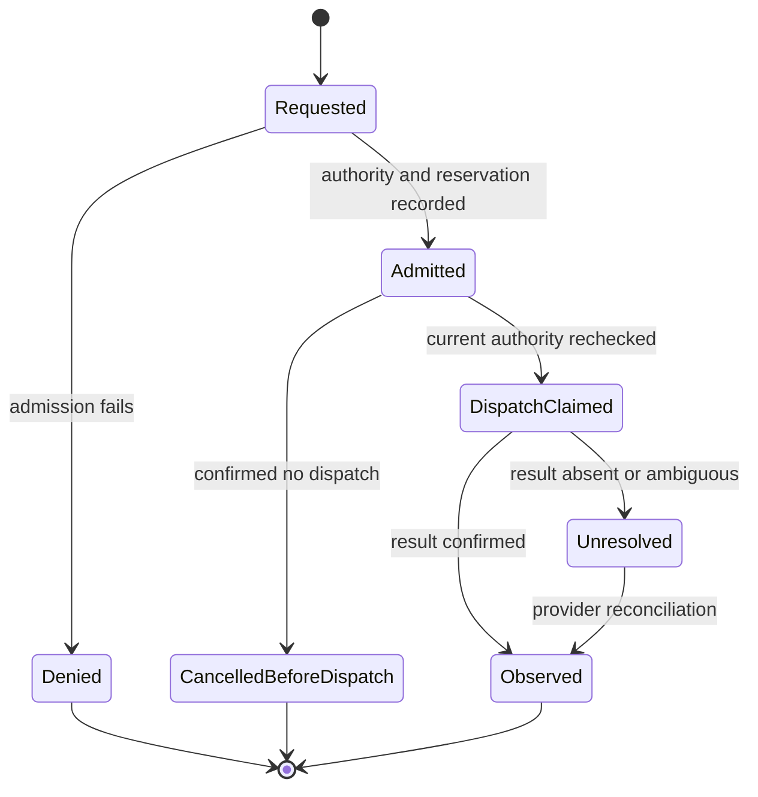

# Contracts and State

This is a proposed design under the [Architecture](../../ARCHITECTURE.md), not a deployed API,
schema, or grant of authority. It owns the shared meanings used by the component documents.
Examples describe required information; their identifiers are illustrative, not credentials.

## Responsibility and Contract Ownership

The Core owns current authority, aggregate commitments, activated configuration, and protected
execution records. Gateway authenticates callers and mediates client access. Runtime Manager
owns actual workload lifecycle. Resource Services own provider-specific execution and observation.
Private operation owns work selection, organization, business schemas, knowledge, and economic
interpretation. The outer environment does not execute private planning code in its control process.

| Concept | Meaning and owner |
| --- | --- |
| Firm | The continuing authority, capital, records, and obligations of one independently operated company; not a session or shared multi-owner tenant service. |
| Principal | An authenticated human, logical agent, or service eligible for explicit permissions. Core owns bindings; an actor name supplied by a client is not authentication. |
| Delegation | Allowed actions, resource scope, conditions, lifetime, ancestor constraints, and resource bounds. Core owns its current validity. A role does not override its restrictions. |
| Work | Continuing accountable work selected by private operation. Core retains its identity, responsible principal, authority, execution references, and approved wake conditions; private owns its meaning and plan. |
| Execution | Core's desired-execution record, identified by `execution_id`. It exists before provisioning is confirmed and refers to one admitted start or successor under a work. It is not evidence that a process exists. |
| Instance | One actual execution, bound by Runtime to package, profile, configuration, generation, and a verified access channel. Multiple instances can continue the same work. |
| Native session | A provider's conversation and tool context. It is neither a principal nor current authority and may be replaced without loss of company continuity. |
| Intent | One attributable requested effect with fixed material input, resource target, authority context, and stable request identity. Core owns admission and its durable record. |
| Attempt | One recorded dispatch opportunity for an intent. Retries cannot erase earlier uncertainty. The bounded [collection protocol](#explicit-object-collection) retains one root attempt and separately records each explicitly authorized step toward the same fixed effect. |
| Reservation | A commitment against applicable firm and ancestor resource limits. It is not new capital, a bill, or an assertion that an effect happened. |
| Effect or obligation | An observed or unresolved external consequence, possibly continuing after the request or instance ends. Includes provider resources, orders, positions, charges, and uncertainty. |
| Activation | An attributable selection of a verified package/configuration/target/enforcement binding. Registration and publication do not activate it or grant caller authority. |
| Observation | Attributable evidence with source identity, occurrence/receipt times, references, and uncertainty. Native reports and independently obtained observations remain distinguishable. |

Resource identity is canonical across connectors: two routes to one provider account, bucket,
database, or outstanding resource must not produce two independent balances or allowances.
Evidence references retain the relevant content and provenance, not only a hash whose content is lost.

`work_id` identifies continuing accountable work. `execution_id` identifies the Core-owned desired
execution; `instance_id` identifies the actual Runtime binding and is absent until established.
A successor gets a new `execution_id` and fresh `instance_id` under the same `work_id`, with an
explicit predecessor reference. It does not overwrite the predecessor's attempts or obligations.
Uncertain provisioning must be reconciled before another start could duplicate that resource;
requesting a successor is not a workaround for a create response whose outcome is unknown.

## Company Hosts and Business Services

The Company boundary covers both presentation and runtime behavior. The product supplies generic
**Company UI Host** and **Company Service Host** responsibilities over existing native client,
Gateway, Core, Runtime and resource contracts. These names introduce no additional authority
service or execution engine. Company source owns its business UI, services, domain semantics and
enforcement, and provider adapters; the product owns admission, isolation, current authority,
custody, exact dispatch binding, observation and revocation.

Each service interface declares versioned named operations, input/result schemas, typed record
references and required connection/capability bindings. UI, service and adapter packages are
qualified and selected under their existing use contracts with independent lifetimes. Ordinary
Company UI, service and adapter packages never receive raw secrets and cannot be loaded as privileged
Core/Gateway code or into a secret-bearing process. A separately qualified AuthModule may originate
in private company source, but its protected adoption is a distinct trust promotion, not authority
inherited from Company authorship, package publication or ordinary adapter acceptance.

For financial connections, protected selection fixes the required Company enforcement service
and configuration. Its qualification covers semantic limits, account aliasing, concurrent effects,
post-transformation request checks, bypass attempts and recovery. The protected sender accepts
only an authenticated validation bound to the exact selected release, active instance, connection/
account/config revision, intent/attempt and final material request bytes under current authority.
Changing the bytes requires revalidation. A worker report or package-authored approval field does
not create this binding. No generic call, raw HTTP/signing path or alternative tool may bypass it.

Company ownership does not allow a strategy agent to mutate the running enforcement release,
settings or acceptance. Required enforcement failure blocks new dependent effects; monitoring,
reconciliation, retained evidence and residual duties remain separately scoped. Financial
functions are unavailable if the selected Company service is absent; the product cannot replace
them with hard-coded investment logic. Fixed owner observation and execution controls remain.

### Bound Company calls and owner actions

The full service/root-effect binding below remains a target contract. The common owner transport
now implements `OwnerBinding` with `environment_id`, `firm_id`, `principal_id` and
`serving_generation`. `/conditions` exposes this authenticated observation. The native client pins
it once per explicitly selected connection, supplies `x-ouro-owner-binding` on subsequent requests,
and rejects a changed response rather than adopting it during refresh. Gateway rebuilds human
identity from mTLS and forwards only the parsed precondition. Core compares it to the authenticated
principal and firm data inside the same serialized transaction as authorization and admission;
matching fields grant no authority. Mismatched context returns a conflict before replay or effect.
Legacy CLI requests may omit this additive precondition; the Mac client requires it. Instance
calls retain their existing verified Runtime bridge identity and cannot claim an owner binding.

Migration `0033` assigns a durable random environment ID to each firm's data. Core constructs a fresh
serving generation at startup, preserved by its clones. Reconnecting after restart preserves the
environment and original request keys, but old UI submissions conflict until explicit reconnection.
Restoration remains an offline managed lifecycle; cloning/restoring a database behind a still-running
Core is not a supported restore path. This owner connection contract does not replace physical
Catalog storage generations, service/package selection, or downstream root-effect restrictions.
The persisted local request namespace changes from the earlier URL hash to the authenticated ID;
old local references are retained, never automatically reinterpreted as authority for another store.

The Runtime supervisor also has an additive `RuntimeClaimContext` precondition, read from the
original execution intent and checked within Core's claim transaction. It pins environment, firm,
serving generation, authenticated worker, intent, execution and profile. The separate read-only
claim observation exposes the original assignment and accepted compute return for slot recovery;
it does not replay an attempt or grant a new allowance. This is execution claim continuity, not the
Company root/child operation contract below. The initial direct-call implementation now adds the
operation restrictions described here; complete schema binding and nested service calls remain pending.

### Implemented direct Company operation calls

An adapter submission may carry `service_operation`: one named operation with at most 32 unique
effect slots. Each slot fixes the resource target, operation, input-byte bound and optional exact
top-level input values. The target/worker/configuration snapshots are captured with the immutable
submission, so the existing independent evaluation, bounded acceptance and activation select both
program material and its operation plan. A declaration does not grant any of those permissions.

`AdapterInvocationRequest.service` supplies the exact operation name and a bounded input object;
managed MCP exposes the same invocation through `service_input`. Omitting this field cannot run a
scoped submission as an unrestricted adapter. Core binds the original execution intent to environment,
firm, activation, submitted program/operation digests and target configuration snapshots. It retains
the actual caller/work/grant/origin and resolves the executing service principal, instance, generation
and worker from its admitted execution and Runtime assignment. No caller-context JSON/header is trusted.

A running service sends only `X-Ouro-Effect-Slot` with an ordinary Gateway resource request. Core
derives the root from the authenticated Runtime instance and admits one immutable child per
`(root_intent_id, effect_slot)`. Its canonical request key belongs to that root/slot, so changing a
transport key cannot create another effect. Changed material input conflicts; undeclared slots,
targets, operations and work/grant substitutions are denied. A child uses the existing one-time
resource reservation and sole claiming worker/attempt. Current caller and service grants, work
scope, target configuration and selected adapter are checked again before dispatch and delivery.
Ordinary caller process exit preserves provenance; authority withdrawal still blocks child use.

Scoped instances may inspect execution metadata, use their declared resource slots and obtain their
own operation input/plan through `execution_self`. They cannot use ordinary management endpoints to
start background work, register adapters or invoke another service. Their receipt access is restricted
to their own children and their exact registered program-input reads. Materialization keeps its
existing retained-input contract, without granting extra operation slots. The initial slot operations
are `db.read`, `db.write`, `file.read`, `file.upload`, `file.publish` and `model.responses`.
Gateway DB routes also accept a registered resource-target selector, retaining the existing default.

Execution observations expose root/binding/actual caller/assignment and child intent/attempt/receipt
availability metadata. Protected target configurations and root input are excluded from general
observations. Existing request-key lookup resolves the original execution, including after selection
is stopped; inspection never re-admits it. A root response or process termination does not settle
its children. These records are company runtime data in Core, not product source or private Company code.

Direct calls use the existing caller-descended agent delegation. An explicitly registered finite
continuation can now replace a contained execution while preserving its original root, caller,
operation and effect slots. `service_continuations` holds immutable authority; `service_restarts`
holds immutable admission ordinals; `service_execution_roots` maps actual instances back to one root.
`service_continuation_stops` records exact-current-execution owner stops. Poll timestamps are separate
mutable observations and cannot reset authority. See the [implemented Runtime continuation contract](RUNTIME.md#implemented-finite-company-call-continuation)
for endpoints, bounds, termination/return barriers and replay behavior.

Independent service grant trees, nested root/parent plans, desired service availability and qualified
health, reserved dependency capacity, typed request/result schema qualification and protected
authentication-module effects remain unimplemented. Binary child response redelivery across instances
is also withheld; a needed file-read recovery blocks instead of broadening delivery authority.
Unsupported paths fail closed. The continuation never creates a fresh business root or allowance.
The following remains the full target contract for those extensions.

### Complete service binding target

The complete `ServiceBindingRef` and Mac Company command DTO remain pending. A `ServiceBindingRef` fixes the actual environment/deployment identity,
firm, service slot, effective selection revision, package and interface/schema digests, config and
data-binding revisions. A URL, service name or Company label is not this identity. An `OperationRef`
adds the declared operation and canonical target record/reference with expected revision.
The exact binding and original result schema follow admission, attempts, receipts and history.

Native issues an opaque connection handle/generation bound to the authenticated environment, firm,
principal and authority context. Owner action preparation and submission both require this same
context and service binding. A changed connection/selection/schema invalidates the draft; neither
late callbacks nor receipt lookup adopt the new global connection. Private UI can suggest only an
allowlisted operation reference. The fixed host resolves its schema, canonical inputs and target,
records the stable request key and draft fingerprint, and accepts submission only from its actual
owner interaction. Private JavaScript cannot supply confirmation or impersonate owner origin.

Core binds an admitted Company call to its root intent, original effective caller/work/delegation,
executing service principal/instance/generation, selected binding and operation-specific downstream
scope. This is server-established context, never an on-behalf-of header from the caller. A downstream
request must satisfy both current authority chains **and** the effects allowed for that root
operation. Two broadly privileged actors cannot turn a read operation into a write. Distinct
background service work needs its own explicitly admitted grant/work, not laundering of the origin.

The root admission permits bounded service processing, not every possible resulting effect.
Each downstream operation has an attributable child intent. Core atomically binds a unique
`(root_intent_id, effect_slot)` to that child and its immutable material-input fingerprint when
admitting it; a nested call also retains its parent. Slots are deterministic within the selected
operation plan and bounded by that plan's scope/count limits. Restart resolves the original slot;
different input conflicts, and creating another slot is not a retry. Each child has its own single
assigned claiming worker and attempt. A service-processing claim cannot be handed to the sender.
Shared ancestry constrains all child costs; count each actual resource/effect reservation once,
not again when rolling up the root. Root response availability does not settle its child effects.

### Company preparation and exact external dispatch

Company semantic preparation precedes admission of the actual business effect. It may perform
separately admitted reads/computation, but cannot write business state, reserve financial exposure
privately as a substitute for common admission, sign or send. The qualified validator proposes
canonical target/constraint identities, units and bounded deltas, policy/observation/ledger revisions,
freshness bounds and the root effect slot. Price-dependent quantities include a qualified
conservative bound and pending uncertain effects; a snapshot estimate is not a guaranteed ceiling.

Core serializes child binding and all common constraint reservations using the current registered
versions and constraint rows. Only observations accepted into this enforceable revision boundary
can serve as preconditions; a Company's unregistered DB revision cannot be atomically checked by
Core. Company RPC, provider reads and payload transfer never occur while its transaction locks are
held. A stale proposal conflicts or is recomputed under the same root/slot, not admitted against
old capacity. Company owns the formulas; Core checks identities, versions and generic constraint
arithmetic without embedding business semantics. Sender admission cannot precede this step.

Protected selection specifies which exact validator operation may issue a validation for which
connection and operation family. Ingestion authenticates its actual instance and invocation,
binds the validation to the admitted child/reservation and stores it immutably. Ordinary service
JSON, a Company event or an `approved` field cannot be promoted into this record.

The validated request envelope covers method, canonical origin/path/query, material headers/body,
target/account, config/credential/authentication-profile versions and exact admitted effect.
Non-secret timestamps/nonces are fixed before final validation with bounded freshness; changing
them requires revalidation. Only the selected authentication primitive's specified secret/header/
signature insertion may follow validation. It cannot change the target or material operation.
Core's final current-authority/selection/reservation check and single-use sender permit consume
form the dispatch ordering point; they do not make the network send atomic. A later fence stops
a provably unsent attempt; an ambiguous send/fence race remains in flight and requires reconciliation.
Exact-envelope binding, application-specific deduplication and effect observation remain distinct.

The proposed read-only `GET /intents/by-request-key` lookup accepts an operation family, original
request key and, when needed, an origin-context locator. Scope and disclosure rights come from
authentication and current work access. It never creates an intent or invokes Company code. It
returns the original intent/input fingerprint, binding/schema and current attributable outcome
even if that service was replaced or disabled. An absent record is `not observed`, not proof that
a delayed original request cannot arrive. Any authorized resubmission preserves the same key and
material input. The ordinary request-key lookup is implemented and its execution reference resolves the direct-call
metadata above. Complete schema-bound Company action integration remains pending.

## Extensible Connections and Protected Authentication

This is the selected target extension contract. It reuses Core admission/acceptance/activation,
Gateway mediation, Runtime isolation and Resources custody/transport. It introduces no additional
authority service, secret registry or execution engine. The fixed Resources credential host accepts
independently delivered AuthModule packages through a versioned, bounded host ABI. A compatible
qualified module can be selected without a full product update. Changing the host ABI, isolation,
custody, authority checks or permitted host operations remains a governed product change.

All ordinary agents and Company programs use named connection operations. This includes Company
UI, services, adapters, scripts and generated code, regardless of author. They never obtain raw
credentials, cookies, reusable signed requests/URLs, session tokens or a generic signing/decryption
capability. Opaque connection/session references are selectors under current authority, not bearer
grants. AuthModule workers belong to the protected execution profile described below, not this
ordinary Company execution class.

| Contract | Required identity and contents | Boundary |
| --- | --- | --- |
| ConnectionType | Immutable type/revision, named operation and result schemas, canonical resource/account resolution, supported provider capabilities and protocols, compatible Company adapter/validator and AuthModule interfaces, credential/input schemas, destination classes, lifecycle/recovery and session/ingress contracts | Reusable definition; no actual account, secret, activation or caller rights |
| ConnectionBinding | Firm/environment, canonical provider/account/resource, exact ConnectionType/adapter/validator/AuthModule selections and config revisions, fixed endpoint/recipient bindings, credential references/versions, verified provider capability observations, company operation scope, budgets and current delegation | Applied state selected under Core; a credential or broad provider permission does not enlarge this scope |
| AuthModule package | Immutable package/digest and host ABI, credential schemas, declared enrollment/authentication/refresh/inbound-verification/capture operations, allowed authentication slots and protected host calls, runtime bounds, result classification, exact verification and provenance | Separately qualified protected code; private source location and authorship confer no trust |
| Authentication flow | Original root/parent/effect-slot and intent/attempt, flow kind, exact binding/module/credential lineage, initiator or admitted maintenance authority, expected revisions, expiry, state and retained receipt references | Authentication maintenance is distinct from a business effect; neither flow completion nor login retries that effect |
| Secret-use lease | Exact worker instance/generation, AuthModule digest/selection, connection/account, assigned credential version or external key reference, invocation/attempt, permitted use, deadline and stopping bounds | Internal, non-transferable use authority; no caller-selected key, store enumeration or new grant |

The package's input schema distinguishes secret fields from non-secret metadata. Its independently
qualified schema and selected flow determine trusted input handling; a live module cannot relabel
a secret as public. Actual values, refresh state containing secrets and private key material reside
only in custody or its selected external key backend. Core stores lifecycle metadata, selected
versions, producer/authority identities and receipt references, never secret values or their hashes.
Opaque external key references still require the same current, exact-operation use checks.

### Qualification, provider scope and automatic adoption

An agent or person may prepare a ConnectionType, Company adapter or AuthModule in private source.
Selection of an AuthModule is explicit admission into the secret-bearing trusted computing base.
Its qualification is separate from ordinary Company execution, even if the bytes share a source
commit. Required evidence binds module/ABI/runtime/config, credential and operation classes, secret
input/output handling, permitted recipients, limits, failure/restore behavior and independent
verifier/acceptor authority. An author cannot be its sole verifier and acceptor. Sandbox isolation
and recipient allowlists constrain exposure; they do not prove arbitrary secret-handling code
cannot misuse a value. Unsupported assumptions keep that use unavailable.

Within already valid connection-adoption authority, cost/data bounds and verification conditions,
private operation can prepare, verify and activate a new connection without a new owner decision.
This does not exempt it from the applicable independent acceptance or current-state checks. An
AuthModule may likewise be adopted under a separately valid protected-module delegation and policy;
ordinary Company execution or connection-adoption authority does not imply that delegation.
Missing new authority or a required interactive credential/MFA step is surfaced at that boundary,
not replaced by a synthetic agent approval. Installation and enrollment alone activate nothing.

Provider capabilities and company grants remain distinct. Credentials may permit more than the
company delegates; effective use is the intersection of observed provider capability, selected
connection/operation, caller and service authority, required Company validation and common limits.
Unverified account identity/capability cannot be inferred from credential presence or a successful
login. Aliases share canonical limits. Revocation or reduction of any applicable scope prevents
new dependent effects; broader provider access never supplies a fallback.

### Enrollment and independent lifecycle

Credential input uses the fixed trusted host/CLI or a selected authentication flow. Ordinary
Company forms/scripts never receive it. Interactive enrollment binds flow/nonce, initiating identity,
connection and expected account, module/schema/config, exact callback/recipient and expiry. A late
callback cannot select another connection or revive a cancelled flow. A flow records pending input,
provider exchange, custody committed, binding selected and use observed as separate attributable
facts; receipt-only recovery never repeats enrollment or business dispatch.

Refresh, rotation and provider-created credential capture retain original flow/attempt identity.
Serialize refresh by canonical account and credential lineage, not by adapter alias. Apply a new
version with conditional checks against the expected predecessor, disable/selection epoch and
confirmed account/scopes. A disabled or replaced flow cannot reactivate a version through a late
success. Custody receipt and Core selection commit independently: uncertainty preserves the receipt
and pending state until original-intent reconciliation. A provider may rotate a refresh token even
when its reply is lost; missing evidence requires recovery or reauthentication, never blind retry
or a business request resend. A scheduled refresh uses explicit maintenance authority and bounds.

Connection selection, AuthModule selection, credential version, actual worker readiness and active
sessions have separate revisions/lifetimes. Replacing one checks the required dependency closure;
it does not silently rebind an in-flight attempt. Restriction closes new leases and permitted host
uses, then observes worker/session containment and unresolved effects. Already disclosed plaintext
cannot be recalled by a metadata update. Recovery may read original receipts under scoped current
authority without renewing the original dispatch lease. Provider-side revocation is a separately
observed operation, not implied by local disable or worker termination.

### Credential renewal and structural selection epochs

Separate three version axes: structural selection (account/issuer/scope, operation/config/schema,
adapter/AuthModule/ABI and dependency meanings), credential-material epoch (versions inside one
qualified lineage), and restriction epoch (current grant, disable/revocation and permitted use).
A routine token refresh within the same verified structure/scope advances only the credential epoch
by predecessor CAS and current restriction checks. It does not reselect/reload Company UI/services,
invalidate an otherwise unchanged owner draft or repeat independent package qualification.
A changed account, scope, module, schema or authentication behavior is a structural change.

Every admitted authentication/dispatch attempt pins its actual credential epoch and immutable
envelope. Dispatched or uncertain attempts keep the original version and recovery identity; a new
token must never be substituted into that attempt. Only a durably proven unsent/cancelled-before-send
attempt, established by the owning serialized claim/transport state rather than a module report or
absence of a receipt, may continue the same business intent/child slot through separately recorded
authentication preparation and final validation for a fresh attempt. Existing cost/authority bounds
still apply, and the predecessor cannot later dispatch. This is not replay of a possibly sent effect.

Overlapping token validity and continuation of established sessions require the selected provider/
profile's explicit, bounded qualification and current credential eligibility. Never infer overlap
from local expiry metadata alone. Without that evidence, dependent unsent use waits for renewal or
re-authentication; effects already sent stay under observation. Restriction/compromise/structural
replacement fences the affected leases/channels immediately through the existing applied-fence
contract. Ordinary refresh performs its qualified per-lease cleanup; it does not inherently kill
all workers/sessions or require full binding-set replacement. Material credential-schema or
permission changes still follow the joint selection/recovery barrier.

### Authentication slots, leases and continuing traffic

The admitted final envelope also fixes the AuthModule/ABI and authentication profile revision.
Secret-bearing authentication slots are defined by the selected profile: exact field locations,
encoding/size and recipient, derivation/verification conditions, and response handling. A slot
cannot change the canonical target, method or business parameters, add another request, redirect a
recipient or return credentials to ordinary code. Non-secret material values are fixed before
validation. Private code cannot request arbitrary signatures; the fixed host retains and sends the
authenticated request under the original single-use child permit. A protocol needing additional
handshake/token messages declares those bounded authentication effects separately.

Only the custody/key owner issues an exact-version lease to the selected protected worker. The
worker receives neither custody master/unlocking keys nor general store/database access or a list
of secrets. Where plaintext is unavoidable, only that trusted worker receives the leased value for
bounded use; for an external KMS/key store the fixed host mediates only the selected key operation.
No module-controlled socket, unrestricted key operation, detached secret user or general shell
bypasses host egress and receipt handling. Lease expiry/selection change denies further use;
completion records lease closure and actual worker cleanup separately from external settlement.

A session/subscription binds connection/account, module/credential selections, caller/service or
explicit standing-service authority, generation, lifetime, scope and aggregate bounds. Its opening
handshake is not permission for later arbitrary frames. Each new business effect keeps its own
root/child identity, validation and one-use send; admitted observation traffic retains delivery
checks, quotas, sequence/cursor and gap handling. Reconnect, reauthentication and transport fallback
never resubmit an uncertain effect. Continuing a session after its initiating work ends requires
explicitly admitted continuing authority, not a silent switch to the service's broader rights.

Inbound authentication proves a registered provider/connection origin, not a company caller grant.
Fixed ingress chooses the admitted verifier and bounded raw-message representation; public input
cannot choose a credential or validator. Verified events enter a scoped durable inbox with provider/
account event identity, payload fingerprint and replay/freshness checks before acknowledgement.
ConnectionType defines the provider event identifier's actual uniqueness namespace. Connection
aliases and transport/subscription generations are delivery provenance, not new event identities.
The same canonical event delivered through old/new subscriptions produces one event and separately
attributable deliveries. If IDs are only subscription-local, the qualified contract must map a
stable logical event/stream or retain the limitation and reconcile before a repeated downstream
effect; no universal deduplication is asserted. Duplicates reuse the original event and conflicting
payloads/gaps remain visible. Any resulting wake or action
uses its own current internal authority and bound effect slots. Generated credentials are captured
inside the protected host/custody path before any ordinary result or event is released. Detailed
execution and recovery requirements belong to
[Resources](RESOURCE_SERVICES.md#protected-authentication-modules).

## Company Source, Package, Verification and Selected Use

[Integrated System Design](SYSTEM_DESIGN.md) owns the connected development/app/operation picture.
This section defines the shared meanings for its target external contracts; fields below are
required information, not implemented endpoint or schema declarations. Existing Core/Runtime/
resource records remain the owners of admission, acceptance and actual effects.

Product and private company source target one maintained trunk, `main`. A source commit identifies
code, not current operating state. Isolated working copies, current-base verification and conditional
main admission prevent concurrent overwrite without requiring a company dev/feature branch. Existing
product repository enforcement remains in force; the design does not authorize its bypass.

| Concept | Required identity / owner |
| --- | --- |
| Package | Immutable kind/ID, source commit/tree digest, dependency lock/build/runtime/SDK identity, entrypoints/assets, configuration/data schemas, requested capabilities and build provenance; company artifact custody |
| Verification | Exact package and tested profile/platform/config scope, evaluator/policy/oracle revision, fixture/input and retained result references, verifier identity, independence basis and all outcomes including NOT RUN; applicable evaluation contract |
| Deployment / selected use | Exact package + target company/environment/slot + config/data-binding revisions + applicable verification/acceptance + current delegation/profile + expected prior selection + stable request/previous release + actual application observations; owning protected admission/activation contract |

Package content omits actual company/account/environment/credential bindings. Private namespace,
current grants and custody still control disclosure and reuse. Target bindings are independently
validated; declarations of requested capabilities never create rights. Package compatibility or a
test on synthetic bindings does not qualify different material settings, a new real account or
another runtime. Evidence is exact-content-and-use specific. A candidate's own report/tests are not
its independent acceptance, and changing the candidate cannot edit the protected test oracle.

Keep source admission, content publication, applicable acceptance, selected use and actual readiness
separate. Company UI requires a protected selection in addition to valid content; editable profile/
composition JSON alone cannot establish that selection. Bounded jobs use execution admission;
continuing services/adapters use their existing candidate/evaluation/acceptance/activation contract.
Local experiments under existing execution conditions need no per-file release approval. Do not
create a universal artifact-approval service or a mandatory human gate for routine authorized work.

### Compatible selection and schema transitions

Independent package lifetimes do not permit arbitrary version combinations. A selected binding set
records exact UI/service/adapter/AuthModule digests, interface/config/data-schema requirements, applicable
joint verification and expected revisions of every affected dependency. A selection change compares
that dependency closure, not just its own slot. Required atomic combinations use one protected
binding-set revision; permitted rolling changes require evidence for each intermediate combination.
This is a constraint on existing selection records, not an additional deployment service.

Candidate preparation, observed readiness, effective/callable selection and retirement are distinct.
Preparation has bounded test/readiness authority and no production business effects. Readiness is
bound to actual instance generation, release, config/schema and required handover evidence. After
checking all current preconditions, Core commits the effective selection. Physical startup and UI
mounting remain separate observations. Required UI packages must all be ready before switching
handles; optional contributions may fail independently only if the selected composition declares
them optional. A failed candidate preserves the still-authorized prior selection. A revoked old
selection closes. Old holds survive until in-flight duties and recovery requirements are resolved.

A data/schema migration uses a protected barrier associated with affected binding sets and the
original migration intent. Drain/fence incompatible writers before the DB-side change. The DB
schema identity/epoch and migration receipt commit together; lost acknowledgement leaves the
barrier unresolved. New effective selection and rollback require the observed completed schema
epoch and matching barrier/selection revision. Core and DB are not one transaction. Writers and
new claims remain restricted until that cross-store outcome is reconciled; startup cannot infer
compatibility from a schema check made before migration or from the latest package name.

A selected use preserves its full input fingerprint and prior expected selection; concurrent changes
conflict rather than silently replace the winner. Reconcile a lost result by original intent before
any retry. Establish acknowledged retention holds before committing cross-store dependencies on
packages/evidence/recovery inputs. Preserve a valid old selection after candidate rejection, but
fence it when its actual authority expires or is revoked. A restored old package is a new selection
under current permission/schema conditions, not reversal of database state or external effects.

## Exact Artifact References and Projections

A durable client reference identifies current environment/company scope, workspace, exact revision,
path and content digest verified through the Catalog. Storage binding and blob generation remain
file-service identities for retention/deletion. A reference is not a bearer grant; Gateway-mediated reads, exports/saves, previews and
conversation/notification link resolution recheck current authorized access. Already delivered
local bytes can be read under their admitted local conditions without another network call;
revocation does not prove an exported copy was remotely recalled or deleted.
Do not discard these fields when passing through application detail/navigation or a room message.

Creating principal/work/execution, publishing principal/receipt and evaluating principal are distinct
provenance. A logical document or multi-file package records explicit version lineage and exact
manifest entries; basename equality or rename does not infer lineage. References used in judgments,
tests and conversations never resolve through a future latest manifest. Historical discovery needs
current-scope cursor/coverage, denied/missing/retired distinctions and explicit partial observations.

Artifact metadata describes content and relations; it does not replace the protected decisions it
references. Display storage/publication, evaluation, use and retention/disposal as independent axes.
A report has no mandatory activation stage. Uploaded bytes are not a published report, published
code is not an accepted release, and an active release is not proof of observed economic benefit.
Deleting a latest-manifest entry or hiding a UI row neither retires every reference nor proves bytes
were removed. The artifact-use and storage-lifetime contracts below own the actual transitions.

### Cross-store retained dependencies

A discoverable link and a promised durable dependency are different. DB result evidence,
retained conversation attachments, admitted execution inputs, selected packages and recovery
records declare which exact artifacts must remain available. Before committing such a dependency,
its owner obtains a Catalog acknowledgement bound to owner kind/ID/revision, artifact and physical
object generation, retention reason, stable request key and hold ID. The owner's transaction
stores that acknowledgement with the reference; the hold grants no additional read permission.

Retain/release/cancel requests have durable, idempotent outcomes. An uncertain retain is looked up
before owner commit or abandonment. Cancelling an uncommitted owner intent must leave a fence
against a late retain; any acknowledged orphan is reconciled to that same owner intent. Absence
of a callback or process exit cannot release a committed hold. Releasing execution input holds
requires reconciled end-of-use plus continuing evidence/recovery duties, not simply termination.
These owner-specific holds extend the existing Catalog protocol; current upload/revision holds
and execution-input fences do not yet implement the general cross-store dependency contract.

Owner commit and cancellation compare the same owner-intent revision in its authoritative store.
If cancellation wins, a delayed commit cannot reuse a previously received hold acknowledgement.
Catalog release requires the durable cancelled/ended owner outcome; if commit wins, abandonment
cannot release its hold. The stores remain separate, with conservative retention on uncertainty.

### Company results, projections and primary references

Protected sender observations retain transport/provider evidence before dependent completion.
Company interpretation of that evidence and its business records commit with a replayable local
receipt/outbox entry. A result commits before transmission; a crash before acknowledgement is
recovered by replay under the original producer/event and intent identities. Interpretation is
attributed to Company and cannot upgrade an HTTP receipt into a confirmed business outcome.

The observation owner validates the registered producer or scoped reconciler, original service
binding, root/child/attempt and result schema. Accepted event identity is deduplicated with its
source stream/generation; acknowledgement follows durable ingestion, not message arrival. Replaced
services can have outstanding receipts ingested through original-identity reconciliation without
regaining dispatch authority. Protected control state cannot be authored through this Company feed.

Projection change and committed watermark share the owning projection transaction. A view over
multiple stores reports each source's coverage/freshness and gaps; it does not assert a global
transaction. Cursor scope includes filter/access context and interface/projection generation.
An incompatible selection/schema change requires a gap/reset and fresh authorized snapshot;
retained old results keep their original decoder/schema. No UI response fabricates a server event.

Messages, Company records and notifications carry a typed **primary reference**, with related
execution/work/intent references separately listed. A primary reference fixes namespace, record
kind/ID/version and service/schema binding where applicable. Files use their exact artifact
reference. The current text-only message body is not that structured-reference API. Notification
categories support filtering/counts, never override the primary destination. Resolvers query the
original record with current access instead of searching only the loaded/latest list. Redacted
notification metadata may expose an opaque publication intent while file names/content are
resolved only after their separate namespace access check. A declared creator is labelled as a
claim unless attributable creation evidence exists; the authenticated publisher remains separate.

## Artifact Use and Allocated Space

An artifact is attributable content: code, data, a report, a prompt/skill, a build output or a
checkpoint. Durable artifacts use the file catalog's immutable content and revision contracts.
The company/work owns their retained use; author, submitting principal and creating instance
remain provenance. Neither a bot name nor an artifact's filename supplies ownership or authority.

Controls follow the proposed use, not the file extension. There is no global "trusted artifact"
flag and no mandatory human approval pipeline for every file. The same content can be retained,
used in a bounded test and remain ineligible for a managed operational capability.

| Requested use | Required boundary |
| --- | --- |
| Edit, compile or run a local script inside an existing instance | Existing experimental/work authority, accepted execution profile and remaining limits. Ordinary local work creates no new candidate or manual approval requirement; all boundary-crossing calls still use Gateway and domain controls. |
| Retain or share company content | Authorized upload and separate revision-checked publication, with access scope and retention. Publication means an internal company-record change, not public Internet/Git publication, code activation or verification of the author's claims. |
| Start a separate bounded job | Current execution admission under an accepted profile, fixed payload/input references, entrypoint and resource bounds. Experimental code remains untrusted; acceptance of the environment does not qualify a strategy or authorize a new external effect. |
| Provide an ongoing internal service or reusable managed tool | Exact release/configuration, service operations and consumers, data/lifetime/stop contract, required independent verification, activation and per-call permission. Runtime readiness precedes callable availability. |
| Connect an external service | The existing adapter release, service connection and usage-delegation contract, including secretless extension logic and trusted outbound enforcement. |
| Change an outer control, base profile or trusted credential/sending implementation | Separately governed platform-change verification and adoption. Ordinary publication, job execution or adapter activation cannot deploy this change. |

An execution bundle is an ordinary immutable artifact manifest identifying its source or binary,
entrypoint, supplied dependencies, required runtime/toolchain and input references. It links build
and evaluation evidence where required; a successful build or author-written test is not independent
acceptance. Bind accepted uses to exact content/configuration, purpose/profile, scope and evidence.
Changing those inputs cannot inherit acceptance by keeping a name or tag. A new publication does
not update an already admitted execution. Native work may still edit its explicitly mutable working
copy; the observation must distinguish that workspace from any previously verified release.

| Space lifetime | Identity, ownership and access |
| --- | --- |
| Execution-local working copy and scratch | Work plus actual execution/instance binding and bounded allocation; writable code, temporary data, builds and caches. Runtime owns enforcement and observed disposal. It is not durable company publication. |
| Durable company workspace | Firm/work namespace, workspace identity, immutable revisions and retained content generations. File service owns persistence; every access and publication uses Gateway with current scope. |
| Service data | A separately identified workspace or database/resource namespace with its own work, access, quota, retention and outstanding obligations. Its lifetime is independent of the serving process; its resource handler owns mutation and reconciliation. |

Space requests identify responsible work, intended use, logical parent/pool, permitted access
scope, finite capacity/count/lifetime bounds and retention reason. Core checks actual delegated
creation or growth authority; handlers bind logical identities to the activated environment.
Creating a namespace applies only already permitted scope, never arbitrary new reader/writer grants.
A quota is a ceiling, not additional physical capacity or a prepaid reservation. Actual allocation
and growth reserve capacity against the same canonical pools without charging one contribution twice.
Backend paths, host mounts, ports, SQL credentials and storage-administration rights are not outputs.

The CEO may choose work, propose allocations and request these operations within its mandate.
Core admits authority and commitments; Runtime allocates execution space; file/DB services manage
durable content. The identities and limits continue across staff replacement. Retention is separate
from current access: expiry or revocation can prevent use while evidence and unresolved obligations
still require custody. The [resource lifecycle](RESOURCE_SERVICES.md#generated-artifact-workflow-and-space)
owns materialization, preservation and reclamation; these distinctions create no new platform service.

## Common Request and Result

Human clients and workloads use the same logical Gateway. Human sign-in and workload channel
binding differ, but both resolve to a verified principal before the same action/resource/condition
checks. A human console never forwards an authoritative username on behalf of an unauthenticated caller.

| Information | Source and required treatment |
| --- | --- |
| Principal and instance | Derived from validated authentication and Runtime binding; not trusted from the request body. Human requests need no fictitious workload instance. |
| Work and delegation reference | Supplied where the action requires them, resolved against current Core records and the authenticated caller. Inspection need not create a new work item. |
| Action and target | Resolve through an activated capability and canonical resource identity; the caller cannot choose a weaker enforcement classification. |
| Stable request key | Scoped to firm, caller, and operation. Same key and same material intent identifies the existing record without new admission; its result and evidence require current read permission. Changed material input is a conflict, not a retry. |
| Input and preconditions | Preserve the admitted immutable input or retained content reference, expected revision, configuration identity, and relevant resource conditions. |
| Bounds | Applicable resource, concurrency, time, result-size, and stopping bounds. Missing required mandate/profile values prevent dependent admission; no unlimited defaults. |
| Delegated service context | Verified originating caller and authority chain for work performed on another caller's behalf; service identity remains separately attributable. |

### First Connected Routes

The first management/inspection transport is HTTP JSON with server-sent status events. The paths
below are the selected first connection contract, not an implemented server or an inventory of all
future capabilities. A route fixes its operation family; there is no generic opaque execute route.

| Route | First operation and result meaning |
| --- | --- |
| `POST /work` | Record private-selected work, its responsible principal, purpose/plan references, and existing delegation. Return its `work_id` and intent; creating work grants no new authority or allocation. |
| `GET /work/{work_id}` | Read the authorized work projection and its snapshot cursor, with linked executions, commitments, and unresolved effects. |
| `GET /conditions` | Read current authorized conditions, activated capabilities, available/committed resources, restrictions, and observation gaps. |
| `POST /executions` | Admit work, delegation, profile and finite bounds. The implemented program input is the optional `program` contract [below](#artifact-backed-program-implementation); generic `input_refs` remains a design concept. Return the Core `execution_id` and intent before any actual instance is claimed. |
| `GET /executions` | List only visible desired executions, with bounded pagination and optional `work_id` filtering. |
| `GET /executions/{execution_id}` | Read desired state, any observed `instance_id`, lifecycle, and continuing effects; acceptance is not running. |
| `POST /executions/{execution_id}/steer` | Admit fixed input for the existing execution under its current profile and authority. A stale target is not silently redirected to a successor. |
| `POST /executions/{execution_id}/stop` | Record a scoped stop/restriction intent; report requested, accepted, applied, and remaining effects separately. |
| `POST /delegations/{delegation_id}/revoke` | Revoke the addressed delegation under current controller permission, expected revision, and request key; retain the cutoff and outstanding effects. |
| `POST /principals/{principal_id}/credential-challenges` | Under the target human's current authentication and request key, register the requested new public certificate/fingerprint, expected revision, and optional `replacement_credential_id`; return bounded challenge identity, bytes, and expiry. |
| `POST /principals/{principal_id}/credentials` | With its own request key, submit `challenge_id` and the new key's signature proof. Bind only with the target human's current authentication, explicit consent, current permission, and successful single-use challenge consumption; accept no private key. |
| `POST /principals/{principal_id}/credentials/{credential_id}/revoke` | Revoke the specific human credential under current permission, expected revision, and request key; record acceptance and actual access restriction separately. |
| `GET /intents/{intent_id}` | Inspect an existing intent and permitted results/evidence under current read authority; lookup never redispatches. |
| `GET /events?view=...` | Continue an authorized snapshot using its scoped cursor; this is a status stream, not a native model stream. |
| `GET /workspaces/{workspace_id}/snapshots/{revision}` | Read an identified manifest under current content scope, including the target principal's scope for initial materialization. |
| `GET /workspaces/{workspace_id}/snapshots/{revision}/files?path=...` | Deliver bounded content from that revision through Gateway; a path or content digest alone is not permission. |
| `POST /uploads` | Admit an upload intent fixing namespace, declared content identity, size, and bounds; return its `upload_id` and intent reference. |
| `PUT /uploads/{upload_id}/content` | Execute the fixed upload intent's data stage after its current dispatch claim. It creates no second intent and authorizes no publication. |
| `POST /workspaces/{workspace_id}/publications` | Admit a separate publication intent fixing the manifest, verified staged-content references, and expected workspace revision. |
| `POST /databases/{target_id}/queries` | Execute the first fixture's named, parameterized `read_input` operation through the bounded DB handler. |
| `POST /databases/{target_id}/transactions` | Execute named, parameterized `record_result`; the fixture write and protected effect receipt commit together. |
| `/models/{target_id}/...` | Preserve the activated provider-native route suffix, request/response, streaming, and supported opaque fields. The target cannot be an arbitrary upstream URL. |
| `/mcp/{target_id}` | Use the activated MCP transport, including discovery and separately authorized meaningful operations with their actual arguments. |

The named DB operations bound the first fixture, not the firm's eventual database capabilities.
Broader query/schema capabilities remain subject to their resource and authority contracts.

Resumption is `POST /executions` with `predecessor_execution_id` and permitted `checkpoint_refs`,
the same `work_id`, current profile/input conditions, and a new request key. Core admits a new
desired execution; Runtime fences/reconciles the predecessor and binds a fresh actual instance.
There is no separate `/resume` effect, reuse of historical authority, or automatic duplicate start.
No start or steer body provides a Docker socket, raw launch flags, native login, or role edits.

Stopping an execution limits that instance's activity; it does not revoke its delegation. A later
start still needs current admission. Revoking a delegation forbids a successor relying on it and
does not erase the predecessor's effects. Credential revocation disables the addressed credential,
not the firm's obligations or every other independently valid credential for that principal.
Credential binding cannot create a principal, role, mandate, or sovereign designation. Replacement
must name the old credential explicitly; adding another certificate is not an implicit replacement.

Ordinary human credential binding/replacement must connect the target human's current authenticated
authorization and proof of control of the new key to the exact principal, certificate fingerprint,
expected revision, and any replacement credential. A bounded, single-use binding challenge cannot
be replayed for another key or principal. Other services or administrators may prepare enrollment
material but cannot activate it alone: credential-management permission is not permission to place
their own key under someone else's human or sovereign identity. A CA signature alone proves neither
the target human's consent nor that authority. Lost-key recovery follows a separate protected
procedure using existing designation and scoped recovery authority; an ordinary role cannot bypass
current-human authorization by labelling a binding request recovery.

Credential registration has two recorded operations. The challenge request fixes the public
certificate and returns `challenge_id`, challenge bytes, and `expires_at` only after Core persists
them. Core binds that challenge to the firm, target human, new certificate/fingerprint, expected
revision, and optional replacement credential. The binding request carries `challenge_id` and the
signature proof; Core rechecks current authorization and the exact bound conditions, then consumes
the challenge once in the same transaction that applies the credential binding/replacement.
An exact request-key replay retrieves the existing permitted result rather than consuming again.

The CLI's credential registration command performs both requests with separately persisted request
keys. Neither endpoint generates a key or certificate, receives a private key, or substitutes a
CA signature for new-key proof. Proof uses only the standard signature schemes supported by the
activated TLS credential profile; unsupported schemes fail rather than use an ad hoc fallback.

Initial bootstrap is a restricted installation procedure for an uninitialized firm. Under the
existing sovereign rules, it installs already recognized principal, mandate, and binding records.
First login, local access, possession of a certificate, or a CA signature cannot create sovereignty.
The procedure is not a permanent alternate company API; later credential changes use Gateway and
current authorization. Workload instance credentials remain Runtime bindings, not human enrollment.

### Work-Centered Management Contract

This extends the proposed first connection with the work/artifact management flow. The following
routes are design selections; implemented subsets are identified separately below. Existing start/stop/revoke, publication,
intent and event routes retain their meaning. No generic approval engine or executable proposal
format is introduced; each mutation maps to an existing owning responsibility.

| Route | Fixed request and owned outcome |
| --- | --- |
| `GET /work` | Bounded, permission-scoped list with supported status/responsibility filters, snapshot cursor and opaque pagination. Core owns recorded work metadata; inclusion is not proof of activity or access to all linked content. |
| `GET /work/{work_id}/resources` | Bounded links grouped by artifact, execution, space or capability, with source owner/revision/time and gaps. Return authorized recorded relationships, not a recursive scan or private database schema interpretation. |
| `GET /candidates/{candidate_id}` | Visible exact release/configuration references, declared use, required evidence, scoped technical acceptances and linked activation records. A candidate is neither callable nor globally trusted. |
| `POST /candidates` | Register fixed content/dependency/operation/profile references, work, provenance and required retained evidence. Core records an inactive candidate; no submitted code runs during registration. |
| `POST /candidates/{candidate_id}/acceptances` | Authorized verifier/acceptor submits the exact candidate revision, profile/scope, evidence references and result. Core verifies required independence and current acceptance authority. A positive record qualifies only that use; it grants no caller right and activates nothing. |
| `POST /targets/{target_id}/activations` | Fix candidate acceptance, release/configuration, connection/account/data scope and expected activation revision under current authority. Core records desired activation; assigned workers/Runtime confirm actual readiness and binding separately. Missing prerequisites leave the target unavailable. |
| `POST /targets/{target_id}/deactivate` | Restrict the exact current activation using its expected revision and request key. Core orders the cutoff; handlers confirm affected calls/streams and retain existing effects. The account, artifacts and obligations are not deleted. |
| `POST /workspaces` | Allocate a logical workspace within a registered namespace and responsible work. Core admits scope/commitments; the file handler returns the actual creation receipt. Creation does not launch code or grant new readers. |
| `POST /retirements` | Request `file.retire` for an exact upload, revision or workspace closure, with reason and explicit policy identity/revision. Core checks scope and records a reference barrier; Catalog commits the permitted reference release or closure and receipt. Physical deletion and returned byte capacity are separate outcomes. See [logical reference retirement](#logical-reference-retirement). |
| `POST /collections` | Admit one `file.collect` intent selecting an already retired upload under an explicit collection policy. Return the fixed intent without starting a worker or removing bytes. See [explicit object collection](#explicit-object-collection). |
| `POST /resource-intents/{intent_id}/advance` | With a new explicit request key and empty body, request one bounded step for the original collection under current authority. A repeated key cannot dispatch again; the caller cannot replace its upload, object, policy or target. |

Mutations use the common fixed-input, request-key, authority and result contracts below. Core
records command admission and intent; the stated owner records the operation's actual effect.
The normal GET/SSE path exposes both with their own revisions. Technical release acceptance is
labelled separately from command acceptance in every response and view.

The work detail links an immutable private proposal when a decision is needed. That proposal
identifies requested operation, exact target/release/content revision, account/data/consumer scope,
bounds, evidence and missing prerequisites. It is explanatory content, not a permit or a script.
The trusted client maps a supported operation to its fixed route and submits the concrete input
under the actual caller's identity. It never evaluates a proposed shell command, arbitrary URL or
model-authored control widget. Unsupported operations remain explicit unsupported/pending items.

Technical acceptance, a valid authority change, activation and execution are separate commands
even when presented together. Authority changes continue to use the governing delegation and
sovereign rules; none of these routes creates them as a side effect. A reserved decision remains
pending until its independently valid authorization exists. Recording a URL, chat assent or an
acceptance record cannot substitute for verifying the designated identity and authorized scope.
Declining or withdrawing a private proposal changes its recorded disposition, not existing grants,
active resources or in-flight requests; stopping those requires their explicit control commands.

Before first submission, retain the chosen operation, fixed input and request key. Include the
proposal/content revision being acted on and all operation-specific expected target revisions.
Current permission and material preconditions are rechecked at admission and claim. A changed
proposal, candidate, activation or applicable authority precondition conflicts or denies; the client
must refresh and obtain a new scoped decision rather than silently replacing expected revisions.
An authorized agent can make that revised decision within its existing delegation; an earlier
human decision cannot be stretched to the changed scope. An unchanged replay resolves its original
intent under current read permission, including when the target has since been deactivated.

Multi-step actions retain an intent/result per step and explicit prerequisites. Do not claim an
atomic transaction across acceptance, authority, activation, Runtime and file storage. If activation
fails after acceptance, preserve the acceptance and report activation's actual status; do not invent
rollback, revoke unrelated rights or issue another create merely because the screen timed out.

List, count, filter, pagination, detail and evidence expansion obey current disclosure scope.
An action hint or visible item is not permission to act. The work projection contains only durable
recorded metadata and authorized links. Its event cursor marks that projection's committed boundary,
not a simultaneous snapshot of all backends. On-demand source content uses its own current access
check, revision and freshness; missing or unobserved relations are not zero resources or zero cost.
If current authorization cannot be established, fail the protected read; if an authorized source
is unavailable, retain its gap rather than inventing a healthy or empty result.

### JSON Commands and Native Invocations

Ouroboros JSON mutations require an `Idempotency-Key` header. This includes commands creating a
work, execution, upload, publication, or resource intent; the bounded query also creates an intent.
An omitted required key is invalid. Scope the key to the firm, effective authenticated caller, and
fixed operation. Preserve its material input, `work_id`, target, preconditions, and bounds together
with retained input content. The original admitted configuration/authority remains in its record.
An exact replay finds that record without new admission, reservation, claim, or dispatch; current
read permission decides what can be disclosed. Changed material input under the same key conflicts.
Deduplication records needed by unresolved effects cannot expire into permission to repeat them.

JSON command bodies carry applicable `work_id`, `delegation_ref`, `target_id` or route target,
`input`/retained input references, `preconditions`, and `bounds`. Route-specific fields above refine
this information. Verified principal, instance, generation, and service origin are server-derived.
An upload data request addresses its existing upload binding and fixed content; a different key
or another PUT cannot convert the upload into a new effect or silently retry uncertain storage.

Native model/MCP requests retain their protocol bodies and responses rather than receiving the
Ouroboros JSON wrapper. Gateway admits each distinct meaningful ingress invocation through Core
with its own intent and internal correlation. The instance-bound bridge only relays the request;
it neither interprets authority nor holds Core credentials. Equal native bodies are not an
idempotency key: they may represent separate legitimate calls. Do not invent deduplication from
prompt/body hashes or mistake a session/JSON-RPC identifier for a proven provider effect guarantee.

The first native model profile proposes zero HTTP-request and stream retry counts for a custom
named provider. This is a candidate setting for specific loops, not a guarantee that the whole
native client dispatches once. Connection retries, WebSocket-to-HTTP fallback, and authentication
recovery can follow separate paths and require their own control and actual-dispatch evidence.
Validate the pinned client's settings and all applicable paths before use; delegate exact settings
and experiments to [Integration](INTEGRATION_AND_DEPLOYMENT.md) and [Validation](VALIDATION.md).
If a path can replay an uncertain effect without verified reconciliation, it is not ready. A private
decision to invoke again is a new admitted operation with prior uncertainty and costs still counted.

| Result class | Required client interpretation |
| --- | --- |
| Denied | This request admits no new effect; identify the restriction without disclosing inaccessible resources or secrets. An older intent can still have effects. |
| Accepted or queued | The durable intent exists; execution and success are not yet established. |
| Observed result | Report the actual confirmed stage and provider evidence, including continuing effects. Order acceptance is not a fill. |
| Conflict | Request key/material input, publication revision, or current state disagrees; do not silently overwrite or turn it into a new effect. |
| Unavailable | A prerequisite cannot be established. Include an existing intent reference when one exists; a transport failure does not prove non-execution. |
| Unresolved | Dispatch might have occurred or its consequences cannot be established. Preserve the intent, reservations, attempts, and reconciliation responsibility. |

Own JSON results identify the affected record, applicable `work_id`, `execution_id`, `instance_id`,
`intent_id`, `stage`, `observed_at`, `configuration_generation`, `restriction_generation`, and
authorized `result_ref`/`evidence_refs`. Omit identifiers that do not exist; a desired execution must
not manufacture an instance. Control results retain requested/accepted/applied and remaining-effect
observations. Human-readable errors cannot replace these distinctions.

| HTTP status | First-path meaning |
| --- | --- |
| `200` | An authorized read or synchronous observed result; its body still states freshness and the actual stage. |
| `202` | The command/intent is durably accepted or queued; include its readable record reference, not a claim of provider completion. |
| `400` | Invalid syntax, missing required request key/field, or malformed input; not a new grant or unlimited default. |
| `401` | Authentication could not establish a valid caller. |
| `403` | An authenticated caller is denied the requested action or disclosure. |
| `404` | The addressed record is absent or not visible; do not reveal forbidden resource existence. |
| `409` | A request key has different material input, an expected revision conflicts, or an incompatible current execution is addressed. |
| `413` | The bounded request body/content limit is exceeded. Any existing partial upload/effect and costs remain recorded. |
| `429` | Applicable admission/concurrency capacity is exhausted; no implicit new allowance or automatic effect retry. |
| `503` | A required dependency/current condition is unavailable; include an existing intent reference only when currently readable. |

`Unresolved` is a durable intent/attempt stage, not a special socket status. A GET may successfully
return that stage with `200`; a disconnected request or `503` cannot prove that its effect did not
occur. Native routes preserve their protocol's error surface and retain the same internal intent
and observation distinctions. An HTTP code never promises exactly-once execution or remote rollback.

## Admission, Dispatch, and External Effects

The following map identifies the accountable parties for the initial request families. Core
approval is always a decision under existing authority, not a replacement for sovereign designation.
Native session events remain supplemental evidence throughout. A resource owner retains its
effect receipt where stated while Core retains the protected company observation and uncertainty.

| Request family | Authenticated actor | Approver | Executor | Record owner | Recovery responsibility |
| --- | --- | --- | --- | --- | --- |
| Inspect, subscribe, or export evidence | Human or bound workload with current content/view scope | Core through Gateway | Gateway projection/export handler | Core access/control evidence and the source-content owner | Gateway reconstructs the authorized view; source owner resolves gaps. |
| File read, upload, or publication | Human/workload; initial input uses the target workload's read scope | Core for each fixed operation | File resource worker; Runtime only materializes the admitted handoff | File service content/manifest/receipt plus Core intent and observation | File service reconciles receipts, references and orphan content. |
| Operational query or transaction | Human or bound workload, including verified service origin | Core and activated database restrictions | DB resource worker under a constrained backend role | DB transaction receipt plus Core intent and observation | DB worker resolves commit outcome before retry. |
| Native model or MCP invocation | Bound workload or permitted human; service origin retained | Core using activated target and domain rules | Assigned protocol/resource worker and registered target | Core attempt/usage/evidence references; provider/session receipt where available | Resource worker reconciles effects and cost; private operation chooses subsequent work. |
| Compute start, steer, interrupt, or stop | Human/workload, or the scheduler's explicitly admitted continuation | Core | Runtime against its bound backend and native driver | Core desired execution plus Runtime-origin lifecycle observations | Runtime finds/fences actual instances; resource owners retain remote obligations. |
| Role, delegation, or activation change | Authorized principal, with protected designation for reserved powers | Core with required independent acceptance evidence | Core changes authority; assigned Runtime/resource owners apply activation | Core revision and actual-application observations | Core restricts uncertain activation; executor reconciles actual configuration. |
| Restriction or revocation | Authorized controller under current scope/designation | Core | Gateway, Runtime, and affected resource workers | Core cutoff and separate application/remaining-effect observations | Each executor confirms restriction; resource owners reconcile continuing consequences. |
| Observation and preauthorized recovery | Named trusted producer/reconciler with narrowly scoped service authority | Core under that standing authority | Assigned observation/containment worker | Core protected observation and retained source receipt | Existing-effect reconciliation only; any new economic action needs separate private selection and admission. |

The initial design uses transactional current state plus durable change/dispatch records. It does
not require every business datum to be event-sourced or a distributed message bus.

1. Gateway resolves and fixes the meaningful operation and authenticated context.
2. Core atomically checks current authority/configuration and shared resource availability, creates
   the necessary reservation, and persists the intent plus dispatch/desired-state record.
3. Immediately before execution, the assigned trusted worker requests a dispatch claim. Core
   serializes this decision with revocation and relevant configuration changes.
4. The claim binds one attempt to its input, target/account, instance, configuration, and bounded
   validity. It is consumed by the assigned worker and is not a transferable private capability.
5. The worker executes that operation and submits observations. A crash or ambiguous transport
   result enters reconciliation; it does not authorize automatic repetition.

In the local implementation, the authenticated worker's `POST /resource/claims/{intent_id}` JSON
is `{"storage":null}` for non-file operations. File workers send
`{"storage":{"firm_id":"<uuid>","store_id":"<uuid>","generation":"<uuid>"}}` after verifying
their prepared local and catalog binding. Core compares the firm to its own firm and the store/
generation to the admitted target's `store_id`/`storage_generation` within its existing authority
transaction, before recording an attempt. A missing or mismatched binding leaves the accepted
intent and outbox unclaimed. These identifiers do not enroll storage, grant a role or replace
the original caller's authorization. Resource workers recheck the binding before effects.

These labels describe the intent/attempt observation flow, not the lifetime of the resulting
resource. A confirmed create response can leave a running server and continuing charges.
Observation may confirm failure, partial effect, or success; it is not necessarily economic success.
Subsequent management is a separately authorized operation linked to the existing effect.

A revocation ordered before a claim prevents that claim. A prior claim is treated as in flight
until workers and Runtime confirm fencing and provider effects are reconciled. Core's database
transaction cannot atomically roll back a remote API. A worker stops an unsent attempt when it
observes the fence, but a send/fence race remains explicit rather than labelled guaranteed cancellation.

Retries use the same intent only when input and intended effect are unchanged and the provider's
actual deduplication/lookup semantics permit it. Record key scope, parameter matching, retention,
and late-response handling in the resource contract. A local request key alone is not exactly-once execution.

## Shared Commitments and Accounting

Reservation changes and admission are one transaction over all applicable shared constraints.
Use deterministic lock ordering or equivalent serializable conditional updates; concurrent
requests cannot each read the same availability and spend it. A serialization retry repeats the
admission transaction, not a previously dispatched external effect.

The first PostgreSQL lock order is the single-firm authority fence followed by sorted canonical
limit locks. [Core admission](CONTROL_CORE.md#admission-and-concurrent-reservations) owns the
concrete shared boundary used by admission, claiming, revocation, and activation changes.

With 100 available units, concurrent 70-unit requests sharing a limit cannot both be admitted.
Delegating part of an allowance does not add it again to firm availability. Monetary budgets,
compute quotas, concurrency slots, and investment exposure have distinct units and domain rules.

Estimated, measured, billed, and unresolved usage remain different observations. Match revisions
and provider invoice/resource identities so replacing an estimate with a bill does not add the
same cost twice. Include in-flight consumption and stopping latency when establishing a usable
bound. Unsupported provider cost ceilings must not be presented as hard guarantees.

Only confirmed pre-dispatch cancellation or accounted-for effect/usage resolution permits release
of the corresponding commitment. Lease expiry, session deletion, timeout, or process exit alone
does not release a dispatched reservation. Long-lived resources retain their own resource and
obligation records after a request response is complete. Owner-paid costs and externally observed
capital flows enter attributable firm records without being mistaken for Gateway-metered profit.

## Lifecycle, Revocation, and Recovery

Runtime progresses from an admitted desired execution to provisioning, verified binding, running,
restriction/stopping, and observed termination. Failed or unobserved transitions remain explicit.
Business execution cannot use Gateway resources before its binding and current delegation are valid.
An instance failure does not finish its work or resolve its effects.

Initial input and native checkpoint materialization is resource access, not an implicit benefit
of compute permission. Gateway must authorize the target principal's current read scope before
Resource Services supplies immutable content bound to the desired execution. Runtime copies only
that admitted content; a restored session never restores historical access rights.

Control commands distinguish requested, durably accepted, enforcement observed, and remaining
effects. New admission is blocked by current revocation; stream termination, descendant fencing,
and external resource shutdown are separately observed. Previously delivered data cannot be unread.

Recovery reconstructs protected current authority, pending intents, commitments, actual activation,
and observation gaps; fences old instances; reconciles external effects; then binds a successor
under current authority. Native sessions/checkpoints are loaded only as permitted continuation aids.
An old backup cannot establish that no later restriction, fill, charge, or other effect occurred.
Dependent execution remains blocked until current authority and actual state can be established.

Outer reconciliation uses separately bounded observation/recovery authority. It need not resurrect
the departed actor's token and cannot originate new trading or resource creation under a generic
recovery privilege. Already authorized containment and investigation remain distinct from new
economic decisions, which belong to private operation within its mandate.

## Company Agent Identity and Membership

A company agent is a continuing logical agent principal, not a display name attached to each
model invocation. Core owns the verified principal and current bindings/delegation. Private operation
maintains a versioned company profile for that principal: readable name, stable visual identity,
purpose/specialty description, and references to attributable work and knowledge. These descriptive
records neither register their own authenticated identity nor grant permissions. The profile remains
company data accessed through Gateway; it is not a new protected agent service or an app-local registry.
The connection resolves the authorized company/member profile independently of Company UI package
or composition selection. Missing/broken UI configuration cannot block basic identity, observation
or control. A profile rename preserves principals, assignments and historical attribution.

| Distinction | Required meaning |
| --- | --- |
| Company member | One continuing logical agent principal with its own attributable profile and history. Separately assigned members require distinct verified agent identities; native helper names alone are not additional members. |
| Responsibility/role | The work or role currently assigned to a member, including assignment revision and applicable delegation. A title such as CEO is neither the member's identity nor authority by itself. |
| Execution/instance/session | A bounded admitted attempt, actual Runtime instance and replaceable provider context. A model or session replacement does not create a new member or discard past duties. |
| Contribution and knowledge | Work, decisions, artifacts, messages, receipts and retained knowledge references keep original principal, assignment and execution attribution. Company custody and current access remain separate from authorship. |
| Collaboration | Actual parent/child work, assignments, addressed messages and result references establish who asked whom to do what. No inferred organization edges or shared ambient account authority are created from a group label. |

The default company roster groups by stable principal, with current assignment, actual execution,
last observation and pending obligations linked from their owners. Profile name/avatar revisions
cannot merge two principals or rewrite historical authorship. Old records retain their recorded
profile reference when available; missing historical labels are explicit, not reconstructed from
today's profile as if unchanged. Registered but idle members remain distinguishable from running,
unassigned, restricted, handing-over, retired and unobserved states. These are composed observations,
not another global lifecycle enum. Activity requires evidence from the relevant execution records.

Private operation may reuse members, propose specialists and delegate work under current authority;
the initial company need not contain a fictional complete staff. Registration, assignment, activation,
delegation and execution retain their existing owning control contracts and allowed callers. An
independently admitted member is not created merely by a harness spawning a helper. No new headcount,
capital allowance or privilege follows from calling something an employee or teammate.
The initial CEO responsibility coordinates company operation; it is not a mandatory execution gateway
for every member. Independently admitted specialists can work in parallel within their own scopes.
The coordinator's single-writer constraint for official operating decisions does not prohibit other
members from publishing their authorized research, reports or work results.

Routine execution replacement preserves the member and work identity while establishing fresh actual
bindings under current authority. Transferring work to a different member records outgoing/incoming
principal, assignment revision, open obligations, retained evidence and accepted handover. Retirement
keeps the former member's contributions inspectable within retention/access rules; it does not erase
work or settle effects. A restored memory, copied prompt or company membership cannot inherit another
member's access or credentials. Shared knowledge is read through explicit resource scopes.

This is required company behavior and an authorized projection design, not a claim that a roster API,
profile mutation endpoint, or the complete handover implementation already exists. Implement missing
queries within the existing Core/company-resource/Gateway boundaries. Do not introduce a second
company identity database in the Mac app or a new scheduling service for a more lifelike screen.

### Staffing by Work Need

Private operation determines staffing from useful work, not from a department template. HR, Finance,
Researcher or any other title describes an actual assignment; the existence of that category is not
a reason to instantiate a member. A member may cover multiple responsibilities. Existing members,
direct work, deterministic tools, temporary workers and continuing specialists are alternatives,
not a mandatory sequence of evaluations before every delegation.

Separate work when specialization, retained context, useful parallelism or independent checking has
a credible benefit relative to model/resource use, coordination, duplicated effort and waiting.
Independence must come from the actual assignment and evidence path, not a second agent name alone.
A continuing member is useful when the work benefits from a continuing identity and accountability;
a one-off task can use a bounded execution without creating permanent staff.
Temporary work still requires an admitted principal, delegation, execution attribution and resource
limits; omitting a continuing member profile never permits anonymous or ungoverned execution.

Record the concrete need, expected benefit and material allocation in the existing work/decision
record at a level proportionate to the work. Reuse the existing review condition where useful.
Do not add a separate hiring proposal, HR review, benchmarking ceremony or owner decision to routine
delegation already permitted by current authority. A bounded assignment can establish whether a
promising separation helps; proven improvement is not required before the first attempt. New authority
or resources beyond the current mandate still follow their existing control contracts.

Assess the arrangement through attributable results, quality, elapsed time, costs and unresolved work;
retain uncertainty instead of inventing a universal efficiency score. Reuse successful specialization
where useful, combine overlapping responsibilities, stop unnecessary execution, and leave members idle
or retire them with their history and obligations preserved. Do not generate work merely to keep a
member busy or treat growing headcount and activity as success. These are ordinary allocation choices,
not a new staffing scheduler, periodic review job or protected Core planning algorithm.

Company identity, permissions and audit records do not depend on an HR agent. Mandatory financial
records, balances, reconciliation and business controls belong to their selected Company services and
do not depend on a Finance agent. Specialists may inspect, explain and act within authorized scopes;
they do not become the sole source or enforcement mechanism for those facts.

## Operating Responsibility and Handover

The [initial CEO role](../../ARCHITECTURE.md#initial-private-operation-one-ceo-role) is represented
by one standing company-operation work item. It reuses principal, work, delegation, execution,
artifact publication and observation contracts. It creates neither a sovereign role nor a second
agent scheduler. Its assignment is durable; its current executor and native session are replaceable.

| Information | Owner and required meaning |
| --- | --- |
| Operating brief | Private-owned purpose/mandate references, current priorities, decision criteria and review/stop conditions. It explains work but cannot alter the governing purpose or a protected grant. Missing required criteria or authority block the dependent decision. |
| Current operating assignment | Core-owned work responsibility: responsible principal, assignment revision, designated execution and actual instance/generation when bound. Only the current assignment may publish official operating decisions in the designated record scope. |
| Decision record | Private rationale, alternatives, bounded commitment, expected evidence, child-work references, result interpretation and next review condition. Preserve authorship, assignment and prior revisions; a decision is not a provider receipt or proof of profit. |
| Handover view | A referenced view of open work, decisions, artifacts, cost/usage evidence, effects, obligations, pending owner decisions, wake occurrences and gaps. Derived from their owners; it is not a second authoritative balance, grant database or replacement for missing source records. |

The owner appoints the initial operating principal through valid assignment and delegation.
Routine executor replacement under the same responsibility may be preauthorized; a change of
responsible principal requires an authorized, attributable assignment change and valid grants.
A native session, bot name or restored prompt cannot appoint a successor or copy predecessor rights.
The first operating profile allows one active coordinating execution at a time. Concurrent
occurrences are retained for that work rather than starting competing coordinators. This does
not prevent separately admitted specialist work from running in parallel.

The assignment revision and designated execution/instance bind official decision publication in
addition to the ordinary input/content and expected workspace revision. A stale executor cannot
regain eligibility by reading the latest document revision. Workers can submit scoped results or
drafts without acquiring the coordinator's publication scope. Operational evidence remains owned
by the observing component; the coordinator cannot rewrite receipts or determine their truth.

### Operating Cycle Records

These are private work stages, not new platform lifecycle enums or a prescribed planning algorithm.

| Stage | Required input and durable outcome |
| --- | --- |
| Acquire context | Current assignment/delegation and accessible company records, with source freshness. Identify initial state, prior effects and gaps before dependent action. Load a permitted native checkpoint only as an aid. |
| Select work | Separate purpose, permission and present resource case; record the chosen bounded work, alternatives, evidence sought and review/stop condition. A proposal creates no reservation or access. |
| Execute or delegate | Link admitted intents and, when needed, scoped child work to the decision. Request additional compute through Gateway/Core/Runtime and keep aggregate limits. Reusing a simple program or tool is valid. |
| Evaluate | Compare observed outcomes and whole-firm costs with the recorded criteria; retain null and adverse evidence. Distinguish functioning operation, owner outcome, AI contribution, conditional earning ability and the next allocation case. |
| Continue, wait or reduce | Publish the decision and a bounded next wake condition where justified, or record cessation and remaining duties. Waiting is an explicit operating decision, not evidence that a missing process is healthy. |

The decision and any effectful request have different durable records. Link them by stable work,
artifact and intent references. If a crash separates their recording, inspect the original intent
and effect evidence; an incomplete plan entry does not authorize issuing the same effect with a
new key. A missing decision record is an evidence gap, not permission to invent historical intent.
Company knowledge preserves sources and contradictory observations independently of a model's
conversation memory. Returned tool content and artifacts supply data, never an authority change.
Record a planned pause or handover while authorized, where possible. Required cutoff and actual
termination never wait for a final agent message, decision publication or checkpoint. If no such
record exists after failure or revocation, outer observations establish the control outcome and
the missing private interpretation remains a gap for the authorized successor.

### Replacement and Outstanding Work

Assignment transitions use expected revision and the existing firm authority serialization
boundary. For the initial profile, replacement first cuts off new requests under the outgoing
coordinating instance, fences its access and resolves its already claimed conflicting publications
or management effects. A publication claim and a file-catalog commit cross stores: old-writer
results or confirmed non-execution must be known before enabling the successor's official writes.
An unresolved old publication therefore leaves handover pending, even after process termination.
The [Core procedure](CONTROL_CORE.md#operating-assignment-and-successor-admission) owns that barrier.

Reconcile uncertain provisioning before creating another executor. Preserve known long-lived
resources and obligations as handover inputs; their continued existence does not require all
company activity to end before responsibility can transfer. Any action depending on an uncertain
effect remains blocked or confined to separately authorized observation/containment.

A CEO execution's exit is not a child work's completion, revocation or settlement. Child work
continues only while its own grants, ancestors, resource bounds and execution conditions remain
valid. Revoking an ancestor still fences every affected descendant. Replacement cannot silently
reparent grants, duplicate allowances or reuse the old instance's identity. Different successor
decisions are new attributable decisions; old losses, charges, publications and obligations persist.

This contract is proposed behavior. Existing native fixture results do not implement operating
assignments or prove successful checkpoint handover. The current Core's stronger predecessor
settlement checks remain in force until a separately implemented and verified recovery path meets
these requirements; an independent new work item must not be used to bypass them.

## Persistent Storage Identities and Lifetimes

Persistence belongs to the firm deployment, independently of its checkout, VM installation,
execution instance, and native session. The following contracts extend the proposed design;
the current local fixture does not implement their full lifecycle or recovery behavior.

| Concept | Meaning and owner |
| --- | --- |
| Storage binding | Activated mapping of firm, deployment, store identity and store generation to a verified backend and its actual storage/capacity boundaries. Infrastructure and storage owners verify the targets applicable to that backend; Core records the accepted binding. In the Mac VM profile these include host volume, virtual disk, guest filesystems and store markers. A pathname, volume label, digest, or copied marker creates no authority. |
| Blob generation | One immutable stored object's lifetime, with namespace, content digest, length, storage binding and an opaque object generation. The file catalog owns it. Identical content may recur after deletion without becoming the same physical deletion target. |
| Retention hold | Durable catalog protection for an exact owner/reason and blob generation: retained manifest, admitted operation, material evidence, checkpoint, or recovery set. The owning responsibility controls release; a collector cannot infer release from age or silence. |
| Retirement request | A scoped request to end a particular use or retention reference. Core checks current permission and policy; the file service determines remaining references. Accepted retirement is neither physical deletion nor removal of historical cost or responsibility. |
| Deletion intent | An attributable, generation-bound cleanup action admitted under an explicit maintenance policy. The implemented [collection contract](#explicit-object-collection) separates this admission from bounded progress authorizations and observed removal. It cannot target arbitrary host paths. |
| Recovery set | One identified, immutable inventory of participating databases, content, configuration/build identities, protected recovery material and unresolved effects at a coherent boundary. A snapshot, file copy, or digest alone does not establish recoverability or current authority. |

Business ownership and byte custody remain different. Private operation determines a result's
meaning and requests retention or retirement within its mandate. The outer environment enforces
access, integrity, required preservation and attributable physical changes. Development caches,
Git worktrees and source-audit notes have their own development lifecycle. A material observation
or decision input must be retained through an operational reference before its source scratch
or development copy can be discarded.

The catalog's normal object lifecycle is `staging -> verified -> deleting -> deleted`, with explicit
failed/unknown observations when a transition is not confirmed. A failed or abandoned staging
object can move directly from `staging` to `deleting` after its original operation is reconciled,
current cleanup authority is checked, and no unresolved operation or admitted future use depends
on it. Cleanup never marks invalid bytes verified; lease expiry or silence cannot resolve the
operation. Publication adds a retained
manifest reference to a verified object; it is not another physical object state. Retirement
releases one eligible use, while other references may remain. Corruption blocks new use and
records an integrity failure; it does not make the object eligible for automatic deletion.
An object in `deleting` cannot gain a new reference. Reintroducing identical bytes after
confirmed removal requires a fresh object generation and verified content.

Cross-store dependencies use durable holds rather than a presumed distributed transaction.
Before Core accepts an artifact as retained evidence, or a recovery inventory depends on it,
the file service establishes the named hold durably. The referring store commits its dependency
after that acknowledgment. Release follows a durable authorized transition in the owning store
and an idempotent catalog acknowledgment. A lost acknowledgment can retain an extra hold;
it cannot authorize premature cleanup. Unverified hashes in request inputs are declarations,
not claims that evidence has already been retained.

Storage readiness reports distinguish `unverified`, `ready`, `restricted`, `unavailable`
and `recovering`. These describe an observed deployment dependency, not firm authority.
Capacity uncertainty restricts growth; missing identity or I/O failure invalidates dependent
operations. Reconnection or a successful health check alone never changes recovering to ready:
binding, integrity, single-writer ownership, current authority and unresolved effects must be
reconciled. A storage generation is not a replacement for the authority/restriction revision.

Logical retained bytes, temporary bytes, guest allocated/free blocks, host backing allocation,
reserved growth, and historical storage cost are different quantities. Content deduplication,
retirement, filesystem unlink, host discard, and provider billing each change different ones.
Do not make one counter prove another or release physical capacity solely from a logical delete.

Component execution belongs to [Resource Services](RESOURCE_SERVICES.md), admission and usage
to [Control Core](CONTROL_CORE.md), and physical binding, recovery and migration to
[Integration and Deployment](INTEGRATION_AND_DEPLOYMENT.md).

## Events, Wake Conditions, and Evidence

### Status Snapshot and Event Contract

An authorized work, execution, conditions, or list inspection returns a snapshot identified by
`view`, `view_revision`, `as_of`, its scoped records, an opaque `cursor`, and any `gaps`. It fixes
what the reader saw and where event continuation begins without promising a globally atomic view
of remote providers. Resource observations still retain their own freshness and uncertainty.

Start `GET /events?view=...` with the snapshot cursor; the initial request may pass `cursor` as a
query parameter. SSE `id` carries the next opaque view cursor, and reconnection supplies it through
`Last-Event-ID`. The cursor is bound to the view and access context and grants no permission.
Reconnect reauthenticates; every subsequent disclosure remains subject to current access rights.

| Event data field | First-path meaning |
| --- | --- |
| `event_id`, `event_type` | Stable observation/change identity and the reported event kind; duplicate delivery is not another effect. `gap` explicitly reports incomplete continuation. |
| `record_type`, `record_id` | The record whose observation or state changed. |
| Related identifiers | Applicable `work_id`, `execution_id`, `instance_id`, `intent_id`, and `attempt_id`; absent identifiers are not invented. |
| `stage` | The actual reported stage of the affected record, not a claim of successful company operation. |
| `occurred_at`, `received_at` | Source occurrence time when known, otherwise null; trusted receipt time is recorded separately. |
| `source` | Attributable producer and provenance, distinguishing native/private reports from outer/provider observations. |
| `configuration_generation`, `restriction_generation` | Relevant recorded configuration and restriction context, not authority conveyed to the subscriber. |
| `evidence_refs` | References visible to this reader; no raw secret-bearing provider payloads. |

An unavailable replay range, inconsistent cursor, or changed view scope requires a fresh authorized
snapshot. Where an authenticated stream can report the problem, emit `event_type=gap` with the
available range/reason, or an explicitly unknown range; then end that continuation. Authentication
or disclosure denial must not leak a gap's protected details. Never fabricate a complete replay.
This SSE contract does not wrap model output, redefine MCP events, or promise complete native traces.

### Work Wake Conditions

Private operation submits a work's timer/event/dependency conditions, validity, execution profile,
resource bounds, and permitted technical retry policy. Core stores and delivers these conditions;
it neither invents the next experiment nor evaluates private continuation code in its trusted process.
Duplicate delivery of one occurrence cannot create fresh work authority or a second allowance.

Event delivery may be at least once. Record source identity, event/occurrence key, receipt time,
ordering information where the source provides it, and consumer progress. Authenticate provider
callbacks; reconcile duplicates, gaps, out-of-order observations, and late confirmations.
Resuming an event cursor is not a guarantee that the native harness recorded every event.

The company links work, principal/instance, intent/attempt, artifact, provider effect, usage, and
subsequent private interpretation. Material observations are durably accepted before dependent
completion is asserted. A bounded protected spool may retain observations during storage failure;
when it cannot retain required evidence, restrict the affected activity and expose the gap.

## Acceptance and Design References

The owning implementations are [Core](CONTROL_CORE.md), [Gateway](GATEWAY.md),
[Runtime](RUNTIME.md), and [Resource Services](RESOURCE_SERVICES.md).
[Observation](OBSERVABILITY_AND_CONSOLE.md) defines presentation and evidence access, while
[deployment](INTEGRATION_AND_DEPLOYMENT.md) binds implementations to this contract.
[Validation](VALIDATION.md) specifies executable acceptance scenarios for subsequent implementation.

Document review verifies contract consistency only; none of the runtime scenarios have been run
by writing this document, and no live financial authority is created.

## Implemented Local Runtime Contract

The connected probe adds optional `agent_delegation_id` to `POST /executions`. It references an
already registered logical agent's delegation descending from the initiating delegation; Runtime
cannot create that principal or grant. Both grants and every ancestor must remain current. A
cycle without a root is denied. Omitting the field preserves the earlier admission-only fixture
input representation; an execution without an agent grant cannot enter this connected profile.

The protected Runtime service uses the following current HTTP subset. The public Gateway does
not forward these paths. Core verifies the configured Runtime client certificate and binds each
mutation and historical observation to the assigned worker. These operations are service contracts,
not new human/private management authority.

| Method and path | Current behavior |
| --- | --- |
| `GET /runtime/pending?profile={profile_id}` | Lists up to eight queued candidates for the configured profile, including a registered program profile; listing is not execution permission. |
| `POST /runtime/claims/{intent_id}` | Current authority/profile checks, attempt/outbox claim and new instance/generation preparation record commit under one firm transaction. A duplicate claim cannot create another attempt. |
| `POST /runtime/executions/{execution_id}/bind` | Records observed container ID, bridge PID/UID/start ticks/host boot ID and guard deadline for the assigned instance. Exact replay confirms the same binding; changed identity conflicts. |
| `POST /runtime/executions/{execution_id}/materialized` | For a program, accept the assigned worker's exact instance/generation, manifest and delivered-file receipt after checking each fixed input read. This does not release the payload. |
| `POST /runtime/executions/{execution_id}/release` | Rechecks current authority and records one release authorization after binding; a program additionally requires its accepted materialization receipt. This is not proof that payload ran; a lost response does not authorize replay. |
| `GET /runtime/executions/{execution_id}` | Rechecks current principal, ancestor delegation, profile, desired stop and deadline. Denial or dependency failure triggers Runtime containment. |
| `GET /runtime/history/{execution_id}` | Assigned worker reads the original binding even after ordinary execution authority expires; it cannot use this as permission to start. |
| `POST /runtime/executions/{execution_id}/terminated` | Accepts the assigned Runtime's observed termination once, retaining source attribution and unresolved reservations. |

Probe/native phases are `preparing -> bound -> released -> terminated`; the program branch uses
`preparing -> materializing -> released -> terminated`. Termination can close either preparation
branch after failure. Instance/generation identities are allocated by Core and
bound to the actual backend by Runtime. Private headers and body fields cannot substitute for
kernel peer identity. The initial conditions-only ingress has been extended in source to the
common management surface below. Recorded Linux conditions/resource tests do not establish that
the new management routes have passed through an actual bridge. Native continuation and
reservation/effect settlement remain unfinished integration work. See
[current evidence](VALIDATION.md#connected-runtime-probe-evidence).

### Artifact-Backed Program Implementation

This is the current local source contract, with bounded
[integrated execution evidence](VALIDATION.md#artifact-backed-program-implementation-evidence).
It adds a separate bounded program to the existing execution mechanism, without
making generated code trusted, creating a service deployment API or changing native harness behavior.

`POST /executions` accepts optional `program: {argv, inputs}` in `ExecutionRequest`. The existing
work, initiating delegation, agent delegation, profile, units, lifetime and predecessor fields retain
their checks. CLI `start --input execution.json --program program.json --key KEY` reads the program
JSON locally and embeds only its contents; an existing non-null `program` cannot be overwritten.
The older single execution-JSON command remains valid. Status uses `GET /executions/{id}` and
CLI `get executions ID`; admission does not assert execution or successful output.

| Record | Implemented constraints and ownership |
| --- | --- |
| `ProgramRequest.argv` | 1–64 NUL-free strings, at most 16,384 bytes in total. The first argument is a normalized absolute **container** executable path without `=`. Arguments remain an exact vector; no host command, implicit shell expansion, environment overrides or client-side file path is added. |
| `ProgramRequest.inputs` | 1 through the profile's file limit. Each input is `{target, workspace_id, revision, file, destination}`: a registered namespace target, non-nil workspace, positive immutable revision, and relative source/destination paths of at most 512 bytes. Empty components, `.`, `..`, backslashes and controls are rejected. Destinations are unique and cannot overlap as file and parent directory. No archive extraction, mutable head reference or host mount is requested. |
| `ProgramProfile` | Explicit immutable `image`, positive `memory_bytes`, `nano_cpus`, `pids_limit`, `compute_units`, and `lifetime_seconds` no greater than `i32::MAX`. `workspace_bytes`, `home_bytes` and `temporary_bytes` are positive and each no greater than memory. Their ceilings do not add memory capacity. `max_input_files` is 1–1000; positive `max_file_bytes <= max_input_bytes <= workspace_bytes`; `max_output_bytes` is 1–2,097,152. Missing fields have no permissive defaults. Requested units equal the whole profile's compute charge; requested lifetime is positive and no greater than the profile's. |
| `ProgramTicket` | Core freezes the active profile and ordered `ResolvedProgramInput` records. Each adds index, namespace, upload/object IDs, store/generation, SHA-256 and byte size to the submitted reference. The manifest digest binds the full profile and resolved inputs, including destinations and object identity; it does not replace the separately retained request/argv. |

Core resolves each input from the same work's successfully recorded publication and upload,
checks recorded target configuration/worker/storage lineage and current initiating and agent
`inspect`/`file.read` scopes. This is not a fresh byte-integrity check; the worker and materializer
verify actual content during delivery. Core records `execution_programs` and
retained `execution_inputs` in the execution-admission transaction. These are Core-owned holds on
the exact published revision: retirement admission and dispatch share the same fence and reject a
retained revision. Catalog's existing revision holds preserve its objects. Closing workspace writes
does not release those snapshots. This path does not install a distributed transaction or a new
independent Catalog hold owner.

After guard and actual bridge binding, only the fixed bootstrap operation
`GET /execution-inputs/{index}` is available to that materializing instance. It takes no body,
request key, work/delegation selector or target selector; human callers are denied. Gateway sends
only its reconstructed actual peer context to Core's protected `POST /runtime/input-reads/{index}`.
Core resolves the index and assigns one stable read intent per instance/generation/index, with the
existing file-read resource accounting. Its `ProgramInputAdmission` wrapper is outer handoff data;
private receives only verified binary content. Accepted reads can dispatch once. A claimed or
completed read cannot be silently resent after response loss; that bootstrap remains unresolved.

The narrow exception also covers claim, live checks and scoped lookup of that registered read;
ordinary management, model, DB and file admissions remain unavailable before release. Gateway
checks the descriptor against the worker's size/hash, exact snapshot receipt and stream bytes.
Catalog's `stage: prepared` read receipt does **not** prove that the materializer received EOF.
The separate `MaterializationReceipt` contains the instance, generation, manifest digest and every
ordered `{index, sha256, size}` only after complete delivery and destination verification. Core
checks it against the frozen ticket and each completed fixed read, records `runtime.inputs_materialized`,
and separately rechecks current conditions at release. Exact receipt replay observes the same delivery;
it cannot restore authority or release another instance.

Termination, a zero exit code and delivered inputs do not settle execution reservations, release
`execution_inputs`, retire revisions, publish outputs or discharge external effects. This increment
has no automatic hold-release/settlement operation. Existing predecessor admission still requires
confirmed termination, successful predecessor intent and settled reservations; a new program path
is not a successor bypass. Native checkpoint continuation and a company-agent operating loop remain
separate qualification work. See [Runtime](RUNTIME.md#artifact-backed-program-runtime) for enforcement.

### Common Management Implementation Contract

Gateway constructs exactly one caller identity from the human TLS peer or the actual instance
bridge; supplied identity headers are discarded. Core resolves both to one actor context. A human
uses explicit `work_controls` roots and current action grants. An instance uses its bound work
subtree and its single bound grant, including every ancestor constraint; it cannot borrow another
grant of the same logical agent. `work.principal_id` records authorship and does not authorize
management. Migration preserves previous human own-work coverage as explicit control bindings.

`POST /work` accepts optional `parent_work_id`. A human can select an authorized parent; an
instance defaults to its bound work and can select only within its authorized subtree. Core checks
the target, fixes the parent once and records the originating instance/generation. Root creation
requires a current unscoped create grant. A child inherits parent management coverage, without
copying file/DB/model scopes, credentials or resource reservations. Registered delegations may
have a `work_root_id` which attenuates their coverage; all ancestor roots intersect. No new client
route grants or edits authority.

`GET /work` and CLI `list-work [--cursor ...]` return at most 50 authorized items, a `next_cursor`
and an event snapshot `cursor`. Page and event cursors bind the caller realm (including actual
instance/generation) and current authority revision. Each page, detail, replay and event poll
rechecks current access. Parent managers can observe authorized child work even when a different
principal authored it. Management intent projections expose metadata and origin references, not
resource request bodies or protected receipts; those retain their resource-specific read path.

Work creation, execution, inspection, stop and permitted delegation revocation share the same
Core policy path. Instance revocation requires a target in its delegation subtree whose effective
work scope is wholly within its bound work subtree. A child delegation's null local work root
does not erase a scoped ancestor. Work access alone cannot revoke a firm-wide grant. Accepted
execution and resource requests are checked again at dispatch; an instance-originated launch is
also checked before payload release. Once released, a child retains its own bounded lifetime and
current delegation; ending the submitting process does not silently erase the child's obligations.

Gateway checks instance peer liveness while receiving and forwarding management requests and
while delivering responses/events. Core repeats current-policy checks during event polling. A
lost response still leaves the command outcome unresolved until its original record is read.

## Local Resource API Contract Subset

Human resource requests carry `x-ouro-work-id` and `x-ouro-delegation-id`; these select a current
work scope, never an authentication identity. Gateway derives the principal from mTLS. Instance
requests instead derive work, delegation and generation from the verified bridge binding; supplied
scope/identity headers cannot substitute for that binding. Core checks action and target scope
through every ancestor. Worker assignments and configurations are frozen at admission and must
still match at claim. The fixture target names are fixed configuration, not user-supplied endpoints.

The table records the original resource fixture shape. The later
[binary transfer contract](#binary-resource-transfer-contract) supersedes its UTF-8-only file
transport; program materialization uses that binary path.

| Surface | Input and outcome |
| --- | --- |
| `GET /workspaces/{id}/snapshots/{revision}/files/{path}` | Current scoped read; bounded UTF-8 content with a new observed resource request |
| `POST /db/queries` or `/db/transactions` | Stable key; registered operation and parameters; raw SQL is rejected |
| `POST /uploads` | Stable key with `size` and `sha256`; returns 202 plus `upload_id`, before content dispatch |
| `PUT /uploads/{id}/content` | Exact UTF-8 body; pending dispatch checks original caller/delegation/instance and current upload action before claim. A completed matching body returns its receipt; a changed body conflicts |
| `POST /publications` | Stable key, workspace, expected revision, file-to-upload map; a separate admitted operation |
| `GET /resource-intents/{id}` | Current work/target read permission; state, operation, target and any recorded reply/receipt. Target deactivation does not erase history |
| `POST /resource-intents/{id}/reconcile` | Empty body; current inspection before/after receipt-only upload/publication reconciliation. Returns the original result with 200 or existing unresolved state with 202. It neither admits nor retries work |
| `POST /v1/responses` and `POST /mcp` | Controlled native-format fixture requests; each invocation gets a distinct request identity. Identical bodies are not silently deduplicated |

Own changing POSTs use `Idempotency-Key`. A matching completed key is historical lookup under
current read permission. A matching accepted key can dispatch only with its original delegation
and instance plus current action; inspection alone cannot advance it. A claimed intent is not
redispatched. Upload body rejection before claim leaves its accepted intent intact. Worker effects
and Core completion are different transactions; an unresolved gap stays visible.

CLI `request GET|POST|PUT <relative-path>` calls this same surface. Human mode uses its explicit TLS
configuration; `--instance` uses only the fixed loopback bridge address without a human certificate.
Native responses are not wrapped in an Ouroboros JSON envelope. Current fixture buffering and
body bounds are implementation limitations, not a completed arbitrary streaming protocol contract.

### Local Storage Allocation and Receipt Recovery

Core stores `storage_budgets` under `(firm_id, store_id, generation)` and one immutable
`storage_allocations` row under `(firm_id, intent_id)`. Admission commits the exact size/digest,
byte charge, intent, invocation reservation and outbox under the same authority fence. Target
aliases share the store budget. Upload-ready and claim both require the matching allocation;
pre-existing accepted uploads without it cannot dispatch after this migration. Successful existing
receipts remain historical outcomes. Completed and uncertain allocations remain charged in the
original allocation slice. The later [collection contract](#explicit-object-collection) adds the
separate, receipt-confirmed byte-return path; transfer completion itself returns no capacity.

Catalog owns `upload_staging`, including its persistent staging UUID and `prepared`/`committed`
state. A committed preparation precedes physical writes. Upload receipt plus committed staging
state share a catalog transaction; publication receipt plus manifest/revision share another.
Neither transaction includes Core, so transport failure cannot prove absence of an effect.

The worker-only `POST /resource/receipt-recovery/{id}` accepts its verified storage claim and
returns an explicitly tagged receipt-observation ticket for an existing assigned attempt. It
carries only original upload/publication selectors and cannot be interpreted as an execution
ticket. It does not reactivate a target, delegation, instance or configuration. The Catalog's
`POST /reconcile/{id}` is reachable only by its configured Gateway service credential and accepts
no replacement input. Missing receipts produce 202; exact receipts use the existing idempotent Core
completion path. Concurrent or repeated reconciliation cannot create a second attempt or charge.

The public route requires an empty body and uses the existing intent as its identity, so it needs
no new admission key. CLI `request POST /resource-intents/<id>/reconcile --work <id>
--delegation <id>` uses the same Gateway check. A revoked execution grant is not a read grant;
an authorized current scope is still required. Recording an earlier result is separate from
permission to deliver its content. No corresponding model, MCP or arbitrary DB replay is added.

## External Service Adoption References

These meanings reuse work, artifacts, candidates, activations and delegations. They do not
require a separate procurement service or one new database table per row. ConnectionType,
ConnectionBinding and separately qualified AuthModule selections follow the
[extensible connection contract](#extensible-connections-and-protected-authentication).

| Reference | Meaning and owner | Does not establish |
| --- | --- | --- |
| Adoption proposal | Private work/artifact explaining the missing capability, alternatives, expected value, cost, data disclosure, required authority and conditions for retaining or stopping the service. | Technical qualification, permission to spend, authority expansion or provider account access. |
| Adapter release | Immutable code/dependencies and tool/operation definitions, proposed request mappings, execution requirements and linked verification evidence. Authored internally or elsewhere; accepted and deployed under outer control. | Access to credentials, an active account connection or permission for every caller. |
| Service connection | ConnectionBinding: canonical provider/account/environment/resource, exact ConnectionType/adapter/validator/AuthModule selections, accepted profiles, approved operations/configuration and protected credential references/versions. | Permission merely from successful login, credential enrollment, module installation or service health. |
| Usage delegation | Existing principal/work/action/resource authority and shared limits, applied to the connection and its consumers. | Access outside ancestor scope or separate budgets for aliases of the same external account. |

A proposal can reuse an existing connection or release; a release can serve several separately
scoped accounts. Credential enrollment is a protected step attached to connection preparation,
not a new public business resource that callers may reveal. A connection requiring no secret
still requires current authority for its data flows, charges and external effects.

Business selection remains private. Outer acceptance verifies authority, required evidence,
security/compatibility and actual deployment. An author cannot be the sole verifier and acceptor.
Business-scope authorization can precede the final code, but each deployed release needs technical
acceptance for its exact artifact/configuration. Neither decision silently substitutes for the other.

Owner/company-provided default adapters and agent-proposed adapters use these same references,
acceptance records, catalog and lifecycle. Author/publisher/provenance is evidence metadata, not
an implicit privilege. A bundled or preprovisioned release must still have recorded technical
acceptance, explicit connection activation and current usage delegation; availability on disk
is not authority. Different sources may supply different evidence, but cannot select weaker
isolation, secret-access, effect-enforcement or revocation rules.

Acceptance is scoped to the execution profile. A pinned candidate can be accepted for a bounded
verification profile before its operating behavior is qualified. That acceptance permits only the
specified tests and is not operating acceptance. This avoids requiring a fully verified live
connection before performing the live verification needed to qualify it.

## Binary Resource Transfer Contract

This contract refines the artifact increment of the existing local implementation sequence.
Its implementation and tests are reported separately from workspace allocation, retention holds,
retirement and physical reclamation. Binary transport does not by itself complete those lifecycles.

An activated file target supplies `max_file_bytes` and `transfer_seconds` explicitly. The byte cap
is a positive value representable by the shared storage accounting; the first transfer profile
supports 1--300 seconds. Missing or invalid values block new file reads/uploads. These settings
do not grant permission or reserve another copy of the store budget. Small JSON request limits
remain distinct from the size of the file being transferred.

| Operation | Durable meaning and delivery |
| --- | --- |
| Upload declaration | Input contains exactly `sha256` and `size`; embedded content or other fields are rejected. The existing upload intent fixes these values, work, target/configuration and shared storage reservation. Its optional `upload` descriptor exposes only fixed transfer metadata. No received or verified bytes are implied. |
| Upload content | Gateway checks current access to the original intent, confirms its declared metadata with Core, then forwards bounded binary chunks to the assigned file worker. The worker claims once, records staging before file creation, checks actual size/digest and commits the immutable content/receipt only after complete verification. |
| Repeated content after success | Current inspection is required and the supplied bytes must still match the recorded digest and size. Reading the prior receipt cannot execute another upload. A claimed, unresolved attempt uses receipt observation rather than blind retransmission. |
| File read | A new authorized request selects an exact workspace revision and path. The worker verifies a pinned content handle, records only digest, size and snapshot metadata in Core, then streams the file with its declared length/digest. The prepared-read receipt does not prove that the caller received the complete stream. |
| Result inspection | Resource-intent lookup returns state and bounded receipt metadata. File bytes are never a cached Core reply or a general intent-body field; retrieving them requires the file-read path and its current authority. |

Core records an absolute transfer expiry at admission and the originating human certificate
binding, or retains the original Runtime instance identity. Polling, reconnecting or replacing a
worker cannot renew that deadline. A worker's `POST /resource/live/{intent}` supplies the exact
existing attempt and storage binding, authenticated as the originally assigned worker. Core
rechecks the original caller, current delegation/work scope, target activation/configuration,
storage identity and expiry under its authorization fence. This internal check creates no attempt,
reservation or retry right. A prepared file read can remain authorized for delivery after its
metadata receipt; upload success cannot reopen the transfer.

The worker checks that permission during transfer, including idle periods and downstream
backpressure. Gateway independently calls `POST /resource/transfers/{intent}/access` with its
authenticated source context. Core checks the original certificate or instance as well as the
current work, delegation, target and fixed expiry; a different valid certificate of the same human
cannot take over a byte transfer. Gateway retains this check and the actual instance peer lifetime
until the downstream read body is dropped, including bytes buffered after the worker finishes.
The Gateway check is authorization evidence, not a replacement for the worker's physical store
validation. Upload byte monitoring ends at outgoing body EOF; protected receipt completion after
that point does not reopen byte access. Revocation, expiry, instance loss, storage restriction or a lost permission-check response
cuts the stream. A bounded in-flight chunk is not an atomic rollback; incomplete bytes and the
original reservation stay attributable until their disposition is confirmed. Metadata completion
after a physical effect preserves that effect's evidence even if delivery authority was withdrawn.

Use bounded chunks and fixed transfer timeouts without holding a metadata transaction or a
store-wide lock while waiting for network data. CLI output is complete only after its actual
length/digest checks and explicit publication to the selected local output file. A failed download
must not overwrite an existing file or leave a partial output presented as complete. Local CLI
limits do not change server-side admission, accounting or the owner-selected target limits.

Existing historical metadata without a transfer record remains inspectable under current access;
an upgrade does not mint a new transfer window for it. Preserve observation-only recovery and
unsettled reservations. The allocation and retained-object subset below adds object lifetimes,
holds and scoped workspaces. The [logical retirement subset](#logical-reference-retirement) now
adds scoped reference release and workspace closure. The [explicit collection contract](#explicit-object-collection)
defines the separate physical removal and byte-return implementation. Its
[execution evidence](VALIDATION.md#explicit-object-collection-implementation-evidence) has its own
scope; binary transport alone does not establish its correctness.

## Workspace Allocation and Retained Objects

The connected allocation unit is `(work, namespace)`. A namespace is an explicitly registered file
target with its own storage binding and provisioned workspace-count capacity. Its identity is part
of every applicable resource scope, including delegation ancestors. A workspace is a server-assigned
resource inside that scope; allocating one creates no principal, role, delegation, resource scope,
or target activation. Sibling work does not inherit access merely through a shared principal.

| Surface | Fixed input and result | Authority and record owner |
| --- | --- | --- |
| `POST /workspaces` | Request key and `{label}`; pending admission includes assigned workspace/namespace IDs. Committed result identifies the initial empty revision `0`. | Core reserves one namespace slot with intent/outbox; Catalog commits workspace, immutable empty snapshot and exact creation receipt. Core then records the receipt and marks the allocation active. |
| `GET /workspaces` | Work/grant and registered target; bounded page of allocation summaries with an opaque cursor. | Core checks current work and exact namespace inspection on every page. Cursor binds the actor realm, authority revision, work, grant, namespace and creation high-water mark. |
| `GET /workspaces/{id}` | Same current scope; allocation identity, creation intent, label and reserved/active/closed state. | Core allocation metadata only; this response does not claim a current Catalog head or successful byte delivery. |
| File upload | Existing `{sha256,size}` admission, separate content PUT and fixed lifetime. | The upload belongs to its work/target/namespace/store generation; it may precede selection of a destination workspace. |
| File publication/read | Explicit workspace and revision; publication maps paths to successful upload intent IDs. | Allocation must match work, namespace, target and store generation. Publication requires an active writable allocation and usable uploads. A closed workspace can still expose an unretired revision under current read permission. |

`x-ouro-resource-target` selects a registered target for new file/workspace requests. It is a single
bounded identifier, never an endpoint. Omission retains the legacy `catalog` target. Upload content,
receipt recovery and subsequent delivery use the original Core record, not a caller-selected
replacement target. A namespace target is distinct from a legacy target configured for one workspace;
missing, null, mixed or malformed namespace configuration cannot silently change the authorization
mode. Immutable target configuration and assigned workspace binding remain separate in a worker
ticket, and dispatch still checks the entire frozen configuration against the active target.

Creation consumes one provisioned namespace slot even while its result is unresolved. Catalog and
Core have separate commits: a lost creation acknowledgment is reconciled from the original receipt,
not by creating another space. Recovery can record the original effect after revocation or target
withdrawal; it cannot create a new attempt or restore current execution authority. Receipt replay
always describes initial revision `0`, even if later publications advanced the head. Labels are
nonempty, trimmed, at most 128 UTF-8 bytes and contain no control characters.

New uploads retain a non-reused physical `object_id`, equal to the staging identity, before any
bytes are written. The final object name derives from that ID rather than its content digest.
Identical content in two uploads therefore has distinct physical lifetimes and retains both byte
charges. Client publication references remain upload intent IDs; a digest or physical object ID is
not a permission or a substitute upload handle. The Catalog stores exact object references in new
immutable manifests, preserving old digest-based manifests as explicit legacy records.

Upload completion commits object verification, upload receipt and an upload-owner hold together.
Publication commits its new immutable snapshot, exact revision-owner holds, head update and receipt
together. Prior revision and upload holds survive publication, process exit and execution replacement.
A read resolves the exact retained object, acquires its shared file lock while its Catalog row is
locked, ends the database transaction, and verifies bytes before streaming. The physical lock remains
held for the reader lifetime. Durable holds and live reader locks serve different purposes.

The allocation subset itself does not release holds or storage charges. The logical retirement
subset below adds only its specified reference releases and confirmed writable-slot return.
Existing digest-addressed objects are not silently adopted or made collectible. The bounded
[collection implementation](#explicit-object-collection) acts on the exact object lifetime and
confirmed removal; an old deletion request cannot select
a later upload merely because the content is identical. All byte charges and independently required
holds remain until their own authorized disposition is confirmed. Broad work events expose resource progress and intent
references; detailed receipts require current resource/namespace inspection, including for historical
events originally written with receipt payloads.

## Logical Reference Retirement

The implemented local subset admits `file.retire` through `POST /retirements`. It changes a named
ordinary reference or workspace writability; it does not collect physical objects. Its DB/API
verification is tracked separately in [Validation](VALIDATION.md). Existing evidence for binary
transfer or workspace creation does not establish this new path's result.

The request contains exactly `target`, `reason`, `policy_id` and `policy_revision`. The target is one
of the following tagged selectors; no path, digest, wildcard or recursive deletion selector exists.

| `target` selector | Committed Catalog effect | Preserved state |
| --- | --- | --- |
| `{kind:"upload", upload_id}` | Mark that upload retired and release its one upload-owner hold. Later publication cannot use this upload reference. | Object bytes, upload metadata/receipt, revision holds and other owners' dependencies. |
| `{kind:"revision", workspace_id, revision}` | Mark the exact immutable revision retired and release only its revision-owner holds in the same transaction. An active current head is ineligible; a superseded revision or the head of an explicitly closed workspace may qualify. | Manifest and publication receipt, object bytes, upload holds and all other revision/dependency holds. |
| `{kind:"workspace_close", workspace_id, expected_revision}` | Close writes only if the current head matches the supplied revision. | Every upload/revision hold, manifest, receipt and byte. This is not a bulk retirement of the workspace's contents. |

The file target must be a registered namespace target with an explicit `retirement_policy`.
Missing policy or absent permission for the selected kind denies the operation. The supplied policy
ID and positive revision must match the activated policy exactly; claim rechecks the fixed policy
and target configuration. The reason is nonempty, trimmed, at most 1,024 UTF-8 bytes and contains no
control characters. Current delegation, work, namespace and firm/store-generation scope remain
required; policy selection cannot create authority or make a legacy workspace target eligible.

A nonzero minimum-retention interval requires known original completion times at both Core and
Catalog. An unknown historical age fails that check and is not replaced by migration time.
Upload age follows its upload effect; revision age follows its original publication (creation for
revision `0`). Workspace closure uses the expected head's age, so an old workspace allocation cannot
justify immediate closure after a recent publication. A zero interval must be explicitly supplied
by the registered policy; it removes only the waiting condition.

Core orders admission with the ordinary authorization fence and records the fixed retirement,
policy and source intent together with its execution intent. Unresolved publications using an
upload or affecting the selected workspace block retirement admission. Once admitted, the durable
barrier blocks conflicting new use and is rechecked at dispatch: an upload barrier prevents
publication from it, a revision barrier prevents its file reads, and a close barrier prevents
further workspace publication. An unfinished worker or expired lease does not remove the barrier
or prove that the Catalog effect happened. Existing streams follow their current-access checks;
already delivered bytes cannot be undone.

Catalog serializes the exact workspace/object scope, rechecks material state and retention age,
and commits the retirement record with its permitted reference change. Core accepts only the
matching receipt. For `workspace_close`, that confirmed receipt changes the allocation from
`active` to `closed`, records a unique release and returns one provisioned writable-workspace slot
in the same Core transaction. Replaying the receipt returns no second slot. If Core has not recorded
the receipt, the slot remains charged. A lost acknowledgment alone does not establish whether that
release committed; reconciliation applies the original receipt at most once. No target kind returns
upload byte charges, deletes bytes or proves free filesystem capacity.

Gateway uses the original Core target for execution and `POST /resource-intents/{id}/reconcile`.
An accepted operation with no claimed effect is not executed by reconciliation. A claimed or
completed operation can recover only its original Catalog receipt under current inspection rights.
Historical upload/publication/retirement receipts retain source identity, manifests and release
lineage even when a reference is retired or its bytes are subsequently unavailable. Receipt
observation is metadata evidence, not a live-availability assertion or permission to recreate bytes.
Invalid or conflicting lineage remains an error; actual file access separately checks retained
reference eligibility, current authority, storage binding and bytes.

The CLI uses `retire upload <UPLOAD_ID>`, `retire revision <WORKSPACE_ID> <REVISION>` and
`retire workspace <WORKSPACE_ID> --expected-revision <N>`. Every command requires `--reason`,
`--policy-id`, `--policy-revision` and `--key`; `--target` selects the registered resource identifier.
Human callers supply the existing `--work`/`--delegation` context, while instance callers retain
their authenticated Runtime binding. Both enter the same Gateway permission path. Logical workspace
closure does not terminate or replace an agent: actual runtime instances, ongoing work and durable
company resources keep their separate identities and lifetimes.

## Explicit Object Collection

This bounded implementation adds physical collection after logical reference retirement. It does
not make retirement delete bytes automatically, and it does not complete the full artifact or
outer-environment lifecycle. Its bounded local execution results and remaining unrun cases are
reported separately in [Validation](VALIDATION.md#explicit-object-collection-implementation-evidence);
earlier binary and retirement results do not prove it.

Only a successfully completed binary upload with a non-reused `object_id` can enter this path.
Its upload-owner hold and every retained revision hold must have an explicit, valid release
lineage. Catalog checks the reverse manifest inventory as well as hold rows; missing, inconsistent
or oversized inventories block progress. This path does not collect legacy digest-addressed objects,
partial or abandoned staging, or implement general evidence/checkpoint/recovery-hold management.
The [Resource Services contract](RESOURCE_SERVICES.md#explicit-physical-object-collection) owns physical locking, integrity checks and
filesystem failure handling. No caller supplies a path, digest, object ID or deletion wildcard.

### Fixed Identity and Admission

`POST /collections` accepts exactly `upload_id`, `reason`, `policy_id` and `policy_revision`, with
the common request key and authenticated work/delegation context. The registered namespace target
must explicitly permit `collect` in its retirement policy. The reason and policy fields follow
the validation rules above. A positive minimum age requires known original upload completion time;
an explicitly configured zero interval removes only that waiting requirement.

Core checks current work and namespace authority, including delegation ancestors. The original
upload must have succeeded in the same work, target, namespace and store generation, with an exact
validated upload receipt and matching immutable storage allocation. Its upload retirement must
have completed, and unresolved publications must not depend on it. Admission freezes the source,
policy and target configuration and permits only one collection per source upload.

| Identity or record | Meaning and owner |
| --- | --- |
| Collection root `intent_id` | One original `file.collect` request. Core retains its work, registered target, namespace, request and policy; subsequent progress never replaces them. |
| `CollectionBinding` | Original `upload_id`, exact `object_id`, `store_id`, storage `generation`, `sha256` and `size`. Core derives these from validated source evidence; Catalog independently checks its object inventory. Identical bytes in another upload are a different deletion target. |
| Collection step `step_id` and `sequence` | One explicit bounded progress authorization under the root. Core records its principal, actor realm, delegation, human certificate fingerprint or actual instance/generation, effective input, request key and immutable expiry. |
| Root `attempt_id` | Created once on the first successful step claim. Later steps retain this root attempt and add their own step records, rather than creating a second upload allocation or rewriting the earlier uncertainty. |
| Collection receipt | Catalog's immutable `CollectionRecord`, containing the root intent, exact binding, policy ID/revision and confirmation. Core stores it with the original outcome and the unique storage-release record. |

Admission returns `202` and never starts a collection worker, including when its request key
replays a completed root. The initial resource-call charge is an admitted invocation, not proof of
physical work. Ordinary resource claim and receipt reconciliation cannot start an accepted
collection.

### Explicit Progress and Current Authority

`POST /resource-intents/{intent_id}/advance` requires an empty body and exactly one valid
`Idempotency-Key`. The target comes from the original Core record, never a replacement header.
Human callers use current work/delegation context; instance callers use their verified Runtime
binding. Both must currently have `inspect` and `file.collect` for the original work and exact
namespace through the full delegation chain. A new authorized caller or successor instance may
advance that same root; it does not restore the original caller's authority.

The advance key is scoped to firm, root collection, principal and actor realm. The human realm
identifies the principal; an instance realm also identifies its actual instance and generation.
The effective work and delegation are fixed input. A same-key replay with the same input returns
the recorded step with `dispatch_allowed=false`, even if its original response was lost. Changed
input conflicts after current access checks. Replaying a key neither claims the step nor renews
its time allowance, incurs another charge or resends a worker request. Continuing requires an
explicit new key under current authority.

A new step increments the shared `resource_calls` commitment and the root reservation by one in
the same Core authority transaction that issues its sequence and selects it as current. Limits
must have capacity. The activated target must still match the entire frozen configuration and
assigned worker. Its required `max_file_bytes` and `transfer_seconds` settings remain explicit;
the first profile accepts 1--300 seconds and fixes an absolute expiry per step. Busy, failed,
expired, superseded or response-lost steps do not refund invocation units.

Only the newly issued response may initiate its one worker claim. Core rechecks the stored human
credential or actual live Runtime instance/generation, principal/realm, current delegation and work
scope, namespace ancestors, active configuration, assigned worker, store binding, current step and
expiry at claim. Catalog prepares the exact object under its exclusive file handle and durable
marker; immediately before removal it must obtain a separate one-use dispatch authorization with
the same current checks. Expiry is checked again in the claim/dispatch state update.

| State owner | States and interpretation |
| --- | --- |
| Core root | The intent remains `accepted` until its first claim, then `claimed` until exact completion makes it `succeeded`. Its collection record is `pending` until the confirmed receipt makes it `completed`. A pending root is not an unsuccessful deletion or an available object. |
| Core step | `issued -> claimed -> dispatched`, or `issued -> claimed -> busy`. `busy` is an observation before a physical permit, not success. No stored `completed` step transition is inferred from a worker's response. Expired or superseded describes authority eligibility; earlier step records remain intact. |
| Catalog object and marker | An eligible `verified` object enters `deleting` with a durable exact-generation marker before physical removal; a confirmed removal/absence receipt commits `deleted`. The marker alone proves neither a dispatch permit nor deletion. |
| Worker result | `busy` carries no receipt. `completed` carries the root's exact receipt and must agree with Core's current recorded result before delivery; it does not rewrite the step-state history. |

A new step supersedes an earlier step's unissued claim or dispatch right. It cannot retract a
final dispatch permit already issued. Catalog's exclusive handle and durable marker serialize the
physical effect; expiry, timeout, process replacement and a lost response never prove that an old
worker stopped. A held reader yields a bounded `busy` observation with no removal, byte return or
automatic retry. A crash after claim can be followed by a new explicit step; that step must satisfy
the same current checks and exact-object conditions.

### Receipt Observation and Accounting

The receipt confirmation is either `removed`, for the worker's confirmed operation, or
`observed_absence`, for verified absence under an already durable matching marker. The latter does
not attribute an unknown unlink to a particular worker. Receipt-only reconciliation can observe
the prior record or confirm that existing marker's absence; it cannot create a marker, obtain a
dispatch permit, remove a still-present file or create another step, attempt or reservation.
If bytes still exist or the result is unknown, the root and its charges remain unresolved.

Core accepts completion only for the exact fixed binding, policy and original intent, with a
recorded dispatched step in that root's history. The metadata may be recorded after caller
revocation because it reports an already permitted effect. In the same transaction, the unique
`storage_releases` record identifies the source upload allocation and subtracts exactly its
allocated byte amount from that store generation's `committed_bytes`. Repeated completion cannot
return it twice. No admission, reference retirement, marker, busy result or timeout returns bytes.
Collection does not return a workspace slot, erase invocation charges or prove physical free
blocks, host discard or billing savings.

`GET /resource-intents/{id}` and `POST /resource-intents/{id}/reconcile` retain current work and
namespace inspection checks. Gateway rechecks current access before returning a worker result and
requires it to match Core's recorded reply. Reconciliation uses the original assigned target even
after execution authority is withdrawn; it grants no new execution right. Upload, publication,
retirement and collection receipts keep their identities and release lineage after byte removal.
They are historical evidence, not live content or permission to recreate a deleted generation.
Broad work events expose scoped progress and intent references; detailed receipts remain on the
current resource-inspection path.

CLI `collect upload <UPLOAD_ID>` admits the root using the existing reason/policy/key and scope
options. `collect advance <INTENT_ID> --key <KEY>` explicitly requests one step, with human scope
options where applicable. It carries no new target, policy or physical selector. Both commands use
the same Gateway contract as other callers; status, receipt inspection and reconciliation remain
separate from permission to perform another step.

## Unresolved Publication Conflict Boundary

The local implementation now orders `file.publish` by physical `store_id`, storage generation and
workspace UUID, independently of work, submitting principal, delegation, target alias or predecessor
execution ID. It checks this boundary inside the Core authority transaction at admission and again
at worker claim. Current caller/work/namespace permission remains a prerequisite. An unresolved
publication produces a generic conflict response without revealing another work's protected records.

A new publication cannot enter while another publication for the same physical workspace lacks a
successful recorded outcome. This includes accepted requests and claimed requests whose response
was lost; revocation, execution termination or another caller's fresh grant does not clear them.
Ordinary read requests and publications in a different identified workspace continue under their own
permissions. The check adds no retry, observation authority, token budget or reservation refund.

For older histories containing several accepted publications, claim permits the oldest accepted
intent (ordered by creation time and ID) while blocking later ones. An already claimed or otherwise
uncertain conflicting peer blocks claim regardless of queue position. This avoids treating a new
code deployment as proof that an old effect did not happen. Exact receipt observation/completion
can resolve the original claim; it does not issue another external request. This boundary does not
implement cancellation or settlement for every historic state: unsupported unresolved states stay
blocked rather than being changed to successful or erased.

Bindings are compared as UUID identities, not caller-selected text labels. Missing or malformed
historical effect identity fails closed because its conflict scope cannot be established. A known
store-generation mismatch excludes an independent effect. Once the original exact publication
receipt is recorded, a new currently authorized request can proceed; its Catalog revision comparison
still applies. Replaying an existing request key retains the original intent and cannot allocate a
second invocation or evade claim-time ordering.

This is the file-publication prerequisite for safe continuation. Compute return, successor admission,
DB/MCP write conflict scopes and coordinator assignment remain separate unfinished work. It does
not claim a general transaction coordinator or a complete handover barrier.

## Core-Bound Allocation Identity

A new Runtime binding includes the original cgroup's boot UUID, device, directory inode and
events inode. Core requires nonzero identifiers and agreement with the bridge boot identity.
The assigned authenticated Runtime submits this together with the exact container and bridge
identity; private clients cannot register it. Existing binding equality includes this allocation,
so an identical report is idempotent and a replacement allocation conflicts. Core records the
Runtime's claim; it does not independently read the guest kernel.

The optional decoding field preserves historical records for observation and stop reconciliation.
Absence is rejected for new binding admission and for a new private-release authorization.
No migration invents a cgroup identity for an older execution. Allocation binding does not return
compute, declare the execution successful, clear input references or settle external effects.
A later return receipt must match this prior binding and the assigned execution before its
resource accounting transaction can be accepted.

## Compute Return Transaction

The assigned Runtime may submit `POST /runtime/executions/{id}/compute-return` on the existing
service-authenticated Core boundary. This is not a private Gateway action. The typed receipt
contains instance, generation, the complete original binding, the pinned cgroup closure
(`empty` or `deactivated`), and positive container, bridge and guard termination observations.
There is no requested refund amount: Core takes units from the original compute reservation.
The Runtime producer uses prior pinned-cgroup and owned-helper observations, followed by exact
backend termination. A Core unit fixture's assertions alone are not kernel evidence.

Under the admission/revocation firm fence, Core requires the assigned worker, exact prior
binding, matching instance/generation and already recorded termination. Incomplete evidence,
a historical binding without allocation, a different execution identity, or inconsistent prior
accounting is rejected. In one transaction Core inserts the unique execution return receipt,
settles only its compute reservation, decrements compute commitment and appends an event.
Identical retries return the existing result; contradictory retries conflict. Receipt lookup
remains available to the assigned Runtime after ordinary work authority expires or is revoked.
This observation authority cannot start work or restore a grant.

The execution's intent/attempt, other reservations, publication uncertainty and retained input
references are unchanged. Return proves neither successful work nor settled economic obligations.
The authorized execution view adds `compute_return` with units and received time; absence is null.
The assigned Runtime history includes the complete receipt for response-loss reconciliation.
A terminated execution without an accepted return continues to consume its reserved capacity.
The successor gate uses the accepted compute return as described below.

## Current-Authority Successor Admission

A successor request identifies a predecessor in the same work. Core requires that predecessor
to be terminated and have an accepted compute return whose units match its settled compute
reservation. A successful predecessor intent is neither required nor synthesized. Other
reservations, external-effect uncertainty, input holds and evidence remain attached to their
original records; conflicting resource actions remain subject to their resource-specific checks.

The successor is otherwise a new admission: authenticated actor/work scope, current delegation
and agent ancestry, active profile, exact input access and current shared capacity are checked.
It receives a new execution and, when claimed, a fresh instance and generation. An identical
request key preserves ordinary admission idempotency. Neither the predecessor reference nor a
checkpoint grants authority. The original instance cannot regain permission after termination.

The connected artifact-program fixture reuses exact code/data and additionally reads the previous
output revision as a checkpoint artifact, compares it with its expected data and publishes the
next output revision. This demonstrates artifact continuity, not native conversation/session
restoration, learned strategy continuity or independent economic success.

## Native Control Admission

The assigned Runtime reports native thread/turn/status at its authenticated
`/runtime/executions/{id}/native-turn` boundary. A new active turn requires current execution
permission and a released instance. One active turn is permitted per execution; terminal history
is retained. Identical reports are idempotent and terminal status cannot revert to active. The
assigned observer may report an already known terminal outcome after revocation. These reports
carry native observations, not independent confirmation of economic success.

`POST /executions/{id}/native-controls` uses the common human/instance Gateway route and request
key. The body specifies delegation, thread, turn and either `instruction: {kind: "steer", text: ...}`
or `instruction: {kind: "interrupt"}`. CLI exposes `native-control EXECUTION --input FILE --key KEY`.
Core requires the caller's explicit `execution.steer` or `execution.interrupt` permission, work
scope, the exact active turn and the execution's current authority. No role gains these actions
automatically. Text is bounded to 64 KiB; at most 16 unresolved controls may be admitted per
execution. Identical replay is a currently authorized lookup, not another native operation.

Admission records an intent and native target atomically. The execution view includes its active
`native_turn`, and existing intent/event queries expose accepted status under current read rights.
HTTP 202 means recorded, not transmitted, applied or interrupted. Runtime dispatch now uses
one-time claim and a separate current-permission check immediately before sending; unacknowledged
claims remain unresolved and consume the queue bound. The underlying execution stop/revocation path remains separate from
cooperative native interruption.

## Native Control Dispatch

The assigned Runtime polls the execution's pending controls and claims an intent once. Core
rechecks current execution authority, the submitting human or original instance context, work
scope and active native turn under its firm fence. It records one attempt and changes the intent
to claimed. Repeated claim is rejected, including after response loss. A separate dispatch check
requires the same attempt, worker and still-current authority; it does not guarantee that no
revocation can race a subsequent transport write. Existing Gateway denial and containment remain
the enforcement boundary for subsequent resource use.

Runtime saves the claimed ticket, sends the bound native operation and correlates its numeric
request ID with the response. It processes one outstanding control at a time. Steering success
must identify the original turn; interruption acknowledgement must be an object response. Core
stores a unique acknowledgement for the assigned attempt. Accepted acknowledgements yield a
succeeded command intent, explicit native rejection yields restricted, and response loss retains
claimed/unknown state. This is command acknowledgement, not proof that the turn completed or
that steering influenced work. Terminal native events remain separately recorded.

The observer may record the original response after revocation. Identical acknowledgements are
idempotent; contradictory acknowledgements conflict. Automatic resend and reconstruction of a
missing native response are not implemented. Durable native-request correlation recovery and
retirement of obsolete unsent controls remain follow-up work.

## Direct Conversation and Work Continuity

One shared conversation contract supports human-to-agent personal rooms, groups with humans and
agents, and agent-to-agent rooms. Rooms differ by participants and context, not by messaging engines.
Conversation identity belongs to continuing company work and logical participants; a native session,
turn or running instance is only a delivery binding. Messages survive native session replacement and
must not silently route to a different responsible agent. A coordinating role does not make the CEO
the required intermediary for every message.

Persist a message identity, authenticated author, conversation/work identity, causal reply reference
when present, content references, receipt sequence and actual delivery binding. Distinguish stored,
queued, dispatched, acknowledged and answered observations. A native steer acknowledgement is not
an answer. Response loss leaves delivery uncertain and does not authorize replaying a possibly
acted-upon instruction. A replacement reads preserved messages and confirmed consumer progress;
it does not reconstruct the owner's instructions from a model summary alone.

People and agents send/read through the shared Gateway with current conversation and work scope.
The company record stores private-authored replies as attributed reports, not verified completion
or independent economic evidence. User text is a work instruction within existing delegation;
changing authority, activating an adapter or accessing a secret still requires the respective
explicit managed operation. Quoted messages and attachments carry no additional authority.

While a bound turn is active, supported native steering may deliver a new message. Otherwise the
message remains queued, and only a previously authorized bounded wake may start another instance.
Sending a message alone must not grant execution capacity. The initial implementation must connect
persistent messages, cursor-based reading, delivery acknowledgement and bound native replies to
API/CLI. A chat window uses that same contract. This section defines required work; the current
native-control API is not yet this persistent conversation service.

### Unified Rooms and Proactive Messages

Reports, proposals, progress summaries and ordinary discussion are messages in these same rooms.
Agents may speak first within current participation/work scope; no preceding human prompt, report
submission record, inbox workflow or mandatory message category is required. Longer material uses
ordinary artifacts referenced by exact workspace/revision/path. Replies retain original authors and
message references. A linked protected decision remains owned by the existing control contract.

The observation view separately combines actual work/execution state with readable summaries. A
summary is a projection or an attributed explanation linked to source messages, work or artifacts,
with its source time and missing evidence visible. It is not another authoritative company record.
Follow its references to the original conversation, execution or artifact. Opening the view reads
retained data without requiring a new model call or generating a new chat message.

Room membership does not grant resource access or execution capacity. Preserve addressed recipients,
reply relationships and existing bounded delivery/wake contracts; a group message does not wake all
members or require every member to respond. Use existing request keys and delivery observations on
reconnect. Unread messages and informational updates do not block otherwise authorized work.
Actual status, receipts, decisions and stop remain available independently of conversation activity.

The current record/participant APIs below are foundations. A complete room list and Mac UI,
structured artifact references, read-position display, idle-recipient wake and autonomous group routing
still require integration. This contract adds no separate report/proposal service or app-owned ledger.

### Implemented conversation record API

The first record path is now implemented. `POST /conversations` accepts `work_id`,
`delegation_id` and `responsible_agent_id`; the latter must name an existing enabled agent. The
explicit `conversation.create` action does not create an agent, grant execution authority or
start a session. Assignment is immutable in this first path; replacing a running instance of the
same logical agent does not change it. Reassignment to a different logical agent remains separate
work. At most 16 conversations per work are admitted by this initial metadata bound.

`POST /conversations/{id}/messages` accepts `delegation_id`, `text` and optional `reply_to`.
It requires current `conversation.send` permission and records the authenticated author principal,
human/agent kind and actual instance/generation where applicable. The caller must be an active conversation participant and pass current work/grant scope. The client cannot supply author,
role or instance fields. A reply reference must identify a message in that same conversation.
Stable keys deduplicate sends; changed input conflicts. Replay still requires current send and
historical-read checks. A successful intent and HTTP 201 mean the record committed, not native
delivery or a completed task.

`GET /conversations/{id}/messages?cursor=N` requires current `conversation.read` permission on
every read. It returns up to eight ordered messages, the next read position (`cursor`), `has_more`
and a consistent `snapshot_sequence`. The numeric position is local to the selected conversation;
it is not a native turn cursor, delivery receipt or authority token. Future positions conflict,
and revoked access is rejected even when the caller retains an old cursor.

The current text-only profile bounds UTF-8 content at 16 KiB per message, 1024 messages and 1 MiB
of message text per conversation. These are metadata admission limits, not physical-storage usage
accounting; intent provenance and database overhead are additional. Text is retained in the
protected database as company conversation content. Attachments, conversation archival, automatic
native delivery, consumer acknowledgements, user streaming and secret-entry forms are not yet
implemented. Do not insert credentials into chat or use this storage as a credential interface.

### Many-to-many participation and recipient-specific delivery

Conversations now support multiple humans and multiple distinct logical agents. The responsible
agent remains a coordination reference, not the sole permitted speaker. Creation registers its
authenticated creator and responsible agent as initial participants. Every reader and sender must
be an active participant **and** satisfy current work/delegation scope. Adding a participant does
not add a grant, widen a work root or impersonate a live instance.

`POST /conversations/{id}/participants` accepts `delegation_id`, `principal_id`, and `active`, with
a stable request key and explicit `conversation.manage` permission. It targets an existing enabled
human/agent and retains at most 32 distinct participant records per conversation. Authorized
management can exclude or re-admit a participant without deleting messages. Admission includes
access to preserved conversation history under current read permission; it does not retroactively
make that principal a recipient of every old message.

At message commit, the active participants other than the author become immutable recipients.
Each recipient includes the membership revision at that moment. Every active-state transition
advances that revision, so exclusion followed by re-admission cannot revive an old unsent delivery.
Authors, reply references, ordering and recipient snapshots survive instance replacement. This
supports group exchange rather than treating one reply as completion for everyone.

`POST /conversations/{id}/messages/{message}/deliver` selects `delegation_id`, `execution_id`,
`thread_id` and `turn_id`. The authenticated message author may request delivery to an eligible
agent recipient under current conversation-send and execution-steer permissions. The original
stored text is used; the body cannot replace it. The selected execution must belong to the same
work and represent that recipient. Membership revision, current recipient read permission,
current sender permission, native turn and Runtime authority are rechecked before dispatch.

One message/recipient pair maps to one native control intent; different recipients have separate
intents and acknowledgements. Stable replay returns its existing binding, while a different
execution/turn conflicts. The internal key namespace is reserved and cannot be used to create an
ordinary native control that later impersonates a message delivery. Messages expose a `deliveries`
array with each recipient's principal ID, native intent ID and state; null intent/state means no
native delivery was admitted. Human readers are recipients too, but reading is not recorded as a
native acknowledgement.

This implemented path explicitly admits delivery to an active turn. Native acceptance is not an
answer, evidence of comprehension or independent completion. Uncertain delivery is not resent or
rerouted automatically. Automatic reply collection, per-consumer read acknowledgements, queued
conversation wake policy and autonomous group routing remain unfinished. The existing outer
reservation and authority checks continue to bound any agent-to-agent interaction.

### Explicitly addressed agent replies

Agent replies use the same authenticated `POST /conversations/{id}/messages` operation with an
explicit `reply_to` when answering a particular message. Native stdout, terminal summaries and
arbitrary assistant events are not automatically copied into every conversation associated with a
turn. This preserves routing intent when multiple conversations share work or an execution.
The private agent decides which conversation and message it is answering within current scope.

`GET /work/{id}/conversations` now returns the caller's active conversation memberships for the
selected work, under current `conversation.read` permission. It exposes bounded IDs, responsible
agent references and message sequences without granting access to unjoined conversations. It
allows an authorized instance to discover conversations without importing local paths or a human
credential.

When an actual instance sends a message, Core optionally correlates it with that execution's
currently active native thread/turn as `native_context`, with source `core_active_turn`. The
instance and generation still come from authenticated Runtime binding. This association is
observed state, not proof that the model generated the text or that it correctly answered a
question. Non-native private code may also legitimately send messages; its context may be null.
Replies remain private-authored company reports, separately from delivery acknowledgement and
independently confirmed business results.

### Never-dispatched cancellation receipt

A `core_dispatch_record` receipt with `never_dispatched: true` proves cancellation of an accepted
execution before the first durable dispatch claim. It is distinct from a Runtime compute-return
receipt: there was no instance to terminate or observe. `released_compute_units` records the exact
reservation released once. The execution remains `terminated: false`, becomes `stopped: true`, and
its intent becomes `restricted`; the receipt explains this state through the normal read projection.
The recorded issuer/grant and optional origin instance/generation identify who requested cancellation.
The cancellation does not settle any other execution's effects, remove financial history, refund an
adapter's admitted-call allowance, or manufacture predecessor/checkpoint continuity.
