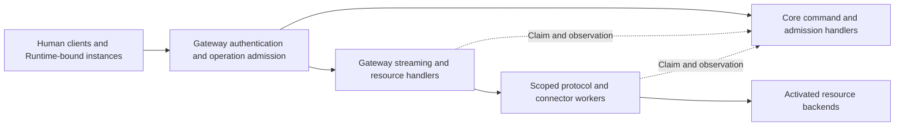

# Gateway

This is a proposed component design under the [Architecture](../../ARCHITECTURE.md).
[Contracts and State](CONTRACTS_AND_STATE.md) owns its identities, result classes, and lifecycle
meanings. This document specifies the common access boundary, not a deployed API or operating grant.

## Responsibility and Placement

Gateway is the shared client entrance for humans, instances, and private services. It authenticates
the caller, resolves the meaningful operation, obtains Core admission, and keeps resource access
on an attributable execution path. [Core](CONTROL_CORE.md) owns current authority and commitments;
Gateway does not maintain a competing role registry, budget ledger, or source of activation truth.
[Resource Services](RESOURCE_SERVICES.md) own provider semantics and reconciliation. Gateway
ensures their handlers cannot be reached through a weaker client path.

The first implementation uses a Rust admission edge and resource handlers with Tokio/Axum and
protected service transports. The Rust CLI is the first client; a future TypeScript console is an
independently built API client with the same authority rules and no backend or database privilege.
An agentgateway standalone process is a replaceable protocol/data worker inside this logical
Gateway, initially evaluated for native model forwarding. It is not the company's IAM or Core.
Control, data workers, connector credentials, and Runtime privileges have distinct access scopes;
these scopes need not imply one process per route or an exact total process count.

Workers accept only authenticated internal dispatch from their assigned Gateway path. They expose
no alternative client listener, provider credential, or reusable dispatch capability to private
code. Core and worker internal channels are protected service channels, not privileged human APIs.
Private service targets remain private execution supervised by [Runtime](RUNTIME.md).

## Client Surfaces and Routing

[Contracts and State](CONTRACTS_AND_STATE.md) owns canonical HTTP routes, request/result fields,
request keys, and execution identifiers. The following map binds those routes to the first Rust CLI;
these are implementation contracts, not installed commands. All commands use the same Gateway.
Registered metadata remains scoped, and only Core's current activation selects executable targets.

| CLI command after `ouroboros` | Gateway route | Enforcement and meaning |
| --- | --- | --- |
| `work create` / `work show WORK` | `POST /work`; `GET /work/{work_id}` | Create accountable work under current authority, or read its authorized projection. |
| `conditions list` | `GET /conditions` | Read current capabilities, resource commitments, restrictions, and observation gaps within scope; listing creates no authority. |
| `execution start` / `execution list` | `POST /executions`; `GET /executions` | Admit a desired execution for an existing work and activated profile, or inspect current scope. |
| `execution show EXECUTION` | `GET /executions/{execution_id}` | Keep desired `execution_id` distinct from Runtime-observed `instance_id`. |
| `execution steer EXECUTION` | `POST /executions/{execution_id}/steer` | Admit a command to the current bound native execution; receipt is not observed application. |
| `execution stop EXECUTION` | `POST /executions/{execution_id}/stop` | Admit restriction/stop and report actual enforcement and remaining effects separately. |
| `execution resume EXECUTION` | `POST /executions` | Supply `predecessor_execution_id`, currently readable checkpoint references, and a new request key; create a fresh execution/instance for the same work. |
| `delegation revoke DELEGATION` | `POST /delegations/{delegation_id}/revoke` | Revoke the grant and its affected use; stopping one execution alone does not revoke the grant. |
| `credential register PRINCIPAL` | `POST /principals/{principal_id}/credential-challenges`; `POST /principals/{principal_id}/credentials` | Obtain a bound challenge, then prove control of the new key with the target human's exact binding consent and current authentication; use separate stable request keys and upload no private key. |
| `credential revoke PRINCIPAL CREDENTIAL` | `POST /principals/{principal_id}/credentials/{credential_id}/revoke` | Revoke the registered credential and restrict its continued use without erasing past operations. |
| `intent show INTENT` | `GET /intents/{intent_id}` | Read the original outcome under current permission; never dispatch it again. |
| `events watch --view VIEW` | `GET /events?view=...` | Subscribe to the authorized SSE projection with scoped replay/gap handling. |
| `workspace snapshot WORKSPACE REVISION` | `GET /workspaces/{workspace_id}/snapshots/{revision}` | Resolve the permitted immutable snapshot and content references. |
| `workspace read WORKSPACE REVISION PATH` | `GET /workspaces/{workspace_id}/snapshots/{revision}/files?path=...` | Read bounded content at the fixed revision; reject path/link escapes. |
| `workspace upload WORKSPACE` | `POST /uploads`; `PUT /uploads/{upload_id}/content` | Open and transfer one bounded staging intent; both phases retain its identity and fixed content constraints. |
| `workspace publish WORKSPACE` | `POST /workspaces/{workspace_id}/publications` | Admit a separate revision-checked publication intent over verified staged content. |
| `database query TARGET` / `database transaction TARGET` | `POST /databases/{target_id}/queries`; `POST /databases/{target_id}/transactions` | First fixture uses activated `read_input` and `record_result` operations with bound parameters/results, not arbitrary SQL or a returned database connection. |
| `model request TARGET` | `/models/{target_id}/...` | Preserve activated native methods, paths, bodies, and streams; suffixes cannot select arbitrary URLs or provider accounts. |
| `mcp call TARGET` | `/mcp/{target_id}` | Preserve supported MCP transport while admitting each meaningful tool/resource operation and verified service origin. |

Commands take their material inputs and preconditions from the common contract; this table does
not define another DTO or a generic execute payload. JSON commands use the common required
`Idempotency-Key`; retain the key and material input before first submission, including bounded DB
queries. An exact replay inspects the existing record under current read rights and never
redispatches it; changed material input under the same key conflicts. Resume cannot evade a revoked delegation or unresolved predecessor provisioning. Investment
remains unavailable until the selected Company handler and account enforcement are activated;
model/MCP/DB route names cannot substitute for that boundary. A CLI connection profile chooses the
fixed Gateway identity, client credential reference, and server trust configuration; it cannot
grant a role or disable verification.

The CLI offers machine-readable JSON for management results and puts human diagnostics on stderr.
Native protocol commands preserve native JSON or streaming output without a company result wrapper;
inspection of their attributable intent uses the normal inspection route. Credential values never
enter arguments, command output, error details, or ordinary logs. Displaying `Accepted or queued` means
submission succeeded, not that execution or the requested effect succeeded.

`--wait` observes the original intent/execution through authorized GET/SSE until the command's
specified completion condition or local timeout. Mutating commands and waits return nonzero for
denial, conflict, unavailable prerequisites, observed failure, unresolved requested effects, or
local timeout, with the available authorized record reference. A successful inspection can return
zero while faithfully showing an existing `Unresolved` stage; it claims only successful inspection.
A timeout does not cancel execution or imply non-execution; subsequent inspection uses that reference. Exit zero means only the documented command condition
was met. Neither wait/reconnect nor an error handler resubmits the effect with a fresh request key.

Native Codex App Server runs inside private execution with its stdio lifecycle integration;
Gateway does not host its planning loop. Its model and remote resource requests enter the families
above. Local stdio tools and descendants remain inside that instance's runtime allocation and
network boundary. A separately managed private MCP server is invoked through Gateway, not a new
direct private-to-private network permission. See [integration](INTEGRATION_AND_DEPLOYMENT.md).

SSE inspection streams contain authorized projections and evidence references, not unfiltered
provider payloads or credentials. `Last-Event-ID` resumes only the same currently authorized view;
an unavailable replay range emits the common `gap` event only while that disclosure remains
authorized, ends that continuation, and requires a fresh snapshot. Reconnect reauthenticates and
rechecks current read scope. A status stream is not a model stream or a private
event bus, and the cursor itself is not a credential.

Use the common HTTP status/result mapping: authentication that cannot establish a valid caller
is `401`; an authenticated caller denied the current operation is `403`; incompatible input/key or
state is `409`; unavailable required authority/dependencies is `503`. A TLS handshake rejection
can terminate before any HTTP response exists. Native provider errors keep their native format
subject to credential redaction; HTTP status alone cannot resolve an already dispatched intent.
If access is revoked after response headers or bytes were sent, stop further protected delivery
and close the affected stream within its bound; do not pretend to replace its prior status with
`403` or inject a foreign event into a native stream. Retain the restriction and partial-delivery
observation. Reconnection or reading the prior result requires current permission again.

### Work-Centered Management Client

The [management contract](CONTRACTS_AND_STATE.md#work-centered-management-contract) owns the
following proposed extensions. They use the same authentication, response mapping, stable keys,
read filtering and event contract as the existing CLI. These commands are **NOT IMPLEMENTED**.

| CLI command after `ouroboros` | Route | Command boundary |
| --- | --- | --- |
| `work list` | `GET /work` | Current visible work only; bounded filters/pagination. |
| `work resources WORK` | `GET /work/{work_id}/resources` | Authorized resource/evidence links and source gaps, not a new inventory authority. |
| `candidate submit` / `candidate show CANDIDATE` | `POST /candidates`; `GET /candidates/{candidate_id}` | Inactive registration or inspection of the exact revision and scoped acceptance evidence. |
| `candidate review CANDIDATE` | `POST /candidates/{candidate_id}/acceptances` | Record accepted/rejected technical judgment under existing independent review authority; not a general approve operation. |
| `target activate TARGET` | `POST /targets/{target_id}/activations` | Current accepted release/connection and expected activation revision; follow desired versus actual readiness. |
| `target deactivate TARGET` | `POST /targets/{target_id}/deactivate` | Restrict this activation and observe effects; do not delete an account or revoke every caller grant. |
| `workspace create` | `POST /workspaces` | Request a scoped logical namespace; no direct filesystem creation, executable launch or new grant. |
| `workspace retire WORKSPACE` | `POST /workspaces/{workspace_id}/retirements` | Request exact retained-use retirement; show retained holds and subsequent disposal separately. |

`work show`, `execution start/show/stop/resume`, `delegation revoke`, `intent show` and `events watch`
reuse their existing routes. A client cannot bypass an unavailable extension by writing directly
to the owning database, invoking a backend SDK or posting an arbitrary operation to a generic tool.
Unknown action hints remain unsupported. Gateway's route allowlist fixes the operation family;
model/artifact content cannot supply the actual handler or substitute a stronger service identity.

Persist a pending mutation's key and fixed, non-secret input in protected client state before
transmission, with the caller/firm binding and referenced proposal revision. After timeout or
restart, inspect that original intent or repeat the exact keyed request for lookup. Duplicate
clicks while its outcome is unknown share that pending action, not new keys. A genuinely new
decision uses a new key after resolving the earlier effect. Refreshing a page cannot silently
change a pending request, repeat an external effect or adopt a new artifact revision.

The default mutation result reports admission only. `--wait` follows the named operation's
documented condition: verified actual activation for activation, observed restriction for
deactivation, or the catalog's recorded retirement disposition for retirement. Pending physical
deletion, retained holds and bills remain visible even when that disposition is confirmed.
No generic "done" marker or successful command exit implies that every downstream obligation
has ended. Current read permission is rechecked during waits and every evidence expansion.

## Verified Caller and Delegated Service Context

The first local human profile uses mutual TLS from the Rust CLI to the company Gateway. The
client verifies the configured Gateway identity and trust roots; Gateway verifies the client
certificate's chain, intended authentication use, validity, and an explicit current Core registration
binding that certificate to an existing principal. A certificate subject, a valid CA signature,
CA ownership, Mac login name, or possession of the VM does not select a principal or sovereign.

Protected setup imports already recognized authority and its explicitly authorized initial
certificate binding only into an uninitialized firm. It is not a first-visitor registration flow
or a way to replace an initialized firm's authority. Ordinary enrollment/replacement through the
existing credential route requires the target human's current authentication, explicit consent to
the exact binding, and verified control of the new key, as well as current permission and revision.
Bind those proofs and preconditions to the public certificate, target principal, and any explicitly
named replacement. Client assertions or a consent flag alone are not evidence of those conditions;
accept no private key. Core owns validation and atomic activation of the resulting binding.

`credential register` makes two calls through the same Gateway. First, the currently authenticated
target human requests a short-lived, single-use challenge bound to the new public certificate and
fingerprint, target principal, expected revision, and explicit replacement where applicable. The
CLI then submits `challenge_id` and a signature proving control of that new key, together with the
exact binding consent required by the common contract. Core consumes the challenge atomically with
binding activation. Each call retains its own stable request key; a lost response is looked up
before a consumed challenge is treated as a new activation attempt. The CLI signs locally using
an existing key: this flow neither creates a key/certificate nor sends the private key to Gateway.

Credential-management permission cannot let an agent, service, or another human attach its own
key to a human/sovereign principal and inherit that principal's powers. A separate manager may
prepare or check registration material but cannot activate another human's credential alone.
Certificate issuance does not activate a binding, and a new binding cannot change principal grants.
Keep credential validity, binding history, and actual access restrictions separately observable.
Revocation remains available to an already authorized controller without requiring the compromised
credential holder's consent; it does not authorize registration of a replacement key.

Lost-key recovery follows protected current-designation and explicit-scope rules, not an ordinary
administrator role or proof of CA/host ownership. It restores an authorized authentication binding
without silently appointing or impersonating a sovereign. Credential custody, initial setup, and
recovery follow [deployment](INTEGRATION_AND_DEPLOYMENT.md) and the shared authority contract.

Check registration, principal, and operation scope on every request, including requests over reused
TLS connections and reads of prior intent results. TLS resumption is not authority renewal. A
revoked credential cannot keep an SSE, download, or model stream open under its former rights;
apply the bounded restriction path to existing connections as well as new handshakes. A future
browser authentication adapter must meet the same binding/revocation contract before activation;
this first CLI profile does not imply a browser login has been implemented.

For workloads, Runtime creates a separate nonprivileged authentication bridge per actual instance.
The bridge joins only that instance's verified network namespace, retains a protected outer mount
view and process identity, and forwards its fixed local endpoint to one generation-specific Gateway
pathname Unix socket. It has no generic upstream selection, CONNECT proxy, provider credential,
Docker access, or private callback execution. Gateway verifies the assigned socket, kernel peer
credentials, Runtime-retained process lifetime and namespace binding, and current generation.
A reused PID/UID, copied token, forwarded header, or shared NAT address cannot recreate that binding.

The private native client additionally presents its short-lived Gateway-only token. The token and
verified channel must agree with the actual instance, current Core authority, and activated profile;
either alone is insufficient. [Runtime](RUNTIME.md) owns bridge creation and retirement. Rotating a
token or replacing a transport connection never extends the instance's armed hard deadline or
reactivates an expired execution. Fresh execution and input reads use the common admission contract.

The edge removes client-supplied authoritative identity/dispatch headers before constructing its
internal context. Internal RPC receivers allowlist authenticated service identities and method
scopes, verify the intended receiver, and bind each call to its operation and configuration. Socket
reachability alone does not grant every method. A request body cannot override the verified
principal, service origin, configuration generation, or an already fixed admitted target. The human
CLI never reaches Core/Runtime RPC, the Docker socket, a provider credential, or a database
connection directly.
Human requests need no artificial instance. Inspection does not manufacture a work or reservation.
An administrator role does not establish sovereign designation or authorize reserved powers.

For a service acting on another caller's behalf, preserve the originating effective caller, the
executing service principal/instance, work, and verified delegation chain. The default permission
is constrained by both caller delegation and service scope, including ancestor and firm limits.
The service cannot erase the origin and substitute its own wider role to reach another resource.
Caller-supplied on-behalf-of metadata is not a valid delegation chain.

A service may undertake distinct work under a separately valid grant where the mandate permits;
Core must establish that work and authority explicitly. This is a new accountable operation, not
an automatic promotion of the received request. Public connector credentials implement admitted
operations; their underlying provider privilege is not extra permission for the effective caller.
Bounded outer observation/reconciliation authority remains separately identified and cannot create
new economic action by reclassifying it as cleanup.

## Operation Admission and Dispatch

1. Authenticate and establish the caller context. Parse the fixed operation family, canonical
   target-reference syntax, bounded material input, and preconditions. Do not require current target
   activation or new-action permission before Core can look up an existing keyed intent.
2. For keyed commands, send the scoped request key and fixed operation/input references to Core's
   lookup path first. An existing matching intent returns only its currently readable record and
   result, without new admission, activation checks, reservation, claim, or dispatch. This also
   recovers a lost first response when the caller does not know the intent ID and its target was
   later deactivated. Changed material input under the same key conflicts; neither that response
   nor lookup may disclose a key/record's presence outside the caller's current read scope.
3. Only a new admission resolves the activated capability, canonical target, mandatory Company
   enforcement, and configuration identity. Unknown/inactive targets are unavailable for new work;
   caller-selected labels cannot downgrade enforcement. Core atomically checks current authority
   and shared limits and records the intent, necessary reservation, and dispatch state. Send Core
   retained input references and semantic data, not a stream of file bytes or model tokens.
4. Management/asynchronous results may report `Accepted or queued` at that stage. Preserve native
   synchronous response formats while recording the same stages internally; do not replace a model
   or DB response with a fabricated success. The assigned trusted worker requests its dispatch
   claim immediately before execution, after local preparation and queueing.
5. Core serializes the claim against restriction and relevant activation changes. It binds one
   attempt to input, target/account, instance, configuration, and bounded validity. Only that
   worker can consume it; a route change, changed input, restart, or retry cannot reuse it.
6. Execute the admitted operation and report attributable observations. Release or retry follows
   the shared contract and resource semantics, not an HTTP timeout or a proxy retry default.

Each attempt has one assigned claiming worker. A downstream protocol stage cannot mint another
claim or start a new attempt by reusing the original dispatch context.

For Company calls this sequence applies separately to the root service-processing invocation and
each actual downstream operation. The root does not authorize an uncomputed business effect.
The [bound-call contract](CONTRACTS_AND_STATE.md#bound-company-calls-and-owner-actions) fixes both
caller and service authority, named-operation scope and deterministic root/child effect slots.
Company preparation runs outside Core locks; the resulting canonical requirements and current
revisions must pass child-effect admission and aggregate reservation before the protected sender
can claim. The original service claim is never forwarded to that sender. Read-only key lookup
precedes current Company schema decoding so replacement cannot hide an older admitted request.

Use `Requested`, `Admitted`, `DispatchClaimed`, `Observed`, `Unresolved`, and the other shared states
with their existing meanings. A revocation preceding the claim blocks it. A preceding claim is
in flight until fencing and provider reconciliation establish its effects. Stop a still-unsent
attempt when a fence is observed; never relabel a send/fence race as confirmed pre-dispatch cancellation.

Gateway may retain an authorized view of policy/configuration for routing and ongoing enforcement,
with its generation and bounded validity. This cache does not replace Core's current admission or
dispatch decision. Restarted workers obtain current state before serving dependent work. Missing
validity or stopping bounds prevents the corresponding route/profile from becoming usable.

## Complete Input and Credential Custody

Inspect the complete authorization-relevant input before admitting an effect. Limit decoding,
decompression, nesting, body size, and parser work before expensive processing. Truncation or a
partial body cannot establish that an account, amount, target, or command is authorized. Reject
oversized semantic requests rather than authorizing the prefix and forwarding an unchecked suffix.
All later transformations remain inside the admitted target and meaning; a material change needs
new admission. Redirects and fallback targets are not an implicit extension of target authority.

For file upload, admit bounded staging against declared content identity and size; stream into
non-published storage while checking the actual bytes. A digest/size mismatch never publishes the
artifact. Publication is a separate revision-checked operation over the verified staged content.
This keeps large data outside Core while fixing what publication will make durable and visible.
Model and DB requests expose all authorization-relevant fields before dispatch; other native
fields remain intact without inventing an interpretation. Their response bytes can stream.

Provider credentials belong to scoped connector workers or demonstrated provider-enforced scopes.
The worker injects the required credential only for its admitted target immediately before use.
Client Gateway credentials and incoming MCP tokens are not forwarded as upstream provider tokens.
Validate issuer, intended audience, validity, and target-specific authorization at each applicable
boundary. Do not return usable credentials, direct storage URLs, backend connections, or host mounts.

Credential values are excluded from intent metadata, normal logs, error bodies, status events,
and ordinary evidence exports. Scrub sensitive headers and credential-bearing provider errors at
the boundary; private traces are untrusted input to the same observation protections. Necessary
restricted source material follows [observation access](OBSERVABILITY_AND_CONSOLE.md), not a
generic debug endpoint. Redaction must preserve material effects and identify incomplete evidence.

## Extensible Connections and Protected Enrollment

The [connection/Auth Module contract](CONTRACTS_AND_STATE.md#extensible-connections-and-protected-authentication)
reuses Gateway entry, current Core authority and Resources custody. Discovery returns only connection
types and named operations visible under current access. Invocation rechecks the exact connection,
provider/account/environment, selected adapter/Auth Module/schema revisions and originating caller.
A connection reference is not a credential or a bearer capability. No public generic secret-get,
decrypt, sign, authenticated HTTP, raw SQL/session or plugin-install-as-owner escape route is added.

Ordinary Company adapters remain isolated and secretless. Independently qualified Auth Modules are
selected by the protected Resources Host; Gateway cannot import their code, decrypt their material
or trust their self-declared approval. An agent may prepare a module or adopt a connection within its
current technical-acceptance and business/data/cost scope. A new name does not require a new human
decision, but broader authority, personal login/secret input or new protected-code trust requires its
actual authorized actor. Core authorizes these changes; a tool registry or chat message does not.

Provider credential enrollment is separate from human Gateway identity registration. The protected
native form sends material through a dedicated confidential input path to assigned custody, never a
Company WebView callback, general intent JSON, event or request-body log. Safe metadata identifies
firm/environment/connection, selected module, enrollment challenge and expiry. A credential response
reaches only the same challenge and intended account; expired, switched or cancelled enrollment
cannot activate a connection. Native OAuth uses the official external browser and supported PKCE,
with exact issuer/callback/session checks. Company-supplied labels and URLs cannot choose recipients.
The host receives only declared enrollment-step data and owns secret-input UI and authenticated
submission. Safe metadata and a custody receipt, not a token, return to the ordinary client.

Outgoing data scope is checked separately from authentication scope. A credential-free endpoint,
model request, repository operation or uploaded artifact can still disclose data or incur cost.
Selected operation mappings fix permissible recipients and effects; alternate redirects, protocol
upgrades and auxiliary authentication requests do not broaden them. Provider responses, headers,
cookies, redirects, errors and streams pass through qualified protected capture/filtering before any
ordinary adapter/result/projection. Filtering must not replace an uncertain provider effect with an
invented no-effect result. Auth lifecycle and business-effect original-key lookups remain separate.

Inbound callbacks and long-lived connections have explicit bindings rather than a general inbound
MCP identity. A fixed registered ingress verifies provider connection/subscription generation and
bounded original envelope, commits permitted content/deduplication before acknowledgement, and
exposes replay/conflict/gap state. OAuth callbacks use the enrollment challenge rather than business
event admission. Incoming provider identity grants only the authorized intake operation, never
owner/service identity or business action authority. Follow-up wake/work uses current internal
scope. Local installation does not create a public endpoint; any relay/ingress provisioning needs
an explicitly admitted network binding and bounded costs.

A live session keeps account, module/credential version, generation, cursor, scope and shared usage
bounds. Effects in messages are individually admitted; streams continue current read checks.
Reconnection can resume allowed observation/authentication, not replay an unknown business effect.
Credential/module restriction fences new protected use, egress/KMS operations and affected sessions;
existing provider effects and response reconciliation retain their original identities.

These are target interfaces, not implemented HTTP paths or qualification of the fixed Responses
worker. The [extension checkpoint](../implementation/CONNECTION_EXTENSION_DESIGN.md) separates this
document change from code, native containment and provider verification.

## Data Workers, Streams, and Management Capacity

Bulk handlers and model/MCP workers transfer bytes on Gateway-owned paths without routing them
through Core's policy controller or event log. Stream state retains principal/instance, intent or
authorized view, resource target, configuration, bounds, usage, and current restriction generation.
Every subsequent semantic operation is mediated; an open connection is not a reusable permission.
Native opaque protocol features are usable only where their effects remain within the selected
contract. Unknown consequential semantics are unavailable, not silently exempt from enforcement.

Each active worker receives restriction updates and enforces bounded validity independently of
private cooperation. A fence stops new dependent operations and closes affected access/streams;
provider cancellation and continuing charges are observed separately. Already delivered bytes
cannot be unread. If control updates are lost, stop dependent activity within the declared bound
rather than retain a cached allowance indefinitely. Expiry does not release dispatched reservations.

Bound concurrent requests, queued work, upload size, response buffering, stream lifetime, and slow
consumers. Apply backpressure to the actual producer where supported; otherwise close the bounded
stream and record the interruption and possible continuing effect. Do not drain an unbounded
provider response into memory after the downstream consumer disappears.

Reserve bounded ingress, execution, connection, and evidence-ingestion capacity for authorized
restriction and inspection operations. Admission priority follows action and permission, not a
human label. Authentication and bounded parsing precede expensive route work; separate data worker
limits keep bulk/model traffic from consuming all management resources. Capacity reservation is
not a guarantee of availability through host failure or a shared process crash.

The agentgateway worker uses activated configuration and scoped credentials; its management
UI/API is not a second company policy authority. The first native profile requires automatic
request retries, stream reconnection/replay, model substitution, and format conversion to be disabled
in both native-client configuration and the worker. Verify those effective settings on the pinned native
binary and every required path; documentation or a configured flag alone is not proof. A zero
request-retry setting may govern only one HTTP retry loop. Separately account for connection retry
loops, WebSocket-to-HTTP fallback, authentication recovery, and stream reconnects; no such path may
automatically replay an admitted invocation. Use the pinned client's supported custom named model
provider configuration; do not assume that a built-in provider can be overwritten by a base-URL
setting. If the profile cannot prevent ambiguous retransmission while preserving required native
behavior, it remains ineligible rather than enabling direct access or disabling that behavior.

Native response formats, events, errors, and usage meaning remain unwrapped. Similar content is
not the same intent; without a preserved stable identity, a repeated request cannot be deduplicated
by guessing. Later retry support requires an explicit resource contract covering request identity,
provider deduplication, replay, bounds, and reconciliation. A stream that delivered a partial result
cannot automatically become a new invocation. First-profile compatibility remains NOT RUN.

## Forced Routing and Failure Recovery

[Runtime](RUNTIME.md) enforces private network and mount restrictions outside private code.
Only assigned Gateway endpoints are reachable, covering descendants, IPv4/IPv6, DNS, metadata,
host interfaces, sibling workloads, and alternate protocols. SDK proxy settings and hooks select
the intended route but do not enforce it. Channel identity remains distinguishable after any relay;
a shared NAT address cannot substitute for Runtime's verified instance binding.

Outer workers also have constrained target networks, internal channels, and secret access.
Generic HTTP/MCP cannot reach financial credentials or privileged financial endpoints; DB handlers
cannot reach protected control data or database administration. Activated target bindings select
mandatory enforcement using actual resource identity. Publishing a private wrapper or a new tool
name cannot remove it. Protected outer storage and supervision channels are narrow internal paths,
not exceptions that private callers can invoke recursively or use as arbitrary command execution.
Gateway retains fixed product admission/routing enforcement and never imports private packages
into its process. Company Service Host resolves the selected isolated Company service for named
business operations, including financial enforcement. The Company release is separately qualified
and selected by protected records; callers cannot replace it or its configuration by publishing
code. The protected sender requires validation bound to that service's current release/instance,
connection, intent and final bytes. Domain semantics belong to Company; required routing, current
authority, custody and exact dispatch remain enforced by the product. See
[Company hosts and business services](CONTRACTS_AND_STATE.md#company-hosts-and-business-services).

| Failure | Required handling |
| --- | --- |
| Console disconnects | Enforcement continues; another authenticated client uses the same Gateway and current views. |
| Core or protected state is unavailable | Block dependent admission/claims and reads whose current access cannot be established; retain bounded containment and authorized observation. Label any still-authorized cached view stale. |
| Gateway worker fails after a claim | Mark absent/ambiguous results `Unresolved`; retain attempt, reservation, and target for resource reconciliation before retry. |
| Client disconnects or times out | Preserve durable intent and actual stage; cancellation is requested and observed separately, never inferred from the socket closing. |
| Required evidence cannot be retained | Use only the bounded protected spool defined by the shared contract; restrict affected activity when that bound is exhausted. |
| Gateway restarts | Recover current bindings/configuration/restrictions, invalidate stale worker claims, and reconcile pending attempts before dependent resumption. |
| Application control is unavailable | Runtime follows already-authorized containment; infrastructure owner may stop/recover the host, without a direct privileged company API. |

The distinction between `Denied`, `Unavailable`, and `Unresolved` depends on the existing durable
intent and observed dispatch stage, not only the HTTP status. Recovery uses bounded service
authority; it neither resurrects a departed caller's credential nor erases external obligations.

## Example Results and Acceptance

| Request | Result and evidence that must be available |
| --- | --- |
| Human inspects current work under an observer binding | Authorized snapshot/cursor with observation times; no trading permission or fictitious instance is added. |
| Human certificate/read scope is revoked during SSE | Stop protected delivery and close the stream; a reused TLS connection or cursor cannot regain access. |
| Service with credential-management permission submits its key for a human principal | Deny activation without that target human's current authentication, exact binding consent, and new-key control proof; preparation rights cannot create impersonation. |
| Instance requests a native model turn | An admitted invocation and one claimed attempt; native result or explicit interruption, usage, and source references. |
| Same DB transaction key arrives with changed input | `Conflict` within current disclosure scope; preserve the original intent rather than send a second transaction under its claim. |
| First JSON command response is lost and its target is later deactivated | Same key and material input return the existing currently readable intent; no new activation check or dispatch is needed for lookup. |
| Instance invokes a service that requests a wider account | `Denied` under verified caller/service context, unless distinct work already has explicit authority; no privilege laundering. |
| Worker has an admitted queued request when its grant is revoked | No later claim; confirmed unsent cancellation remains distinct from a prior in-flight claim. |
| Artifact upload succeeds but publication revision changed | `Conflict` for publication; retain the staged artifact's identity and actual storage cost without an unnoticed overwrite. |
| Database applies a transaction and its response is lost | `Unresolved` with retained intent/attempt and reservation; provider-specific reconciliation, not blind replay. |

[Validation](VALIDATION.md) must demonstrate useful native work and attempted bypass under the
same profile: file work, DB access, model/tool rounds, session continuation, bounded compute, and
artifact publication. Repeat authority checks across delegated services, queued dispatch, open
streams, role/configuration changes, disconnects, and restart. Verify management capacity under
data load, complete-body enforcement, credential non-disclosure, and separately visible uncertain
effects. Document consistency completes this design work; runtime conformance and production
acceptance remain unproven until the exact [deployment profile](INTEGRATION_AND_DEPLOYMENT.md)
passes those checks. No live financial authority is created by this document.

## Local Connected Ingress

The implemented Linux Gateway now serves human mTLS and a distinct instance Unix socket in the
same process. Its instance listener obtains `SO_PEERCRED` and `SO_PEERPIDFD`, keeps the kernel
process-lifetime handle while serving the request, and checks boot ID/start ticks. Lack of that
kernel support denies the instance path. It never accepts a private-supplied identity header.
The actual peer is sent through the Gateway's authenticated Core service connection, where the
recorded binding and current delegation are checked. A local process copying the bridge's claimed
identity is denied. Unix connections have a five-second bound and no keep-alive; this subset
implements conditions reads only, not general native/resource streams.

Human forwarding replaces original-client identity from the verified certificate and excludes
all instance context headers. Runtime service paths are excluded from this public forwarding
surface. The local fixture uses separate OS users and credential directories for Core, Gateway,
CLI and Runtime. Broader streaming/revocation, delegation changes and resource admission need
further implementation and testing; see [connected evidence](VALIDATION.md#connected-runtime-probe-evidence).

## Native route selection in the local implementation

Gateway deployment configuration explicitly maps `native_routes.model` to the managed target for
`POST /v1/responses`, and `native_routes.mcp` to the target for `POST /mcp`. Each configured name
must exist in the deployment's `workers` map; unknown or empty names reject startup. An omitted
route returns service unavailable without resource admission or worker dispatch. There is no
implicit `fixture` target, provider substitution or fallback to the other native route.

These names select transport destinations only. Core still checks the authenticated caller,
work/delegation scope, current target activation, operation, limits and fixed worker identity.
Incoming native payloads and target headers cannot replace the deployment-selected name. Both
human and instance ingress use this same resource handler. Recovery resolves the original
intent's retained target, not the current native default. A configuration change therefore does
not retarget an existing attempt or authorize the replacement connection.

The first implementation configures one model route and one MCP route per Gateway process.
Selecting among multiple managed models/services and admitting connector releases remain separate
work; the mapping is not a registry activation or credential-enrollment API. Prepared DB routes
retain their existing `company` target and are not made generic by this change.

### Managed adapter MCP endpoint

`/mcp/work/{work}/delegation/{grant}` exposes managed adapter admission and execution observation
using the pinned MCP 2025-11-25 Streamable HTTP JSON-response profile. The work and grant in the
path are untrusted selectors, not credentials. Human mTLS and Runtime-bound instance ingress use
the same Core authorization. The endpoint is stateless and supplies no session ID; every request
rechecks its actor and selected scope. This first local profile does not offer OAuth onboarding,
server-initiated SSE, MCP tasks, sampling, roots, elicitation, or list-change notifications.

POST accepts one JSON-RPC object with JSON content type and both JSON/SSE Accept types. Initialize
negotiates the supported version; subsequent messages require that version header. Supported
initialized/cancelled notifications receive empty 202 responses. GET authenticates and returns 405
because no server-initiated event stream is offered. Invalid JSON produces a JSON-RPC parse error;
invalid protocol requests and unknown methods/tools receive protocol errors. Actual tool admission
failures use tool results with `isError: true`. No raw SQL, internal diagnostics or secret is returned.

Gateway rejects any Origin header on this local machine-client endpoint, preserves only the
required protocol/content headers alongside its own authenticated actor binding, and bounds POST
bodies to 64 KiB. Browser access needs a separately configured origin policy before it is supported;
no browser origin is silently trusted. The CLI common request path supplies MCP Accept/version
headers automatically for this endpoint.

`tools/list` presents execution inspection tools and dynamically selected `invoke_<activation>`
tools. Pagination visits at most 64 selected records per page and rechecks permission for each;
replacement during pagination is not a snapshot guarantee. Stopped, expired, disabled-target or
unauthorized activations are omitted. Discovery is advisory: remaining capacity, child delegation,
current profile and ordinary execution permission are checked when the operation is admitted.
No agent-supplied tool description or arbitrary JSON schema is executed in the control process.

An invoke tool takes a stable `request_key` and the caller's authorized `agent_delegation_id`.
Its frozen profile supplies compute units and lifetime; its approved code/input manifest supplies
argv and files. It calls the same Core `invoke_adapter` contract as the direct API, so switching
transport cannot acquire another allowance or rewrite a same-key input. The result explicitly
contains admission plus `completion: not_confirmed`. `execution_get` returns protected observations
under the named work/grant in the same read transaction; it does not treat process exit as economic
or work success. Instance-only `execution_self` resolves the execution from the authenticated
Runtime binding, accepts an empty argument object and rechecks the named scope when reading.
Humans cannot impersonate an instance by supplying an execution ID. Cancelling an MCP exchange does not cancel an already admitted company execution;
use the explicit execution or adapter stop API for that separate action.

This managed MCP endpoint is distinct from the existing native MCP resource fixture/connector
path. It currently submits fixed contained programs; parameterized domain tools and real-provider qualification still need integration tests.
The selected submitted-code fixture uses the existing operation-only encrypted provider worker
against bounded loopback HTTPS; it does not establish real-account compatibility. The selected native Codex fixture now discovers
and invokes an approved fixed program through this endpoint. Its five model responses are synthetic;
this does not qualify live subscription or arbitrary-provider compatibility.

### Cancel a provably unstarted execution

`POST /executions/{id}/cancel-unstarted` accepts `{"expected_revision": <current revision>}`
and the ordinary stable request-key header. The common Gateway route supports humans and bound
instances; Core requires current `execution.stop` permission for the target work. HTTP 200 returns
the immutable cancellation receipt, 403 denotes missing authority and 409 denotes a stale/conflicting
request or an execution that cannot be proven unstarted. This differs from the ordinary asynchronous
stop acknowledgement. `GET /executions/{id}` includes `unstarted_cancellation`, or null when absent.

The existing CLI request surface calls the same API, for example:
`ouroboros-cli --config <client.json> request POST /executions/<id>/cancel-unstarted --input <revision.json> --key <stable-key>`.
There is no separate CLI or administrator settlement bypass. Restarting work requires a new currently
authorized execution; a cancelled start or its prior adapter allowance is never resurrected.

### Recover an unresolved DB request identity after response loss

A same-key `POST /db/transactions` whose original admission is already `claimed` and has no reply
returns HTTP 202 with the existing resource admission (`intent_id`, `operation`, `target`, `state`
and a null `reply`). It does not return `result_id` or claim business completion. Core first checks
the exact fixed work/target/operation/input and the caller's current inspection scope. Accepted but
undispatched requests retain their original instance/delegation restrictions. A mismatched request
key/input remains a conflict; this change does not relax Core authorization.

Gateway does not call the DB worker, reclaim the attempt, release its reservation or reconcile it
as a consequence of this identity response. The caller can explicitly invoke the existing
`POST /resource-intents/{intent_id}/reconcile` route to observe the authoritative effect receipt.
A missing or ambiguous receipt remains unresolved. This response applies to managed DB writes;
native model and MCP response formats are unchanged. Clients must treat 202 as a recoverable pending
identity, not a successful DB result. The change closes the case where a caller lost the first
response and therefore knows the stable key but never learned the server-assigned intent ID.
