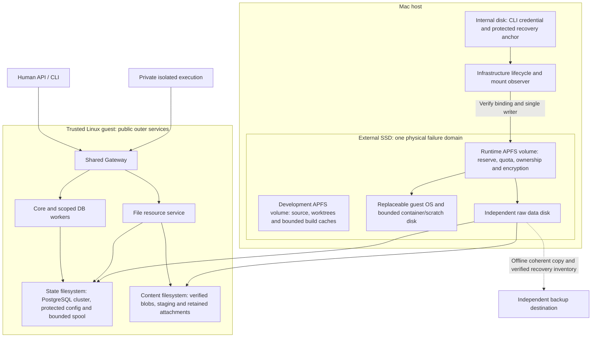

# Integration and Deployment

This proposed design binds the [Architecture](../../ARCHITECTURE.md) and [Contracts and State](CONTRACTS_AND_STATE.md) to a first implementation target.
It is not deployment configuration, an installed environment, or operational authorization.
Paths, unit names, and ports below are symbolic or illustrative design identifiers, not personal
host paths, deployment defaults, or commands to execute. The same product build accepts an
explicit environment binding; the developer's Mac is one reference environment.

## Reference Implementation and Its Limits

Start with one firm on one active host, with interruption followed by verified recovery.
On Mac, the target is Lima with Apple's Virtualization.framework (`vz`) and a plain Ubuntu
24.04 LTS guest. Run the protected outer services, storage, and Docker Engine inside that guest;
run private workloads in constrained containers. The Mac hosts the VM lifecycle and Rust CLI client.
On a Linux server, run the same guest-side responsibilities against the native Linux host.
Neither arrangement claims automatic failover, independent tenants, or production-approved isolation.

| Reference choice | Assigned role and selection condition |
| --- | --- |
| Rust backend and CLI in a Cargo workspace | Core, Gateway, Runtime, resource contracts/adapters, and a separate authenticated API client; no framework supplies company authority. |
| Native Codex App Server over stdio | First native conformance candidate, driven through a small allowlisted integration; retain the private native loop. Resolve applicable experimental/production-support limits before production adoption. |
| Lima `vz`, plain Ubuntu 24.04 LTS | Mac development VM; the image identity and Lima version must be pinned and verified before implementation acceptance. |
| Docker Engine through Runtime's Bollard adapter | Explicit fixed Unix socket, constrained launch profiles, no environment-driven endpoint discovery or automatic backend fallback. |
| Thin Ouroboros Gateway plus agentgateway 1.5.0 worker | Ouroboros admission, authority, and resource semantics surround a replaceable protocol worker. The worker cannot authorize company operations. |
| PostgreSQL 18.6 plus local artifact storage | Transactional protected state and separate business storage; immutable file content and database references require coordinated durability and recovery. |

These are reviewed reference choices, not claims that these versions are installed or tested.
Connected runtime compatibility remains unverified. Pin the actual Codex binary/protocol, Lima release, guest image digest,
Docker Engine, worker build, database minor version, and adapter dependencies in a reviewed build manifest before activation.

The Rust workspace separates Core, Gateway, Runtime, resource contracts and scoped adapters, native
lifecycle integration, and the CLI into modules/crates according to dependency and authority boundaries.
Private operating code is never a trusted module. Tokio supplies asynchronous execution; Axum/Tower
handle HTTP routing and bounded middleware; Hyper carries native HTTP/streams; SQLx accesses assigned
PostgreSQL roles. Use rustls/tokio-rustls with one explicitly selected `ring` crypto provider and
standard verified TLS configuration throughout; no implicit provider selection, permissive certificate
verifier, disabled hostname check, or insecure fallback. Pin reviewed crate versions when implemented.
The CLI uses only the Gateway API. A later TypeScript console is a wholly separate API client,
deferred from the first implementation and never a holder of Core, storage, or Runtime privileges.

## Checkout-Portable Validation Environment

Repository-owned validation tools consume the checkout, explicit tool/build locations and newly
created disposable roots. They do not import a developer's `research/` directory, reuse a company
database or infer the active environment from a home directory. The responsibility catalog and
result boundaries are defined in [Validation](VALIDATION.md#responsibility-based-executable-checks).
An installed binary, a build manifest and a successful test report remain separate observations;
none activates a company or grants a credential.

[`scripts/check.py`](../../scripts/check.py) is the common local/CI entry point. `plan` records
changed paths, the selected source identity, responsibility closure and required scenarios. `run`
executes one selected lane using an explicit environment JSON. `report` requires exactly one
successful result for every selected scenario at that same source/plan identity. Reports and
other outputs must be new files outside the source set or in an ignored output root; writing
them into the source set would change the identity being checked.

| Environment input | Consumer and boundary |
| --- | --- |
| `target_dir`, `bin_dir` | Explicit Cargo output and prebuilt product executables. A test must not silently use an unrelated executable from another checkout. |
| `build_manifest` | Source/toolchain/platform identity and exact executable hashes produced by `check.py build`; required before product-binary scenarios. The first build/package profile uses `bin_dir = target_dir/debug`. |
| `scratch_root` | Existing caller-owned mode `0700` parent for bounded PostgreSQL/resource/recovery fixtures. Each invocation owns a new child, never an earlier run. |
| `pg_bin` | Explicit PostgreSQL executable directory. Database tests require PostgreSQL 18; the selected native reference profile separately pins its tested minor. |
| `native_environment` | Separate explicit disposable Linux ARM64 host binding: source/binary roots, protected run/deployment/IPC/release roots, database identities, fixed Docker socket and immutable native images. The selected kernel case additionally requires its source/hash-bound `kernel_test_manifest`. |
| `age`, `keygen` | Explicit native encryption tools for synthetic recovery tests; an actual recovery key or independent backup destination is not supplied by this fixture environment. |

The nonroot [`run-postgres-suite.py`](../../tests/support/run-postgres-suite.py) starts its own foreground
PostgreSQL child, requires private scratch space, uses randomly generated SCRAM credentials and
listens only on loopback. Credentials are private files, never command-line arguments. It rejects
ambient database/proxy selection and never accepts an existing database endpoint. Child
fixture environments use a positive tool/path/profile allowlist; Python optimization or
import overrides cannot remove or replace assertion oracles. Direct optimized runner invocation
is rejected before fixture preparation. Core and
resource integration tests run with the `postgres-tests` feature; actual API/CLI suites use
fresh migrated databases and synthetic certificates. Their Cargo output uses a separate cached
`contract-tests` target beside the product profile directory, or the runner's explicit
`--test-target-dir`; test-feature builds cannot replace the attested API/native executables.
Resource tests still receive the product `bin_dir` through `OURO_TEST_BINARY_DIR`.
Bounded child groups and PostgreSQL are
stopped before cleanup. Runner-enforced timeout, cancellation, forced group termination or an unverified database shutdown
cannot become a successful result. Published runner evidence contains redacted logs and safe
summaries; synthetic credentials, database bytes and private service logs are not CI artifacts.

The named native runner is a different, privileged qualification surface. It requires an explicitly
disposable Linux ARM64 host with systemd, cgroup v2 controllers, pidfds, an exact Docker Unix socket,
pinned PostgreSQL/Codex inputs and images tied to the current embedded CLI/materializer source.
Its non-mutating `--preflight` only checks the selected environment. A run creates one named
fixture, keeps failure evidence and verifies cleanup; it never reuses a previous run name.
The real Codex process receives finite synthetic model responses. Native execution success here
does not establish actual subscription compatibility or authorize a live provider call.

The same portable preparation is usable from a clean checkout with installed, explicitly selected
tools. Building Linux artifacts, creating disposable identities and running kernel enforcement
checks inside a qualification VM do not install services on the developer's Mac or change the
operating SSD's allocation. Reusable source contains no personal host path or volume binding.

### Build, Check and Package Entry Points

Supply installed tools and fetch the locked dependencies during explicit environment preparation;
the build and test commands use Cargo's locked offline inputs. `check.py build` compiles every
distribution binary, checks Cargo's observed outputs and records the source digest, toolchain,
platform, sizes and hashes. A later scenario validates this manifest and the actual executables
before using them. Reusing a build/cache path does not bypass that check.

The following variables denote caller-selected inputs and new output files, not deployment
defaults. Run every lane listed in the plan's matrix and pass all resulting lane files to `report`.
The `--full` plan option selects all automated checks when an affected-change plan is insufficient.
Before the first local build, create the dedicated directories: both `target_dir` and
`bin_dir = target_dir/debug` must already exist. `TEST_TARGET_DIR` and `TEST_SCRATCH_ROOT`
below must match the JSON `target_dir` and `scratch_root`, respectively. Choose a fresh
`CHECK_OUTPUT_ROOT` for each run and place the build manifest, plan, result directory, summary
and archive under it;
the JSON `build_manifest` must equal `BUILD_MANIFEST` passed to `build --output`.

```sh
umask 077
mkdir -p "$TEST_TARGET_DIR/debug" "$TEST_SCRATCH_ROOT" "$CHECK_OUTPUT_ROOT" "$RESULT_DIRECTORY"
python3 scripts/check.py build --environment "$TEST_ENVIRONMENT" --output "$BUILD_MANIFEST"
python3 scripts/check.py plan --base "$BASE_REVISION" --head HEAD --output "$CHECK_PLAN"
python3 scripts/check.py run --plan "$CHECK_PLAN" --lane "$SELECTED_LANE" \
  --environment "$TEST_ENVIRONMENT" --output "$LANE_RESULT"
python3 scripts/check.py report --plan "$CHECK_PLAN" \
  --results "$RESULT_DIRECTORY"/*.json --output "$CHECK_SUMMARY"
python3 scripts/check.py package --plan "$CHECK_PLAN" --summary "$CHECK_SUMMARY" \
  --build-manifest "$BUILD_MANIFEST" --environment "$TEST_ENVIRONMENT" \
  --output "$INSTALLATION_CANDIDATE"
```

`TEST_ENVIRONMENT` must reference that same build manifest. The result directory contains only
lane result arrays, not the plan, build record or final summary. A report cannot infer success
for a selected lane that was never executed. Packaging requires a successful matching summary
including Rust validation, then rechecks the binaries while producing a new archive. The archive
contains executable files, checksums, versions, the build manifest and sanitized validation summary;
it excludes credentials, host configuration, databases, logs and research. It is an installation
candidate, not automatic installation, release publication or operational authorization. A digest
identifies content; it does not authenticate an untrusted producer of a manifest or summary.

### Change-Selected CI and Its Qualification Boundary

The added [`responsibility-contracts` workflow](../../.github/workflows/behavior.yml) runs on every
PR without a workflow-level path filter. PRs select affected responsibilities against the base and
checked-out merge commit; main pushes, the weekly scheduled run and manual runs select the full
catalog. Existing repository-integrity, secret scanning and other repository checks remain in place.

| Lane | Execution environment and selection |
| --- | --- |
| `integrity` | Required for every plan; repository, documentation and source hygiene. A known documentation-only PR does not build the Rust product. |
| `fast` | Deterministic Rust/tooling/startup contracts when implementation or test tooling is affected; supplemental `macos-15` execution accompanies selected fast checks. |
| `postgres` | Real disposable PostgreSQL, receipt and mTLS API/CLI scenarios selected by responsibility dependencies. |
| `native` | Real Codex with synthetic responses on a disposable `ubuntu-24.04-arm` host; Docker, systemd, cgroup and pidfd preconditions must pass before privileged fixtures. |
| `recovery` | Bounded synthetic encryption/archive/restore scenarios on the selected Linux reference tools; no real backup destination or account is provisioned. |

The Linux jobs share same-platform build outputs and tool/dependency/compiler caches; they do not
cache fixture databases, credentials or company state. Independent selected lanes run separately,
and a failing lane does not cancel the remaining evidence collection. The always-running
`behavior-gate` checks exact selected results and required job outcomes. Missing artifacts,
cancelled jobs, failed preconditions or a required `NOT RUN` block its success. Only safe case
records and summaries are exported; packaging follows a successful gate and does not deploy.

This describes the repository workflow and local test interface. Hosted runner provisioning,
artifact transfer and the final GitHub check remain **NOT RUN** until exercised on a PR. A local
unit test or a prepared workflow file does not prove the hosted isolation profile. Actual
subscription use, independent backup and current-authority operational recovery retain their
separate approval, implementation and qualification requirements.

## Required Startup Inputs

The initial configuration contract names required inputs, not executable YAML, SQL DDL, or secrets.
Its validated revision becomes an activation record; editing a file cannot activate another profile.

| Input group | Required information before dependent readiness |
| --- | --- |
| Firm and authority | Firm identity, current sovereign/principal bindings, mandate reference, restriction generation, and an established current-authority source. |
| Host and execution | Single active host identity, exact build/image references, engine backend, network/mount restrictions, and containment profile. |
| Access and credentials | Gateway service identity/address, human issuer and workload binding mechanisms, trusted peer scopes, and protected credential references. |
| Storage and recovery | Firm/store generations, enrolled host volume and guest filesystem identities, enforced ownership, protected/business DB roles, owned artifact roots, finite capacity/headroom and retention policy, coherent recovery set and independent backup destination where required. |
| Capability and resources | Activated target/account bindings, compatible native protocols, permitted operations, aggregate and instance limits, and retry/reconciliation conditions. |
| Time and health | Clock source/health policy, expiry and interruption treatment, dependency readiness, and already-authorized degraded responses. |

Missing required values deny dependent execution; no generated default can create a mandate or budget.
Credentials are resolved by their owning outer services from protected custody, never private images
or company workspaces. Rotation changes the active binding and fences stale use; it does not delete
pending attempt identities or observations needed to reconcile earlier credentials' effects.

### Environment Injection and Configuration Ownership

Reusable source, tests, public examples and design documents contain no developer username,
checkout path, personal volume label or account identifier. Real host observations and research
stay in ignored local material; deployed configuration and credential material stay in protected
environment-owned storage outside source control. Examples use symbolic inputs, not a working
personal configuration. Test fixtures create their own bounded disposable roots and identities.

Keep three decisions separate: stable product contracts, a qualified execution/storage profile,
and that profile's activated environment binding. The host filesystem type and mount, VM name,
backend endpoint, service paths/listeners, database names/endpoints, credential references, build
locations and resource ceilings belong to the latter two. Business code uses logical work/resource/
artifact identities; neither private code nor the public API needs the host's physical paths.

| Injected input | Owning consumer and validation |
| --- | --- |
| Source/build/test roots, toolchain target and optional VM alias | Development tooling only; explicit caller input or a newly created disposable test root. Do not infer a live store from the checkout, working directory, developer home or a previous fixture. |
| Infrastructure data root, VM/backend selection and exact management endpoint | Infrastructure owner and Runtime adapter. Use only the activated backend and endpoint; validate ownership, peer/instance binding and the selected profile. No ambient Docker context, alternate engine or auto-detected volume. |
| State/content/runtime-socket roots and recovery-anchor reference | Assigned outer services. Resolve and pin verified roots/identities before use; enforce independent capacity, access and rollback boundaries. Equal/overlapping roots cannot erase required separation. |
| Listener addresses, bridge upstream, provider targets and database endpoints/names | Owning Gateway, bridge or worker. Load an explicit allowed target with current service authentication and capability binding. An injected address is not permission to reach it or bypass Gateway. |
| TLS trust and human/service/provider/backup credential references | The credential's owning process resolves only its assigned protected reference. Never include secret values in argv, public manifests, examples, logs or private process environments. |
| Capacity, retention, staging, retry, deadline and recovery limits | Current policy/profile owner. Validate finite bounds and parent ceilings; omission or a changed path cannot create extra capacity, extend an existing deadline or release an obligation. |
| Build/image/native protocol identities and supported feature set | Validated deployment profile. Replacement must satisfy the same required contracts; no automatic provider fallback or reduction in enforcement. |

Use one explicitly selected candidate configuration per service or an equivalent explicit launch
argument set with documented field mapping. Resolve it once into a validated immutable binding.
Reject duplicate, conflicting or unknown inputs and missing required fields; do not silently merge
ambient environment variables, private workspace configuration, user dotfiles and defaults.
Where a deployment runner accepts environment variables as inputs, it must explicitly map approved
non-secret fields before validation, not provide a second runtime override channel. Pass secrets
by protected reference or assigned FD. Each process receives only its scoped configuration subset.
For filesystem locators, the trusted startup loader resolves relative inputs against the explicit
candidate configuration directory and passes the absolute locator to the owning service. The
current loader rejects parent traversal components rather than normalizing them across possible
symlinks; use an explicit absolute locator for another root. A service never interprets a field
relative to its own CWD, expands shell expressions, or searches the user's home. Non-filesystem
secret references retain their provider-specific typed meaning. Resolution does not replace
mount/owner/identity verification.

Preparation, validation and activation are distinct. Filesystem/host inspection is the
infrastructure owner's duty; effective company resource/authority changes follow current Core
authorization and configuration generation. A file edit, startup flag, new mount, credential
reference or successful health check cannot self-activate authority. Established instances and
attempts remain bound to their original admitted configuration; replacing endpoints or roots
requires draining/fencing and reconciliation before a new binding is used. Bootstrap and recovery
still obey existing sovereign designation rules rather than trusting configuration possession.

Within one active binding, sockets, roots and bridge destinations are fixed. Their exact spelling
can vary between environments; their owner, identity checks, isolation and allowed call path
cannot. Injection never exposes arbitrary host paths or backend launch options to private callers.
Missing storage, credential or backend settings leave the dependent capability unavailable.

Mac-specific APFS/Lima choices below form one qualified-profile candidate. Linux uses its own
explicit storage/mount and lifecycle binding under the same contracts. No Mac path, APFS UUID,
capacity, hardware architecture or VM alias is a universal product default. Backend replacement
requires conformance evidence; configurability alone does not qualify a second backend.

### Existing Fixture Injection Gaps

The local implementation now uses one shared bounded, strict JSON loader for Core, Gateway,
workers, Runtime and human CLI. Relative TLS, database-file and resource paths are resolved from
the configuration directory. Duplicate keys, including nested worker maps, unknown fields,
missing required values, parent traversal and non-regular/oversized input files are rejected.
Regular-file checks use nonblocking open so a FIFO cannot wait for a writer during startup.
Configuration is loaded once, with no ambient override or file-watcher activation path.

The PostgreSQL consumers require an explicit complete target, port, database, username, password
and TLS policy before SQLx parses the URL. Ambient `PG*` settings, duplicate/unrecognized query
options and endpoint overrides are rejected. Explicit passwords prevent `.pgpass` fallback.
`sslmode=disable` is limited to the local loopback profile; remote `verify-full` requires an
explicit absolute trust-file reference and its own qualification. This does not create authority
to provision or connect a new account. The fixture runner explicitly removes ambient connection
settings from child environments; directly launched services reject them rather than mutate the
global environment after threads exist.

These changes do not implement enrollment, full storage readiness, independent process isolation
or a general configuration-activation API. No personal username, host home path or external-volume
name belongs in reusable source or examples. The remaining boundaries are:

| Implemented connection | Remaining evidence or scope boundary |
| --- | --- |
| Both Runtime Docker connections consume the configured Unix endpoint; Gateway IPC root and expected owner are explicit. | Linux checks pin socket inode/ancestors, verify the actual peer/pidfd and require a bounded connection probe before readiness. Kernel tests, full Docker/bridge lifecycle and adversarial process replacement have distinct evidence levels. |
| Python drivers consume one explicit fixture JSON with separate evidence/build/IPC roots, endpoint/TLS bindings and scoped DB administration input. | Newly created fixture roots carry binding markers; existing roots are not overwritten. An explicit disposable fixture remains different from an enrolled company store. |
| Shell drivers select the supported build profile and require explicit staging/install/build locations and Docker endpoint. | Unsupported architectures fail; URL/digest and image-internal contracts stay pinned. Installation requires a new prefix inside a marked disposable toolchain parent. Command-stub tests do not qualify a real build/backend. |
| Relative service paths resolve during startup; fixture reports expose a run/binding reference. | Raw configuration and diagnostics remain restricted local evidence. Full operational evidence projection, custody and storage-lifecycle enforcement remain separate work. |

Image-internal working directories, loopback-only reachability and Linux kernel interfaces are
profile or platform contracts, not developer paths. Changing such a profile requires coordinated
native/bridge/CLI configuration and conformance tests; it must not weaken loopback, cgroup or
namespace enforcement. The connected native fixture requires its coordinated loopback port;
unsupported port changes are rejected rather than accepted without effect. These connections
do not establish portability to every backend or complete the persistent-storage contract. Validate
them through [V-38](VALIDATION.md#v-38--environment-injection-without-authority-or-path-leakage--not-run).

### Local Content Binding Implementation

The first local content slice replaces the Catalog worker's `artifact_root` setting with
`storage_binding_file`. The other worker roles reject that setting. The selected descriptor must
already exist in a protected registration directory outside the content root. Normal startup
validates it before connecting the resource database or opening the worker listener. The worker
cannot initialize a missing directory, choose another filesystem or update the catalog binding.

For explicitly disposable setup, `ouroboros-storage prepare --config <file>` accepts this shape:

```json
{
  "root": "<absolute-existing-empty-content-directory>",
  "binding_file": "<absolute-protected-registration-directory>/binding.json",
  "owner_uid": 1000,
  "firm_id": "<explicit-fixture-firm-uuid>",
  "store_id": "<explicit-fixture-store-uuid>",
  "generation": "<explicit-fixture-generation-uuid>"
}
```

The UID is an example, not a default. Both leaf directories must already be private and owned by
the invoking store owner; protected ancestors and canonical paths are required. Relative paths,
when used, resolve from the selected configuration directory. Preparation refuses nonempty roots,
existing descriptors and restricted generations. It measures root and registration-directory
device/inode/filesystem identities, writes the immutable store marker and external descriptor
exclusively, and synchronizes them. A partial preparation remains unavailable for explicit
maintenance; it is never silently completed by normal startup. Output contains logical IDs only.

The synthetic fixture's maintenance owner separately inserts the matching `storage_binding`
catalog row and Core target configuration. The Catalog service receives SELECT on that row and
EXECUTE on `check_storage_binding(uuid,uuid,uuid)`, with no INSERT/UPDATE/DELETE/TRUNCATE privilege
on the binding. Preparing local files is not activation of a firm or operational authority.
The maintenance owner also supplies an explicit Core `storage_budgets` row for the same
firm/store/generation; no runtime capacity default is installed. Its `capacity_bytes` is a logical
payload budget, with filesystem, metadata and other operational headroom still separately required.
Catalog receives SELECT/INSERT/UPDATE on `upload_staging` along with its existing catalog tables.
Core alone writes byte budgets/allocations in normal service operation. Neither Catalog nor private
work receives Core database credentials. The first slice exposes no budget update or release API.

The catalog receipt-recovery route uses its existing worker mTLS identity; it requires no new
credential, provider secret or private authority. It remains unavailable if the selected content
binding is restricted or its bytes cannot be verified. Operator observation of an unresolved
upload is not permission to finish staging, discard files, clear a restriction or refund its charge.


The open store pins its directory chain and uses `openat`/`linkat`/`unlinkat` relative to the owned
root. A nonblocking exclusive writer lock rejects competing instances without poisoning the
active owner. Mismatches persist a store/generation restriction under the pinned external
registration directory. Copying or renaming the descriptor cannot silently escape that custody.
There is no automatic clear or recovery command in this slice. The registration owner remains
trusted; a rollback of the entire root and registration requires the separate recovery design.

These local mechanisms have execution evidence on macOS and an unprivileged Ubuntu aarch64
VM using guest-local ext4; see [Linux storage qualification](VALIDATION.md#linux-storage-qualification-results).
That Linux storage fixture runs its services under one OS user. A separate
[connected native qualification](VALIDATION.md#connected-native-qualification-results) exercises
distinct service UIDs, representative credential denials and a bounded actual Codex resource workflow.
Its remaining native lifecycle and full isolation cases are explicit. Mount-session fsid
is not a persistent APFS volume UUID, encryption evidence, a Linux guest-disk identity, capacity
reservation or a globally current writer epoch. A remount, host/VM replacement, physical SSD fault
or restored generation still requires its own qualification. The public file API remains the
bounded text fixture; GC, backup/restore and the full storage activation surface are not implemented.

## Deployment Units and Privileged Owners

Deploy separately permissioned Core, Gateway, and Runtime units, scoped file/database/model workers,
and per-instance bridge and deadline-guard processes. These implement four logical components;
neither three services nor one process per module is an invariant. Separate additional workers where
credentials, native libraries, or independently contained failure require another boundary.
Private business services always execute as private workloads, even when long-lived or useful to others.
Only Runtime constructs Bollard with the activated fixed Unix endpoint; ignore ambient Docker
environment defaults. An unavailable endpoint is a failed prerequisite, not permission to select another engine.

| Unit or owner | Required authority | Boundary it must preserve |
| --- | --- | --- |
| Infrastructure owner | Install and restrict the VM/host, protected service definitions, firewall, storage permissions, and recovery material. | Infrastructure access can contain or stop execution; it is not a second company API or a new sovereign designation. |
| Control service | Core state transitions, current authority, admission, durable dispatch records, and approved scheduling. | Own protected database write credentials; do not execute private plugins or accept raw client administration. |
| Gateway service | Caller authentication, admitted routing, stream control, and scoped resource handlers. | Expose the only company client entrance; do not hold unrestricted runtime or database-administrator credentials. |
| File, database, model, or protocol worker | A named capability and scoped provider target, with only required credentials. | Accept bound internal dispatch, not arbitrary client destinations, forwarded authority claims, or private configuration files. |
| Runtime supervisor | Docker Engine access, launch profiles, instance binding, observation, fencing, and containment. | Only this trusted backend owner holds general engine control; never expose the socket or raw launch options to workloads or the console. |
| Per-instance authentication bridge | The actual workload network namespace and its registered outer Unix-socket channel. | Unique service UID/process lifetime; no private PID/mount namespace, private callbacks, arbitrary destinations, or Docker access. |
| Independent Runtime deadline guard | One execution cgroup's pre-opened `cgroup.kill` write FD and fixed `CLOCK_BOOTTIME` deadline. | No Docker socket, cgroup path lookup, target selection, launch, or deadline extension; survive supervisor EOF/crash until the existing deadline. |
| PostgreSQL and artifact owners | Store their assigned protected state or business content, maintain durability, backup, and restore. | No workload login, shared writable mount, or unrestricted sibling service access. |
| Private workload | Bounded local execution plus its own Gateway identity and current delegation. | No host, engine, provider, protected storage, or outer service-administration authority. |

Use separate operating-system identities and restrictive file ownership for protected services.
Adapters in one process share its memory and credentials. Give independently protected provider
accounts separate workers or a verified provider-enforced boundary; package names do not isolate secrets.
No private workload can install an outer unit, edit a launch profile, or reload the Gateway configuration.
The host administrator remains in the trusted computing base and can compromise this local deployment.

## Reachability and Internal Authentication

| Surface | Illustrative placement | Admitted callers and constraints |
| --- | --- | --- |
| Human Gateway listener | Explicit guest address, mTLS port `8443` | Registered human CLI clients; HTTP inspection, management, resources, and bounded status streams. |
| Workload Gateway listener | Fixed outer pathname socket such as `/run/ouroboros/instances/<instance>/<generation>.sock` | Registered per-instance bridge peer, verified UID/process lifetime/generation, plus the scoped Gateway credential; no private socket mount. |
| Core control RPC | Protected Unix socket such as `/run/ouroboros/core.sock` | Named trusted service identities; Gateway commands retain verified original caller context. No workload or console route. |
| Runtime RPC | Protected socket such as `/run/ouroboros/runtime.sock` | Core's admitted desired-execution and control dispatcher under narrow service permissions; no separate compute-handler launch path, generic shell, Docker proxy, or client forwarding. |
| Protocol/resource worker RPC | Per-worker protected socket or authenticated private listener | Only the assigned Gateway/service principal and bound attempt; no listener accessible from workload networks. |
| PostgreSQL | Local protected socket, or restricted guest listener on `5432` | Assigned outer database clients and maintenance owner; never reachable from private networks or Mac console clients. |
| Artifact storage | Outer-owned `<content-root>/blobs` under the verified content filesystem | Owning resource service and bounded backup/observation identities; no private mount. |
| Native App Server | Pipes inside the workload instance | Trusted lifecycle bridge with allowlisted commands; stdio is neither a public port nor a company resource API. |

Socket ownership and peer credentials authenticate local service peers; an allowed socket alone does
not authorize every method. Validate service identity, method scope, caller/delegation context, bound
intent/attempt, and configuration generation. If a boundary crosses namespaces or hosts, use an
authenticated encrypted service channel with equivalent bindings, not unauthenticated loopback trust.
Strip caller-supplied internal identity and dispatch headers at the client entrance. A worker accepts
dispatch only from its assigned trusted peer and obtains the current claim described in the contracts.
No user name, forwarded role, native session ID, or possession of a resource URL substitutes for this.

Define the Mac CLI's route to the mTLS listener explicitly; do not enable Lima automatic forwarding.
The future console uses the same logical Gateway. Neither client reaches protected RPC or storage. Administrative
SSH, if retained for the infrastructure owner, is isolated from workloads and recorded as maintenance,
not exposed through a generic company tool. The production-facing listener is a later exposure choice.

Initial human authentication validates the client certificate chain, validity, and revocation state,
then resolves the registered issuer, certificate/key fingerprint and serial binding to an existing human
principal. Unknown certificates create no account, role, ownership, or sovereign authority; an
authenticated owner still requires the existing authorized scope for the requested action.
Keep the CLI key in a firm-specific trusted Mac configuration directory, outside the checkout and
private VM, for example `<user-config>/ouroboros/<firm>/client.key`: owner-only directory and `0600`
private-key file. An OS keychain is not an initial dependency. Ordinary artifacts and images contain
no such key. A separate offline or protected maintenance CA issues/rotates certificates under current
authorization; neither the online Gateway nor private workloads hold its signing key. Rotation
updates the registered binding and revocation state without generating a sovereign bootstrap identity.
Ordinary binding or replacement requires the target human's current authenticated authorization,
proof of control of the new private key, and explicit consent to that exact principal/issuer/key/serial
binding. Certificate-management permission alone cannot register the manager's own key as another
human or sovereign principal. Lost-key recovery follows the existing protected designation and
scoped recovery authority; an ordinary administrator role, host login, or possession of the CA key
does not authorize it. This design neither creates bootstrap credentials nor establishes a new identity.

## VM and Container Enforcement Profile

Use a plain guest configuration, not an unchanged convenience template. Explicitly disable home
directory and other host mounts, SSH agent forwarding, automatic port forwarding, and guest access
to host service conveniences. Configuration omission is not evidence that a default is safe.
The native client uses the fixed local bridge endpoint; the bridge uses the fixed outer Gateway
pathname socket. No private DNS or routed network is needed; outer workers resolve approved dependencies.

Establish guest-owned time synchronization and observe clock health. Host sleep, VM suspension,
snapshot restore, or a backward/forward clock jump invalidates assumptions about leases and expiry.
Use `CLOCK_BOOTTIME` for guard deadlines and validated wall time for authority; verify their
correspondence across guest/host suspension before re-establishing authority and resuming work.
Linux suspend semantics do not prove Mac sleep/VZ pause or prompt resume-time enforcement; those remain untested.

Runtime creates the workload with Docker's `none` network: no veth, default route, shared bridge,
or DNS path. A trusted bridge joins only that actual network namespace and listens on loopback;
it retains an outer-owned mount/PID context and connects only to the fixed Gateway pathname socket.
Gateway binds the Unix peer credentials and live process identity to the registered instance and
generation. A unique service UID and process lifetime prevent stale UID/PID reuse from authenticating
a successor. Private mounts, headers, source IPs, or copied tokens cannot choose another bridge.
The bridge drops namespace-entry privilege after setup and cannot execute private callbacks.
Validate IPv4/IPv6, abstract sockets, metadata, host and sibling access under this actual topology;
an HTTP proxy setting or Docker network name alone does not establish isolation. Mediated service
ingress requires its own admitted fixed target path and cannot enable private-to-private routing.

Launch nonprivileged workloads with bounded CPU, memory, process count, local storage, and lifetime;
drop unnecessary capabilities, prevent privilege escalation, and apply syscall restrictions.
Use an immutable base image with allocated writable working-copy and scratch locations; disallow
host networking, host PID namespaces, privileged containers, device passthrough, engine sockets,
and unapproved mounts. A nested daemon or child process does not gain a new execution boundary.
Only the supervisor resolves activated profiles into engine options; private input cannot override them.
Before useful execution, arm a separately supervised guard with only the unique parent cgroup's
`cgroup.kill` write FD and immutable `CLOCK_BOOTTIME` deadline. Supervisor EOF never extends the
deadline or terminates the guard with its parent; it retains the original stop responsibility.
It cannot open another cgroup or Docker endpoint. A Docker restart policy cannot replace it.
Joint guard/kernel failure cannot promise timely CPU termination; Gateway expiry remains independent.

All containers in this first guest share its Linux kernel, including the protected services' host.
A container escape or guest-root compromise can compromise outer enforcement and credentials.
The Mac VM boundary protects the Mac host differently; it does not provide a separate kernel between
each private worker and the outer controls. This is an explicit reference-environment limitation,
not an approved isolation level for live capital. Stronger boundaries remain a deployment decision
requiring the same contracts and independent validation, not a silent claim about this topology.

## Native Harness and Model Integration

The trusted driver launches the selected Codex App Server over stdio and exposes only reviewed
lifecycle operations: initialize, start or resume a permitted session, submit or steer a turn,
inspect available status, interrupt, and close. Map each operation to the pinned protocol's supported
commands. Unknown methods and configuration mutation are rejected rather than passed through.
Do not expose raw JSON-RPC, arbitrary command execution, login, provider configuration, or approval
administration as a company API. The driver cannot interpret private output as an outer command.

The harness, its normal tools, hooks, skills, subagents, subprocesses, and private coordination run
inside the constrained instance. Native approvals govern native behavior but cannot grant company
authority. The driver preserves event provenance and distinguishes command receipt from application.
App Server logs, messages, and session files may contain untrusted or sensitive data; receive them
through bounded observation channels without evaluating their contents or exposing provider secrets.

Configure the harness's supported model endpoint to the Gateway while preserving the provider's
native request, response, streaming, error, cancellation, and session semantics. The inside credential
identifies only this bounded workload channel; the actual model-provider credential remains in the
scoped outer worker and is injected only after admission. A model SDK key field is not proof of
provider-key exposure if it contains only the Gateway credential, but that distinction must be tested.

Use agentgateway 1.5.0 where the required native protocol and feature set pass compatibility checks.
A direct native HTTP adapter inside the same Gateway boundary is the fallback when that worker
cannot preserve a required feature. It retains identical admission, target binding, credential
custody, limits, tracing, redaction, and restriction behavior. Fallback never means workload-to-provider
network access, bypassed policy, silent protocol downgrade, or a second attempt after uncertain dispatch.
Choose that implementation through reviewed offline conformance evidence and Core activation;
it is not request-time failover or a proxy retry after a worker has claimed an operation.

The first native candidate uses a custom named provider with `request_max_retries=0` and
`stream_max_retries=0`; the reviewed source does not permit redefining built-in `model_providers.openai`.
In that source, zero request retries leaves the HTTP loop's initial attempt, but zero stream retries
does not eliminate separate `Feature::UnboundedConnectionRetries`, WebSocket-to-HTTP fallback, or
authentication-recovery paths. These are source distinctions, not additional configuration keys.
Verify control of every recovery/fallback path in the pinned build and observe actual native dispatch
under failures, background work, and reconnection before activation. The two zero values alone do
not prove absence of replay. If an uncertain request can repeat without the required identity and
admission guarantees, keep the profile inactive; these settings are not a passed integration result.

Validate the actual native paths, including background compaction, retries, alternate transports,
telemetry, built-in browsing, downloads, MCP, and subagents. Unsupported external paths are unavailable
in the profile until mediated. Native functionality required by the reference workload cannot be
declared supported by disabling it; select a compatible worker or leave that acceptance condition open.
Resuming a native session restores context only after a fresh instance binding and current authority.

## Persistent Storage Deployment Profile

This is the first persistent deployment proposal, not a migration already performed. Attaching
an external SSD establishes neither store enrollment nor readiness. Device size, current mount,
ownership mode and encryption state are environment observations, not product constants. A host
volume with ownership enforcement disabled cannot satisfy that profile requirement. No volume,
ownership setting, encryption key, filesystem or VM is created or altered by this document.

### Physical Placement and Failure Domains

For the Mac external-SSD profile, place development checkouts, caches and source-audit material
on a development volume. Provision a separate APFS runtime volume with an explicitly accepted
reserve, quota, encryption and ownership enforcement. Inject its mount as `<runtime-volume-root>`
and enroll its verified identity independently of its name. This separates development growth
from reserved runtime capacity. Both volumes still fail if the SSD fails, and they share device
I/O. A volume label or directory name is a locator, not identity. Single-volume experiments can
remain disposable fixtures but cannot claim this capacity isolation.

Keep one active VM, one replaceable boot disk and one independently managed raw data disk. The
data disk has fixed, separately mounted ext4 state and content filesystems. This introduces no
execution layer, general storage orchestrator, object-store cluster or automatic tiering service.



The raw disk attaches only to the trusted guest. It does not pass through host `/dev/disk*`,
share the development volume, or expose storage to private containers. Resource access retains
the Gateway contract. On Linux, equivalent bounded filesystems provide the same logical storage
roles and ownership through injected roots without APFS/Lima.

| Placement | Contents, owner and lifecycle |
| --- | --- |
| Protected `<client-config-root>` and `<recovery-anchor-ref>` outside the runtime rollback set | Human CLI key and small infrastructure recovery anchor under distinct scoped custody, outside checkouts. No bulk business artifacts. |
| Runtime APFS volume with injected short `<lima-home>` | Lima configuration, management identity, boot image and independent data disk, protected under infrastructure custody. Qualify the actual longest socket path for the pinned Lima build. |
| Guest `<state-root>` | Complete PostgreSQL cluster including WAL, separate Core/catalog/company databases and roles, activated configuration/recovery references and bounded protected spools. PostgreSQL owns its files; other service owners get only assigned directories/credentials. |
| Guest `<content-root>` | File-service-owned immutable blobs/staging and separately permissioned native/evidence attachments. Metadata and protected receipts remain in the catalog database, not editable sidecar authority. |
| Replaceable boot/container disk | OS, pinned binaries/images and bounded scratch. No sole copy of required evidence, firm state, recovery secrets or published content. Required scratch exports precede eligible cleanup. |
| Independent recovery destination | Verified coherent recovery sets under a separately protected backup identity. Another folder, volume or image on this SSD cannot protect against its loss. |

The runtime APFS reserve must cover accepted maximum backing expansion of boot/data disks,
management files and permitted local recovery staging, plus measured host headroom. Its quota
must fit the actual container allocation. Sparse images' initially small allocation does not
describe their future space need; apparent disk size does not reserve host blocks. State/content
sizes, staging/file-count bounds, WAL/temp/spool allowance, scratch/log limits and observation
freshness are required profile inputs. Neither an invented percentage nor the whole purchased
SSD becomes an agent budget. Verify APFS enforcement and guest exhaustion separately; Core and
producer limits operate inside these physical bounds.

State/content separation prevents blob growth from consuming the state filesystem directly.
It does not isolate the three databases from shared cluster/WAL overhead. Keep business access
limited to bounded registered statements; bulk ingestion or unbounded SQL needs a separately
qualified capacity boundary. Full essential state space can still prevent durable control
acknowledgments even when another filesystem has room. Report that failure honestly.

Require encrypted runtime storage before retaining real restricted company or management material.
In this first local profile the infrastructure owner unlocks it before verified startup. The
unlock secret stays outside the SSD and private execution; no unattended unlock service or new
credential authority is introduced. Recheck ownership after remount. Encryption protects locked
media, not an unlocked host from its administrator, who remains part of the trusted boundary.

### Enrollment, Binding and Readiness

Initialization is a separately scoped maintenance operation on an identified empty target:
allocate accepted capacity, create the raw disk and filesystems, assign identities/ownership,
initialize accepted schemas and record the binding. Normal startup never formats media, adopts
an unknown database, creates a firm, changes quota or builds a replacement root because one is absent.

For pinned Lima 2.2.0 `plain: true`, do not rely on automatic additional-disk formatting/mounting.
Attach a named raw disk and supply trusted explicit Linux mount/start dependencies. Keep initial
formatting outside boot. Use supported disk lifecycle interfaces rather than editing Lima's
internal files or clearing an in-use lock by hand. Its local lock helps prevent duplicate
attachment; it is not distributed fencing or proof that an old writer on another host stopped.
Never attach the data disk read-write to two active VMs.

Verify the binding in both places:

1. The Mac lifecycle owner checks expected APFS volume UUID, approved mount, ownership, writability
   and capacity profile, then exact VM/data-disk identity and exclusive writer. Resolve the real
   mount before opening Lima home. An ordinary same-path directory, suffixed mount name, or another
   volume with the same label cannot be auto-adopted.
2. The guest checks actual virtual disk/partition filesystem identities, mount state, deployment/
   store marker and catalog binding before dependent services start. Prevent writes to unmounted
   directories. Pin opened roots and use safe directory-relative operations; final-component
   symlink checking followed by repeated pathname lookup is insufficient.
3. Services check schema compatibility, references/content integrity, generation, capacity and
   current authority before effects. Copied UUIDs and markers are not freshness proof. A relocated
   or restored store enters restricted recovery even when its identifiers match.

Observe host and guest bindings while active; recheck after I/O failure, remount, disconnect,
resume or generation change. Invalidate dependent claims and restrict growth for missing, unknown
or unhealthy storage. Never substitute the internal disk, `/tmp`, `/run`, another volume or an
empty database. Bound cached health observations and revalidate before dispatch. The host observer
detects external mount state; the guest can only observe virtual storage.

Loss can leave open I/O blocked or outcomes uncertain. Request containment of the bound VM/instances
through the existing infrastructure/Runtime owners and retain actual application observations where
possible. A host incident record outside the SSD can preserve last observed identity and containment
stage, not missing guest evidence or a company revocation acknowledgment when Core is unavailable.
Independent guards keep their deadlines; host/VM suspension, kernel failure and physical power-loss
durability remain qualification limits. Reconnection starts reconciliation, never automatic work,
outbox, stream or checkpoint replay.

### Coherent Backup and Restricted Restore

The local `ouroboros-backup-seal` command supplies a narrow encryption step for a prepared
offline recovery file. It invokes a caller-selected, SHA-256-pinned native age executable with
one classic X25519 public recipient. It does not consume a decryption identity, discover plugins,
or reuse the small credential envelope as archive encryption. The initial qualification uses
the official age v1.3.2 executable; release-asset digest checking is distinct from independent
release-signature verification. Tool and recipient enrollment remain trusted host-maintenance
inputs. A digest supplied by an untrusted caller is not software approval.

The command requires exact absolute paths, a protected regular input, a private destination
directory and explicit byte/time bounds. It streams ciphertext to an exclusively created partial
file, checks the source identity/size/timestamps and child completion, synchronizes the output,
and publishes without replacing an existing destination. Its JSON receipt reports ciphertext
length/digest and explicitly does not attest coherence, independent storage, restore or authority.
Failure retains an incomplete candidate; timeout kills the encryption child, not company work.
The trusted host must keep tool, source and destination directories stable throughout this step.
This command is not an isolation boundary against a hostile host administrator.

The plaintext input and any restore staging still require encrypted-at-rest storage and restricted
access. Public-key encryption lets backup creation operate without a recovery secret, but does not
solve recovery-key custody. A restore must decrypt into isolated, unpublished staging, require
successful complete-stream authentication and verify the recovery inventory before use. Streaming
decryptors can emit earlier plaintext before detecting a corrupt final chunk; an unsuccessful
decrypt must never make that partial output usable as a restored company.

`ouroboros-backup-open` implements that file-staging boundary using the same pinned age adapter.
It accepts one protected classic recovery-identity file and requires the expected plaintext
length and SHA-256 from trusted recovery inventory. It publishes a new private candidate only
after age exits successfully and the complete plaintext matches both expectations. Wrong keys,
authentication failures, mismatches and timeouts leave no final candidate; a partial plaintext
file may remain in the protected staging directory and must not be consumed. Both commands
disable core dumps for themselves and the child; the Rust receive buffer and identity parse
buffer are zeroized. Host memory/swap and staging encryption remain deployment responsibilities.
Identity contents never enter command-line arguments, receipts or captured child output.

The resulting `restored_candidate` receipt attests complete-stream authentication and the supplied
file expectations, not independent provenance or freshness of those expectations. It does not
extract an archive, start services, restore old authority or mark company recovery complete.
Archive inventory/coherence checks and the effect-disabled company restore coordinator remain
separate required work. Recovery identities are not provided to the private execution layer.

`ouroboros-recovery-archive create --spec <protected-spec> --output <new-archive>` now prepares
a standard TAR candidate containing `inventory.json` followed by exactly the selected recovery
entries. The injected JSON specification supplies `firm_id`, `generation`, `cutoff_record`,
`roots`, `max_bytes` and `max_entries`. `roots` must select four exact directories named
`postgres`, `content`, `configuration` and `recovery`; these represent the complete PostgreSQL
cluster, required artifact content, deployment configuration and protected recovery material.
They are archive namespaces, not additional services or fixed host paths. The caller must select
the complete required sets; four nonempty names alone do not establish application completeness.

The command rejects links and special files, bounds total content and entry count, preserves
file/directory ownership and permission metadata in the inventory, and hashes every file.
It verifies the created archive and rescans the sources before publishing without replacement.
`verify --archive <file> --expected-sha256 <trusted-digest> --max-bytes <limit>
--max-entries <limit>` verifies the whole archive and then every member against the embedded
inventory. Missing, additional, duplicate, unsafe-path, changed-type or mismatched-content
entries fail. Verification does not extract or execute archive contents. The native TAR parser
is pinned through Cargo.lock; generic archive extraction is not an approved restore path.

Before invoking the parser's interpreted-entry path, verification scans raw headers with bounded
entry count and seeks over payloads. This profile permits regular files, directories and GNU long
path metadata of at most 4097 bytes, matching its 4096-byte path limit plus terminator. PAX,
long-link, sparse and other metadata types are rejected before interpreted extension allocation.
This preserves the writer's supported long paths without trusting arbitrary archive metadata to
fit in memory. Source and archive stability still depend on the protected maintenance boundary.

The protected plaintext candidate can pass through `backup-seal`, then `backup-open`, then
`recovery-archive verify`. Intermediate files require protected encrypted-at-rest staging and
an explicit capacity allowance. Interrupted candidates remain incomplete; none is silently
deleted or selected as a replacement. `cutoff_record` is a reference for the pending coordinator
to bind to observed shutdown, not a caller assertion that proves quiescence. This utility does
not itself fence writers, verify PostgreSQL shutdown, check VM termination or establish the
currentness of a recovery anchor. Its result deliberately retains `coherence_verified:false`.
The next integration must supply those observations and perform isolated effect-disabled
company restoration before the full backup requirement can be marked complete.

`recovery-archive stage` accepts the same archive/digest/limits as `verify` and requires a new
`--staging-directory` under a protected parent. It first verifies the entire archive, then writes
only inventory-listed regular files and directories using exclusive creation. Directories are
0700 and files 0600, owned by the maintenance caller: archived UID/GID and executable permissions
are evidence to review, never privileges to apply during extraction. The command does not use
generic TAR unpacking. It rechecks each staged file and the archive digest, synchronizes the
files/directories and writes `STAGED.json` only after complete staging. Any interrupted directory
is incomplete without a valid completion record; it must not become a live data directory.

The result is an isolated candidate, not a deployment activation. Before even a read-only company
restore, the coordinator must establish current recovery authority, predecessor fencing, paused
admission and the allowed identities/configuration. It must not reuse restored provider secrets
or permit external effects. The staging directory must remain private to its maintenance owner;
hostile concurrent mutation by that owner or root is outside this local file-tool boundary.

Core and Gateway now accept an optional protected `recovery_inspection` configuration containing
`observer_fingerprints` and `expires_unix_seconds`. This is an additional restriction on existing
mTLS and application authorization, not a credential enrollment or grant. At most eight exact
human-certificate fingerprints can be selected for a finite interval of no more than one hour.
Both wall-clock expiry and an elapsed-time deadline restrict requests; token refresh or backward
clock movement does not extend that running process's interval. After expiry, restart requires
a newly reviewed configuration; the endpoint cannot extend its own mode.

The mode permits only query-free `GET /conditions` for a selected human identity. Gateway rejects
instance sockets, native model/MCP targets and resource workers in this configuration. Core
rejects Runtime identity or wake polling, requires the restored firm to already be paused and
independently restricts all incoming routes, including direct worker/Runtime requests. It accepts
forwarded human identity only from its pinned Gateway certificate and still performs ordinary
credential and `inspect` authorization from the database. No state or permission is created to
make an inspection succeed. Conditions explicitly report `execution_mode: recovery_inspection`
and `current_authority_verified:false`; any displayed grant is restored-state evidence.

The current configuration filter does not verify predecessor fencing or enroll a current recovery
operator. Those must be supplied outside the rollback set before using it on real recovered data.
Nor does it automatically detect that an ordinary configuration points at a restored database.
The restoration coordinator must prohibit ordinary startup until current authority and lineage
are reconciled. Omitting this optional field is not a supported shortcut for restoring a company.
The synthetic restored Core/Gateway mTLS inspection path is now qualified for selected-observer
reads, rejected writes and expiry with unchanged database records. This does not complete current
owner enrollment, predecessor fencing or production acceptance.

The first method is interrupted, offline backup of a complete recovery set. Live cross-filesystem
snapshots, replication, automatic failover and point-in-time recovery need separate qualification.
Retain PostgreSQL fsync, synchronous commit, full-page writes and logged protected records; faster
non-durable fixture settings cannot qualify persistent storage.

1. Admit scoped maintenance through the existing control path. Block ordinary workload dispatch,
   wakes, storage mutations and GC; stop/drain workloads under current authority. Permit only the
   scoped backup-preparation writes and bounded final control/observation drain until step 2's
   cutoff. Reconcile completed effects and list unresolved ones that can still occur afterward.
2. Establish catalog holds for required content and recovery inventory. Quiesce publication,
   cleanup and remaining DB/file writers after draining material observations. Capture the Core
   boundary, store generations, manifest/hold inventory and uncertainty. A checkpoint or denial
   of connections alone is not a safe file-copy boundary.
3. Stop PostgreSQL cleanly, including background writers, and stop the VM with actual process
   termination verified. Copy the whole cluster/WAL, required content, configuration and protected
   recovery material as one immutable set. With writers stopped, sequential state/content copies
   share this boundary. Failed shutdown/copy leaves an incomplete candidate; copying a running
   image is not a coherent backup.
4. Record source binding/cutoff, build/schema versions, participating stores, inventories,
   lengths/digests, unresolved effects and separately protected secret-recovery references.
   Stream to an enrolled independent destination with sufficient capacity; verify copied bytes,
   complete inventory and destination durability before completion. Runtime-volume encryption does
   not encrypt files copied out of it. Independent backups, intermediate copies/staging and restore
   rehearsal storage require equivalent confidentiality and access protection, including encryption
   at rest for restricted material and authenticated encrypted transport across host boundaries.
   Protect recovery keys separately from the copies they unlock, and verify authorized key recovery.
   Private execution receives neither backup credentials nor raw database/image access.
5. Restore a copy in an isolated, effect-disabled environment. Verify complete-cluster
   compatibility, manifests/receipts, all required blobs, holds and obligations. Copy verification
   and restore rehearsal are distinct evidence; neither proves current authority. Measure the
   tested recovery point and duration against owner-selected RPO/RTO.

Recovery-set holds persist until completion or abandonment is reconciled. After a complete
independent copy/inventory is verified, durably release preparation-only source holds; retain
separate operational/archive obligations and destination retention. A self-contained backup does
not permanently pin every source byte. An incomplete copy, expired lease or absent destination
does not prove a required archive exists or permit evidence deletion.

The protected Mac recovery anchor holds installation/store lineage, retired writer generations,
maintenance history and last observed control watermarks outside the external SSD rollback set.
It can reveal rollback or an unfenced predecessor. It is not another authority DB, a source of
grants or proof of no later events; matching watermarks do not prove completeness. Loss or conflict
of this anchor prevents automatic activation.

Every restored backup starts recovering, with business dispatch and old credentials/instance
bindings disabled for use. Establish current sovereign/mandate/restrictions through surviving
trusted records and the existing authorized recovery procedure, reconcile newer effects, and
positively fence the previous writer and its external access. A local PID check cannot fence a
remote predecessor. Retain missing knowledge as a gap or obligation. Only then activate a new
deployment generation and fresh bindings. Native checkpoints supply context under new access
checks, never historical permission.

An external SSD holding primary runtime storage supplies capacity, not an independent backup destination. Disposable
fixtures can be labeled without independent-media protection. Activation requiring preservation
against SSD loss stays unavailable until destination, retention, RPO/RTO and rehearsal satisfy
the accepted profile. Do not invent these owner choices.

### Migration from Current Development Fixtures

Current `.local` directories, historical `.ouroboros` stores and guest `/run` paths are inspection
sources, not automatically the firm's current store. Preserve provenance, schema versions and
synthetic/operational distinctions. Moving an image cannot recover already-lost tmpfs evidence;
a successful summary cannot replace it.

Before migration, inventory required DBs/content/evidence/restricted material and explicitly map
source identities to the destination. Retain any stopped I/O-error source VM as diagnostic material.
Prefer a clean pinned guest and freshly enrolled data disk; restore only verified compatible
backups/exports through scoped maintenance. Unknown, corrupt or historically different stores
remain restricted archives rather than being silently merged.

For an optional offline image copy, verify no writers, preserve the source, reserve destination
space and handle sparse images explicitly. Independently compare logical length/content, then
test filesystem/DB recovery on a copy. Copy/import exit status, cross-volume APFS clone assumptions
and allocation size alone are not proof. Do not hide read errors with salvage options.

Cut over only after identity/mount tests, work/receipt/content recovery, current authority and
[storage validation](VALIDATION.md#persistent-storage-and-recovery-qualification) pass for the selected profile.
Source retirement follows accepted retention/recovery conditions. After any destination write,
returning to an older source is restricted recovery, not a path-only rollback. This proposal
does not perform migration or authorize source deletion.

## Persistent State and File Publication

Use one PostgreSQL 18.6 server initially, with separate protected and business databases and roles.
The first profile uses three logical databases: `core_control` for protected Core state,
`file_catalog` for upload verification, file metadata, manifests, and publication receipts, and
`company_data` for business data plus a worker-only protected effect-receipt namespace.
These names are design identifiers, not DDL, executable configuration, or created databases.
The Core role owns protected authority, intent/attempt, reservation, activation, and observation state.
Gateway and Runtime submit scoped commands or observations to Core; they do not receive its general
write credential. Business capability contracts allow separately authorized queries, transactions,
and schema work; the first fixture is limited to the operations and credentials below.
Private actors own business meaning through those capabilities, not database superuser
access. Database owners, migration roles, extension installation, filesystem access, and network-capable
functions remain outside private authority. Physical co-location is not independent fault containment.

| Credential holder | First-profile access | Excluded authority |
| --- | --- | --- |
| Core service | Its scoped login to `core_control` only, through protected state handlers. | No `file_catalog` or `company_data` login or provider credential. |
| File worker | Its scoped `file_catalog` login and its owned artifact/staging bytes. | No Core/business database access, database administration, or private-selected storage paths. |
| Fixture DB worker | Its scoped `company_data` login for prepared `read_input` and `record_result`; the latter writes its protected receipt in the same commit, with receipt lookup for reconciliation. | No Core/file metadata, administration, DDL, role changes, caller-supplied SQL, or receipt-edit API. |
| Gateway and Runtime | Authenticated internal RPC and their assigned non-SQL execution responsibilities. | No SQL credentials for any of these databases. |
| Model worker | Its scoped model-provider credential and required internal service identity. | No SQL credentials, file catalog authority, or general engine control. |
| Protected maintenance owner | Separately held database-owner/DDL credentials for authorized provisioning, migration, and recovery. | These credentials are never normal runtime-process credentials or private capabilities. |

The query interface checks `read_input` permission independently of mutation permission for
`record_result`. The trusted DB worker selects the prepared statements and protects the receipt
namespace; a private parameter cannot broaden its write privilege or select another statement/role.
This credential assignment uses the existing units; it creates no additional service or private runtime.

Start with the state distinctions in [Contracts and State](CONTRACTS_AND_STATE.md), then derive the
minimum reviewed storage schema during implementation. This document does not supply DDL or grant
private code direct access by presenting illustrative tables. Versioned migrations are controlled
artifacts applied by a separate maintenance identity after review, with compatibility and restore
evidence; business-schema changes cannot alter protected schemas, roles, or connection policy.

Keep artifact bytes, manifests, restricted native session material, and staging areas outer-owned.
Resolve resource identity, ownership, access scope, and expected revision through the file service.
Validate paths and links against the owned root, rejecting traversal, symlink/hardlink escapes,
device files, and client-selected storage locations. A digest alone is neither ownership nor permission.

The separate staging intent writes bounded immutable content, verifies length and digest, and
makes the content and its directory entry durable. A subsequent publication intent refers to
that verified content, obtains its own current admission/claim, and atomically commits the
authorized manifest revision and publication receipt in the owning database. Each intent keeps
its own request key, attempts, commitments, costs, and uncertainty. Readers follow only committed references.
An existing blob does not itself publish or activate it. The service must be able to find the same
receipt after a lost response using the original intent key; an expected-revision conflict is explicit.

The filesystem and database do not share one transaction. A crash before manifest commit may leave
an unreferenced durable blob; reclaim it only after retention and in-flight publication checks.
A database reference to missing or corrupt content is an integrity failure, never successful recovery.
If publication commits but Core does not receive its observation, reconcile the resource receipt
into the existing intent rather than republish or claim the Core and file service committed atomically.
Content reuse across resources must preserve resource/file ownership and authorization links.

## Startup, Readiness, and Recovery Ordering

Service process health is separate from eligibility for company execution. Preserve a default-deny
state through boot, restart, migration, and restore; readiness is not merely an open port.

1. Establish the single active host, trusted service identities, protected storage ownership,
   network deny rules, available containment, and valid guest/host clock before any workload starts.
2. Open PostgreSQL and artifact storage in a restricted recovery posture; verify schema compatibility,
   required content references, durable configuration identities, and available evidence capacity.
3. Load Core authority, restrictions, pending intents, reservations, and activation state. Determine
   whether these records establish current authority; an old snapshot cannot prove no later revocation.
4. Start authenticated internal services and Gateway inspection/restriction with ordinary dispatch
   disabled. Confirm credential scope; enable only separately authorized observation/reconciliation.
5. Inventory actual containers, workers, external resources, and incomplete attempts. Fence stale
   generations and reconcile remaining effects, costs, and observation gaps against provider evidence.
6. Publish per-capability degraded conditions, unresolved state, and reserved control capacity.
   Inspection remains available during reconciliation; unresolved dependencies cannot become ready.
7. Enable only the verified capabilities whose authority, identity binding, dependencies, and resource
   bounds are current. Bind successors freshly; load permitted session material after those checks.

The first human client is the Rust CLI over the authenticated Gateway API; command spelling is
secondary to these [shared contracts](CONTRACTS_AND_STATE.md), not a parallel administrative path:

| First connection step | Required observation before proceeding |
| --- | --- |
| Load the explicit firm endpoint, CA trust, and client certificate/key references. | Missing configuration or inaccessible key fails locally; do not discover an alternate host or create credentials. |
| Establish verified mTLS and read `GET /conditions`. | Resolve an existing principal and current authority; distinguish authentication failure, denied inspection, recovery-only, and unavailable Core. |
| Inspect permitted capabilities and create/read work with `POST /work` and `GET /work/{work_id}`. | Existing purpose, delegation, required limits, and input-read eligibility are identified; discovery is not activation. |
| Submit `POST /executions` under a stable request key. | The accepted `execution_id` identifies desired execution, not a running instance or completed work. |
| Read `GET /executions/{execution_id}` and authorized status events. | Observe preparation, actual `instance_id` binding, guard/channel readiness, and native initialization separately. Unknown launch outcome requires reconciliation. |
| Exercise the admitted reference workload and inspect its receipts. | Gateway-mediated input, DB/model/compute use and publication connect to their actual observations; native completion alone does not prove effects. |
| Steer or stop through the execution subresources, then inspect. | Accepted control differs from observed stream/instance restriction and remaining effects. Resume creates a new execution with predecessor/checkpoint references and fresh current read authority. |

The CLI preserves `Denied`, `Accepted or queued`, `Conflict`, `Unavailable`, and `Unresolved` rather
than converting a transport failure into a retry or a desired record into success. A failed mTLS
handshake creates no accepted company intent. An authenticated timeout may follow a committed
intent; recover its existing identity and current read permission before deciding whether to repeat.

Existing effects may require bounded observation or containment while ordinary execution is blocked.
That recovery authority is distinct from the former worker's delegation and cannot originate new
trades or duplicate resource creation. Core unavailability, uncertain clock, lost evidence capacity,
or failed worker authentication never enables direct fallback access. Runtime follows its previously
authorized containment profile and retains evidence of what was actually stopped or remains unknown.

Back up the complete coherent recovery set through the
[offline backup and restricted restore procedure](#coherent-backup-and-restricted-restore).
Do not copy secrets into ordinary artifact exports. Coordinate database recovery points with retained
immutable content: retain all referenced bytes and in-flight publication receipts across the backup
window, and record a recoverable checkpoint identifying the participating stores and generations.
Independent successful database and file backups do not establish cross-store recoverability.

A restore rehearsal must detect missing content, mismatched manifests, later restrictions, active
old hosts, and effects newer than the backup. Apply the first profile's complete cold procedure;
alternative coherent snapshot methods require separate qualification. Restore dependency checks
precede activation. Do not start a second
active host while the old host's effectful access is unfenced. Losing the old host is not proof it
stopped. Preserve gaps and obtain current authority rather than reissuing historical credentials.

## Portability, Source Ownership, and Future Providers

The public source owns outer control contracts, native lifecycle adapters, Gateway/resource adapters,
runtime profiles, evidence collection, console, and validation fixtures. Private source owns operating
methods, research, business schemas, agent organization, and private applications. Native harness
integration can contain public reusable glue and private configuration; provider libraries keep
their own licenses. Public/private describes ownership boundaries, not current repositories or data
visibility. This work neither splits repositories nor publishes company state or secret material.

Linux migration replaces VM provisioning and host-specific networking while preserving the same
principal, delegation, dispatch, resource, observation, and recovery contracts. Re-run the native
harness paths, network escape tests, clock discontinuity, engine permissions, storage durability,
and revocation scenarios on that host. Mac success and portable code alone prove none of these.

A future managed backend must demonstrate prior mediation for every required model, tool, storage,
network, credential, and descendant path, with attributable effects and effective restriction.
Provider IAM, a tool catalog, an agent registry, or a Gateway product name does not establish this.
Check actual region/account eligibility, execution-role credentials visible to private code, token
delegation, egress enforcement, quota/cost bounds, session recovery, and provider retention semantics.
Unsupported guarantees remain explicit eligibility failures; they do not relax the company contract.

The first milestone is the connected reference workload and the failures in [Validation](VALIDATION.md).
Writing these deployment choices creates no installed infrastructure, credentials, paid executions,
production isolation approval, live-trading authority, or evidence of economic performance.


### Explicit native route configuration

The Gateway configuration may include this non-secret fragment alongside its TLS/Core settings:

```json
{
  "workers": {
    "managed-model": "https://model-worker.example:8443",
    "company-tools": "https://tool-worker.example:8443"
  },
  "native_routes": {
    "model": "managed-model",
    "mcp": "company-tools"
  }
}
```

These illustrative endpoints must be replaced by injected deployment values with valid TLS and
matching Core worker registrations. No provider token belongs in Gateway configuration. Omit an
unused native route to disable it; merely adding a worker endpoint does not expose a native route
or grant its use. Existing fixture launchers now select their synthetic targets explicitly.

The local Runtime may use the finite worker mode documented in Runtime with one outer-owned
configuration and evidence root per slot. The process owns that slot until its execution count or
idle limit is reached, or until an error stops it. Starting the process does not approve work:
Core's existing pending/claim boundary still decides each execution. Do not configure an automatic
restart loop that replays failed effects or treats an exited worker as proof that its old obligations
were settled. Install/service-manager and backup/restore qualification remain separate unfinished work.

### Immutable binaries for repeated local fixtures

`tests/support/fixture_release.py` installs an explicitly supplied binary manifest into an injected release
store. The release identity is the SHA-256 of its canonical filename/digest manifest. Binaries are
copied from open non-symlink files, checked against the manifest and stored with mode 0555 under an
owned non-writable release directory; the manifest is mode 0444. A bounded exclusive store lock
serializes installation. Private staging is verified and synchronized before publication. Existing
releases are checked for exact inventory, ownership, modes and hashes before reuse; corruption is
an error and is not repaired by overwriting the release.

The installer does not start processes, grant authority, move credentials, delete old releases or
switch a mutable current-release link. Fixture configuration supplies the returned exact `bin_dir`.
Each run keeps its own configuration, credentials and evidence, while identical builds use the same
verified files. Store ancestors must be controlled by root or the selected installer identity and
must not be writable by other users. The command-line installer requires root; library tests use
the test process identity in a private directory. Source directories and manifests remain explicit
inputs, and no developer-home or device path is embedded in the tool.

The current local native fixture runner now uses this installer and records the selected release
identity plus binary hashes. This is a qualified disposable-fixture deployment mechanism, not a
complete product installer, an OS immutability guarantee against root, artifact retention policy,
release adoption or backup/restore. Historical expanded deployments remain preserved until a
separately verified retention action handles them.


### Transport process shutdown

Core, Gateway and Resource Services now track accepted HTTP connection tasks. SIGTERM or SIGINT
closes each listener, notifies its existing connections to stop HTTP keep-alive and finish their
current exchanges, and waits up to five seconds for async connection drain. Gateway awaits both
human mTLS and instance-socket servers on an ordinary shutdown. A failed connection task or expired
drain deadline produces an error; remaining async connection tasks are cancelled and awaited.
After successful drain, the instance server retires only the socket it created, using a held parent
directory descriptor and matching device/inode/type/owner. The directory must belong to its service
identity and must not be writable by other users. A changed pathname or failed drain leaves the
entry intact. Startup never unlinks an existing entry; crash recovery still requires separate
ownership/liveness verification. Root and the same trusted service identity remain outside this
pathname isolation boundary.

This host-process signal does not grant company authority or replace admission pause. The local
operator first uses current Gateway control to pause/restrict work and records outstanding state.
Once material observations have been handled, it can stop ingress and then assigned workers while
Core remains available for their final reports, finally stopping Core. OS process ownership is
required to deliver the signal; no public signal/kill API is added. The listener drain does not
prove remote transaction cancellation, cessation of detached/blocking work, Docker termination,
PostgreSQL shutdown or backup readiness. An unresponsive process requires the separate supervised
termination boundary and actual liveness verification; the five-second async timer is not a kernel
or host-suspension guarantee. Lost completion responses remain recoverable from original receipts.

The connected process fixture validates ordinary mTLS-server termination and a Gateway shutdown
after the first model-stream byte: the listener closes, the active response finishes within the
drain window, and restart retains its single original attempt. The native fixture additionally
qualifies ordinary joint mTLS/instance-server shutdown, ordered resource/Core exit and refusal to
replace a stale Unix socket. Safe stale-socket recovery, stalled OS-process escalation and the cold
recovery-set procedure remain separate qualification requirements.


### Normal Gateway restart and crash residue

The instance socket cleanup object is captured immediately after bind and retained until listener
closure and successful connection drain. It has no automatic Drop cleanup. A verified normal
shutdown unlinks through the held directory FD and synchronizes that directory, allowing a new
Gateway to bind the same configured path. This does not restore old bridge identities, grants,
checkpoints or dispatch rights; Core's current authentication/instance checks still apply.
A forced process death leaves the socket and the next startup refuses it. Missing/replaced socket
identity at retirement is an error, not permission to delete the replacement. Startup, timeout and
crash paths do not call cleanup. The explicit local recovery command below handles matching recorded crash residue; treating any
unreachable socket as disposable is not supported.


### Explicit instance-socket recovery

The Linux Gateway supports `ouroboros-gateway --config <configuration> --recover-instance-socket`.
Run it as the configured Gateway service OS identity. It resolves only the configured socket and
returns whether that pathname was retired, with `listeners_started: false` and
`authority_changed: false`. It does not start the server, contact Core, grant access, resume work,
or authorize restoration of an old installation. This infrastructure operation is for recovering
the existing local installation; a restored data set still requires independent freshness checks.

Normal bind and recovery both hold the same nonblocking exclusive file lock in the service-owned
socket directory. The server durably records the created socket device/inode plus its boot/PID/
start-time/UID identity before serving. The lock and owner-record files are regular, single-link,
service-owned and inaccessible to other users; no-follow opens reject symlinks. They contain no
credential. Recovery requires an available lifecycle lock, a bounded valid owner record, a dead
recorded process, matching actual socket identity and a refused connection probe. It then uses the
same checked pathname retirement as normal shutdown. Active/uncertain probes, current process
identity, missing/corrupt records, replacement files and lock contention are failures. There is no
force flag, PID killing or authority fallback. Root and the service identity are trusted writers;
old binaries that do not honor this lock are not a supported concurrent deployment.

The lease files remain after retirement. Crash during owner-record writing can leave an unreadable
record and requires separate operator investigation, never a guessed deletion. Namespace lookup
and lock availability do not prove external effects have settled or that restored state is current.


The local cold-restart fixture now verifies configured PostgreSQL durability settings, stopped
postmaster/control-file state and identical protected/company/catalog rows plus blob bytes across
clean database restart. It brings back existing service configurations under the same identities
and confirms admission remains paused. This evidence supports clean restart of the current local
installation only; it does not qualify independent backup, rollback freshness, restoration key
recovery or production RPO/RTO. The subsequent cold native continuation fixture also restores the
original native thread in a new instance after explicit admission reopening. The fixture owner
uploads the captured checkpoint through Gateway and publishes an immutable revision; Runtime
materializes it under current input permissions. It reads an existing company receipt without
repeating its write. This uses synthetic model responses and the same installation's retained
checkpoint; it does not prove recovery from an independent backup or a real subscription.


### Next backup boundary

An independent backup destination and an explicit storage allowance are required before copying
recovery material. The destination is injected local deployment configuration, never a developer
path in code. A second directory on the primary physical device is not evidence of independent
failure protection. Capacity checks must account for encrypted staging, the retained source and
restore rehearsal, not only the final compressed length. Destination selection is still pending;
no independent backup/export or restoration is currently qualified.

The existing credential envelope intentionally protects small credentials with credential-specific
binding and a 16 KiB input bound. It is not a backup container. Do not increase that limit or reuse
provider credentials as backup keys to accommodate whole recovery sets. Backup confidentiality,
complete authenticated inventory and separately protected key recovery must be implemented and
verified together. A readable archive or matching file hashes alone does not satisfy this boundary.

### Rendered Linux protected-service units

`ouroboros-service-unit --spec <absolute-spec-file>` renders one systemd unit to stdout. This Rust
host-maintenance tool in rendering mode does not install it, call systemctl, create OS accounts, start a listener,
modify company state or grant application authority. It is separate from the Gateway client.
The renderer supports Core, Gateway and Resources as nonprivileged roles, and Runtime through
an explicitly separate privileged host profile. Each profile requires its own guest qualification.

The common JSON input has `role` (`core`, `gateway`, `resources` or `runtime`), `binary_directory`, `config`,
explicit `uid` and `gid`, `writable_directories`, positive `memory_max_bytes` and `tasks_max`, and
`stop_timeout_seconds` (6–300 seconds, longer than the transport's five-second drain). Every value
is explicit. Paths are absolute, normalized, and restricted to ASCII letters, digits, `/._-` in
this first profile. Unsupported paths fail rather than undergoing shell or systemd expansion.
Each Resources role uses its own configuration and assigned identity. Writable roots cannot
contain the selected executable or launch configuration. This lexical check is not filesystem
ownership, symlink, disk-binding or credential-scope verification; the infrastructure owner must
verify those before installation and keep launch inputs protected from service modification.

The nonprivileged unit uses a cleared process environment, explicit nonzero numeric identity, no capabilities,
no privilege gain, a read-only system/home view with only declared writable directories, a private
temporary directory, and explicit memory/task bounds. Host systemd must resolve the assigned OS
account; a kernel UID previously used by a fixture is insufficient. Service logs go to the host
journal and are not authoritative effect receipts or a complete evidence store. Journal access
and retention remain deployment responsibilities. No secret value belongs in the unit or spec.

No `[Install]` section, restart policy, shell program or post-stop recovery hook is generated.
Systemd process start is not API readiness: verify the existing authenticated Gateway view before
accepting a deployment as ready. Nonprivileged service stop sends SIGTERM to the service cgroup and escalates after the
explicit timeout; escalation or process disappearance does not settle obligations. Start/stop
ordering, admission pause, actual draining and explicit stale-socket recovery remain required.
The tool does not automatically enroll storage, initialize databases or replay a failed operation.

For a prepared host, render into a protected staging file, inspect it, run `systemd-analyze verify`
on the selected unit, and have the infrastructure owner install/start that exact reviewed unit.
The repository fixture installs only uniquely named runtime units in the selected disposable
guest, removes them after confirmed stop, and never enables boot startup. The actual service-unit
qualification is recorded in VALIDATION.md. This is not yet an end-to-end persistent installer,
release-switching mechanism, storage-readiness gate or independent backup/restore tool.


Runtime requires UID/GID zero and a `worker` object with `max_executions` (1–100),
`idle_timeout_seconds` (1–300), and `lifetime_seconds` (1–86400). Other roles reject this object.
The generated command requires `--require-managed-guard`; a configuration without the independent
managed guard fails before claim. It retains bounded-worker semantics and has no automatic restart
or boot enablement. The service lifetime is a host limit, not an extension of any private deadline.

The Runtime profile uses `KillMode=mixed`: the initial SIGTERM reaches the main process so it can
retire its bridge and guard after payload closure; systemd force-stops remaining unit processes
on main-process exit or the configured timeout. Its independently managed guard is in a separate
unit. The fixed capability list covers namespace entry (SYS_ADMIN), process identity/namespace
observation (SYS_PTRACE), UID/GID drop, outer file access (DAC_OVERRIDE) and signalling (KILL).
The already-bounded SETUID capability is retained ambiently across the trusted host launch:
selected systemd explicit-user/seccomp setup otherwise removes it before the bridge can drop UID.
The bridge must have zero effective and ambient capabilities after changing identity; this is
verified on the actual process, not inferred from the unit text. Cgroup access is required for
the original kill/events descriptors. This is a trusted privileged
host supervisor, not a sandbox against compromise of that supervisor. Private payloads retain
their distinct unprivileged profile and never receive the service's credentials or capabilities.

Runtime's launch configuration must be outside its writable evidence directory. Keep the binary,
launch config and registration inputs protected, and explicitly provide writable evidence roots.
A generated unit or successful host process start does not prove storage readiness or application
authority. Qualification, including rejected launch and native bridge behavior, is recorded in
VALIDATION.md; the renderer is not a persistent installer or evidence of completed deployment.

### Prepared-host start and stop sequence

For the selected single-host profile, PostgreSQL and previously enrolled storage must already be
available with their original identities, records and separately held service credentials. Start
Core, the independently configured company/catalog/provider resource services, then Gateway.
Check actual service identity, resource limits and protected launch configuration as well as
process status. An empty `SupplementaryGroups=` directive does not erase memberships from the
host account database: verify the observed groups contain no group beyond the assigned primary
GID. A duplicate appearance of that same primary group grants no additional scope.

Use the existing registered human CLI identity through Gateway to confirm an authenticated
`GET /conditions` response before starting Runtime. This confirms the authenticated Gateway/Core
path, not readiness of every adapter, sufficient capital or backup safety. Resource availability
and the required capabilities must still be checked for the intended work. Start Runtime only
with its fixed prepared configuration and the mandatory independent guard profile. The connected
native fixture separately exercises file, prepared DB, MCP and model-response paths under this
whole service arrangement; synthetic model responses do not prove account/provider readiness.

Before maintenance of an environment accepting work, pause admission using an existing authorized
Gateway principal. Observe pending/running work and unresolved outcomes. Stop Runtime first and
preserve its termination/return evidence while Core and Gateway remain available for reporting and
reconciliation. Then stop Gateway, resource services and Core in that order, and stop PostgreSQL
only after their connections and accepted effects are accounted for. This order is a prepared-host
procedure, not an implicit systemd dependency or automatic admission grant in generated units.
A failed step leaves its owned records and unresolved status; it does not authorize removal of
storage, forced receipt creation or automatic restart. Independently confirm stopped processes
before removing a temporary unit file. Persistent installation, backup readiness and restart from
an independently stored recovery set remain separate required work.

### Mac host volume preflight

`ouroboros-storage host-check --config <absolute-config-file>` performs a read-only host check.
The configuration contains `mount_path`, `expected_volume_uuid` and a positive
`minimum_available_bytes`. Supply the independently selected expected identity; copying the
observed identity into a configuration is not enrollment or approval. Paths resolve through the
same explicit configuration-root mechanism. No personal mount name or UUID is compiled in.

The Mac implementation requires the exact canonical mounted APFS root, opens it and observes its
filesystem mount point and process-available bytes. It obtains the host's volume UUID, encryption,
ownership and writability status through diskutil's property-list output and plutil conversion,
with a bounded wait. It rechecks the open directory's identity against the configured path after
the observation. It requires confirmed FileVault/encryption, enabled global ownership, writable
volume/media and the explicit free-space floor. Missing or ambiguous fields fail closed. The
OS utility paths are fixed macOS system interfaces; no caller-supplied command or shell is run.

The command prints a bounded structured report and exits nonzero if readiness is false. It never
formats, mounts, unlocks, enables ownership, creates an image, changes permissions or writes a
binding. This is one host-volume observation, not a persistent health lease, capacity reservation,
complete inode/reference audit, VM/disk writer fencing, guest mount check or permission to start
an execution. Continue to check the existing guest store binding and original DB/firm records.
Linux hosts must use their separately qualified storage profile; this Mac command rejects them
rather than substituting a weaker generic path check.

### Offline bound-store check

Before starting the catalog worker, run `ouroboros-storage check --binding-file <absolute-file>
--firm <expected-firm> --store <expected-store> --generation <expected-generation>` as the store's
assigned owner UID. The command reuses `BoundStore::open` and `validate`: it checks the external
registration anchor, original physical directory and filesystem identities, protected marker and
binding contents, existing restriction and exclusive writer lock. It creates no root or binding,
clears no restriction, changes no quota and grants no application authority. The expected company
identities must come from the prepared deployment, not be inferred as approved from the target.

Unlike the read-only Mac host probe, this check can persist the existing restriction latch when
physical validation fails. A busy writer causes failure without restricting the active store.
A wrong expected company/generation fails without adopting that target. Success reports only the
bound-store check and releases its temporary writer lease on process exit; the actual worker must
open and hold its own lease. This is not a reservation lasting until later startup. Catalog DB
registration, required content references, capacity, host/guest mounting and current authority are
separate checks. Never run preparation or erase a restriction to turn a failed check into startup.

### Render a whole prepared-host service bundle

`ouroboros-service-unit --bundle <absolute-bundle-file>` validates and renders an inline inventory
without installing files or starting processes. `--bundle` and the existing `--spec` mode are
mutually exclusive. Input is limited to 1 MiB and 4–32 services. Its shape is
`{"services":[{"name":"ouroboros-example.service","service":{...}}]}`; each `service` uses the
same strict role-specific specification as single-unit rendering. Names must be unique bounded
lowercase `ouroboros-*.service` names. The first host inventory requires one Core, one Gateway,
one or more Resources and one or more bounded Runtime workers. Resources are independent in this
initial sequence; the bundle is not a general service dependency graph.

The bundle rejects duplicate non-root service UIDs, overlapping writable roots and any service's
writable root containing another service's launch configuration or binary directory. Individual
unit validation still applies. These are specification checks, not proof of actual host ownership,
ACLs, supplementary groups, mount protection or configuration freshness. Verify the prepared host
and resulting processes separately.

JSON output contains the exact named unit content and its SHA-256, a deterministic start order
(Core, Resources, Gateway, Runtime) and reverse stop order. It explicitly records that installation,
readiness and storage have not been verified and no authority was granted. A digest identifies
bytes; it is not a signature or approval. The ordering does not create systemd dependency directives
or replace authenticated readiness and admission-pause checks. Inspect and verify this bundle
before any separate installation action. No OS user, credential, database, permission, disk state,
unit file, restart policy or service activation is created by rendering.


### Explicit reviewed file installation

After inspecting a fresh bundle, pass its `bundle_sha256` with the same `--bundle` input and
`--install-directory <existing-directory> --receipt-directory <existing-private-directory>
--reviewed-sha256 <digest>`. Installation requires Linux host root and exact canonical directories
with root-owned, non-group/other-writable ancestors. Both directories must already exist and must
be distinct. The destination is explicit; selecting the correct service-manager directory and
checking loaded/transient unit-name conflicts remain host maintenance responsibilities.

The command regenerates the strict bundle and rejects a different reviewed digest before creating
installation entries. It locks the target directory against another cooperating installer and
preflights every destination, including broken symlinks. Existing files are never overwritten or
adopted. It first persists an immutable plan in the receipt directory. Each unit is written and
synced as a pending file, linked without replacement to its final name, synced, and read back;
a protected receipt records its bytes' digest and actual device/inode. A separate completion
receipt is written only after all units finish. A failure leaves the plan and completed/pending
entries available for inspection, without claiming batch atomicity or automatically removing them.

Success is `installed_not_started` with `reload_required:true`. The command does not call
systemctl, reload the manager, enable startup, start/restart/stop services, create accounts, change
application authority or provision storage. A matching digest is byte identity, not sovereign
approval. Repeating an installation without `--resume-install` fails on existing destinations rather than
silently overwriting them. Explicit reconciliation is described below; controlled update/removal
remains required before treating this as a complete persistent deployment manager. Keep original files,
receipts and current host state available when deciding any subsequent action.


Add `--resume-install` only to reconcile the same reviewed bundle and original protected plan.
The plan binds both installation and receipt directory device/inode identities. Each unit now has
a durable staging identity recorded before final publication; recovery verifies that original
inode, exact bytes and protected ownership, including the two-link window before pending-link
retirement. Complete pending bytes can be synced and recorded; partial/corrupt bytes or records
are rejected and preserved. A copied file with identical text does not substitute for the recorded
original. Missing original staged/published files or changed directories fail rather than triggering
replacement creation. Older installation plans without these identities cannot be automatically
upgraded by this command.

Reconciliation fills missing installation receipts only from those original observed files, syncs
them and writes/verifies the completion receipt. An already complete install can be explicitly
revalidated without rewriting its files; missing entries in a completed set remain a failure.
The current destination paths are checked again before completion. No resume path loads or starts
services, revokes an existing authority, approves a changed bundle or clears contradictory evidence.
Filesystem-error injection checks these recovery windows; it does not qualify physical power-loss
or all storage hardware behavior.

The rendered-environment integration fixture now installs a complete reviewed bundle through this
command before invoking the host manager. It verifies loaded fragment paths and absence of drop-ins,
starts the control/resource services, and requires authenticated Gateway readiness before starting
Runtime. Native input preparation must not mutate the captured launch profile after installation.
The fixture owns its temporary unit cleanup. This is a tested connection to the manager, not yet
a product activation/upgrade command or permission to enable the environment at host boot.

### Explicit product start phases

The service-unit command now accepts `--start-phase control` or `--start-phase runtime` together
with the same `--bundle`, `--install-directory`, `--receipt-directory` and `--reviewed-sha256`
used for installation, plus `--gateway-client <existing-cli-config>` and `--expected-firm <uuid>`.
This mode verifies the original completed installation without installing or reconciling files.
It holds the installation-directory lock, checks directory identities, original unit inodes,
content and protected staging/final/completion receipts. Host root is required. It is a host
maintenance command, not an alternative application authorization endpoint.

The control phase requires all bundle units inactive with no main process. Existing loaded units
must match the selected installation and have no drop-ins or pending reload. The command records
its operation, reloads the manager, verifies each loaded fragment, then starts Core, Resources and
Gateway in bundle order. It checks `/conditions` with the existing CLI mTLS identity and the
expected firm. The client must address the bundle Gateway's exact loopback IP and port; arbitrary
remote readiness witnesses are not accepted by this first local profile. Runtime remains stopped.
Database availability, storage enrollment and host preparation are prerequisites, not created or
qualified by this command.

The runtime phase requires the control services active and Runtime units inactive. It rechecks
authenticated conditions before issuing any Runtime start. Admission pause and current delegation
remain Core decisions: a successful readiness read does not unpause the company or grant work.
Every selected unit gets a durable start-intent record before the manager call and a separate
observation afterward. A phase completion record identifies its operation and bundle. No readiness
body, credential or model payload is written to these records; the readiness receipt keeps only
firm/principal identity, cursor and admission-pause observation.

Manager calls are bounded, have no inherited environment or shell, and are not automatically
retried. Failure or timeout leaves previous starts and records intact; it does not imply that no
effect occurred and does not trigger rollback, restart or reservation release. Inspect original
unit state and retained intents before recovery. A repeated control start against active services
is rejected. The command does not enable boot startup, provision identities, update/remove units,
implement a complete stop/recovery manager, or qualify persistent operation.

### Explicit product stop phases

Use `--stop-phase runtime` and then `--stop-phase control` with the same installation selectors,
Gateway client and expected firm as start, plus `--environment-delegation <uuid>`. Stop is mutually
exclusive with start and install reconciliation. First pause admission through the ordinary
Gateway `/environment/admission` API using a currently authorized delegation and revision. The
host command never creates that delegation or performs the pause implicitly. It reads the current
`/environment/status/{delegation}` through Gateway and requires a matching firm, the Core-record
source and paused admission before issuing signals.

Runtime stop leaves the control/resource services running and records an inventory afterward.
Control stop additionally requires zero unterminated instance/runtime records and zero dispatched
resource calls without replies, plus stopped Runtime units. Pending unclaimed work and unsettled
reservation records are retained, not erased or asserted settled. The inventory is a Core snapshot,
not a cross-store or concurrent-administrator barrier. Coordinate host maintenance and do not
concurrently unpause or alter the deployment; such races remain unqualified.

The command verifies the original installation and loaded unit fragments, captures the selected
unit cgroup event FDs before signaling, records a stop intent, and invokes bounded manager stop
calls in reverse bundle order. It separately observes a zero main PID, inactive/failed manager
state and an empty original cgroup (or kernel deactivation of that original cgroup). No process
success or external settlement is inferred from these observations. Runtime's independently
managed private execution/guard obligations remain distinct from the host service cgroup.

Stop records persist before subsequent units are touched. Failure leaves existing observations
and remaining services intact, with no automatic retry, reset-failed, deletion, authority change
or reservation release. `phase_stopped` reports `obligations_settled:false` and `backup_ready:false`.
Once Gateway has stopped, another control-stop command cannot invent a fresh authorized inventory;
partial shutdown recovery, unavailable Gateway and concurrent maintenance require a separate
observed recovery path. These limitations do not authorize a bypass or make persistent backup ready.

### Host observation and incomplete control-start recovery

`--inspect-installed` uses the installation selectors without requiring a Gateway client or firm
credential. An optional `--operation <uuid>` joins one protected start/stop record set to separate
current manager observations. It verifies the original installation, observes loaded fragments,
pending jobs, main processes and cgroups, and performs no start/stop/reload or record write.
Manager unavailability is explicit. These sequential observations are not an atomic snapshot;
historical completion is not current liveness, missing application evidence is not settlement,
and an unrecorded outcome is not permission to repeat an effect. Missing or conflicting installation
evidence still fails verification rather than being adopted.

For an incomplete control start, `--resume-control <original-operation-uuid>` takes the same
installation selectors, Gateway client and expected firm as start. The original prepared record
must identify control startup for this exact bundle, firm and current Linux boot; completed or
already superseded operations are rejected. Runtime must remain inactive. Active control services
require an original observed manager invocation identity matching the current invocation and are
retained without another start call. Inactive services may start only if the original operation
has neither a start intent nor an observation for them. An intent with an unrecorded outcome,
changed invocation, pending manager job or disappeared observed service requires separate
reconciliation; this command does not infer that retrying is safe.

Recovery creates a new linked operation and preserves the original records. It records retained
services as observations without starts, starts only the untouched services, checks authenticated
Gateway conditions and records completion before marking the old operation superseded. It never
starts Runtime, enables boot startup or grants application authority. Old records without boot
and firm context cannot use this recovery path. Cross-boot recovery, interrupted shutdown with
Gateway unavailable and unresolved start outcomes remain outside this bounded recovery command.

`--restore-control <incomplete-control-stop-uuid>` covers the distinct case where shutdown has
already stopped Gateway but left other controls running. It takes the same installation selectors,
existing Gateway client and expected firm as start. The original protected shutdown must match
this bundle, firm and boot, contain the paused-admission inventory and a complete pre-stop unit
inventory, and have no completion/restoration marker. Remaining active services must retain their
original manager invocation. A stopped control service requires its original stop intent and
empty-cgroup observation before it can be started again; an unrecorded stop outcome is not enough.
All Runtime units must remain stopped with empty cgroups, including a terminated failed unit.

Restoration is explicit host maintenance to recover the control channel, not continuation under
old application permission. It records a new control-start operation, preserves remaining active
services, starts the observed stopped controls and requires a fresh authenticated Gateway read.
It marks the original stop as restored rather than completed. To shut down again, submit a new
stop request: the command reads current Gateway authorization and paused inventory again. It does
not replay the historical pause or old delegation decision. No Runtime, private workload, boot
enablement, reservation release or external-effect settlement is implied by restoring controls.
Cross-boot recovery, changed invocations, missing termination evidence and concurrent maintenance
remain rejected or unqualified.

### Selected local storage placement

The owner assigned the existing encrypted external SSD to Ouroboros. The local development
guest was retained and its boot disk expanded to 256 GiB through Lima's supported
edit/start path. A separately managed 1 TiB raw disk now contains a 256 GiB state filesystem
and the remaining approximately 768 GiB content filesystem. These are local infrastructure
allocations, not delegated agent budgets or portable product defaults.

The selected volume has ownership enforcement enabled. Host volume UUID, Lima home/instance,
data-disk name, guest mount roots and filesystem UUIDs are environment binding inputs retained
outside Git. Guest mounts use UUIDs with nodev/nosuid/noexec. Underlying unmounted directories
deny unprivileged writes; mounted roots retain protected permissions. The default PostgreSQL
cluster was stopped, copied to the state filesystem and compared file-by-file before switching
its configured data directory. Its systemd unit requires the state mount and verifies its UUID
before startup. The old stopped copy remains for migration rollback; it is not an independent
backup. Existing disposable fixture records remain in development storage. No company schemas,
owner identity or operating authority were created by this relocation.

This selected local placement uses one host APFS volume; it does not meet the stronger proposed
development/runtime APFS quota isolation above. The purchased capacity is not a reservation or
a guarantee against other host writes. Firm-store/catalog enrollment and effective service
capacity budgets must still be checked when an actual company configuration is activated.
Independent backup, host-disconnect durability and recovery activation remain separate work.
