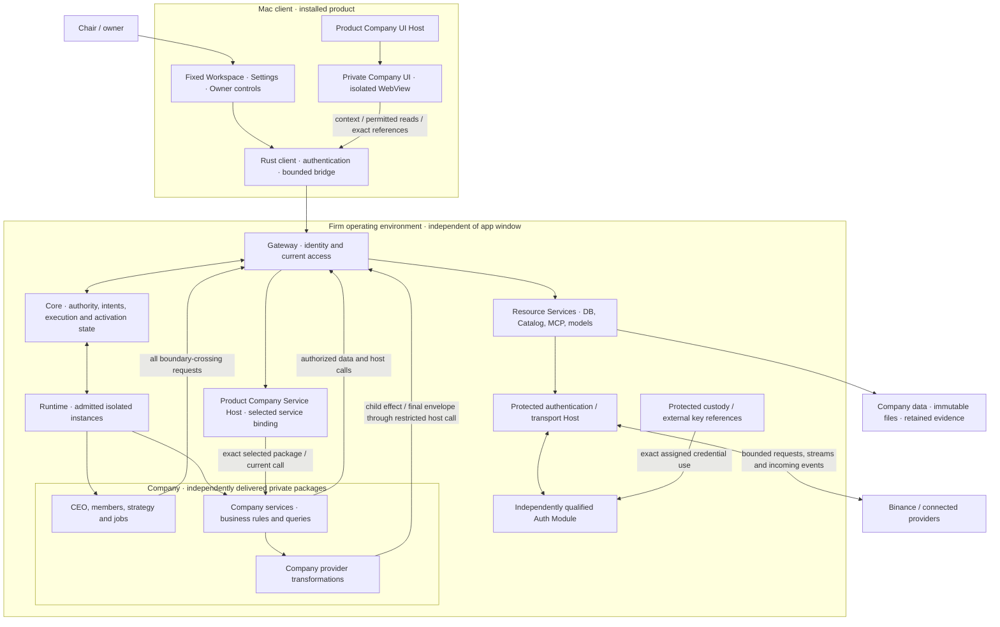
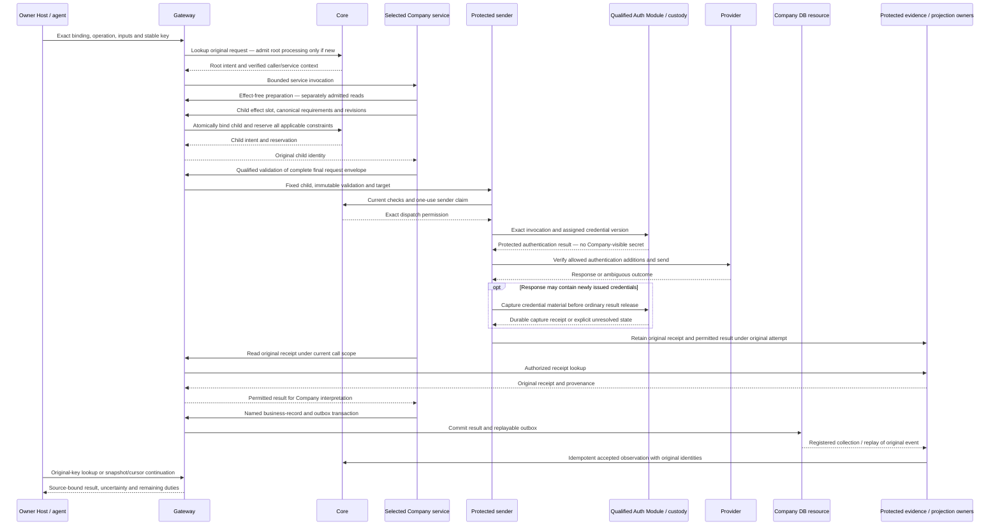
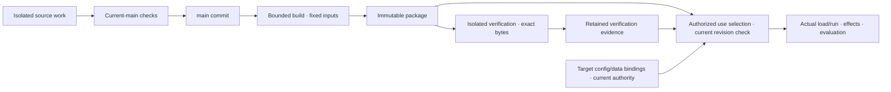

# Integrated System Design

## Status, scope and reading order

This design consolidates the owner's decisions through 2026-09-15: a chair-facing Mac app,
CEO-led autonomous operation, separate product and private company code, company-owned data and
artifacts, extensible Company screens, and **one source trunk, `main`, per repository**.
The Company boundary applies symmetrically to UI and backend services. Investment meanings,
financial enforcement and Binance integration belong to Company packages, not built-in product
domain modules. The product hosts those packages and enforces their selected-use boundaries.
**Company** is the extension boundary and runtime/UI vocabulary. Investment is this Company's
business behavior, not a separate product tier. The [flow review](../implementation/COMPANY_FLOW_REVIEW.md)
records cross-boundary counterexamples, corrected contracts and remaining implementation gaps.
The connection/authentication extension decision adds independently qualified Auth Modules under
Resources, operation-only credential use for ordinary workloads, and autonomous connection adoption
inside current delegation. The [connection extension checkpoint](../implementation/CONNECTION_EXTENSION_DESIGN.md)
records this design revision and its verification boundary.
It specifies the target and migration from the current working implementation. It does not claim
that the target is implemented, change doctrine, grant operating authority, alter enforced GitHub
rules, or authorize live trading. Implementation evidence is separate in
[Company boundaries checkpoint](../implementation/COMPANY_BOUNDARIES.md) and
[Mac implementation](../implementation/MAC_APP.md#current-checkpoint).

[Product Specification](../../PRODUCT_SPECIFICATION.md) owns purpose and required outcomes;
[Architecture](../../ARCHITECTURE.md) owns the outer/private responsibility split. This document
connects those responsibilities across development, deployment, operation and the app. Component
contracts retain their state/authority meanings; this is not another control service or ledger.

| Question | Detailed owner |
| --- | --- |
| Who can act, what is a work/instance/artifact, what can be activated? | [Contracts and State](CONTRACTS_AND_STATE.md) |
| How are resources accessed and private code isolated? | [Gateway](GATEWAY.md), [Runtime](RUNTIME.md), [Resource Services](RESOURCE_SERVICES.md) |
| What does the chair see and manipulate? | [Application Shell and Views](APPLICATION_SHELL_AND_VIEWS.md), [UI purpose contract](../design/UI_PURPOSE_CONTRACT.md) |
| What is observed and how is it attributed? | [Observability and Console](OBSERVABILITY_AND_CONSOLE.md) |
| How are environments installed and recovered? | [Integration and Deployment](INTEGRATION_AND_DEPLOYMENT.md) |
| What proves the intended behavior? | [Validation](VALIDATION.md), [Testing](../../tests/README.md), acceptance below |

## 1. Product and owner experience

Ouroboros is an agent-native quantitative firm. Reusable execution and interface machinery serves
that purpose; extensibility does not silently turn the firm into an unrelated general marketplace.
The initial Company's selected business/contract is **Binance USDⓈ-M BTCUSDT perpetual, USDT margin**. Account access,
capital, risk limits, strategy, valuation and performance comparison conditions are separate
operating decisions. No installation, sample configuration or design creates them.

The human is the chair/owner and, under the existing designation, the sovereign. The CEO is the
continuing operating responsibility. These are product perspectives over existing identity and
delegation, not additional security roles or a required legal/department structure.

The chair opens the app to understand capital and exposure, what changed, what the CEO is doing
and why, and whether intervention is needed. Ordinary work does not require the chair to create a
task, press Run, approve every file or keep a conversation open. The CEO observes, decides,
performs/delegates or waits, evaluates actual effects, and records the next reason to reconsider.
Timers/events are wake conditions; Runtime does not supply the firm's economic judgment.

A member has a stable principal, a data-backed name/profile, current responsibilities, work and
history. A model/session change does not create another employee. A helper invocation is not
permanent staff. Add or combine members when work, expected benefit, coordination cost and observed
results justify it; do not create empty HR/Finance/Research departments to fill the interface.
The design supports one CEO or many useful members without requiring either organization.

All personal/group/agent-to-agent discussion, proposals and progress explanations use the existing
conversation contract. Addressing and wake policy determine who responds; a group message does not
wake every member. Official decisions, permissions, orders and receipts remain separate linked
records. An agent saying "approved" or the chair reading a message does not mutate those records.

### Connection autonomy and the chair's decision boundary

Both an owner-supplied connection and an agent-discovered connection use the same qualified
adoption path. Discovery, preparation, independent verification, activation and use can proceed
without a new human decision when the current delegation explicitly covers the provider/account,
operations, disclosed data, shared costs, execution profile and applicable module acceptance.
A new connection name is not itself an approval gate. Missing authority, personal authentication,
secret enrollment or a new protected-code trust grant is the point to request the chair's action.
A proposal explains the work served, reusable alternatives, exact missing scope and attributable
evidence; it does not create a separate procurement or approval system.

Successful login, the provider's granted scope, the company's current delegation, technical
readiness and observed use are separate facts. An adapter/tool description or a CEO message cannot
supply any of them. The intersection of the current caller/service delegation, required Company
validation and connection/provider capabilities bounds every use. If the provider cannot attest
its full scope, retain that uncertainty instead of presenting it as verified least privilege.

## 2. Ownership and storage boundaries

There are two source repositories and independent operational stores, not four Git repositories.
Artifacts are company-owned content with version, provenance and retention rules; they are a
category of company data, not another tenant or an agent-owned disk.

| Boundary | Contains | Excludes / authority |
| --- | --- | --- |
| Product Git | Fixed Mac shell/control plane, design system, SDK/contracts, Core/Gateway/Runtime/common resources, generic Company hosts, transport/custody and synthetic tests | Company UI/business services, investment meanings/rules, exchange adapters, actual identities, strategies, accounts, operating data, credentials and execution evidence |
| Private company Git | Company UI, business/domain services including financial enforcement and exchange adapters, operating/strategy/analysis code and behavioral instructions, schemas/migrations, locked dependencies, synthetic tests; separately packaged Auth Module candidate source when needed | Actual member assignments, memory, production settings, trading records, package outputs and private runtime evidence |
| Protected operating records | Verified principals/delegations, assignments where specified, admitted intents, executions, activations, reservations and authoritative effect references | No private direct DB writes or author-declared authority |
| Company services and Catalog | Profiles, conversations, work content, decisions, domain records, retained artifacts, company settings and private evidence | Not an application-local substitute for Core or a working Git checkout |
| Protected custody | Encrypted credential bundles, immutable versions, protected external key references and recovery material under their owning service | No secret values in ordinary Company execution, WebView, chat, source, packages or build jobs; qualified Auth Modules consume only assigned material inside the protected boundary |
| Disposable work space | Mutable working copies, builds, caches and unretained scratch bounded to actual work/instance | Not a durable publication, backup or production store |

The product implements storage mechanisms, but actual records belong to the firm deployment.
Source ownership and execution trust are independent. An Auth Module candidate may originate in
private Company Git or product source; selecting it for protected use requires its own exact
qualification and current acceptance authority. Ordinary Company package acceptance cannot promote
it. This adds a package execution profile, not a required third repository.
Creator, publisher, evaluator and current custodian may be different principals. Preserve them as
separate provenance instead of labeling the publisher as the author. A display name may change;
original principal IDs, assignments and recorded attribution do not change with it.

For investment, account/order/fill/position meanings and enforcement belong to a verified Company
service package; Binance protocol translation belongs to its Company adapter. Strategy and analysis
also belong to private source but cannot rewrite or bypass the selected enforcement release.
Actual account bindings, selected contracts/limits, results and positions
are data. Configuration **shape** and migration code are versioned source; applied values and
migration effects are operational records. A prompt template can be code while an agent's current
assignment, conversation and retained knowledge are data.

## 3. Whole-system runtime

The following are logical responsibilities, not a requirement to create more services or VMs.



Protected internal service traffic uses the existing narrow internal contracts; it is not
recursively routed through Gateway. Private code and human clients have no equivalent bypass.
The app does not read Core/Postgres, Docker sockets, protected host files or provider keys directly.
Company services run as isolated workloads even when long-lived or required for financial
enforcement. Their source remains outside the product; their selected release cannot be changed
by editing an agent workspace. The protected sender carries only the exact operation admitted
through the selected service and current connection; it contains no investment calculations.

### Symmetric Company hosts

| Surface | Product responsibility | Company package responsibility |
| --- | --- | --- |
| Mac app | Company UI Host: selection, isolation, bounded bridge, fixed controls | Pages, widgets, business-specific record and action presentation |
| Operating environment | Company Service Host: compatible service selection, named operation binding, health, current access and dispatch identity | APIs, business semantics, enforcement, reconciliation and provider adapters |

Company Service Host is a logical integration responsibility of existing Gateway, Runtime and
resource services, not a second execution engine or fifth control platform. Runtime still owns
all instance creation/fencing. Ordinary Company UI/service/adapter packages are not dynamically
imported into Core, Gateway or a secret-bearing worker. Independently qualified Auth Modules run
only in the separate protected Resources execution profile described below. UI and service packages can share versioned contracts but have separate
selection, health and lifetimes; a page crash is not service termination or financial settlement.

For an enrolled financial connection, protected configuration requires the verified Company
enforcement service. Generic tools, strategy code and alternative operation names cannot bypass
that binding or obtain signing keys. Validation binds the current service release, account/config,
request/attempt and exact final bytes; transformations after validation require revalidation.
The sender checks that binding and current authority before signing/sending. An agent-authored
receipt is insufficient. Missing/stale enforcement prevents new dependent effects while permitted
observation, reconciliation and unresolved obligations retain their separate lifecycles.

### Connection adapters and protected Auth Modules

| Extension | Owns | Fixed host boundary |
| --- | --- | --- |
| Company UI | Company pages, widgets and business presentation | Isolated UI Host; bounded reads, references and protected action handoff |
| Company Service | Business meaning, queries, enforcement and reconciliation | Selected isolated service; attributed caller chain and admitted resources |
| Connection Adapter | Named provider operations, request mapping and permitted-result interpretation | Secretless Company execution; no alternate sockets, credential injection or raw signing |
| Auth Module | Credential schema, enrollment/refresh, authentication insertion, signing and inbound verification | Separately qualified protected Resources worker; exact assigned use and constrained output/transport |

The module contract supports stored values, multi-part credentials, certificates/signing material,
refreshable or short-lived credentials, protected external non-exportable key references and
user-presence authentication. It does not claim every provider/credential is already supported.
A module advertises its proven operations and unattended-use capability. Unknown types remain
unsupported; user-presence requirements remain visible. A third-party SDK/CLI that requires a raw
secret in ordinary execution is unavailable until adapted behind an authorized protected operation.

Within the supported Host ABI, an exact independently qualified module can be installed and selected
without rebuilding the app or whole product. A new Host primitive/permission boundary still needs
a product change and verification. Module installation, qualification, connection binding, activation
and current per-caller usage delegation remain separate. A known name, source signature or author
cannot stand in for independent evaluation or a protected-code acceptance grant.

Auth Modules are trusted secret consumers, not ordinary plugins made safe solely by a sandbox.
The host restricts instance/generation, module digest, connection/account, credential version,
invocation/attempt, authentication destinations, output and resource bounds. It never hands over
the custody master key or general secret-store enumeration. Some credentials require plaintext
inside that qualified worker; private clients receive neither it nor usable tokens/signatures.
External KMS references are also mediated operations rather than arbitrary signing capabilities.
All ordinary Company code remains secretless even when its authors wrote the Auth Module source.

[Connection and authentication contracts](CONTRACTS_AND_STATE.md#extensible-connections-and-protected-authentication)
fix the immutable references. [Protected Authentication Modules](RESOURCE_SERVICES.md#protected-authentication-modules)
owns enforcement, output handling and the qualification boundary. Existing custody encryption and
Core authority remain the owners; this does not add a Registry, secret platform or policy engine.

### End-to-end Company request and result

This sequence distinguishes processing a request from admitting its actual effects. A read-only
operation omits business-effect steps but still uses authorized reads and bounded compute. Direct
agent calls retain their existing delegated authority; only owner-originated actions use the fixed
host confirmation surface. The definitive fields and ordering are in
[bound calls](CONTRACTS_AND_STATE.md#bound-company-calls-and-owner-actions) and
[effect preparation](CONTRACTS_AND_STATE.md#company-preparation-and-exact-external-dispatch).



Returning a root result does not settle a child operation. A service crash reuses the original
effect-slot mapping, never another order/publication key. A schema or connection switch conflicts
with a stale action and resets incompatible projections; old receipts retain the original schema.
Company data/outbox and protected observations commit independently with acknowledged replay,
not one distributed transaction. No Company RPC or provider call runs while Core locks are held.

The current reference deployment is Mac UI/management plus an isolated Linux runtime. UI close
only closes/hides the interface. A Mac sleep or stopped VM can interrupt local operation; the app
must show that dependency rather than promise uninterrupted trading. Reconnection checks current
identity, grants, instance generation, clocks, observations and unresolved effects. Restored
sessions and healthy network connections are not proof of current authority or settled obligations.
A fixed native management layer may manage installation/VM/service lifecycle under explicit scope;
the WebView receives no arbitrary shell operation. Company stores survive removal of a development
checkout and replacement of an instance, app binary or VM boot installation.

### Bidirectional connections and credential continuity

Authentication lifecycle work has its own admitted intent/attempt, maintained within current
scope by a Resources consumer even while the Mac window and individual agents are closed.
Refresh/rotation serializes each credential lineage and conditionally changes the expected version,
connection selection and disable revision. Refresh success cannot replay a possibly executed business
request or reactivate a disabled connection. Routine same-scope credential epochs are separate from
structural selection and restriction epochs; they do not reload Company UI/services. Only proven
unsent attempts can continue the same intent through new credential preparation and validation;
[renewal epoch rules](CONTRACTS_AND_STATE.md#credential-renewal-and-structural-selection-epochs)
fix overlap, claim fencing and original-attempt recovery. Lost refresh responses are reconciled or require
reauthentication; they do not justify blindly reusing a rotated refresh token.

A session/subscription has an exact generation, account, selected modules, credential version,
current authority, quantity/time/cost bounds and durable recovery position. Effectful frames use
individual child admission; a handshake does not grant unlimited future operations. Observation
streams preserve access, scope, gaps and measured consumption. Reconnect restores only authorized
authentication/subscriptions, never unconfirmed orders or other effectful messages.

A fixed ingress verifies a registered connection's incoming event before persisting its canonical
provider/account/event identity and permitted content. Aliases and reconnect/subscription generations
identify deliveries, not new events; subscription-local identity limits require explicit reconciliation. It acknowledges only after durable intake, distinguishes duplicates,
conflicting payloads and ordering gaps, and exposes a bounded replay path. A provider-authenticated
event can supply evidence to an admitted observation/work cycle; it cannot supply an internal
principal, permission, automatic order instruction or trusted model prompt. Public ingress creation
and retirement require an explicit connection/network binding; a local Mac does not silently open a
public endpoint. OAuth callbacks belong to their exact enrollment challenge, not business event intake.

Provider-generated secret material is captured with a receipt before any adapter, log, artifact or
Company event receives the result. An external create succeeding before custody persistence fails
leaves an attributable unresolved obligation. Module/credential replacement fences old use leases,
egress and KMS access; retained workers/sessions and already sent effects must still be reconciled.
Module rollback cannot roll back a token, account or provider effect. Same-account aliases share
applicable authority/budgets, and test/live bindings cannot silently replace each other.

Connection permission also covers the data sent to the provider. Git, models, uploaded files and
other services follow allowed destinations, data disclosure and shared resource/cost limits even
when they need no credential. Qualification/refresh/subscriptions can incur their own recorded
usage; an error does not reset a request key, budget or authority. Unsupported protocols expose
missing capability rather than a generic unbounded network/secret escape hatch.

## 4. Source organization and dependency rules

Paths below describe the target responsibility layout. Existing paths are mapped in section 11;
new package/command names are design contracts, not claims of available tools.

```text
product/                                      Git: main
  apps/mac/src/
    app/                                      fixed routing, context and composition root
    ui/                                       tokens -> primitives -> components -> layouts
    features/                                 common screens and owner controls
    data/                                     authorized queries, commands and projections
    company-host/                             package wrappers, lifecycle and bridge integration
    development/                              explicitly selected fictional fixtures
  apps/mac/src-tauri/src/                      trusted client and isolated Company host
  packages/
    company-ui-sdk/                           published UI/bridge distribution
    company-contracts/                        versioned external schemas and compatibility checks
    auth-module-sdk/                          protected Host ABI; separate from ordinary Company SDK
  crates/{contracts,core,gateway,runtime,resources}/
                                              Company Service Host uses these existing owners
  tests/                                      existing responsibility-based test lanes

company/                                      separate private Git: main
  company.package.json                        build entries and supported contract declarations
                                              UI/service/adapter/auth outputs have distinct profiles
  src/ui/                                     company-specific pages and widgets
  src/services/                               business APIs, financial rules and reconciliation
  src/adapters/                               secretless provider protocol code, e.g. Binance
  src/auth/                                   optional separately packaged Auth Module candidates
  src/operations/                             strategies, analyses and reusable operating code
  schemas/                                    company data/config schemas and migration definitions
  tests/{unit,integration,fixtures}/           company behavior and synthetic inputs
  docs/                                       private source and operating explanations
  dependency lock files
```

Company code imports the released SDK/contracts, never `apps/mac/src`, the product's private
React types or a sibling checkout path. SDK versions and dependencies are pinned. The SDK builds
from the same OpenBoa design-system implementation as the product; company authors do not copy an
independent token set. Product React registrations contain generic fixed features only;
Company entries are versioned metadata and isolated code, not React components imported into
that runtime. A shared brand does not merge capability or process boundaries.

A company checkout is provided to private development through an admitted repository/compute
capability or an explicitly prepared source snapshot. It is not the developer's host checkout or
an unrestricted shared mount. Git hosting credentials are scoped to that repository and purpose;
repository access never confers trading, production DB or owner-control authority. The first
private repository and its hosting binding still need explicit setup; this document creates none.

## 5. Main-only source, package verification and use

### One trunk, separate environments

The target for both product and company source is **one maintained branch: `main`**. There is no
`dev`, staging, release or mandatory feature/work branch in the company template. Humans and
agents use isolated working copies (including detached copies), make small changes, and preserve
an exact candidate source identity. Admission checks the current main revision and required
independent evidence; a competing accepted change requires integration against the new main and
appropriate re-verification. Source updates must not overwrite another task or reset history.

Existing product rulesets, CODEOWNERS, required checks and reviewing PR transport remain governed
by [the GitHub delivery contract](../../.github/README.md). Main-only is not permission to bypass
them or force-push. Reconciling existing host helpers/review transport with the selected trunk
workflow is a migration item, not an instruction to remove enforced controls. This documentation
work preserves its existing owned checkout and does not change branches or repository settings.
Company source admission must likewise have an authorized integration path; it is not the build
candidate's unilateral approval. An independent check can be a protected deterministic evaluator;
it does not require a new human approval or a permanent review agent for every routine change.

### Three linked contracts

| Contract | Immutable identity and required information | What it does not establish |
| --- | --- | --- |
| Package | Kind/ID, source commit/tree digest, locked dependencies, build toolchain/runtime/SDK identity, entrypoints, asset hashes, config and named data-interface schemas, requested capabilities, attributable build evidence | Company/environment/account bindings, credentials, accepted use or operating permission |
| Verification | Exact package digest, evaluator/policy/oracle revision, tested runtime/profile/SDK, fixture/config identity and scope, observations and outcomes including failed/NOT RUN, verifier identity and independence, exact retained evidence references | Every possible environment is valid; author-written tests or a build alone are independent acceptance |
| Deployment / selected use | Target company/environment/slot, exact package, config and data-binding revisions, applicable verification/acceptance, profile/current delegation, expected prior selection revision, stable request key, prior compatible release, requested/accepted/applied/observed status and responsible work | New authority, silent data migration, completed execution, financial settlement or guaranteed rollback |

Selection includes the tested dependency combination, not just individual package approvals.
Required UI/service/adapter/Auth Module versions and Host ABI share a compatible binding set with
expected dependency, credential/config-schema and data-schema epochs. Candidates become effective only after exact readiness and current preconditions;
DB migrations use a writer/recovery barrier. See
[compatible selection and schema transitions](CONTRACTS_AND_STATE.md#compatible-selection-and-schema-transitions).

Package bytes are environment-neutral but remain private company property. Namespace/custody and
current grants enforce access. Target company, deployment and data bindings are verified separately;
omitting company IDs from source bytes does not make a package publicly readable or reusable by an
unauthorized firm. Never use a package ID/tag or self-declared `approved` field as authority.

The same package bytes are tested and selected for operation. The binding to real data/accounts
changes separately and requires the verification appropriate to that changed scope; synthetic
success does not become live-market validation. Schema compatibility and material configuration
changes can invalidate an old acceptance even when the package digest is unchanged.



Source admission and later package qualification are distinct checks. Each attributable build uses
fixed admitted inputs; a repeat build is a new build record, not a silent replacement of tested
bytes. Main admission, Catalog publication and deployment selection never implicitly trigger one
another. Publishing new source does not update an already admitted execution.

### Match the use, do not gate every scratch file

| Intended use | Existing contract to extend/reuse |
| --- | --- |
| Local experiment in an existing instance | Current experimental/work authority, accepted profile and remaining limits |
| Preserve a report/dataset/source candidate | Verified upload and separate revision-checked publication |
| Separate bounded job | Existing execution admission with exact payload/input, entrypoint and bounds |
| Company UI | Package compatibility/isolation validation and protected selection; no financial or owner capabilities |
| Continuing private service/reusable managed tool | Existing candidate/evaluation/acceptance/activation, actual readiness and per-call access |
| Company business service, domain rules or exchange adapter change | Company Package/Verification/Deployment with isolated execution and protected required-service bindings |
| Product control-plane or generic host change | Product development, verification and governed release path |

Use shared immutable references and evidence fields across these cases, with the existing owning
record/operation for each use. Do not invent a universal approval platform or put every selection
in a mutable company JSON file. Requested capabilities are bounded by current target bindings,
profile, delegation and mandatory domain controls.

Before selection commits a durable dependency, acknowledge retention holds on required package,
evidence and recovery references. Use expected-selection revision checks to avoid overwriting a
concurrent deployment; preserve the original intent when a response is lost. A valid active view
remains selected when a new candidate fails validation; if that old view's authority is revoked,
it closes instead of being retained as a fallback. Runtime updates also fence the prior instance
and reconcile outstanding work according to their owning lifecycle.

## 6. Environments, data and operational continuity

| Environment | Purpose and isolation | Persistent outputs |
| --- | --- | --- |
| Development working copy | Editable source, local UI preview, bounded builds; no implicit operating identity | Source commits and deliberately retained artifacts |
| Disposable verification | Fresh explicit identities, DBs, Catalog namespaces, instance limits and synthetic/provider fixtures; no inherited production keys, queues or accounts | Private test evidence with exact inputs/results; confirmed cleanup |
| Firm operation | Activated infrastructure bindings, current delegation, exact selected packages/config, durable records and external obligations | Company state, retained evidence and economic history |

Verification environments are created when needed; a permanent staging farm is not required.
A branch name, directory or UI badge does not provide isolation. Endpoint/credential/data-space
boundaries and actual kernel/service enforcement do. Company build/test code does not run with
production custody, Core DB privileges or on an unrestricted persistent production runner.
Real provider tests use explicit disposable/test targets and authorized bounds; they are a separate
lane and do not silently adopt personal accounts or renew their own budgets after failure.

Current company data is not Git-managed configuration. Profile names, memberships, work status,
conversations, account observations, live limits and applied settings are read from their owning
services. The deployment stores approved **references** to environmental settings/custody;
source contains schemas and non-secret synthetic templates. Core remains authoritative for rights,
verified principals, official assignment constraints and admitted effects. Company display labels
or conversation text cannot register those facts.

Operational DBs and file storage have service/namespace/role and backup boundaries independent of
source copies. A schema migration is code; actually applying it is a separate authorized state
change with version checks, evidence, compatibility and recovery conditions. A package switch does
not silently run arbitrary migrations or imply that old code can read the new schema.

CEO/member replacement preserves work, room history, evidence, pending effects, costs and obligations.
A successor reads retained state and current assignment, obtains a valid execution binding and
records actual activity. Recovered model context is not current authority; predecessor fencing and
handover responsibilities remain observable. A missed event or timer needs original-ID/cursor
reconciliation, not duplicated work or an invented completion. The current assignment revision
fences official decision writers; unresolved predecessor publications/conflicting effects block
successor official writes under the [handover contract](CONTRACTS_AND_STATE.md#operating-responsibility-and-handover).
CEO exit is not child-work completion; [outstanding work](CONTRACTS_AND_STATE.md#replacement-and-outstanding-work)
keeps its own obligations and valid grants, while ancestor revocation fences affected descendants.

Boot/reconnect/restore and operating end follow the explicit
[recovery and end barriers](INTEGRATION_AND_DEPLOYMENT.md#company-recovery-and-operating-end-barriers).
Required Company observation services need scoped recovery execution and dependency capacity even
while new business effects are restricted. End operation drains those responsibilities before
Runtime shutdown. A decision saying wait is healthy only when its exact continuation acceptance is
observed under the [wake contract](CONTROL_CORE.md#wake-conditions-and-continuing-work).

## 7. Artifact management and lifecycle

### One Catalog, distinct content and uses

Agents and humans create temporary files in bounded workspaces. Useful results are uploaded and
published through Gateway into the existing Catalog. Store bytes, publication metadata and Core
intent/effect records under their existing separate owners; no distributed transaction is assumed.
A Git commit is source provenance, not a file-publication receipt or a backup of runtime results.
Company code candidates can begin as artifacts, be integrated into private main, then produce
packages with a source/evidence chain. Publication does not itself integrate source or activate it.

An exact client reference preserves **environment/company scope, workspace, revision, path and
verified content digest**, with current authorized access resolved on each Gateway-mediated use. The file service
also retains storage binding and object generation for safe retention/deletion. A digest is an
integrity claim, not permission, and a cached old grant is not perpetual Gateway access. Delivered
local copies remain subject to their admitted local-use conditions; later revocation cannot be
represented as remote deletion of an exported copy.

A logical document or multi-file package can have successive versions. Keep explicit predecessor/
successor relationships and exact manifest entries; a renamed path must not fabricate continuity.
Messages, judgments, notifications, tests and deployments pin the version actually used. They do
not resolve `latest` later. Latest views can aid discovery but are not the historical source.
Catalog publication replaces a workspace manifest: writers preserve required entries, use observed
revision checks and reconcile the original intent after timeout. A file disappearing from a latest
manifest/list is not proof of deletion or release of all past references.

The authorized projection carries title/type/purpose, creator and creating work/execution, publisher
and publication time/receipt, exact version/digest, related source/build/input references, evaluation
and selected-use references, retention reasons and coverage. Author explanations and technical
receipts stay separately attributable. Evidence files are artifacts; protected acceptance and
activation decisions remain in their owning records, not in editable report text.

| Axis | Distinguish |
| --- | --- |
| Storage/publication | Local scratch, staged upload, content verified, publication confirmed, outcome unresolved |
| Evaluation | Not evaluated, passed/failed/inconclusive for identified tests and use, required NOT RUN |
| Use | Reference material, candidate, exact admitted input, selected release, actual use observed |
| Retention/disposal | In use, retained for named evidence/recovery reason, eligible retirement, deletion requested, actual removal confirmed |

These are independent axes, not one mandatory lifecycle or one `trusted` badge. Reports normally
need publication and access checks; a service additionally needs its applicable acceptance.

### Retention, quotas and recovery

Retain active package inputs, admitted execution inputs, required evidence, unresolved-effect
references and agreed recovery versions with durable owner/reason holds. Release a hold only through
its owner's reconciled lifecycle. Finishing an agent, expiring a lease, deleting a branch or hiding
a Library item does not release all dependencies. Keep byte/count budgets, growth reservations,
actual usage and confirmed recovered capacity visible. No universal retention duration is invented;
policy and the firm's outstanding obligations govern eligibility.

Cross-store DB/message/package dependencies bind an acknowledged owner-specific hold before
commit; [retained dependencies](CONTRACTS_AND_STATE.md#cross-store-retained-dependencies) defines
late acknowledgements, cancellation and release. [Publication continuity](RESOURCE_SERVICES.md#publication-continuity-and-definite-rejection)
defines carrying forward exact retained entries and definite no-effect refusal receipts. These
are target contracts; current active-upload requirements and unresolved publication barriers have
not been removed by this documentation update.

Scratch cleanup is Runtime responsibility; service data survives process exit. Retirement ends an
eligible use/reference; collection independently confirms removal of the exact object generation.
Missing/corrupt content is a visible integrity failure, not permission to silently use another
revision or delete the evidence of failure. Store/data backup and restore tests are independent of
Git and package copies. Recovery inventories bind DB state, content, selected code/config and
unresolved effects; restore starts without external effect authority, then reconciles current
credentials, account state and obligations before dependent operation resumes.

Code rollback selects a retained compatible package under current authority. It does not rewind
conversations, erase losses, undo migrations automatically or cancel an exchange fill. A changed
schema can make rollback unavailable; show a recovery/forward-fix requirement rather than claim
that every package has an automatic rollback button.

## 8. Mac application and interaction architecture

### Stable product shell and independent Company content

| Surface | Purpose and owner |
| --- | --- |
| Home | Product-owned widget layout; chair chooses sourced product/Company widgets and priority |
| Work | Why work exists, responsible member, outcome, cost/obligation and next evaluation condition |
| Agents | Continuing members, responsibilities, actual executions, trace/history and exact stop links |
| System | Actual environment/resource observations, readiness, limits, failure and recovery state |
| Conversations | One personal/group communication model for humans/agents, proactive summaries, explanations and proposals |
| Library | Authorized retained materials, historical versions, source/evaluation/use/retention relationships |
| Notifications | Source-linked unread changes/requests; consistent badges, no second approval system |
| Company pages | Private company presentation such as Portfolio; independent verified package selection |
| Settings | One navigation entry, body tabs for General/Connections/Company/Modules/Maintenance |
| Owner controls | Fixed access to exact permitted controls and their observed results |

Investment outcomes should lead this firm's Company page and selected Home widgets. The common
shell remains domain-neutral. Financial detail and controls are contributed by selected Company
packages and backed by their qualified services; the product ships no parallel investment UI or
financial implementation. Generic host records expose service health, exact request/receipt state
and permitted operation entry points without requiring a CEO response. A failed Company page cannot
remove fixed controls or stop a separately running service. If a required Company package/service
is absent, financial functions are unavailable; the product never synthesizes them. The current
sample Portfolio is a migration reference, not an implemented live Company service path.

Preserve the current full-page detail/back navigation, period/account/selection/scroll and room
draft context. Library previews reports/code as data with type-specific bounded viewers; HTML or
JavaScript preview never becomes Company execution. Unsupported formats retain metadata and an
explicit save path. A report opens at its exact version and can be discussed without copying it
into a new evidence store. Add history, evaluation and retention to existing Library details;
add release/source/test/apply information to existing Settings tabs, not more main destinations.

The UI design system is the pinned OpenBoa brand implementation, with shadcn-derived shared
primitives, semantic type/spacing/color/motion tokens, components and layouts. Company builds use
that SDK. Labels and app copy are English. Information priority, compact consistent typography,
spacing and subtle surfaces communicate structure; narrative text and divider-heavy cards do not
substitute for interaction. Status uses words/signs as well as color. Baseline 1440×900 and minimum
1100×720 require actual native/responsive inspection, including keyboard/focus and failure states.

### First setup, reconnect and recovery

First setup verifies enrolled environment/storage and owner identity, then presents only missing
mandate/capital/risk, connection and operating-responsibility decisions required for the selected
use. Profile names are data and Company UI is optional; neither can create rights. Installation,
connection, verified capability, operating start and actual CEO activity are different observations.
After an authorized start, the CEO's first observation/judgment and subsequent wake are observed
without asking the owner to supply a task. No account, leverage, capital or strategy default is
invented to make setup look complete.

Reconnect resolves the existing firm and current state; it does not create another company, assign
a new CEO or replay pending effects. Recovery starts with inspection/reconciliation before dependent
activity. Login-start behavior is an explicit local setting; closing the window never issues the
operating-end command. Removing/resetting the client preserves firm data by default; data retirement
and remaining external obligations are separate owned operations.

### Connections as a chair-facing journey

Settings keeps one sidebar entry. Its Connections body lists name, purpose, verified account and
environment, usable capabilities and actionable attention, then opens Overview / Access / Activity.
Overview explains readiness and dependent work; Access separates provider scope from current company
delegation and data/cost limits; Activity follows use, refresh, replacement and revocation to actual
receipts and remaining duties. Credential IDs/raw payloads belong in diagnostics, never default input.

| Journey | Chair experience | Durable system responsibility |
| --- | --- | --- |
| Initial setup | Connect environment and owner; see only missing operating conditions | Installation, enrollment, current delegation, readiness and actual CEO activity remain distinct |
| Owner-supplied company | Register prepared packages/connections directly | Same qualification/current-use boundary without a synthetic CEO proposal |
| Agent needs capability | Observe automatic adoption in current scope; otherwise follow a contextual conversation request | Reuse existing connections first; retain exact missing authority/login/secret requirement |
| Enrollment | Protected masked input or official system-browser login | Bind firm/environment/connection/challenge; no Company WebView or conversation secret input |
| Ordinary operation | Prioritized Home/Company results, source drill-down and optional CEO discussion | Autonomous work, effects, evaluation and accepted next condition |
| Expiry/refresh | Automatic renewal where authorized; sign-in request only when needed | Separate auth attempt, per-lineage revision checks, affected-work state |
| Unsupported auth | See unavailable capability and prepared module work | No raw-secret fallback; qualification before protected use |
| Update | See changed capability/access and actual application | Exact compatible binding set; readiness before replacement |
| Restriction/intervention | Select exact action and see remaining duties | Accepted/applied/provider-observed states; scoped reconciliation access |
| App close/reconnect | Return to current company and preserved location | No new company, duplicate execution or effect replay |
| Recovery/operating end | Observe reconciliation, blocked dependencies and remaining obligations | Old instances/current authority/provider effects checked; necessary observer survives shutdown |

App logout ends the owner's client session, connection-use disable limits company use, and provider
revocation requests external invalidation. None alone closes a position, cancels an order or proves a
subscription was terminated. Enrollment success does not start trading. A different verified account
is a new binding decision rather than a cosmetic credential rotation. Missing provider evidence stays
unknown/partial and does not become zero, healthy or fully revoked.

Conversations provides the single explanatory/proposal route; its action opens the canonical
protected connection/control surface. Notifications and per-screen badges share exact source
references; repeated renewal failures update the same attention item. Home can host an optional
Connection attention widget. System owns current failures, sessions, uncertain effects and resource
usage; Settings Modules owns selected versions/qualification. No additional credential/report mailbox
or required top-level screen is introduced. The fixed shell continues without a working Company UI,
model answer or auth module; unavailable server control is shown as unavailable, never successful.

The UI follows the existing OpenBoa tokens -> primitives -> components -> layouts -> screens chain.
Connection status, scope, source references, outcomes and protected actions use shared components,
progressive detail, keyboard/focus behavior and truthful uncertainty. App labels remain English.
Native OAuth uses an external system browser, session-bound callbacks and supported PKCE rather
than a Company-owned login page; see [RFC 8252](https://www.rfc-editor.org/rfc/rfc8252) and
[OAuth security best current practice](https://www.rfc-editor.org/rfc/rfc9700).

### Profile, composition, package and selection must load independently

1. Native connection establishes current environment/company/principal through Gateway.
2. Common observations and company/member profile load without requiring any Company package or
   composition. Missing profile falls back to truthful identity labels, never a fictional name.
3. Protected selection supplies eligible exact Company packages and environment-specific bindings.
   The host validates compatibility, identity, grants, asset digests and selected-use evidence.
4. Shared composition selects allowed pages/widgets; personal Home layout only arranges instances.
   Composition or profile publication alone does not select new executable code.
5. Native host mounts Company HTML/assets in separate bounded WebViews. Package/view failure leaves
   common observations and controls available. Source change closes stale surfaces/caches and
   rechecks current authority before new use.

The current code does not yet implement all five independently; see section 11. Main source commit,
built package, verification, selected deployment and observed instance are distinct in Settings.
A package update reuses the app binary. Profile updates reuse both binaries. A product SDK contract
change is a product release with compatibility testing; it does not silently rewrite company code.

### Bridge and projection contracts

Company UI receives only a product-owned bridge: context, named authorized reads, opening exact
records/artifacts or declared operation references, and attaching references to the common
conversation. An operation reference opens a fixed host action surface bound to the selected
Company service/schema. The host preserves and displays exact inputs, target and expected version;
only an actual owner action there submits that owner-originated request through Gateway under
current authority. Company JavaScript cannot auto-submit it or inherit owner command capabilities.
This does not add a human gate to an agent's independently delegated work. Current code supports
JSON artifact reads; typed live projections and operation-reference handoff remain required
extensions. Binding declarations name
supported operations and schemas, not URLs, SQL, shell, provider credentials or arbitrary Tauri
commands. Company views cannot emit fake protected receipts or receive owner command capabilities.
Financial controls use qualified Company operation contracts and current permissions; generic agent stop
never substitutes for order cancellation or position reduction.

Queries preserve source, observation time, coverage, omitted/denied fields, exact revision/cursor and
scope. Effects preserve stable request keys, target/expected revision and original receipt identity.
Transport request acceptance, actual application and remaining duties are shown separately. A
reconnect does not resend an order, execution or publication. Notifications reuse authoritative
unread aggregates and source references; reading is not approval or resolution. Summaries preserve
original records and source/time even when no agent answers a chat.

Private WebViews have no application DOM/React state, arbitrary native capabilities, external
navigation or inherited window-level owner permissions. Bounds, request counts/bytes/concurrency,
CSP, lifecycle cleanup and current-authority checks are enforced outside private JavaScript. A
React error boundary is not isolation. Actual native rendering, script hang, resource exhaustion,
control availability and close/reopen tests are required; the present unit tests do not prove them.

<a id="9-investment-economic-attribution-and-intervention"></a>
## 9. Company business behavior, attribution and intervention

This company's investment service owns account/contract meanings, order intent and transmission/venue-response
state, fills, positions, obligations, mandatory limits and reconciliation. Preserve provider units,
settlement/expiry meaning and timestamp/coverage. Strategy and organization stay private. Binance
integration is Company adapter code, replaceable without putting its SDK or futures calculations
in the product. Company authors can prepare changes but cannot bypass the selected verified rules.

Economic reporting separates contributions, returned principal, profits withdrawn, realized gains,
unrealized valuation, trading/funding fees and model/compute/data/operating costs. Reserved resources
are not already incurred expenses. Estimated/measured/billed versions of the same cost are reconciled
rather than summed; owner-paid costs and unresolved obligations remain visible. Aggregation records
its currency, period, scope, source and valuation/comparison method. Missing methods or accounts
remain unavailable/partial; neither UI nor an agent invents a favorable return formula or a zero.

Financial views connect judgment -> admitted request -> transmission -> venue response -> fills ->
position/cost -> evaluation in both directions. The private explanation and observed effect can
disagree; preserve that disagreement. A chart or simulation cannot establish recurring profitability.

The chair must distinguish four judgments: the owner's actual economic result; the evidenced
contribution of AI operation after its cumulative resource costs; evidence for repeatable earning
ability; and the next decision to maintain, expand, reduce or withdraw capital. Compare against
realistic alternatives under the mandate's horizon and methods, preserve uncertainty and negative
evidence, and link the assessment to subsequent allocation decisions. Retaining a report is not
institutional learning: show which later judgment used or rejected it and the resulting change.
These requirements follow [Continuing Product Validity](../../PRODUCT_SPECIFICATION.md#5-continuing-product-validity),
not a UI-selected benchmark or a new guarantee of performance.

| Control | Independent meaning |
| --- | --- |
| Restrict new investment | Block specified new financial exposure; retain permitted monitoring and obligation management |
| Cancel orders | Target actual outstanding orders and reconcile the venue's outcome |
| Reduce/close position | Separately authorized financial action, with fills and residual exposure |
| Stop execution | Terminate/fence an exact execution and observe resource return |
| Revoke delegation | Fence affected descendants/resources according to current authority |
| End operation | Restrict new activity, reconcile remaining effects/duties, perform permitted cleanup and service shutdown |

None implies all others. Requests show receipt, actual application and remaining order/exposure/cost
responsibilities. CEO transition, provider failure or unavailable Gateway cannot grant a new bypass.
The owner's routine involvement is inspection and optional conversation; mandate/capital/new-rights
changes retain the existing sovereign decision boundary. Changes within current delegation do not
create a mandatory human approval queue.

## 10. Acceptance across the full lifecycle

Use the existing selectors, disposable fixture lanes and independent evaluators. The following are
required outcomes, not newly implemented scenario IDs or claims that every item already has a test.
Package/evaluator/fixture/platform/config identities and negative/NOT RUN evidence are retained.

| Acceptance | Required observed result |
| --- | --- |
| No-input autonomous operation | Observation -> judgment -> work/delegation or justified wait -> evaluation -> next wake without new chair tasks |
| Useful and continuing membership | One-member company works; justified new member has distinct identity and work; replacement preserves attribution/duties |
| Main-only collaboration | Concurrent isolated changes cannot overwrite main; current-base evidence gates integration; main change alone does not alter operation |
| Product/private separation | Clean product build requires no private repository, real identities, data or runtime evidence; forbidden imports and tracked private files fail |
| Symmetric Company boundary | Product builds/runs without investment UI/services/adapters; a Company service is independently selected through the existing Runtime; generic tools cannot bypass its required enforcement or credentials |
| Independent protected auth release | A separately qualified Auth Module installs/selects under the supported Host ABI without rebuilding the app/product; ordinary Company code cannot promote itself or gain raw secrets |
| Scoped connection autonomy | A new connection within current delegated provider/account/action/data/cost/trust scope is adopted without a human gate; missing login, secret or authority is requested precisely |
| Authentication lifecycle | Enrollment, provider scope, company delegation, readiness and observed use stay distinct; refresh/rotation/disable races and lost responses cannot duplicate a business effect |
| Bidirectional continuity | Session revocation and webhook duplicate/conflict/gap handling preserve current scope; provider input cannot become internal authority |
| Secret containment | No raw credentials, reusable authenticated requests or secret-bearing errors reach ordinary workloads, UI, logs, source or artifacts; generated credentials are captured before output |
| Independent company release | Same exact package tested then selected without app rebuild; changed material bindings require applicable verification |
| Invalid/stale selection | Wrong company/environment, digest, contract, stale revision or missing retention/verification cannot replace the active release |
| Profile independence | Rename/profile update needs no code build; common app works with absent/broken Company composition |
| Native containment | Broken/hanging Company view cannot cover/disable fixed controls, access owner commands or other company content; lifecycle cleanup observed |
| Exact artifact history | Old report/package remains accessible under current authority by exact reference; preview/discuss/notification never substitute latest |
| Artifact custody | Creator/publisher distinguished; active/evidence holds prevent disposal; retirement and confirmed byte recovery remain separate |
| Unified conversations and notifications | Proactive/personal/group messages preserve recipients and references; badges reflect server state; read/chat does not grant authority |
| Financial trace and uncertainty | Account/judgment/order/fill/cost links, partial fills, duplicate/lost replies and stale/denied data preserve meaning and do not duplicate effects |
| Economic result | Contributions/withdrawals/gains and costs reconcile; actual owner result, AI contribution, repeatability evidence and next capital decision remain distinct without invented benchmarks |
| Intervention | Target/version/request key, receipt/application/resource return and residual financial duties remain distinct through reconnect |
| Continuity and recovery | App close, execution replacement and restored stores preserve records; stale rights fenced; external obligations reconciled before dependent operation |
| Full Mac experience | First setup/reconnect/recovery, empty/error states, package switch, close/reopen and keyboard/focus tested against actual native and server records |

Simulation, browser fixtures, an SDK build and one successful real-model resource smoke test each
prove their own scope. They cannot be combined into a claim of complete autonomy, live investment
or recovery. Provider calls and real financial effects require their actual authorized conditions.

## 11. Current implementation and migration order

This source audit records the existing working tree, not a merged/released product. Prior test
counts belong to the checkpoint; no new runtime checks were executed for this documentation pass.

| Existing area | Retain | Required change / evidence gap |
| --- | --- | --- |
| Core/Gateway/Runtime/Resources | Existing identity, admission, execution, conversation, files and effect boundaries | Reuse owning contracts for missing projections/selected uses; do not add a parallel privileged API |
| `app/`, `ui/`, common `features/` | Fixed routes, shared design system, navigation/context, conversation/notification/control foundations | Complete screen-specific projections and true readiness; common operation must not depend on private views |
| `features/gateway/GatewayWorkspace.tsx` | Connection composition root | Move embedded query/detail/control behavior into existing feature/data responsibilities |
| `data/company-packages.tsx` | Pinned package preparation and product wrappers | Split profile, composition, package and protected selection lifetimes; profile currently depends on UI workspace selection |
| `src/modules/` and native `company_views.rs` | Product-owned host and bounded separate WebView code | `company-host` is a target name; separate company/data bindings from package, qualify selected-use/holds and test native failure isolation |
| `contracts/modules.ts`, `contracts/company-sdk.ts`, external SDK | Internal wrappers and reusable design system | Distinguish product React registration from versioned external JSON/SDK; ship usable independent contract/types/build tooling |
| `domains/investment/Portfolio.tsx` | Current synthetic reference | Move financial UI/components into private Company source; current placement is not the target product ownership or live Portfolio |
| Archived investment draft outside product source | Financial models/enforcement/provider code removed from the product workspace | Split Company meanings/transformations from credential parsing, authentication and HTTP in the current Binance draft; only the former move to Company, while qualified protected authentication and generic transport own the latter; live integration is not established |
| `data/catalog.ts`, Library/PublishedFile | Exact published reads, digest/size checks, escaped text preview and save | Current list covers latest observed publications; add historical discovery, creator vs publisher, use/retention; preserve full exact reference in every Discuss path |
| Private files outside checkout | Existing private evidence archive | Not yet a registered company repository or production store; no automatic import/adoption |
| Private Git / company release workflow | Selected main-only design | Repository binding, protected admission, Package/Verification/Deployment integration and disposable environment driver still required |
| Credentials and fixed Responses worker | Existing authenticated encryption, owner/version binding, enrollment/disable receipts and fixed protected sender | The [bounded Bearer Wasm host](../implementation/PROTECTED_AUTH_MODULE.md) adds independent package loading, verification and selection for the fixed Responses sender; general Auth Modules, OAuth refresh, HMAC/mTLS, external-key use and authenticated incoming events remain unimplemented/unqualified; do not relabel bounded verification as operating acceptance |
| CEO assignment and recovery | Existing architectural contracts and execution primitives | Full no-input continuity, replacement and actual obligation preservation remain acceptance work |

Implementation order follows dependency, without shrinking the whole-product scope:

1. **Contract baseline:** align this system map, connection/Auth Module contracts, recovery and
   screen/source/action journeys. Keep source findings, NOT RUN and accepted design separate.
2. **Common correctness dependencies:** original caller/service chain, root/child effects,
   exact binding/current-revision checks, original-key receipt lookup, historical artifact references,
   retained evidence and compatible package/data transitions.
3. **Protected connection extension:** custody-backed enrollment, separately qualified module Host,
   bounded authentication/transport and durable lifecycle; prove API-key/Bearer, HMAC and OAuth
   representative paths with disposable mock providers, including independent module installation.
4. **App connection experience:** Settings Connections/Modules, protected enrollment/actions,
   independent state axes, System/Conversations/Notifications/Home links and actual native evidence.
5. **Company operation:** private main/build/package path, Binance Company service/enforcement,
   real account observations within actual scope, persistent service capacity and CEO wake/evaluation.
6. **Integrated acceptance:** actual Mac/Linux records, qualified provider observations where
   authorized, failure/recovery/operating-end scenarios, retained evidence and truthful gaps.

Existing candidate acceptance is bounded verification, not general operating qualification.
Mock OAuth/HMAC or external-key tests establish only their fixture scope, not arbitrary-provider
support. Real credentials/accounts, upstream access rights and unresolved operating settings are
never fabricated to make a lane pass. No product/runtime/UI behavior is claimed by this document
revision; the checkpoint records the actual changed files and checks.

No new top-level app screens, separate report mailbox, fixed department system, live credentials,
Git release policy bypass or new generic artifact-approval service is needed to define this design.
