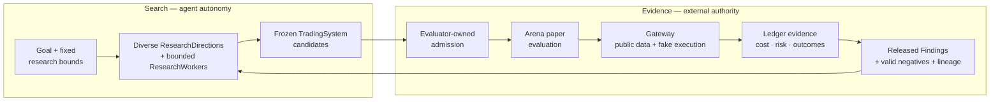

# README Evidence-Governed Iteration Loop Implementation Plan

> **For agentic workers:** REQUIRED SUB-SKILL: Use superpowers:subagent-driven-development (recommended) or superpowers:executing-plans to implement this plan task-by-task. Steps use checkbox (`- [ ]`) syntax for tracking.

**Goal:** Rewrite the root README so a new AI-development reader understands Ouroboros as an evidence-governed agent iteration loop, can see why trading is the first proving ground, can run the current product, and can navigate its product and repository structure without encountering overstated authority or capability.

**Architecture:** Keep the change Markdown-only and make `README.md` the progressive-disclosure entry point. Lead from problem to loop methodology to evidence authority to trading, then provide a two-stage first run, explain the two product loops and five operator views, separate built truth from open claims, and map system and repository ownership. Use one Mermaid diagram to connect search autonomy to Research, external admission, Arena, Gateway, Ledger, and released research feedback.

**Tech Stack:** GitHub Flavored Markdown, Mermaid, repository-local CLI/npm commands, Bash documentation and security guards, Vitest compatibility tests, GitHub branch rendering.

## Global Constraints

- The primary reader is technically literate and interested in AI agents, AI research, weak-to-strong supervision, or long-running improvement loops but does not know Ouroboros.
- Trading, crypto, and systematic-research readers are secondary and must see a concrete proving ground without a profitability promise.
- The hero must center the evidence-governed iteration loop, not frontier-agent leverage.
- Codex is the only current non-fixture provider path. Claude Code and later frontier agents may be named only as future or conditional providers.
- The current market boundary is public-data `BTCUSDT` Binance USD-M futures paper trading with fake accounts, fake execution, and Ledgers.
- Do not claim stock, spot, multi-asset, private exchange, signed-request, listen-key, leverage-change, or live-order support.
- Do not claim profitability, durable generalization, causal agent leverage, production-duration autonomy, completed weak-to-strong success, or that an external source proves Ouroboros works in trading.
- Research/CandidateArena owns external admission. Arena queues and runs already-admitted TradingSystems.
- One paper window cannot carry both `research_feedback` and `qualification` purposes. Precommitted `research_feedback` may feed later generations; qualification evidence stays sealed until terminal closure and may enter later Research only through a separate post-close `PaperTradingComparisonResearchRelease`, which materializes only Finding and Lineage and grants no promotion or live authority.
- ResearchWorkers do not grade, admit, qualify, promote, erase history, or grant themselves trading authority.
- Gateway owns public market data, validation, and fake execution. TradingSystems never attach directly to Binance.
- Paper evidence never grants private or live authority.
- Preserve exactly one Mermaid diagram and do not add logos, generated illustrations, custom SVG, benchmark graphics, or unverified screenshots.
- Preserve the exact strings `Desktop app is the primary interactive operator surface`, `CLI remains the complete baseline`, and `share the same runtime/store-backed session data`.
- Preserve the exact canonical sequence `Candidate Arena -> Trading System -> System Code -> research preflight -> selected Paper Trading -> Gateway -> Ledger`.
- Preserve the S5 phrases “Runbooks for Docker Sandboxes `sbx`/`sdx`, S5 audits, recovery helpers”, `developer/detail surfaces`, “Use the relevant npm script `--help` output”, and `Linear workflow notes`.
- Keep repository edits inside `README.md`, the approved design specification, and this implementation plan unless an exact broken link makes the README untruthful.
- Show the real GitHub-rendered branch README to the user before opening the final PR.

---

### Task 0: Promote The Approved Design And Lock The Execution Plan

**Files:**

- Modify: `docs/superpowers/specs/2026-07-26-readme-evidence-governed-iteration-loop-design.md`
- Create: `docs/superpowers/plans/2026-07-26-readme-evidence-governed-iteration-loop.md`

**Interfaces:**

- Consumes: the user's explicit approval of the written design specification.
- Produces: an approved design status and the exact implementation/readback path used by later workers.

- [ ] **Step 1: Mark the design specification approved**

Replace the proposed-status sentence with:

```markdown
Status: approved for implementation on 2026-07-26.

Linear issue: `OURO-241`

Implementation plan:
`docs/superpowers/plans/2026-07-26-readme-evidence-governed-iteration-loop.md`
```

- [ ] **Step 2: Validate and commit the design-to-plan handoff**

Run:

```bash
bash scripts/check-docs.sh
git diff --check
```

Commit only the approved spec status and implementation plan:

```bash
git add docs/superpowers/specs/2026-07-26-readme-evidence-governed-iteration-loop-design.md
git add docs/superpowers/plans/2026-07-26-readme-evidence-governed-iteration-loop.md
git commit -m "[OURO-241] Plan evidence-governed README implementation"
```

### Task 1: Rewrite The Complete README Flow

**Files:**

- Modify: `README.md`
- Reference: `docs/superpowers/specs/2026-07-26-readme-evidence-governed-iteration-loop-design.md`
- Reference: `docs/project-direction.md`
- Reference: `docs/ouroboros-doctrine.md`
- Reference: `docs/candidate-arena-research-goal.md`
- Reference: `docs/candidate-arena-evaluation-protocol.md`
- Reference: `docs/research-arena-product-loop.md`
- Reference: `docs/autonomy-model.md`
- Reference: `ARCHITECTURE.md`
- Reference: `docs/api-command-contract.md`
- Test: `apps/operator-desktop/desktop-shell.test.ts`
- Test: `apps/runtime/test/s5-sbx-validation-script.test.ts`

**Interfaces:**

- Consumes: the approved copy, information architecture, product boundaries, commands, compatibility strings, and truth constraints from the design specification and canonical documents.
- Produces: one self-contained README whose section order is philosophy → method → trading domain → first run → product orientation → current truth → system/repository ownership → operation/validation → canonical reading path.

- [ ] **Step 1: Confirm the implementation baseline**

Run:

```bash
git status --short
git log -2 --oneline
npm test -- apps/operator-desktop/desktop-shell.test.ts apps/runtime/test/s5-sbx-validation-script.test.ts
```

Expected: the implementation starts from a clean tree; history contains design commit `553f227`
and the committed implementation plan; both focused test files pass.

- [ ] **Step 2: Replace the hero and explain why Ouroboros exists**

Keep the H1 and CI badge. Use this hero verbatim:

```markdown
**Ouroboros is an evidence-governed agent research loop that turns hypotheses into externally tested, cumulative progress—using trading as its first proving ground.**
```

Immediately retain this boundary verbatim:

```markdown
> [!IMPORTANT]
> The current boundary is public-data `BTCUSDT` Binance USD-M futures paper trading with fake accounts, execution, and Ledgers; there is no private or live authority.
```

Create `## Why Ouroboros`. Lead with the conclusion that stronger generation does not create trustworthy progress. Explain that the missing system is the durable contract around the agent: goal, allowed mutation, budget, frozen candidate identity, evaluator, persistent record, stop condition, and progression authority.

State the weak-to-strong research question explicitly: can a bounded system use increasingly capable agents to discover better candidates without allowing the generator to decide what counts as progress?

- [ ] **Step 3: Add the three approved philosophy and method sections**

Use these headings in order:

```markdown
## The unit of progress is the loop
## Autonomy in search. Authority in evidence.
## Why trading is the first proving ground
```

In `The unit of progress is the loop`:

- distinguish a model proposal from research evidence;
- explain path dependence and why adaptive tool use is more useful than a fixed one-shot pipeline;
- use `goal -> attempt -> evidence -> next attempt` as the compact mental model;
- state that released Findings, valid negative results, exact duplicates, and lineage keep later generations from starting from the same ignorance;
- keep provider/evaluator/infrastructure/setup failures platform-attributed rather than calling them research knowledge;
- include one compact research-lineage sentence linking Karpathy Autoresearch, Anthropic Automated Weak-to-Strong Researcher, Anthropic Loop Engineering, NVIDIA NeMo Autoresearch/Auto-FL, OpenAI Goal/scored loops/Codex loop, and OpenAI weak-to-strong.

In `Autonomy in search. Authority in evidence.`, lead with:

```markdown
> AI-agent hill-climbing is useful only when the evaluator is harder to exploit than the search is to run.
```

Explain that within a precommitted ResearchDirection, hypothesis, and method, a ResearchWorker may choose next tool actions, checks, edits, submission timing, and a completed snapshot. The surrounding system owns every authority-bearing boundary.

Add this exact three-layer table:

```markdown
| Layer | Repeating cycle | Responsibility |
| --- | --- | --- |
| Inner agent loop | model <-> tools <-> observations | Codex today; later agents only when supported |
| Experiment loop | hypothesis -> artifact -> run -> measure -> diagnose | bounded and recorded by Ouroboros |
| Research loop | diverse directions -> external evidence -> Findings/lineage -> next generation | core Ouroboros product |
```

Follow it with a short provider paragraph: Ouroboros leverages rather than rebuilds the inner agent loop; frontier labs may improve that intelligence supply; Claude Code is not implemented today; better agents expand search but never become the judge.

Use exactly this Mermaid diagram:



Directly below the diagram, retain these rules:

- ResearchWorkers do not grade or admit themselves.
- TradingSystems reach public market data and fake execution only through Gateway.
- One paper window cannot carry both `research_feedback` and `qualification` purposes. Precommitted `research_feedback` may feed later generations; qualification evidence stays sealed until terminal closure and may enter later Research only through a separate post-close `PaperTradingComparisonResearchRelease`, which materializes only Finding and Lineage and grants no promotion or live authority.
- Paper evidence never grants private or live authority.

In `Why trading is the first proving ground`, open with “Trading is the first domain, not the philosophy.” Explain non-stationarity, competition, future outcomes, fees, funding, slippage, execution, risk, noisy/path-dependent PnL, and why trustworthy evaluation is difficult. Close with the current `BTCUSDT` public-data paper boundary.

- [ ] **Step 4: Build a two-stage executable Quickstart**

Create `## Quickstart` with `### Open and inspect` and `### Run agent research`.

For `Open and inspect`, list:

- Node.js 24 and npm;
- Rust and Cargo for native Tauri Desktop development;
- Linux `glib-2.0`, `gtk+-3.0`, and `webkit2gtk-4.1` pkg-config modules;
- macOS only for packaged/open/verify Desktop release commands.

Preserve these commands:

```bash
npm install
npm run dev:operator-desktop
```

```bash
curl -fsS http://127.0.0.1:4173/health
./bin/ouroboros status
```

```bash
# Terminal 1
./bin/ouroboros runtime serve

# Terminal 2
./bin/ouroboros arena status
```

Explain that Desktop opens the operator and starts or reuses the local runtime. On a clean first run it does not issue a new `arena start`; a persisted running state may resume. State that `./bin/ouroboros` is checkout-local and Web is a browser development surface.

For `Run agent research`, require Docker Sandboxes `sbx` 0.35.0 or later, a host-local `codex` CLI on `PATH`, an account able to complete device login, and an already-running runtime. State that `npm install` does not install those tools.

Preserve:

```bash
./bin/ouroboros agent setup codex
./bin/ouroboros agent login codex
./bin/ouroboros agent probe codex
./bin/ouroboros researcher provider set codex
./bin/ouroboros arena start
./bin/ouroboros arena status
```

Explain that `arena start` starts the bounded generated-candidate research and paper loop without granting private or live authority.

- [ ] **Step 5: Explain the product before its implementation structure**

Create `## Product loops and operator views`.

Explain the two product loops:

- Research bounds candidate-generation sessions, freezes and selects submissions, owns external admission, and retains released memory.
- Arena queues and runs already-admitted TradingSystems in isolated paper sessions and compares their paper evidence.

State that Research and Arena are separate views while persisted operational detail is currently an Arena surface. Do not imply that the current Research view already has complete persisted session/detail/log projection.

Explain the five operator views as views over those loops:

- Research: candidate-generation side within its current visibility boundary;
- Arena: admitted systems, isolated paper sessions, and comparable results;
- Trading: selected-system paper handoff, evaluation, and review state;
- Evidence: evaluations, Gateway and Ledger-chain status, lineage, authority, and command provenance;
- System: runtime, provider, Gateway, and operational state.

Preserve these sentences naturally:

```markdown
The Desktop app is the primary interactive operator surface.
CLI remains the complete baseline for headless operation and automation.
Desktop, CLI, TUI, and Web share the same runtime/store-backed session data and product command/read contract.
```

Preserve the canonical vocabulary sequence exactly:

```text
Candidate Arena -> Trading System -> System Code -> research preflight -> selected Paper Trading -> Gateway -> Ledger
```

- [ ] **Step 6: Separate built truth from open research claims**

Retain `## What exists today`, `### Built`, and `### Still to prove`.

The built list must cover:

- Codex-first bounded ResearchWorker sessions with bounded tools, workspaces, explicit submission timing, and snapshot selection;
- immutable SystemCode identity, external admission, and paper-handoff conformance;
- isolated public-data `BTCUSDT` USD-M futures paper operation through Gateway with fake accounts, execution, and Ledgers;
- recorded fees, funding, slippage, risk, provenance, and append-only paper evidence;
- shared Desktop, CLI, TUI, and browser-development surfaces;
- paper-only authority boundaries.

The open list must cover:

- causal economic improvement from adaptive agent research under fair controls;
- long-horizon real-market generalization and profitability;
- production-duration autonomy, complete soak evidence, and multi-host operation;
- private exchange access, signed/live authority, and completed weak-to-strong success.

State that replay and backtest are research feedback rather than final economic evidence authority.

- [ ] **Step 7: Explain system and repository ownership**

Create `## How the system is structured`.

Use this authority table:

```markdown
| Boundary | Responsibility |
| --- | --- |
| Research | bounds agent sessions, freezes and selects submissions, owns external admission, and retains released memory |
| Arena | queues and runs admitted systems in isolated paper evaluation |
| Gateway | owns public market data, validation, and fake execution |
| Ledger | records append-only paper decisions, costs, risk, and outcomes |
```

Use one ownership-grouped repository table:

```markdown
| Group | Paths | Ownership |
| --- | --- | --- |
| Core contracts | `packages/domain`, `packages/application` | domain records, use cases, ports, controllers, and read models |
| Persistence | `packages/local-store` | filesystem-backed durable state |
| External integrations | `packages/adapters` | Codex, Binance public data, fixtures, and Sandbox adapters |
| Composition | `apps/runtime` | local runtime and shared operator API |
| Interfaces | `apps/operator-desktop`, `apps/operator-web`, `apps/cli`, `apps/operator-tui` | native, browser-development, headless, and terminal surfaces |
| Project workflow | `docs`, `.agents`, `scripts` | canonical design, agent policy, validation, and operational helpers |
```

Do not describe the table order as a dependency chain.

- [ ] **Step 8: Finish operation, validation, and canonical reading flow**

Create `## Operate and develop` with `### Common commands` and `### Develop and validate`. Do not duplicate provider setup from Quickstart.

Use these common commands:

```bash
./bin/ouroboros status
./bin/ouroboros arena start
./bin/ouroboros arena stop
./bin/ouroboros tui

npm run package:operator-desktop
npm run open:operator-desktop
npm run verify:operator-desktop-release
```

Put Python 3.12 and `gitleaks` under contributor validation, not first-run prerequisites. Use:

```bash
bash scripts/check-docs.sh
npm run check:architecture
npm run check:naming
bash scripts/check-env-files.sh --tracked
bash scripts/check-secrets.sh
git diff --check
```

Preserve this S5 paragraph exactly:

```markdown
Runbooks for Docker Sandboxes `sbx`/`sdx`, S5 audits, recovery helpers, fixture compatibility, and
full-cycle research are developer/detail surfaces. Use the relevant npm script `--help` output and
Linear workflow notes when that work is explicitly in scope.
```

Keep the implementation-change guidance for `npm test`, `npm run typecheck`, and `npm run build`,
plus the Operator Desktop performance/release link.

Create `## Read next` and annotate links in this order:

1. `docs/project-direction.md` and `docs/ouroboros-doctrine.md` — thesis and governing rules.
2. `docs/research-arena-product-loop.md` — product flow.
3. `docs/candidate-arena-research-goal.md` — research target and open claims.
4. `docs/candidate-arena-evaluation-protocol.md` — research-feedback and qualification-evidence separation.
5. `docs/autonomy-model.md` — authority progression.
6. `ARCHITECTURE.md` — technical boundaries.
7. `docs/api-command-contract.md` — executable interfaces.
8. `docs/development-workflow.md` — repository delivery.

End with the truthful statement that contribution guidance and licensing terms are not yet published.

- [ ] **Step 9: Run focused validation and commit the README**

Run:

```bash
bash scripts/check-docs.sh
npm run check:architecture
npm run check:naming
bash scripts/check-env-files.sh --tracked
bash scripts/check-secrets.sh
git diff --check
npm test -- apps/operator-desktop/desktop-shell.test.ts apps/runtime/test/s5-sbx-validation-script.test.ts
```

Expected: every guard exits `0`; both test files and all 99 focused tests pass.

Commit only the README:

```bash
git add README.md
git commit -m "[OURO-241] Rewrite README around the iteration loop"
```

### Task 2: Audit The README From Independent Reader And Truth Perspectives

**Files:**

- Review and, only when needed, modify: `README.md`
- Reference: `docs/superpowers/specs/2026-07-26-readme-evidence-governed-iteration-loop-design.md`
- Reference: current canonical documents listed in Task 1

**Interfaces:**

- Consumes: the committed README rewrite.
- Produces: independent AI-reader, trading-reader, first-run, authority/truth, Markdown, Mermaid, and scope findings with all important findings resolved on the same branch.

- [ ] **Step 1: Run independent reviews in parallel**

Assign separate read-only reviewers:

- first-time AI developer and weak-to-strong/iteration-loop comprehension;
- trading/crypto reader, market boundary, and profitability implication;
- current implementation, provider, Research/Arena admission, feedback/qualification, and authority truth;
- Markdown scanability, table width, Mermaid labels, commands, links, and exact compatibility strings.

Require exact actionable findings and prohibit speculative feature expansion.

- [ ] **Step 2: Apply one bounded correction pass**

Edit only `README.md`. Resolve every Critical or Important finding. Keep suggestions only when they improve comprehension without adding unsupported claims or duplicate prose.

- [ ] **Step 3: Re-run the full local documentation gate**

Run:

```bash
bash scripts/check-docs.sh
npm run check:architecture
npm run check:naming
bash scripts/check-env-files.sh --tracked
bash scripts/check-secrets.sh
git diff --check
npm test -- apps/operator-desktop/desktop-shell.test.ts apps/runtime/test/s5-sbx-validation-script.test.ts
```

Expected: every command exits `0`; focused tests report 99 passing tests.

- [ ] **Step 4: Commit review corrections only if the README changed**

```bash
git add README.md
git commit -m "[OURO-241] Refine README after independent review"
```

If no correction is needed, record the clean review result without creating an empty commit.

### Task 3: Verify The Real GitHub Render Before Opening The PR

**Files:**

- Verify: `README.md`
- Do not create a PR in this task.

**Interfaces:**

- Consumes: the locally reviewed branch head.
- Produces: an authenticated GitHub-rendered branch README, a captured image shared in chat, and any bounded render correction committed before PR publication.

- [ ] **Step 1: Confirm clean branch scope and push the branch**

Run:

```bash
git status --short
git diff origin/main...HEAD --check
git diff --stat origin/main...HEAD
git push -u origin codex/OURO-241-readme-evidence-loop
```

Expected: only the design spec, implementation plan, and README are in scope; push succeeds. Do not open a PR yet.

- [ ] **Step 2: Open the branch README on GitHub**

Open:

```text
https://github.com/openboa-ai/ouroboros/blob/codex/OURO-241-readme-evidence-loop/README.md
```

Verify the actual GitHub rendering of:

- hero and safety callout;
- section hierarchy and paragraph density;
- three-loop table;
- Mermaid search/evidence subgraphs, node wrapping, and feedback edge;
- Quickstart command blocks;
- two product loops versus five operator views;
- built/open lists;
- authority and repository tables;
- annotated Read next links.

- [ ] **Step 3: Share the rendered README in chat**

Capture the real GitHub page, include enough vertical coverage to show the opening, Mermaid, and downstream structure, and share it with the user before PR creation.

- [ ] **Step 4: Correct render defects if found**

If labels overflow, tables become unreadable, or Markdown structure misrenders, edit only `README.md`, rerun Task 2 Step 3, commit:

```bash
git add README.md
git commit -m "[OURO-241] Fix README render"
git push
```

Re-open and re-capture the corrected GitHub rendering. If no defect exists, do not create an empty commit.

### Task 4: Publish, Review, Merge, And Write Back

**Files:**

- Verify: branch diff against current `origin/main`
- Write back: existing Linear issue `OURO-241` and its existing `## Codex Workpad` comment

**Interfaces:**

- Consumes: the user-visible, rendered, locally validated branch head.
- Produces: one ready PR, current-head CI and review evidence, a squash merge, remote branch deletion, and final Linear state/readback.

- [ ] **Step 1: Refresh the branch against current main**

Fetch and compare exact divergence:

```bash
git fetch origin main
git rev-list --left-right --count HEAD...origin/main
git merge-base --is-ancestor origin/main HEAD
```

If `origin/main` advanced, rebase without discarding unrelated work:

```bash
git rebase origin/main
```

Re-run Task 2 Step 3 after any rebase, then update the already-published branch safely:

```bash
git push --force-with-lease origin codex/OURO-241-readme-evidence-loop
```

- [ ] **Step 2: Open one ready PR**

Use a title beginning with `[OURO-241]`. The PR body must contain exactly:

```text
OURO-241
```

Create it with:

```bash
gh pr create \
  --base main \
  --head codex/OURO-241-readme-evidence-loop \
  --title "[OURO-241] Rebuild README around the evidence-governed iteration loop" \
  --body "OURO-241"
```

- [ ] **Step 3: Complete the current-head CI and review loop**

Record the PR URL, number, and exact head:

```bash
gh pr view --json number,url,headRefName,headRefOid,mergeStateStatus,reviewDecision
```

Wait for required checks:

```bash
gh pr checks --watch
```

Require a current-head independent code/docs review and confirm the reviewed SHA still equals
`headRefOid`. If CI or review finds an issue, apply the smallest README/plan/spec correction,
rerun Task 2 Step 3, commit, and push:

```bash
git push origin codex/OURO-241-readme-evidence-loop
```

Repeat `gh pr checks --watch` and the current-head review until the latest head is green and
approved.

- [ ] **Step 4: Squash-merge and delete the remote branch**

Merge only when the latest head has clean required CI, review, and mergeability evidence:

```bash
gh pr merge --squash --delete-branch
```

Read back the merge and refreshed main:

```bash
gh pr view --json state,mergedAt,mergeCommit,url
git fetch origin main
git rev-parse origin/main
git branch -r --list origin/codex/OURO-241-readme-evidence-loop
```

Expected: PR state is `MERGED`; `origin/main` is the returned merge commit; the remote feature
branch is absent.

- [ ] **Step 5: Finish Linear writeback**

Update the existing `## Codex Workpad` comment rather than creating another. Record:

- final branch and commit range;
- PR URL and number;
- local validation;
- rendered README evidence;
- independent review;
- current-head CI;
- squash merge commit;
- remote branch deletion;
- remaining gaps or `None`.

Move OURO-241 to Done only after merge evidence is confirmed, then re-read the issue and Workpad.
