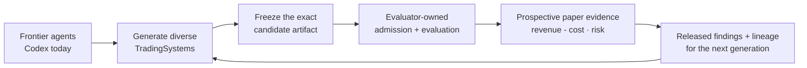

# README Markdown Readability Implementation Plan

> **For agentic workers:** REQUIRED SUB-SKILL: Use superpowers:subagent-driven-development (recommended) or superpowers:executing-plans to implement this plan task-by-task. Steps use checkbox (`- [ ]`) syntax for tracking.

**Goal:** Make the Ouroboros README immediately scannable while preserving its weak-to-strong thesis, frontier-agent leverage model, trading rationale, current capability truth, and repository validation contracts.

**Architecture:** Keep the change Markdown-only. Reorder the page from thesis to research loop to first run, replace dense prose and wide comparisons with short blocks and bullets, and use one Mermaid loop as the only visual architecture. Defer the detailed evidence graph to canonical docs.

**Tech Stack:** GitHub Flavored Markdown, Mermaid, Bash repository guards, Vitest contract tests.

## Global Constraints

- Do not add images, screenshots, logos, custom SVG, HTML layout, a badge wall, or a second diagram.
- The primary audience is an AI-development reader who does not know Ouroboros; trading and crypto readers are secondary.
- State that Ouroboros leverages frontier agents instead of rebuilding the agent or harness layer.
- Codex is the only current non-fixture provider path; Claude Code is future intent, not a current integration.
- Trading is the first proving ground, not the project thesis.
- Current operation is public-data `BTCUSDT` Binance USD-M futures paper trading with fake accounts, execution, and Ledgers.
- Do not claim stock support, private exchange access, signed requests, live orders, profitability, completed generalization, or completed weak-to-strong success.
- Preserve the exact strings `Desktop app is the primary interactive operator surface`, `CLI remains the complete baseline`, and `share the same runtime/store-backed session data`.
- Preserve the exact canonical sequence `Candidate Arena -> Trading System -> System Code -> research preflight -> selected Paper Trading -> Gateway -> Ledger`.
- Preserve the S5 phrases `Runbooks for Docker Sandboxes \`sbx\`/\`sdx\`, S5 audits, recovery helpers`, `developer/detail surfaces`, `Use the relevant npm script \`--help\` output`, and `Linear workflow notes`.
- Keep all changes inside `README.md`, `docs/superpowers/specs/2026-07-26-readme-markdown-readability-design.md`, and this plan.

---

### Task 1: Rewrite The README As A Markdown-First First-Reader Map

**Files:**

- Modify: `README.md`
- Reference: `docs/superpowers/specs/2026-07-26-readme-markdown-readability-design.md`
- Test: `apps/operator-desktop/desktop-shell.test.ts`
- Test: `apps/runtime/test/s5-sbx-validation-script.test.ts`

**Interfaces:**

- Consumes: current repository commands, relative documentation links, exact README compatibility strings, and current product-authority boundaries.
- Produces: one Markdown README whose first-reader flow is thesis → problem/method/domain → research loop → first run → current state → deeper operation and architecture.

- [ ] **Step 1: Prove the existing README contracts pass before editing**

Run:

```bash
npm test -- apps/operator-desktop/desktop-shell.test.ts apps/runtime/test/s5-sbx-validation-script.test.ts
```

Expected: both test files pass. If either fails before the README edit, record the exact baseline failure and do not attribute it to this task.

- [ ] **Step 2: Replace the opening with the approved first-reader hierarchy**

Keep the H1 and CI badge, then use this thesis verbatim:

```markdown
**Ouroboros is a weak-to-strong research system for turning advances in frontier agents into cumulative, externally verified progress—tested first in trading.**
```

Immediately follow it with a compact GitHub `IMPORTANT` callout that says the current boundary is public-data `BTCUSDT` paper trading with fake accounts/execution/Ledgers and no private or live authority.

Create `## Why Ouroboros` with three short bold-led paragraphs:

```markdown
**The problem:** generation is improving faster than trustworthy selection.

**The approach:** use frontier agents as the intelligence layer, then freeze and evaluate their work outside the generating session.

**Why trading:** markets make cost, risk, regime change, and prospective evaluation difficult to hand-wave away.
```

Explain after those leads that Ouroboros does not rebuild foundation models or a generic agent harness; it leverages Codex today and treats Claude Code and future frontier agents as intended intelligence sources. State that the released results, failures, Findings, and lineage inform the next generation without letting a generator grade itself.

- [ ] **Step 3: Add the single approved Mermaid research loop**

Create `## The research loop` and use one left-to-right feedback diagram with these exact conceptual nodes:



Under the diagram, add three bullets that state: researchers do not grade or admit themselves; TradingSystems reach public market data and fake execution only through Gateway; paper evidence never grants private or live authority.

- [ ] **Step 4: Move the executable first run ahead of deeper implementation detail**

Create `## Quickstart` immediately after the research loop. Keep prerequisites concise, then preserve these command blocks:

```bash
npm install
npm run dev:operator-desktop
```

```bash
curl -fsS http://127.0.0.1:4173/health
./bin/ouroboros status
```

```bash
# Terminal 1
./bin/ouroboros runtime serve

# Terminal 2
./bin/ouroboros arena status
```

State that the Desktop app starts or reuses the runtime, `./bin/ouroboros` is the checkout-local CLI, Web is a browser development surface, and provider setup is required before `arena start`.

- [ ] **Step 5: Convert the remaining content to progressive disclosure**

Use these remaining headings in order:

```markdown
## What exists today
### Built
### Still to prove
## System boundaries
## Operate and develop
## Repository map
## Read next
```

For `Built` and `Still to prove`, use separate bullet lists rather than a two-column comparison table. Retain the paper safety boundary, cost/risk evidence, Desktop/CLI/TUI/Web surfaces, provider truth, missing profitability/generalization/live authority, and incomplete production-duration/multi-host evidence.

For `System boundaries`, use a compact two-column table for Research, Arena, Gateway, and Ledger. Preserve the canonical product-vocabulary sequence exactly.

For `Operate and develop`, preserve the Codex setup commands, common Arena/TUI commands, macOS package/open/verify commands, repository validation commands, and exact S5 developer/detail wording.

For `Repository map`, retain the eight current repository paths and their truthful responsibilities in a compact two-column table.

For `Read next`, retain the existing canonical documentation links as a bullet list. Remove the inline navigation row and avoid duplicating descriptive prose already owned by those docs.

- [ ] **Step 6: Run focused and repository documentation verification**

Run:

```bash
bash scripts/check-docs.sh
npm run check:architecture
npm run check:naming
bash scripts/check-env-files.sh --tracked
bash scripts/check-secrets.sh
git diff --check
npm test -- apps/operator-desktop/desktop-shell.test.ts apps/runtime/test/s5-sbx-validation-script.test.ts
```

Expected: every command exits `0`; both targeted test files pass.

- [ ] **Step 7: Perform the manual reader audit**

Check the rendered Markdown and source for all of the following:

- the first screen states the problem, approach, frontier-agent leverage, trading rationale, and paper-only boundary;
- the Mermaid loop is the only diagram and renders with readable labels;
- no section depends on a wide comparison table;
- every relative link resolves and every command matches the repository scripts/CLI;
- all current-versus-future claims match the design document;
- no unrelated file is modified.

- [ ] **Step 8: Commit the README rewrite**

```bash
git add README.md
git commit -m "docs: make README easier to scan"
```
