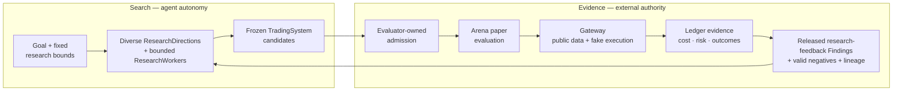

# README Evidence-Governed Iteration Loop Design

Status: approved for implementation on 2026-07-26.

Linear issue: `OURO-241`

Implementation plan:
`docs/superpowers/plans/2026-07-26-readme-evidence-governed-iteration-loop.md`

## Goal

Rebuild the complete root `README.md` narrative around Ouroboros's actual philosophical center:
an evidence-governed agent iteration loop that turns fallible hypotheses into externally tested,
cumulative progress.

Use that center to make the rest of the README feel like one explanation rather than a sequence of
independent reference blocks. A first-time reader should be able to move naturally from philosophy,
to method, to the trading proving ground, to a first run, to the product and system structure, and
finally to contributor detail.

The rewrite must remain equally useful to three audiences:

- an AI developer interested in agentic research, weak-to-strong supervision, or long-running
  improvement loops;
- a trading or crypto reader interested in what competes, what evidence counts, and why the current
  result is paper-only;
- a contributor who needs executable setup, product orientation, repository ownership, validation,
  and canonical reading order.

## Decision

The README will lead with the iteration system, not with the provider strategy.

The durable thesis is:

> The unit of progress is an evidence-governed iteration loop, not one model response, one agent,
> or one winning artifact.

The narrative then establishes three connected claims:

1. **The unit of progress is the loop.** A model response is only a proposal. Research is the
   repeatable sequence from hypothesis to frozen `SystemCode` candidate to external evidence to the
   next attempt.
2. **Autonomy belongs in search; authority belongs in evidence.** Agents need freedom to diagnose,
   de-risk, and adapt their research path. They do not own the goal contract, budget, candidate
   freeze, evaluator, stop condition, durable record, or progression authority.
3. **Trading is the first proving ground, not the philosophy.** It is dynamic and adversarial yet
   prospectively observable. Its noisy, path-dependent outcomes make evaluator quality and evidence
   discipline harder rather than optional.

Frontier-agent leverage remains part of the implementation posture, but it follows those claims.
Ouroboros uses the inner agent loop supplied by Codex today and intends to support later provider
adapters behind the same boundary. The project itself concentrates on the experiment and research
loops around that intelligence.

## Relationship To OURO-239 And OURO-240

This design is a separate follow-up. It does not reopen the completed issues or invalidate their
truth and readability work.

It supersedes these earlier narrative decisions:

- the `Frontier-Agent Leverage Doctrine` in the OURO-239 design is no longer a peer of the core
  thesis;
- the OURO-240 first-screen order of problem, agent leverage, and trading is replaced by a fuller
  philosophy-to-method connection;
- the current Mermaid starts with a provider, while the new diagram starts with the durable goal
  and research bounds;
- Quickstart remains early, but only after the three approved philosophy/method sections.

It preserves these earlier decisions:

- Markdown-first readability and progressive disclosure;
- one meaningful Mermaid diagram and no decorative asset requirement;
- a native Desktop-first Quickstart;
- explicit built-versus-unproven claims;
- exact paper-only, provider, interface, naming, and S5 compatibility wording;
- deeper implementation graphs stay in maintained canonical documents.

## Source Basis

### Repository truth

The current repository provides the governing rules:

- `docs/candidate-arena-evaluation-protocol.md`: AI-agent hill-climbing is useful only when the
  evaluator is harder to exploit than the search is to run;
- `docs/ouroboros-doctrine.md`: generate a population, commit before effects, freeze before judging,
  evaluate externally, preserve Findings and lineage, and repeat;
- `docs/project-direction.md`: improving agents are replaceable research labor inside a stable
  candidate-generation, evaluation, memory, and paper-evidence contract;
- `docs/candidate-arena-research-goal.md`: causal agent leverage, profitability, generalization, and
  production autonomy must be proved rather than inherited from reference systems;
- `docs/research-arena-product-loop.md`: Research and Arena are separate observable product
  responsibilities over one evidence graph;
- `ARCHITECTURE.md`: provider adapters, application services, Gateway, Ledger, LocalStore, and
  operator surfaces remain separate ownership boundaries.

### External design pressure

The README may name and link these primary sources as research lineage:

- [Karpathy Autoresearch](https://github.com/karpathy/autoresearch): fixed environment, mutable
  surface, time budget, metric, experiment record, and keep/discard loop;
- [Anthropic Automated Weak-to-Strong Researcher](https://alignment.anthropic.com/2026/automated-w2s-researcher/):
  independent parallel researchers, broad directions, external evaluation, shared findings, and
  explicit evaluator gaming pressure;
- [Anthropic Loop Engineering](https://claude.com/blog/getting-started-with-loops): durable goals,
  quantitative verification, budgets, fresh review, and explicit stop conditions;
- [NVIDIA NeMo Autoresearch](https://developer.nvidia.com/blog/how-to-run-an-autoresearch-workflow-with-rl-agent-skills-and-nvidia-nemo/)
  and [NVIDIA Auto-FL](https://developer.nvidia.com/blog/accelerating-federated-learning-research-with-ai-agents-and-nvidia-flare-auto-fl/):
  goal-driven campaigns, bounded mutations, baselines, experiment ledgers, stall recovery, and human
  research leadership;
- OpenAI [Follow a goal](https://learn.chatgpt.com/use-cases/follow-goals),
  [scored improvement loops](https://learn.chatgpt.com/use-cases/iterate-on-difficult-problems),
  [Codex agent loop](https://openai.com/index/unrolling-the-codex-agent-loop/), and
  [weak-to-strong generalization](https://openai.com/index/weak-to-strong-generalization/): the inner
  model/tool/observation loop, durable objectives, explicit eval-and-stop contracts, and scalable
  supervision of stronger capability.

These sources are design pressure, not transferred proof. The README must not turn their results
into evidence of Ouroboros profitability, generalization, agent leverage, evaluator security, or
completed weak-to-strong success.

## Opening Copy Contract

The hero thesis will change to:

> Ouroboros is an evidence-governed agent research loop that turns hypotheses into externally
> tested, cumulative progress—using trading as its first proving ground.

The paper-only callout remains immediately visible and retains the exact current boundary:

> The current boundary is public-data `BTCUSDT` Binance USD-M futures paper trading with fake
> accounts, execution, and Ledgers; there is no private or live authority.

The opening then locates weak-to-strong as the research question rather than a completed product
identity: can a bounded system use increasingly capable agents to discover better candidates
without allowing the generator to decide what counts as progress?

`Why Ouroboros` then answers one question: why is another system needed when frontier agents are
already capable?

The answer is that capability alone does not create trustworthy progress. The decisive factor on a
hard problem is the system around the agent: the goal, mutable surface, evaluator, persistent
record, stopping condition, and authority boundary. Ouroboros exists to build that system.

## Philosophy And Method Sections

Three peer-level sections will sit between `Why Ouroboros` and `Quickstart`.

### The unit of progress is the loop

This section explains why the project is agent-based rather than a one-shot generator or fixed
pipeline.

Required reasoning:

- a model response is a proposal, not research evidence;
- hard research is path-dependent because useful next steps depend on observations that do not
  exist before the previous experiment runs;
- an agent can inspect logs and artifacts, diagnose failure, run a cheap de-risking experiment, and
  adapt the next attempt;
- a fixed pipeline can repeat prescribed steps, while an agent can choose which experiment is worth
  running next;
- the compact mental model is `goal -> attempt -> evidence -> next attempt`.

This is the target methodology, not a claim of unconstrained multi-experiment sequencing in the
current implementation. Today's bounded ResearchWorker session supports adaptive tool actions,
edits, checks, submission timing, and explicit selection among completed snapshots.

End with one scannable research-lineage sentence containing the external primary-source links. Keep
the sentence subordinate to the synthesized Ouroboros thesis rather than turning the section into a
literature review.

State what makes the loop cumulative: closed attempts preserve released Findings, valid negative
results, exact duplicates, and lineage so later generations do not begin from the same ignorance or
repeat the same dead end. Provider, evaluator, infrastructure, and setup failures remain
platform-attributed failures rather than being relabeled as research knowledge.

### Autonomy in search. Authority in evidence.

Lead with the canonical evaluator rule:

> AI-agent hill-climbing is useful only when the evaluator is harder to exploit than the search is
> to run.

Explain the strong-boundary/free-search design:

- within a precommitted ResearchDirection, hypothesis, and method, ResearchWorkers may choose next
  tool actions, cheap checks, edits, submission timing, and which completed snapshot to select
  inside one bounded session;
- the surrounding system owns the problem contract, resource budget, allowed mutation surface,
  candidate identity, evaluation policy, stop conditions, and durable history;
- the generating agent cannot grade, admit, qualify, promote, erase history, or grant itself
  trading authority;
- weak-to-strong is presented as an engineering question about scalable supervision, not as a
  completed result;
- better agents expand the search frontier but never become the judge.

Use one narrow three-row table to distinguish the layers:

| Layer | Repeating cycle | Responsibility |
| --- | --- | --- |
| Inner agent loop | model <-> tools <-> observations | Codex today; later agents only when supported |
| Experiment loop | hypothesis -> artifact -> run -> measure -> diagnose | bounded and recorded by Ouroboros |
| Research loop | diverse directions -> external evidence -> Findings/lineage -> next generation | core Ouroboros product |

Follow the table with one short provider paragraph. It must say that Ouroboros does not rebuild the
inner agent loop and that frontier labs are expected to improve it. It must not imply that Claude
Code is implemented today.

The single Mermaid diagram belongs at the end of this section. It must connect the philosophical
split to the real architecture by separating search autonomy from evidence authority:



Adjacent copy must retain three authority rules:

- ResearchWorkers do not grade or admit themselves;
- TradingSystems reach public market data and fake execution only through Gateway;
- only evidence precommitted for `research_feedback` feeds a later generation; prospective
  qualification evidence cannot double as research feedback and remains unavailable to an open
  ResearchWorker;
- paper evidence never grants private or live authority.

### Why trading is the first proving ground

Open with the exact conceptual relationship:

> Trading is the first domain, not the philosophy.

Explain why it is useful:

- it is difficult, dynamic, competitive, and non-stationary;
- future outcomes, costs, risk, regime shifts, funding, slippage, and execution expose claims that a
  persuasive narrative can hide;
- raw PnL is still noisy, path-dependent, opportunity-dependent, and easy to overfit;
- trustworthy iteration therefore requires precommitted evidence purpose, frozen identity,
  comparable conditions, and prospective paper evidence;
- trading is chosen not because profit is easy, but because trustworthy evaluation is hard.

Close by restating the exact current `BTCUSDT` Binance USD-M futures public-data paper boundary.

## Full Information Architecture

The README will use this order:

| Order | Section | Reader question |
| --- | --- | --- |
| 1 | Hero and safety callout | What is this, and what authority does it have today? |
| 2 | Why Ouroboros | What problem exists beyond stronger model output? |
| 3 | The unit of progress is the loop | Why use an adaptive agent iteration loop? |
| 4 | Autonomy in search. Authority in evidence. | How can that loop improve without grading itself? |
| 5 | Why trading is the first proving ground | Why is trading here if the philosophy is broader? |
| 6 | Quickstart | How do I run the current product now? |
| 7 | Product loops and operator views | What are the two product loops, and what will I see in the five operator views? |
| 8 | What exists today | What is built, and what is still a research claim? |
| 9 | How the system is structured | Where do authority and repository ownership live? |
| 10 | Operate and develop | How do I configure research, use commands, and validate changes? |
| 11 | Read next | Which canonical document answers my next question? |

No standalone table of contents is needed. The heading sequence is the navigation.

## Quickstart Design

Keep Quickstart immediately after the philosophy/method/domain sequence. Make it an executable
two-step path so a reader can either inspect the product quickly or continue into the actual agent
research loop without mistaking one for the other.

### Open and inspect

Use compact first-run prerequisites:

- Node.js 24 and npm for the repository;
- Rust and Cargo for native Tauri Desktop development;
- Linux `glib-2.0`, `gtk+-3.0`, and `webkit2gtk-4.1` pkg-config modules for Desktop development;
- macOS only for the packaged/open/verify Desktop release path.

Preserve the current launch and inspection commands:

```bash
npm install
npm run dev:operator-desktop
```

```bash
curl -fsS http://127.0.0.1:4173/health
./bin/ouroboros status
```

```bash
# Terminal 1
./bin/ouroboros runtime serve

# Terminal 2
./bin/ouroboros arena status
```

Immediately after the launch commands, state what this step does and does not do: Desktop opens the
operator and starts or reuses the local runtime. On a clean first run it does not issue a new
`arena start`; an existing persisted running state may resume. `./bin/ouroboros` is checkout-local,
and Web is a browser development surface.

### Run agent research

State that Docker Sandboxes `sbx` version 0.35.0 or later, a host-local Codex CLI available on
`PATH`, and an account able to complete device login are required. These are not installed by
`npm install`. The runtime must already be running. Preserve the provider and Arena commands:

```bash
./bin/ouroboros agent setup codex
./bin/ouroboros agent login codex
./bin/ouroboros agent probe codex
./bin/ouroboros researcher provider set codex
./bin/ouroboros arena start
./bin/ouroboros arena status
```

Explain that Codex is the only current non-fixture provider path and that `arena start` begins the
bounded generated-candidate research and paper loop; it does not grant private or live authority.

## Product Explanation Design

Add `Product loops and operator views` after Quickstart. It should first explain the product in
reader language before the canonical taxonomy or repository paths, then distinguish the product
from its operator navigation.

Open with the two cooperating product loops:

- **Research** is the candidate-generation side: it bounds agent sessions, freezes and selects
  submissions, owns external admission, and retains released memory;
- **Arena** queues and runs already-admitted TradingSystems in isolated paper sessions and compares
  their paper evidence.

Do not present current Research operational detail as already complete. State explicitly that
Research and Arena are separate views while persisted operational detail is currently an Arena
surface.

Then introduce the five operator views as views over those loops, not five peer product loops:

- **Research** presents the candidate-generation side within its current visibility boundary;
- **Arena** presents admitted systems, isolated paper sessions, and comparable results;
- **Trading** follows the selected system's paper handoff, evaluation, and review state;
- **Evidence** exposes evaluations, Gateway and Ledger-chain status, lineage, authority, and command
  provenance;
- **System** shows and controls runtime, provider, Gateway, and operational state.

Explain that the native Desktop is the primary interactive surface, while CLI is the headless
baseline and TUI/Web share the same runtime/store-backed state and command/read contract. Preserve
the exact test-required strings in natural prose.

Finish with the canonical vocabulary sequence:

`Candidate Arena -> Trading System -> System Code -> research preflight -> selected Paper Trading -> Gateway -> Ledger`

Do not imply that the current Research view already provides the persisted session/detail/log
projection described as a later delivery slice in the canonical product design.

## Built And Unproven Design

Retain `What exists today` with visible `Built` and `Still to prove` subsections.

The built list should proceed from research loop to evidence boundary to product surface:

1. Codex-first bounded ResearchWorker sessions with bounded tools, workspaces, and explicit
   selection/submission;
2. immutable candidate identity plus external admission and paper-handoff conformance;
3. isolated public-data `BTCUSDT` USD-M futures paper operation through Gateway with fake accounts,
   execution, and Ledgers;
4. recorded fees, funding, slippage, risk, provenance, and append-only paper evidence;
5. shared Desktop, CLI, TUI, and browser-development surfaces;
6. paper-only authority boundaries.

The open list must retain:

- causal economic improvement from adaptive agent research under fair controls;
- long-horizon real-market generalization and profitability;
- production-duration autonomy, complete soak evidence, and multi-host operation;
- private exchange access, signed/live authority, and completed weak-to-strong success.

Replay and backtest remain research feedback, not final evidence authority.

## System And Repository Structure Design

`How the system is structured` combines two related maps without conflating them.

First, a compact four-row authority table:

| Boundary | Responsibility |
| --- | --- |
| Research | bounds agent sessions, freezes and selects submissions, owns external admission, and retains released memory |
| Arena | queues and runs admitted systems in isolated paper evaluation |
| Gateway | owns public market data, validation, and fake execution |
| Ledger | records append-only paper decisions, costs, risk, and outcomes |

Second, replace the apparent linear dependency chain with an ownership-grouped repository map:

| Group | Paths | Ownership |
| --- | --- | --- |
| Core contracts | `packages/domain`, `packages/application` | domain records, use cases, ports, controllers, and read models |
| Persistence | `packages/local-store` | filesystem-backed durable state |
| External integrations | `packages/adapters` | Codex, Binance public data, fixtures, and Sandbox adapters |
| Composition | `apps/runtime` | local runtime and shared operator API |
| Interfaces | `apps/operator-desktop`, `apps/operator-web`, `apps/cli`, `apps/operator-tui` | native, browser-development, headless, and terminal surfaces |
| Project workflow | `docs`, `.agents`, `scripts` | canonical design, agent policy, validation, and operational helpers |

Keep descriptions short and explain ownership, not a fast-changing inventory of files. Do not call
the group order a dependency direction: adapters implement application ports and runtime composes
the system.

## Operate, Develop, And Read Next

`Operate and develop` retains common operator commands, packaged macOS commands, contributor
prerequisites, documentation guards, and the S5 compatibility paragraph. Provider setup now lives
in the executable Quickstart instead of being duplicated here. Use small subheadings so readers can
skip to the relevant task:

- `Common commands`;
- `Develop and validate`.

Place Python 3.12 for CI-equivalent validation and `gitleaks` for contributor secret scanning under
`Develop and validate`, not in the first-run prerequisites.

Preserve these exact compatibility strings:

- `Desktop app is the primary interactive operator surface`
- `CLI remains the complete baseline`
- `share the same runtime/store-backed session data`
- Runbooks for Docker Sandboxes `sbx`/`sdx`, S5 audits, recovery helpers
- `developer/detail surfaces`
- Use the relevant npm script `--help` output
- `Linear workflow notes`

`Read next` will annotate each link with the question it answers instead of presenting a bare list.
The order is:

1. Project Direction and Ouroboros Doctrine for thesis and rules;
2. Research and Arena Product Loop for product flow;
3. CandidateArena And Research Goal for the research target and open claims;
4. CandidateArena Evaluation Protocol for the separation between research feedback and prospective
   qualification evidence;
5. Autonomy Model for authority progression;
6. Architecture for technical boundaries;
7. API And Command Contract for executable interfaces;
8. Development Workflow for repository delivery.

Keep the truthful final note that contribution guidance and licensing terms are not yet published.

## Readability And Visual Contract

- Each section answers the reader question named in the information-architecture table.
- Each section starts with its conclusion.
- Keep paragraphs short and use bullets only for parallel facts.
- Use tables only for the three exact mappings where columns materially help: loop layers,
  authority boundaries, and repository paths.
- Keep exactly one Mermaid diagram.
- Do not add a logo wall, generated illustration, custom SVG, benchmark graphic, or unverified
  product screenshot.
- Do not hide thesis, safety, current status, or unproven claims in `<details>`.
- Verify the real GitHub-rendered README, including Mermaid, before opening the final PR.
- Do not optimize for a line-count target. Remove duplication while preserving the full reasoning.

## Truth And Authority Contract

The README must not claim or imply:

- stock, spot, multi-asset, or broad Binance support;
- Claude Code provider parity or any unsupported frontier-agent adapter;
- private account reads, credential use, signed requests, listen-key streams, leverage changes, or
  live orders;
- profitability, durable generalization, a causal agent-leverage effect, production-duration
  autonomous operation, or completed weak-to-strong success;
- that replay/backtest results are final economic evidence;
- that paper evidence automatically changes policy, promotes a TradingSystem, or grants later
  authority;
- that an external reference proves Ouroboros works in trading.

The current market boundary is public-data `BTCUSDT` Binance USD-M futures paper operation. Gateway
owns market data, validation, and fake execution. TradingSystems never attach directly to Binance.

## Scope And Non-Goals

Owned files:

- `README.md`;
- this design specification;
- one implementation plan under `docs/superpowers/plans/` after specification approval.

Another canonical repo document may change only if an exact contradiction or broken link prevents
a truthful README. Product code, tests, runtime behavior, API contracts, schema, taxonomy, UI,
icons, branding assets, and authority remain out of scope.

## Alternatives Considered

### Provider-leverage first

Rejected. It promotes a replaceable runtime/orchestration strategy above the stable research thesis
and makes Ouroboros sound dependent on one model-provider narrative.

### Quickstart before philosophy

Rejected for this README. The primary audience must understand the project's unusual AI-research
method before the product appears to be another trading application. Quickstart still follows
immediately after the three philosophy/method/domain sections.

### One compressed mindset paragraph

Rejected. The relationship among adaptive agent search, external evaluation, weak-to-strong, memory,
and trading cannot be made clear without becoming another paragraph wall. Three sections make each
claim independently scannable.

### Multiple conceptual diagrams

Rejected. The three-loop distinction is clearer as a small exact table, while one Mermaid diagram
is sufficient for the concrete Ouroboros feedback loop.

## Acceptance Criteria

The specification is satisfied when:

- the hero and `Why Ouroboros` center the evidence-governed iteration system rather than provider
  leverage;
- the three approved philosophy/method/domain sections appear between `Why` and `Quickstart`;
- an AI developer can explain why adaptive agents are used, what weak-to-strong means here, and why
  evaluation is the bottleneck;
- a trading reader can explain why trading is the first proving ground and why current paper evidence
  is neither profitability nor live authority;
- a first-run contributor can launch Desktop, verify the runtime, use the headless path, understand
  the two product loops and five operator views, find provider setup, locate code ownership,
  validate changes, and choose the next canonical document;
- the three loop layers and their ownership are unambiguous;
- built and unproven claims remain visibly separate;
- commands, links, prerequisites, product-surface descriptions, exact contract strings, and current
  provider/market boundaries are verified against the current branch;
- exactly one Mermaid diagram renders correctly on GitHub;
- independent truth, first-reader, Markdown/render, and scope reviews report no unresolved important
  finding;
- required local validation, current-head CI, current-head review, squash merge, and Linear Workpad
  writeback complete.

## Validation And Delivery

Required local checks:

```bash
bash scripts/check-docs.sh
npm run check:architecture
npm run check:naming
bash scripts/check-env-files.sh --tracked
bash scripts/check-secrets.sh
git diff --check
npm test -- apps/operator-desktop/desktop-shell.test.ts apps/runtime/test/s5-sbx-validation-script.test.ts
```

Manually verify every README command, every relative link, first-screen comprehension, narrow-width
scanability, external-source claim discipline, and the real GitHub Mermaid render.

Delivery uses branch `codex/OURO-241-readme-evidence-loop`, a PR body containing exactly
`OURO-241`, current-head CI and review evidence, squash merge, remote branch deletion, and a final
update to the existing Linear `## Codex Workpad` comment.
