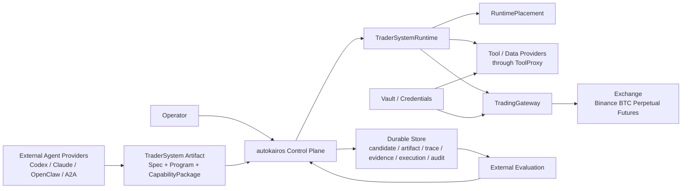
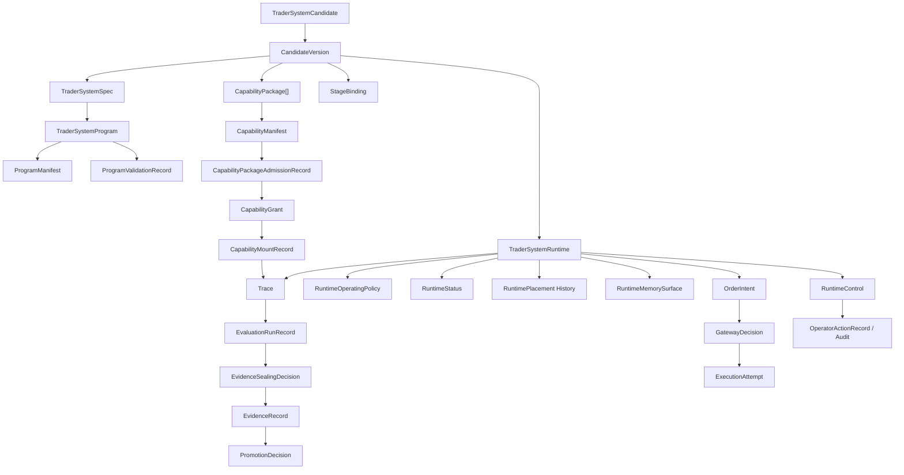
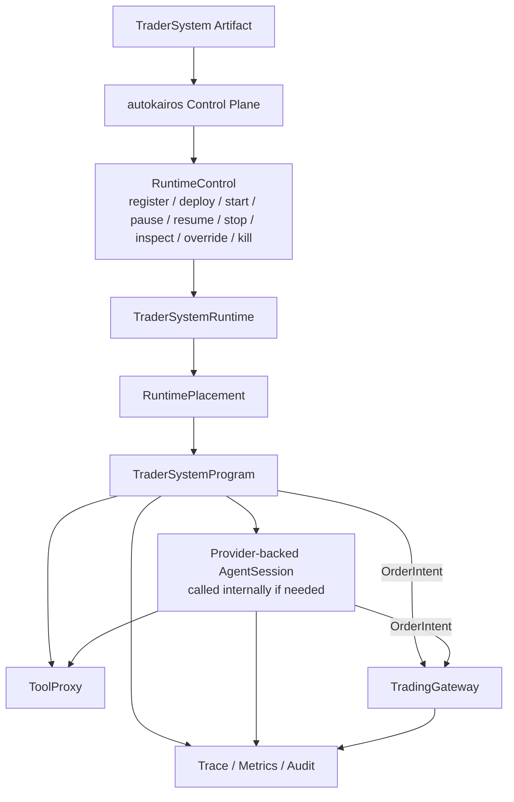

# System Map

This page is the diagram-first technical map for the current MLP-01 architecture.

It is not a product thesis, requirements document, implementation backlog, or project-management
read path.

Its first job is to explain how autokairos itself operates as a trader-system control plane.
Delivery sequencing is secondary and must not be mistaken for the system design.

## One-Line Architecture

```text
autokairos is a control plane for registering, deploying, observing, evaluating, promoting, and
controlling agent-built trader-system runtimes without becoming the trader-system brain or handing
provider sessions unrestricted trading authority.
```

## System Boundary

Primary question:

> what does autokairos own, and what does it borrow?



Boundary rule:

```text
External agents build or update trader-system artifacts.
autokairos operates those artifacts through lifecycle, placement, trace, evaluation, gateway, and audit boundaries.
```

## Current Locked Boundaries

| Boundary | Locked meaning |
| --- | --- |
| autokairos != trader-system author | autokairos operates agent-built systems; it does not own internal trading logic |
| `RuntimeControl != internal strategy loop` | lifecycle/governance commands are not step orchestration |
| `TraderSystemRuntime != RuntimePlacement` | runtime is durable logical identity; placement is replaceable process/container/provider/endpoint execution |
| `Provider output != EvidenceRecord` | provider output enters as `AgentEvent -> Trace`; counted evidence requires evaluation sealing |
| `RuntimeMemorySurface != EvidenceRecord` | memory is scoped context, not objective proof, promotion truth, or provider-private state |
| `TraderSystemSpec != Docker image` | spec is the versioned trader-system definition, not physical packaging |
| `TraderSystemProgram != human DSL` | program is agent-authored executable behavior, not a human-predefined strategy language |
| `ProgramValidationRecord != PromotionDecision` | validation permits mount/execute consideration; it does not prove performance |
| `CapabilityManifest != CapabilityGrant` | package manifests request access; stage/tool/vault/gateway surfaces grant or deny it |
| `CapabilityPackage != secrets` | packages must not carry credentials, evaluator labels, live approval, or gateway signing material |
| `Trace != EvidenceRecord` | trace is recoverable runtime history; evidence exists only after sealing |
| `OrderIntent != GatewayDecision` | runtime may propose intent; gateway owns accept, reject, clip, and execution linkage |
| `A2A != MCP != ACP` | A2A is remote agent communication; MCP is tool/resource access; ACP/OpenClaw is harness bridge |

## Canonical Diagram Index

| View | Primary question | Canonical page |
| --- | --- | --- |
| System boundary | What is inside autokairos and what is external? | this page |
| Durable object model | What is official product/control-plane truth? | this page |
| Logical versus physical execution | What is `TraderSystemRuntime` versus `RuntimePlacement`? | [08-runtime-authority-model.md](08-runtime-authority-model.md) |
| Runtime operating model | How does autokairos deploy and operate an agent-built trader system? | [09-trader-system-runtime-operating-model.md](09-trader-system-runtime-operating-model.md) |
| Provider execution | How do Codex, Claude, OpenClaw, A2A, or local process calls enter trace? | [specs/07-runtime-connector-contract.md](specs/07-runtime-connector-contract.md) |
| Runtime operating policy | What lifecycle, placement, trace, stop, recovery, and audit policy bounds a runtime? | [specs/15-runtime-operating-policy-contract.md](specs/15-runtime-operating-policy-contract.md) |
| Stage progression | How does the same artifact move through backtest, paper, and live bindings? | [08-runtime-authority-model.md](08-runtime-authority-model.md) |
| Live authority | Who can submit or reject real orders? | [specs/16-order-intent-and-gateway-decision-contract.md](specs/16-order-intent-and-gateway-decision-contract.md) |
| Recovery | How does the same logical runtime survive physical execution failure? | [09-trader-system-runtime-operating-model.md](09-trader-system-runtime-operating-model.md) |
| Bootstrap substrate | What minimal code substrate exists before feature implementation? | [05-bootstrap-tech-spec.md](05-bootstrap-tech-spec.md) |

## Core Object Model

Primary question:

> which records are durable product/control-plane truth?



The core boundary is:

- candidate and artifact truth belongs to the control plane
- trader-system logic belongs to the agent-built program
- provider/runtime sessions produce bounded events and trace
- runtime memory is versioned scoped context, not evidence
- evaluation truth is externalized into evidence records
- live authority passes through gateway decisions
- lifecycle/control/audit truth is durable and operator-visible

## Runtime Control View

Primary question:

> how does autokairos operate a trader system without becoming its internal brain?



`RuntimeControl` is lifecycle/governance. It is not a strategy workflow or event-handler map.

## Production Design Read Path

```text
00-system-map
-> 08-runtime-authority-model
-> 09-trader-system-runtime-operating-model
-> 07-production-design-method
-> Bootstrap / focused implementation design note
-> active specs required by that concern
```

[07-production-design-method.md](07-production-design-method.md) defines the common bar for
lifecycle, durable truth, validation, idempotency, recovery, credentials, observability, audit, and
operator inspectability.

## Concern-Specific Spec Read Paths

| Concern | Required active docs |
| --- | --- |
| Bootstrap | [09-trader-system-runtime-operating-model.md](09-trader-system-runtime-operating-model.md), [05-bootstrap-tech-spec.md](05-bootstrap-tech-spec.md), [specs/02-core-primitives.md](specs/02-core-primitives.md), [specs/19-trader-system-artifact-contract.md](specs/19-trader-system-artifact-contract.md), [specs/18-capability-package-trust-and-permission-contract.md](specs/18-capability-package-trust-and-permission-contract.md), [specs/17-evaluation-comparability-and-sealing-contract.md](specs/17-evaluation-comparability-and-sealing-contract.md), [specs/09-trace-contract.md](specs/09-trace-contract.md), [specs/08-candidate-contract.md](specs/08-candidate-contract.md), [specs/04-boundaries.md](specs/04-boundaries.md) |
| Candidate materialization | [09-trader-system-runtime-operating-model.md](09-trader-system-runtime-operating-model.md), [06-runtime-provider-adapter-feasibility.md](06-runtime-provider-adapter-feasibility.md), [specs/19-trader-system-artifact-contract.md](specs/19-trader-system-artifact-contract.md), [specs/07-runtime-connector-contract.md](specs/07-runtime-connector-contract.md), [specs/15-runtime-operating-policy-contract.md](specs/15-runtime-operating-policy-contract.md), [specs/09-trace-contract.md](specs/09-trace-contract.md), [specs/08-candidate-contract.md](specs/08-candidate-contract.md) |
| External evaluation | [specs/03-staged-evaluation.md](specs/03-staged-evaluation.md), [specs/09-trace-contract.md](specs/09-trace-contract.md), [specs/17-evaluation-comparability-and-sealing-contract.md](specs/17-evaluation-comparability-and-sealing-contract.md), [specs/10-evidence-record-contract.md](specs/10-evidence-record-contract.md), [specs/11-promotion-decision-contract.md](specs/11-promotion-decision-contract.md), [specs/14-review-item-contract.md](specs/14-review-item-contract.md) |
| Bounded live runtime | [09-trader-system-runtime-operating-model.md](09-trader-system-runtime-operating-model.md), [specs/07-runtime-connector-contract.md](specs/07-runtime-connector-contract.md), [specs/15-runtime-operating-policy-contract.md](specs/15-runtime-operating-policy-contract.md), [specs/09-trace-contract.md](specs/09-trace-contract.md), [specs/12-governed-execution-request-contract.md](specs/12-governed-execution-request-contract.md), [specs/16-order-intent-and-gateway-decision-contract.md](specs/16-order-intent-and-gateway-decision-contract.md), [specs/13-execution-attempt-contract.md](specs/13-execution-attempt-contract.md), [specs/24-always-on-trading-substrate-contract.md](specs/24-always-on-trading-substrate-contract.md), [specs/26-substrate-state-surface-contract.md](specs/26-substrate-state-surface-contract.md), [specs/27-order-fill-surface-contract.md](specs/27-order-fill-surface-contract.md) |
| Operator intervention | [09-trader-system-runtime-operating-model.md](09-trader-system-runtime-operating-model.md), [specs/15-runtime-operating-policy-contract.md](specs/15-runtime-operating-policy-contract.md), [specs/13-execution-attempt-contract.md](specs/13-execution-attempt-contract.md), [specs/04-boundaries.md](specs/04-boundaries.md) |

## Historical Material

Older proactive-activation, standing-order, and attention-routing documents remain under
[historical/](historical/) as background. They are not active runtime truth.
