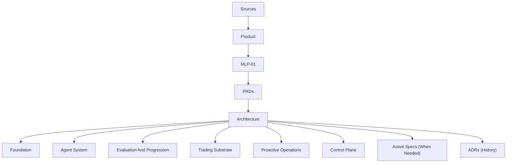

# System Map

This page is the compressed technical reading map for autokairos after `mlp-01` lock.

It is downstream of:

- [../sources/README.md](../sources/README.md)
- [../product/README.md](../product/README.md)
- [../product/mlp-01/prds/README.md](../product/mlp-01/prds/README.md)

## Purpose

Show the smallest technical picture needed to implement the current MLP-01 contracts safely.

This page does not redefine product truth.

## Top-Level Flow

## Current Technical Split

### Foundation

Owns naming, doctrine, invariants, and architecture restraint rules.

### Agent System

Owns agent-originated path creation and candidate-linked execution behavior.

### Evaluation And Progression

Owns counted evidence, non-counted evidence, stage semantics, and live-gate meaning.

### Trading Substrate

Owns Binance BTC perpetual futures operational surfaces, liveness, and the first adapter seam.

### Proactive Operations

Owns meaningful wake generation, urgency semantics, and wake authority above the runtime.

### Control Plane

Owns durable truth for candidate, evidence, promotion, execution, wake, operator action, and audit.

## PRD Support Matrix

| PRD | Trust question | Main supporting subsystems |
| --- | --- | --- |
| PRD 1 | `Is this path real?` | `agent-system + control-plane + foundation` |
| PRD 2 | `Why should I trust this path?` | `evaluation-and-progression + control-plane + foundation` |
| PRD 3 | `Can I actually let it trade?` | `trading-substrate + agent-system + control-plane` |
| PRD 4 | `Can I stay in control after I let it trade?` | `proactive-operations + control-plane + agent-system` |

## Ownership Matrix

| Responsibility | Primary owner | Notes |
| --- | --- | --- |
| Candidate durability and provenance | `control-plane` | The agent system originates paths but does not own durable truth |
| Counted and non-counted evidence meaning | `evaluation-and-progression` | Durable records still live in the control plane |
| Promotion and live-gate meaning | `evaluation-and-progression` | The control plane keeps the committed gate record |
| Real live execution | `agent-system + trading-substrate` | The substrate keeps venue facts live; the agent system performs candidate-linked routine behavior |
| Wake reason and urgency semantics | `proactive-operations` | Durable wake truth and audit remain in the control plane |
| Audit and operator action history | `control-plane` | Product-visible trust history must outlive runtime state |

## Active Technical Invariants

- durable truth remains outside runtime state
- candidate, evidence, promotion, execution, and wake do not collapse into one object
- live execution does not erase stage semantics
- wake authority stays above runtime execution
- live limits stay explicit and enforceable
- first-venue depth is protected while adapter seams remain visible

## Active Read Path

1. [README.md](README.md)
2. the PRD you are implementing
3. [../product/mlp-01/07-implementation-plan.md](../product/mlp-01/07-implementation-plan.md)
4. [01-pr1-path-becomes-real-design.md](01-pr1-path-becomes-real-design.md) when implementing
   PRD 1 / Slice 1
5. the subsystem README listed for that PRD
6. [specs/README.md](specs/README.md) only if a current implementation question still needs a
   narrower contract
7. [adrs/README.md](adrs/README.md) only for baseline decision history

## Not In The Default Baseline

The following families remain in the repo but are not part of the current default architecture
baseline:

- proactive-standing and rebuild families
- read-admission, coalescing, and duplicate-suppression families
- runtime-hosting, containerization, and observability deep dives
- other speculative detail that is not required to implement PRD 1 through PRD 4 safely

## Restraint Rule

If a technical page is not helping implement one of the current PRDs safely, it should not sit on
the default read path.
