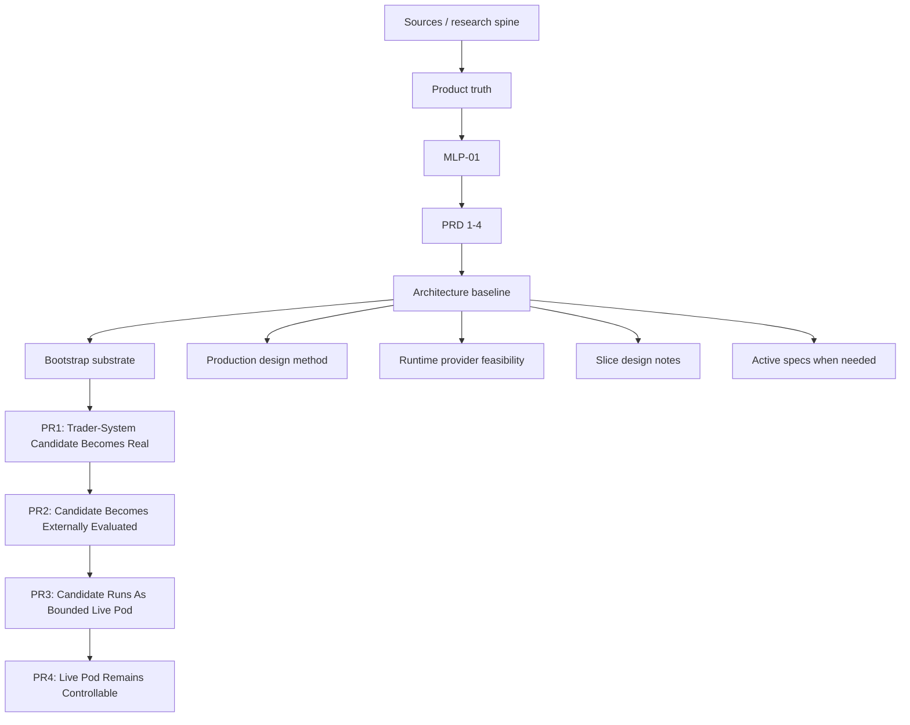
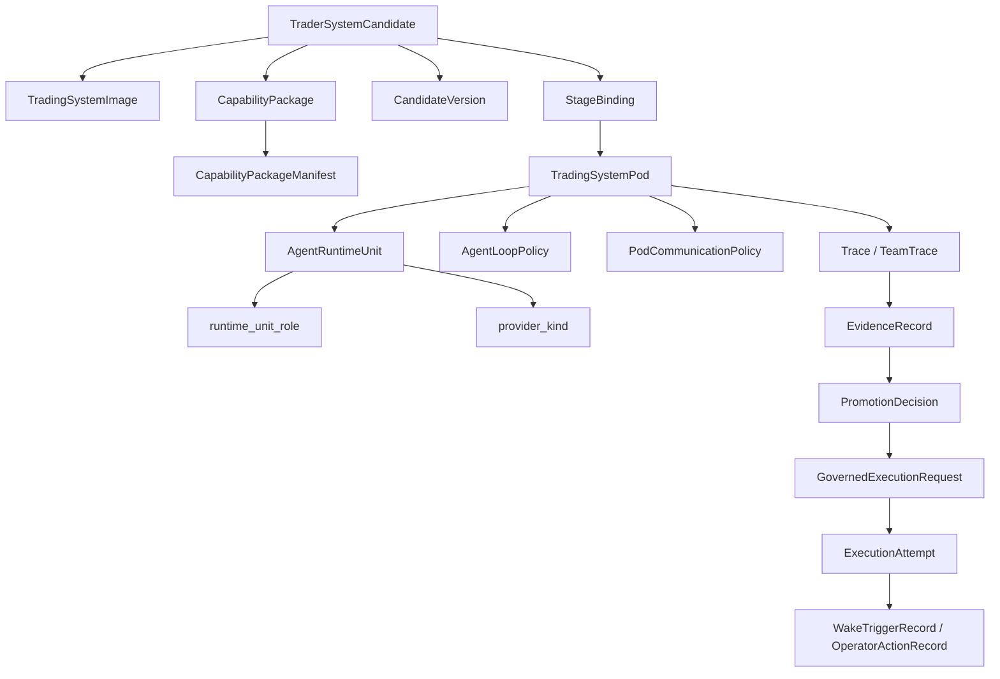
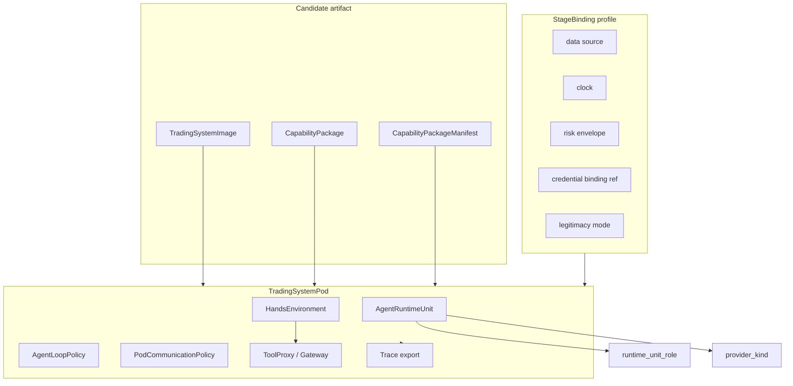
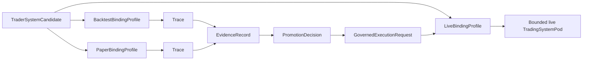
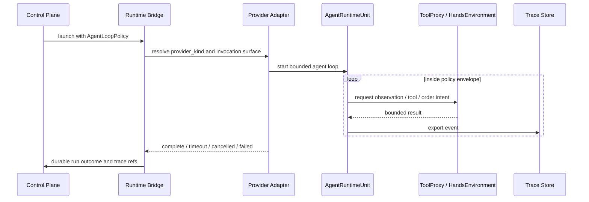
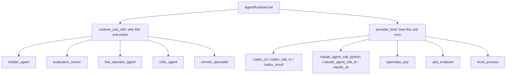
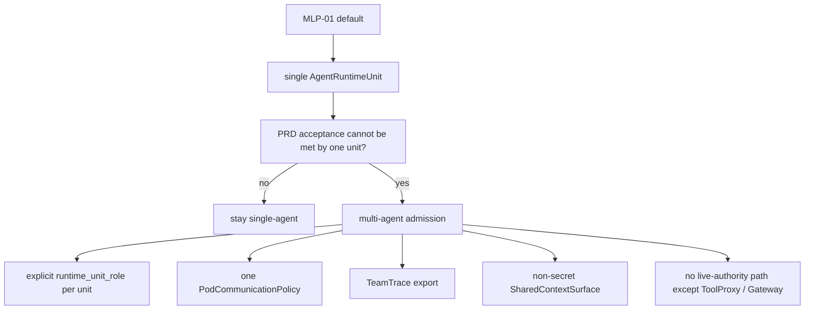
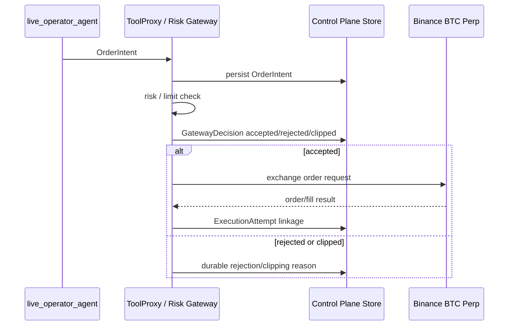
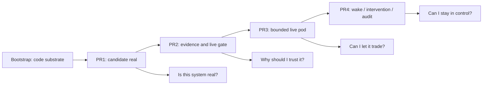

# System Map

This page is the diagram-first technical map for the current MLP-01 architecture.

It is not a product thesis, PRD, or implementation backlog. It shows how the locked product
contracts flow into the active architecture, which boundaries must not collapse, and which specs to
read for each implementation slice.

## Purpose

Use this page to answer:

- how product truth flows into implementation
- what a `TraderSystemCandidate` becomes over time
- what a `TradingSystemPod` is made of
- how an agent loop stays autonomous without becoming unbounded
- where provider execution, evaluation, live execution, and wake/control boundaries sit
- which specs are mandatory for Bootstrap, PR1, PR2, PR3, and PR4

## One-Line Architecture

```text
autokairos is a control plane for creating, evaluating, promoting, running, and controlling
agent-built trader-system pods without letting runtime self-report, provider sessions, or live
agent output become durable truth or unrestricted trading authority.
```

## End-To-End Product / Architecture Flow



The important ordering rule is:

```text
MLP -> PRD -> Architecture -> Slice Design -> PR
```

PRs are cut by trust-proof milestone, not by subsystem taxonomy.

## Production Design Read Path

Production-level design starts from the map, then applies the shared method to the current slice:

```text
00-system-map
-> 07-production-design-method
-> Bootstrap / PR slice design note
-> active specs required by that slice
```

[07-production-design-method.md](07-production-design-method.md) defines the common bar for
lifecycle, durable truth, validation, idempotency, recovery, credentials, observability, audit, and
operator inspectability.

## Core Object Model



The core boundary is:

- candidate truth belongs to the control plane
- provider/runtime sessions produce bounded artifacts and trace
- evaluation truth is externalized into evidence records
- live authority passes through gateway decisions
- wake/control/audit truth is durable and operator-visible

## TradingSystemPod Anatomy



A pod is not just a container. It is the stage-bound execution instance of a candidate artifact.

For MLP-01:

- the same candidate artifact can run under backtest, paper, or live binding
- `CapabilityPackage` injects context/tool/data access declarations, not secrets
- `AgentRuntimeUnit` chooses a concrete provider driver per participant
- `AgentLoopPolicy` bounds autonomous execution without directing every reasoning step
- `ToolProxy` and gateway own side-effect and live-execution authority

## Stage Progression Flow



Backtest, paper, and live are not different product objects.

They are different `StageBinding` profiles for the same candidate artifact:

- `BacktestBindingProfile`: historical/replay data, deterministic clock, simulator, evaluator, no
  live credentials
- `PaperBindingProfile`: live-like data, simulated order gateway, paper risk envelope, no real
  exchange execution
- `LiveBindingProfile`: live data, real gateway ref, risk envelope, credential binding ref, wake
  policy ref

Live binding cannot be constructed from prompt text alone. It must be downstream of a
`PromotionDecision` and a `GovernedExecutionRequest`.

## Agent Runtime Loop



`AgentLoopPolicy` defines the envelope:

- trigger source
- loop mode
- cadence
- max turns or heartbeat expectation
- timeout and cancellation
- retry and resume posture
- trace export requirement
- tool access posture
- stop conditions

It does not define the agent's internal reasoning steps.

Current modes:

- `one_shot_builder` for PR1
- `bounded_batch_evaluation` for PR2
- `continuous_live` for PR3 and PR4

## Provider / Runtime Unit Role Split



Rules:

- `runtime_unit_role` answers why the unit exists
- `provider_kind` answers how it is invoked
- PR1 default is `runtime_unit_role=builder_agent`, `provider_kind=codex_cli`, `model=gpt-5.4`
- PR3 requires `runtime_unit_role=live_operator_agent`
- a PR1 builder adapter cannot silently become a PR3 live trading loop
- provider labels such as Codex or Claude are not executable until they resolve through the runtime
  provider feasibility contract

## Multi-Agent Admission



Multi-agent support is a future-compatible seam, not the MLP default.

## Live Authority Boundary



Rules:

- live agent authority stops at `OrderIntent`
- every real exchange order must be downstream of `GatewayDecision`
- rejected and clipped decisions are durable, inspectable outcomes
- exchange credentials never enter agent context
- A2A messages, provider reports, and subagent outputs cannot bypass the gateway

## PR Slice Flow



| Slice | Trust question | Must prove |
| --- | --- | --- |
| Bootstrap | Can the repo carry the model? | app/runtime/store/domain substrate exists without legacy restore |
| PR1 | Is this system real? | one `TraderSystemCandidate` is durable and inspectable |
| PR2 | Why should I trust it? | trace becomes external evidence and promotion gate meaning |
| PR3 | Can I let it trade? | promoted candidate runs live through bounded gateway authority |
| PR4 | Can I stay in control? | wake, inspect, pause, stop, override, and audit remain decisive |

## Production Concern Matrix

| Work slice | Production concerns that must be closed before implementation |
| --- | --- |
| Bootstrap | record versioning, atomic file writes, validation boundary, fixture reset, runtime restart, no evidence/live/wake meaning |
| PR1 | provider probe, `codex_cli + gpt-5.4` run attempt, schema validation, semantic validation, materialization rejection, trace retention, duplicate candidate prevention |
| PR2 | evaluator ownership, counted/non-counted evidence, legitimate vs convenience mode, partial/ambiguous evaluation, rerun behavior, promotion eligibility |
| PR3 | `continuous_live` loop lifecycle, heartbeat, stop conditions, gateway failure, rejected/clipped decision durability, venue submission failure, fill reconciliation, credential/risk/kill-switch boundaries |
| PR4 | wake severity, operator inspect context, pause/stop/override semantics, audit record, post-intervention resume/reject behavior, candidate versioning for self-evolution |

## Subsystem Ownership

| Subsystem | Owns | Must not own |
| --- | --- | --- |
| foundation | naming, doctrine, invariants, primitive restraint | product truth or PRD meaning |
| agent-system | brain sessions, harness adapters, pod runtime behavior, loop application | durable candidate/evidence/promotion truth |
| evaluation-and-progression | counted evidence, status meaning, promotion and live-gate meaning | runtime self-report as truth |
| trading-substrate | Binance BTC perpetual futures market/order/fill/risk surfaces | agent-side unrestricted exchange authority |
| proactive-operations | wake semantics, urgency, interruption posture | hidden workflow control or evidence truth |
| control-plane | durable candidate, image, package, evidence, promotion, execution, wake, audit truth | agent reasoning or provider-owned truth |

## Active Invariants

- candidate means `TraderSystemCandidate`
- pod means stage-bound execution instance
- image and pod are distinct
- capability packages never contain secrets
- package access is declared by `CapabilityPackageManifest` and granted by `StageBinding` /
  `ToolProxy`, not by the package itself
- agent runtime unit is not the whole pod
- runtime unit role is separate from provider kind
- agent loop policy bounds autonomy without central step orchestration
- provider labels must map to concrete invocation surfaces before implementation
- A2A task/message/artifact exchange is communication, not evidence
- backtest/paper/live are bindings for the same artifact
- trace is not evidence
- order intent is not exchange execution
- gateway decision is durable and inspectable
- live mutation is replaced by candidate versioning

## Active Read Path

1. [../product/mlp-01/00-mlp-brief.md](../product/mlp-01/00-mlp-brief.md)
2. [../product/mlp-01/prds/README.md](../product/mlp-01/prds/README.md)
3. [../product/mlp-01/07-implementation-plan.md](../product/mlp-01/07-implementation-plan.md)
4. [../product/mlp-01/08-greenfield-bootstrap-plan.md](../product/mlp-01/08-greenfield-bootstrap-plan.md)
5. [05-bootstrap-tech-spec.md](05-bootstrap-tech-spec.md)
6. [06-runtime-provider-adapter-feasibility.md](06-runtime-provider-adapter-feasibility.md)
7. [07-production-design-method.md](07-production-design-method.md)
8. the relevant slice design note
9. [specs/README.md](specs/README.md)
10. the specific specs required by the current PR slice

## PR-Specific Spec Read Paths

| Work slice | First specs to read |
| --- | --- |
| Bootstrap | [05-bootstrap-tech-spec.md](05-bootstrap-tech-spec.md), [specs/02-core-primitives.md](specs/02-core-primitives.md) for `CapabilityPackageManifest` and loop/role primitives, [specs/08-candidate-contract.md](specs/08-candidate-contract.md), [specs/04-boundaries.md](specs/04-boundaries.md) |
| PR1 | [06-runtime-provider-adapter-feasibility.md](06-runtime-provider-adapter-feasibility.md), [specs/07-runtime-bridge-interface.md](specs/07-runtime-bridge-interface.md), [specs/15-agent-loop-policy-contract.md](specs/15-agent-loop-policy-contract.md), [specs/08-candidate-contract.md](specs/08-candidate-contract.md) |
| PR2 | [specs/03-staged-evaluation.md](specs/03-staged-evaluation.md), [specs/09-trace-contract.md](specs/09-trace-contract.md), [specs/10-evidence-record-contract.md](specs/10-evidence-record-contract.md), [specs/11-promotion-decision-contract.md](specs/11-promotion-decision-contract.md), [specs/14-review-item-contract.md](specs/14-review-item-contract.md) |
| PR3 | [specs/07-runtime-bridge-interface.md](specs/07-runtime-bridge-interface.md), [specs/15-agent-loop-policy-contract.md](specs/15-agent-loop-policy-contract.md), [specs/12-governed-execution-request-contract.md](specs/12-governed-execution-request-contract.md), [specs/16-order-intent-and-gateway-decision-contract.md](specs/16-order-intent-and-gateway-decision-contract.md), [specs/13-execution-attempt-contract.md](specs/13-execution-attempt-contract.md), [specs/24-always-on-trading-substrate-contract.md](specs/24-always-on-trading-substrate-contract.md), [specs/26-substrate-state-surface-contract.md](specs/26-substrate-state-surface-contract.md), [specs/27-order-fill-surface-contract.md](specs/27-order-fill-surface-contract.md) |
| PR4 | [specs/21-wake-policy-contract.md](specs/21-wake-policy-contract.md), [specs/23-wake-trigger-record-contract.md](specs/23-wake-trigger-record-contract.md), [specs/13-execution-attempt-contract.md](specs/13-execution-attempt-contract.md) |

## Implementation Safety Rules

- do not start code from old legacy app/runtime assumptions
- do not treat provider runtime state as durable truth
- do not treat trace as counted evidence
- do not treat schema-valid builder output as legitimacy
- do not let package manifests grant permissions by themselves
- do not add multi-agent runtime behavior unless a PRD acceptance criterion requires it
- do not implement live trading before gateway decision and execution-attempt linkage are clear
- do not use `Codex`, `Claude`, `OpenClaw`, or `A2A` as vague labels; name concrete adapter
  invocation surfaces

## Not Default Baseline

Historical proactive-standing, read-admission, coalescing, rebuild, and older strategy-workspace
families remain history unless a newer page promotes them back to active baseline.
