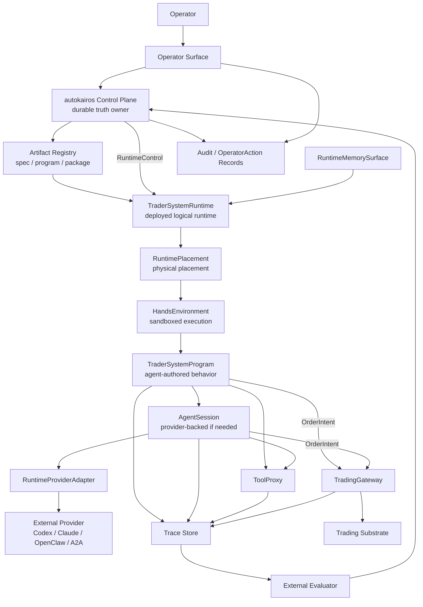
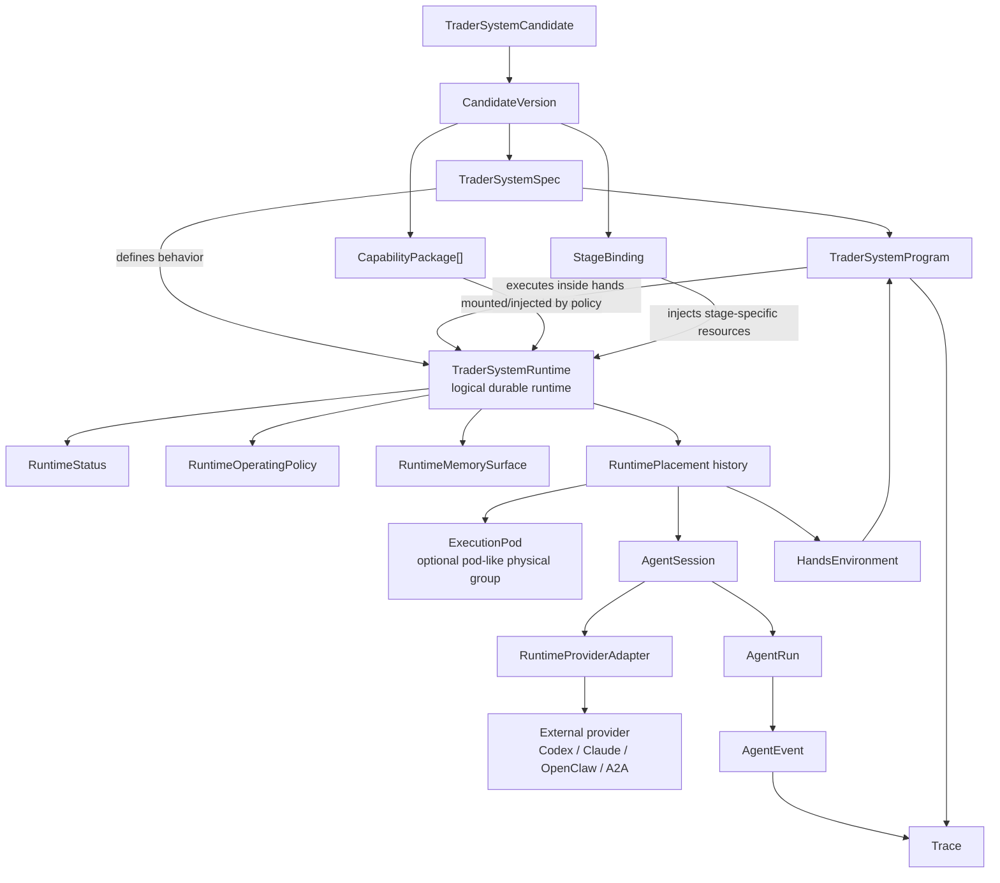

# Runtime Authority Model

This page is the canonical design-first model for how autokairos runs agent-built trader systems.

It intentionally does not explain delivery sequencing, Bootstrap delivery, or implementation
slicing. Those are downstream concerns. This page defines ownership, authority, physical execution,
and recovery boundaries that must hold regardless of implementation order.

## Purpose

Use this page to answer:

- what autokairos owns versus what the agent-built trader system owns
- what runs where
- which objects are logical product/runtime boundaries
- which objects are physical execution placements
- which layer may use credentials or live authority
- how trace makes execution inspectable and recoverable

## Design Thesis

autokairos is a trader-system control plane and devops layer.

External agents create or update trader-system artifacts. autokairos registers, deploys, observes,
gates, evaluates, promotes, and controls those artifacts. It does not become the backend service that
authors trading behavior or activates the agent for every internal decision.

The core rule is:

```text
TraderSystem owns internal trading behavior.
autokairos owns lifecycle, placement, observability, permissions, gateway, evaluation, promotion, and audit.
```

## Source-Derived Design Rules

The active source layer constrains this runtime model:

- Anthropic Managed Agents and long-running harnesses require brain, hands, session, event, memory,
  and vault concerns to stay separated.
- OpenAI agent, sandbox, guardrail, observability, and eval references require provider runs,
  sandbox compute, traces, approvals, and evals to stay separate.
- Google Agent Runtime, Memory Bank, Agent Gateway, Agent Identity, Agent Registry, ADK, and A2A
  require runtime, memory, identity, gateway, registry, observability, evaluation, and protocol to
  be separate platform concerns.
- W2S/AAR and Project Deal require external evaluation and objective evidence to sit outside
  provider self-report and operator satisfaction.

Therefore:

- `RuntimePlacement` maps logical runtime to local, container, provider-managed, or remote execution.
- `RuntimeMemorySurface` is scoped context, not evidence or promotion truth.
- `RuntimeProviderAdapter` borrows execution capability, not product authority.
- `ToolProxy` and `TradingGateway` are separate gateway boundaries.
- A2A is remote agent communication; MCP is tool/resource access; ACP is coding-harness bridging.

## Kubernetes-Aligned Naming Rule

autokairos borrows the Kubernetes mental model of control plane, desired state, replaceable
execution placement, and recovery. It does not clone Kubernetes APIs.

The naming boundary is:

- `TraderSystemRuntime` is the durable logical runtime object.
- `RuntimePlacement` is one physical launch, resume, provider session, process, container, or remote
  endpoint mapping.
- `ExecutionPod` is allowed only when a physical placement is genuinely pod-like: one or more
  co-scheduled execution surfaces sharing sandbox, network, storage, lifecycle, and trace export.

Do not use `Pod` for candidate identity, product truth, evaluation truth, or the durable runtime
object.

## Authority Layers

Primary question:

> which layer may act, write truth, use credentials, or call the gateway?



Arrows mean mediated interaction, not ownership.

## Layer Responsibilities

| Layer | Runs where | Owns | Must not own |
| --- | --- | --- | --- |
| Operator | human/UI | approval, inspection, pause, stop, override intent | hidden runtime work |
| Control Plane | autokairos service/store | artifact registration, lifecycle, evidence, promotion, gateway/audit truth | trading logic |
| Artifact Registry | durable store | `TraderSystemSpec`, `TraderSystemProgram`, `CapabilityPackage`, manifests, versions | credentials or live authority |
| TraderSystemRuntime | logical runtime boundary | deployed candidate/spec/program/package/binding identity | physical process identity |
| RuntimePlacement | connector record | physical process/container/provider/endpoint placement | candidate/evidence/promotion truth |
| HandsEnvironment | sandbox/container/environment | program execution, mounted packages, tool clients, local scratch | secrets, exchange authority, evidence truth |
| TraderSystemProgram | inside hands environment | internal trading behavior, scripts, local planners, generated code | direct exchange calls, self-promotion, evidence writes |
| AgentSession | provider/harness through adapter | reasoning continuity when program calls an agent | durable product truth |
| RuntimeProviderAdapter | local/cloud/external provider bridge | concrete invocation mechanics | product meaning |
| ToolProxy | autokairos boundary | tool request/response mediation and permission checks | counted evidence by itself |
| RuntimeMemorySurface | control-plane / trace / artifact store | scoped context derived from trace and approved artifacts | evidence, promotion, provider-private truth |
| External Evaluator | evaluator service/process | counted/non-counted evidence inputs and outputs | raw runtime authority |
| TradingGateway | autokairos live boundary | accept/reject/clip decisions and credential-mediated venue calls | strategy generation |
| Trace Store | durable append log | runtime events, artifacts, checkpoints, causality | final judgment |
| Audit Records | durable store | operator action and authority-change history | runtime-private state |

## Logical Versus Physical Execution

Primary question:

> what is durable runtime identity versus replaceable execution placement?



The recoverable product state is:

```text
TraderSystemRuntime
+ RuntimePlacement history
+ Trace
+ exported artifacts / checkpoints
+ control-plane records
```

Private provider memory, process memory, and container state are useful execution surfaces but not
durable product truth.

## RuntimeControl Boundary

`RuntimeControl` is the active lifecycle and governance surface:

```text
register -> deploy -> start -> pause -> resume -> stop -> inspect -> override -> kill
```

It lets autokairos operate the trader-system like a controlled deployment. It does not let
autokairos decide every internal trading behavior, agent call, local script, or market reaction.

## Live Authority

The live authority path is:

```text
TraderSystemProgram or AgentSession
-> OrderIntent
-> TradingGateway
-> GatewayDecision
-> ExecutionAttempt
```

No program, provider session, package, memory surface, or A2A artifact may bypass the gateway.

## Recovery

Physical execution failure is handled by placement replacement, not product identity loss:

```text
physical placement fails
-> RuntimePlacement status and Trace record failure
-> control plane loads runtime, policy, trace cursor, checkpoint/artifact refs
-> new RuntimePlacement is created or runtime is stopped for operator review
-> same TraderSystemRuntime remains inspectable
```

## Read Next

- [09-trader-system-runtime-operating-model.md](09-trader-system-runtime-operating-model.md)
- [specs/07-runtime-connector-contract.md](specs/07-runtime-connector-contract.md)
- [specs/15-runtime-operating-policy-contract.md](specs/15-runtime-operating-policy-contract.md)
- [specs/16-order-intent-and-gateway-decision-contract.md](specs/16-order-intent-and-gateway-decision-contract.md)
