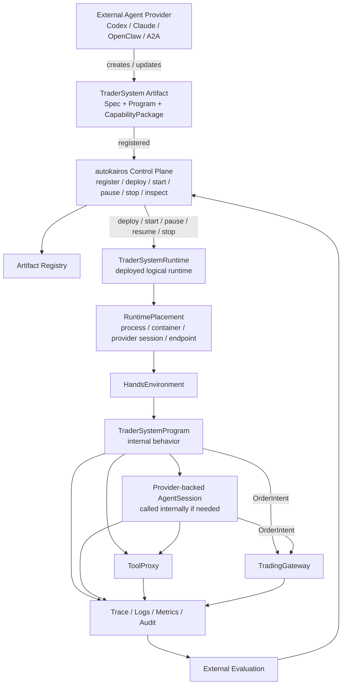
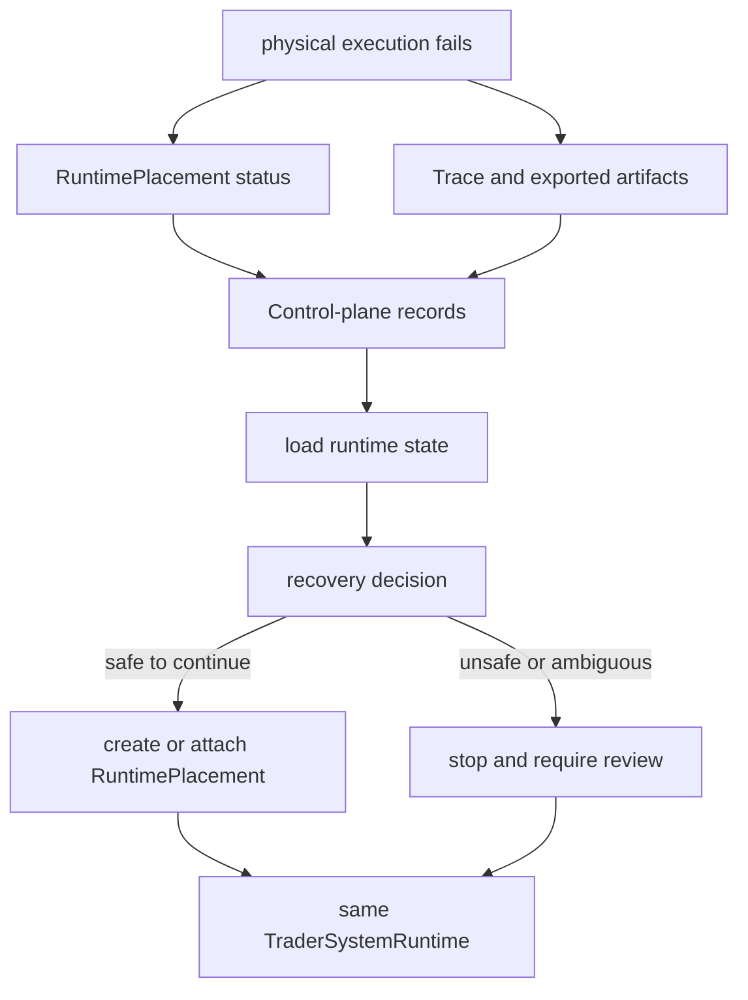

# Trader-System Runtime Operating Model

This page defines how autokairos operates an agent-built `TraderSystem` without becoming the
trader-system brain.

It sits after:

- [00-system-map.md](00-system-map.md)
- [08-runtime-authority-model.md](08-runtime-authority-model.md)

It is implemented through:

- [specs/07-runtime-connector-contract.md](specs/07-runtime-connector-contract.md)
- [specs/15-runtime-operating-policy-contract.md](specs/15-runtime-operating-policy-contract.md)
- [specs/09-trace-contract.md](specs/09-trace-contract.md)
- [specs/04-boundaries.md](specs/04-boundaries.md)

## Purpose

Use this page to answer:

- how an agent-built trader-system artifact is registered and deployed
- how the deployed runtime runs without autokairos waking every internal action
- where provider-backed agents, programs, tools, gateway, trace, evaluation, and audit sit
- how autokairos can start, pause, resume, stop, inspect, override, or kill the runtime
- how the logical runtime survives physical execution failure

This page is not a delivery plan, PR sequence, or code task list.

## Operating Thesis

autokairos is a trader-system control plane and devops layer.

It does not write the trading logic and does not decide every internal runtime step. External agents
create or update `TraderSystemSpec`, `TraderSystemProgram`, and `CapabilityPackage` artifacts.
autokairos registers those artifacts, deploys them into bounded runtime placements, observes their
outputs, gates their side effects, evaluates their trace, and controls lifecycle.

The core rule is:

```text
autokairos controls lifecycle, placement, observability, permissions, gateway, evaluation, and audit.
TraderSystem owns internal trading behavior and decides whether/when to call provider-backed agents.
```

## Runtime Operating Flow

Primary question:

> what happens after an agent-built trader-system artifact is ready to run?



This is not a central workflow. autokairos does not route market, fill, risk, time, operator, or
recovery facts into handler functions. A deployed `TraderSystemRuntime` receives bounded
environment surfaces and runs its own `TraderSystemProgram`; the program may call provider-backed
agents internally when it needs reasoning, coding, review, ambiguity resolution, or redesign.

## RuntimeControl

`RuntimeControl` is the active lifecycle/governance surface.

Minimum commands:

| Command | Meaning |
| --- | --- |
| `register` | accept an artifact into durable autokairos records |
| `deploy` | bind a candidate version, spec, program, package set, and stage binding into a runtime |
| `start` | launch or resume physical placement for the logical runtime |
| `pause` | stop new external side effects while preserving inspectability |
| `resume` | continue a paused runtime under the same operating policy |
| `stop` | end the runtime cleanly and retain trace/artifacts |
| `inspect` | read product-visible state without changing runtime behavior |
| `override` | apply an operator/control-plane intervention through audit |
| `kill` | emergency termination when safe stop is unavailable |

`RuntimeControl` is not a strategy router, agent prompt, scheduler, or step orchestrator.

## What The Runtime Owns Internally

The deployed trader system owns its internal behavior.

It may:

- process market, fill, position, risk, time, and local state streams
- run `TraderSystemProgram` logic inside `HandsEnvironment`
- call `AgentSession` through a `RuntimeProviderAdapter`
- maintain internal program state and checkpoints
- request tools through `ToolProxy`
- emit `OrderIntent` for live decisions
- emit diagnostic artifacts, metrics, program events, and candidate-version proposals

It may not:

- read secrets directly
- call exchange APIs directly
- write counted evidence
- promote itself
- mutate a live candidate version in place
- bypass trace, tool proxy, gateway, sandbox, or credential boundaries

## What Autokairos Owns Around It

autokairos owns the operating boundary:

- durable artifact registration and version refs
- deployment and lifecycle state
- `RuntimePlacement` history
- `RuntimeOperatingPolicy`
- trace export requirements
- tool and credential boundaries
- gateway accept/reject/clip authority
- evaluation comparability and evidence sealing
- promotion decisions
- operator actions and audit

autokairos may stop, pause, kill, inspect, or override the runtime. It must not become the hidden
trader-system brain.

## Provider-Backed Agent Calls

Provider-backed execution is internal to the deployed trader system but externally observable:

```text
TraderSystemProgram
-> AgentSession
-> RuntimeProviderAdapter
-> Codex / Claude / OpenClaw-ACP / A2A / local_process
-> AgentRun
-> AgentEvent
-> Trace
```

Provider output is raw runtime output. It can become trace. It cannot directly become:

- `TraderSystemCandidate`
- `EvidenceRecord`
- `PromotionDecision`
- `GatewayDecision`
- `ExecutionAttempt`
- audit truth

Those records require autokairos-owned validation, evaluation, gateway, or audit boundaries.

## Program Execution

`TraderSystemProgram` is the agent-authored executable behavior bundle.

It may run scripts, generated policies, indicators, local planners, and fast-path behavior inside
`HandsEnvironment`. It may decide internally when to call an agent provider. autokairos should not
encode those choices as control-plane routing.

Allowed boundary outputs include:

- `ProgramEvent`
- `AgentRun` / `AgentEvent`
- `ToolRequest`
- `OrderIntent`
- diagnostic artifact
- metric snapshot
- review request
- candidate-version proposal

## Live Side Effects

Live execution must pass through the trading gateway:

```text
TraderSystemProgram or AgentSession
-> OrderIntent
-> TradingGateway
-> GatewayDecision
-> ExecutionAttempt
```

The runtime proposes intent. The gateway owns accept, reject, clip, credential-mediated venue
submission, and execution linkage.

## Trace And Evaluation

All meaningful runtime output must become trace before it can affect evaluation, promotion, or live
audit.

```text
ProgramEvent / AgentEvent / ToolRequest / OrderIntent / GatewayDecision
-> Trace
-> EvaluationRunRecord
-> EvidenceSealingDecision
-> EvidenceRecord
-> PromotionDecision
```

Trace is recoverable history. It is not counted evidence.

## Recovery

`TraderSystemRuntime` survives physical failure.



Recovery reloads control-plane records, runtime placement history, trace cursor, checkpoints, and
exported artifact refs. It does not rely on provider-private memory or a still-running container as
the only source of truth.

## Anti-Collapse Rules

- autokairos is not the trader-system author.
- `TraderSystemRuntime` is not a process, provider session, Docker container, or Kubernetes Pod.
- `RuntimeControl` is lifecycle/governance, not internal step orchestration.
- `RuntimePlacement` is replaceable physical execution, not product truth.
- provider output is trace, not evidence.
- program validation is not promotion.
- memory is context, not evidence.
- `OrderIntent` is not live execution.
- operator notification is deferred and must not be modeled as internal runtime scheduling.

## Read Next

- [specs/07-runtime-connector-contract.md](specs/07-runtime-connector-contract.md)
- [specs/15-runtime-operating-policy-contract.md](specs/15-runtime-operating-policy-contract.md)
- [specs/09-trace-contract.md](specs/09-trace-contract.md)
- [specs/16-order-intent-and-gateway-decision-contract.md](specs/16-order-intent-and-gateway-decision-contract.md)
