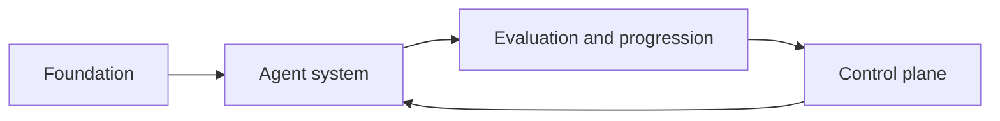

# Agent System Overview

This page defines what the autokairos agent system is as a subsystem of the whole architecture.

It is the first page to read inside the agent-system section.

It is grounded in:

- [../../sources/synthesis/agent-runtime-and-harness-principles.md](../../sources/synthesis/agent-runtime-and-harness-principles.md)
- [../../sources/library/anthropic-managed-agents.md](../../sources/library/anthropic-managed-agents.md)
- [../../sources/library/anthropic-effective-harnesses-for-long-running-agents.md](../../sources/library/anthropic-effective-harnesses-for-long-running-agents.md)
- [../../sources/library/openai-harness-engineering.md](../../sources/library/openai-harness-engineering.md)
- [../../sources/library/openai-next-evolution-of-the-agents-sdk.md](../../sources/library/openai-next-evolution-of-the-agents-sdk.md)
- [../../sources/library/repo-anthropics-claude-code.md](../../sources/library/repo-anthropics-claude-code.md)
- [../../sources/library/repo-openclaw.md](../../sources/library/repo-openclaw.md)
- [../../sources/library/repo-multica.md](../../sources/library/repo-multica.md)

And it depends on:

- [../00-first-principles-architecture-thesis.md](../specs/00-first-principles-architecture-thesis.md)
- [../02-core-primitives.md](../specs/02-core-primitives.md)
- [../04-boundaries.md](../specs/04-boundaries.md)

## Thesis

The autokairos agent system is the execution subsystem that turns governed trading work into live
runtime behavior without turning the runtime itself into the source of truth.

Its job is to:

- carry one persistent `AgentIdentity`
- attach that agent to a governed `Candidate`, `Stage`, and `Session`
- prepare a bounded workspace
- launch or resume a runtime through a stable bridge
- externalize the run as a `Trace`

Its job is not to decide promotion, own evidence, or become the control plane.

## Why The Agent System Exists

The source set converges on the same pattern even when vocabulary differs.

- Anthropic separates `session`, `harness`, and `sandbox`.
- OpenAI separates `harness` from `compute` and treats workspace shape as a first-class concern.
- Claude Code treats runtime loop, permissions, hooks, checkpoints, and memory as execution-side
  surfaces rather than product-level governance.
- OpenClaw separates gateway-owned session/control state from external ACP-backed runtime sessions.
- Multica separates daemon/runtime activation from the higher-level task and runtime inventory
  surfaces around it.

Taken together, these sources imply that the agent system should be treated as a real subsystem
with its own responsibilities, instead of being blurred into either:

- "the whole product", or
- "just a CLI invocation."

## The Agent System In The Whole Architecture

Within that whole-system split:

- foundation defines what the system is allowed to be
- the agent system executes work
- evaluation and progression judge what happened
- the control plane owns the durable records and governance workflow

The agent system sits in the middle. It is operationally central, but not architecturally supreme.

## The Core Shape

The agent system should be understood as one chain of execution surfaces.

This chain matters because it keeps four things separate:

- governed intent
- execution setup
- live runtime behavior
- externalized run history

## What The Agent System Owns

The agent system should own execution-side behavior.

### It should own

- invocation of a live runtime attempt
- runtime attachment and resume behavior
- workspace preparation and mounting
- runtime-driver selection
- runtime-local interruption and liveness handling
- external trace emission during execution
- runtime-local recovery aids such as checkpoints or session-local memory when the chosen runtime
  supports them

### It should not own

- candidate promotion
- evidence sealing
- review routing
- policy precedence for the whole product
- control-plane audit history
- downstream presentation concerns

## The Core Components

The agent system should be decomposed into the following components.

### 1. Invocation layer

Accepts a governed request from the control plane and turns it into an execution plan.

### 2. Stage-binding resolver

Resolves what the current stage actually means for this run: bindings, permissions, connectors,
instruction surfaces, and execution posture.

### 3. Session coordinator

Maintains continuity across turns and resumed runs without requiring one container or one runtime
process to stay alive forever.

### 4. Workspace materializer

Builds the bounded workspace the runtime will see.

### 5. Runtime bridge

Presents one stable autokairos interface above concrete runtimes and execution drivers.

### 6. Execution driver

Actually starts or attaches to the host environment: local container, remote container, native
runtime, or external bridge.

### 7. Trace emitter

Normalizes runtime activity into an external trace stream while the runtime is still active.

## One Persistent Agent, Not Split Identities

The agent system should be designed around one persistent agent identity rather than separate
`research agent` and `execution agent` identities.

What changes across `backtesting`, `paper`, and `live` is not the identity of the agent.

What changes is:

- the resolved `StageBinding`
- the connector semantics
- the permission posture
- the review and promotion consequences

This keeps the agent system consistent with the broader thesis that stage boundaries matter more
than role splits.

## What Changes Across Stages

The agent-facing action surface may remain stable while its underlying semantics change.

For example:

- `place_order` in `backtesting` binds to historical or simulated execution
- `place_order` in `paper` binds to mock execution against live-ish market conditions
- `place_order` in `live` binds to real venue execution

The agent system must preserve that distinction before the runtime starts. It should never ask the
runtime to infer stage semantics from prompt text alone.

## What This Section Will Define Next

The rest of the agent-system section should answer four concrete questions.

1. How is an agent run invoked and carried through its lifecycle?
2. Which state surfaces belong to the agent system, and which belong elsewhere?
3. How should runtime drivers and bridges be modeled?
4. In what order should the first real implementation be built?

Those are handled in:

- [02-execution-lifecycle.md](02-execution-lifecycle.md)
- [03-state-and-ownership.md](03-state-and-ownership.md)
- [04-runtime-driver-model.md](04-runtime-driver-model.md)
- [05-implementation-plan.md](05-implementation-plan.md)
