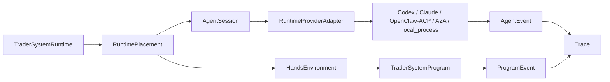

# Agent System Overview

This page defines the execution-side agent subsystem.

It is grounded in:

- [../../sources/synthesis/agent-runtime-and-harness-principles.md](../../sources/synthesis/agent-runtime-and-harness-principles.md)
- [../../sources/library/anthropic-managed-agents.md](../../sources/library/anthropic-managed-agents.md)
- [../../sources/library/anthropic-effective-harnesses-for-long-running-agents.md](../../sources/library/anthropic-effective-harnesses-for-long-running-agents.md)
- [../../sources/library/openai-agents-sdk-and-sandbox.md](../../sources/library/openai-agents-sdk-and-sandbox.md)
- [../../sources/library/openai-2026-agent-codex-workspace-stack.md](../../sources/library/openai-2026-agent-codex-workspace-stack.md)
- [../../sources/library/repo-openclaw.md](../../sources/library/repo-openclaw.md)

And it depends on:

- [../08-runtime-authority-model.md](../08-runtime-authority-model.md)
- [../09-trader-system-runtime-operating-model.md](../09-trader-system-runtime-operating-model.md)
- [../specs/02-core-primitives.md](../specs/02-core-primitives.md)
- [../specs/04-boundaries.md](../specs/04-boundaries.md)
- [../specs/07-runtime-connector-contract.md](../specs/07-runtime-connector-contract.md)

## Thesis

The agent system is the execution layer that lets a deployed `TraderSystemRuntime` use external
agent providers and sandboxed hands environments.

It is not the whole product, and it is not the control plane.

Its job is to:

- attach or create provider-backed `AgentSession` objects
- call a concrete provider through `RuntimeProviderAdapter`
- materialize bounded `HandsEnvironment` surfaces
- run or support `TraderSystemProgram` behavior
- export provider and program output as trace
- respond to lifecycle control such as pause, stop, override, and kill

## Source-Derived Shape

The source set converges on the same split even when vocabulary differs:

- Anthropic separates brain, hands, session, harness, and sandbox.
- OpenAI separates agent harness, sandbox, tools, tracing, and compute.
- Google ADK separates agent, runner, session, event, artifact, and tool.
- OpenClaw/ACP exposes an external harness bridge rather than a control-plane replacement.
- A2A is remote agent communication, not tool access or live authority.

autokairos applies that split as:

## What The Agent System Owns

The agent system owns execution-side mechanics:

- placement attach/create behavior
- provider invocation mechanics
- sandbox or hands-environment materialization
- trace export from provider and program activity
- runtime-local failure, cancellation, and stop handling
- provider readiness constraints before a provider label becomes runnable

## What The Agent System Does Not Own

The agent system does not own:

- candidate identity
- spec/package admission
- stage legitimacy
- evidence sealing
- promotion decisions
- exchange credentials
- trading gateway decisions
- audit truth

## Provider Labels Are Not Runtime Truth

`Codex`, `Claude`, `OpenClaw`, and `A2A` are provider families or communication surfaces. They are
not executable until a `RuntimeProviderAdapter` names:

- `provider_kind`
- invocation surface
- auth posture
- model/tool access
- sandbox posture
- output contract
- trace export path
- cancellation and resume behavior

## One Sentence Summary

The agent system is the provider-backed execution seam under `TraderSystemRuntime`; it makes agent
execution possible without letting provider sessions own autokairos truth.
