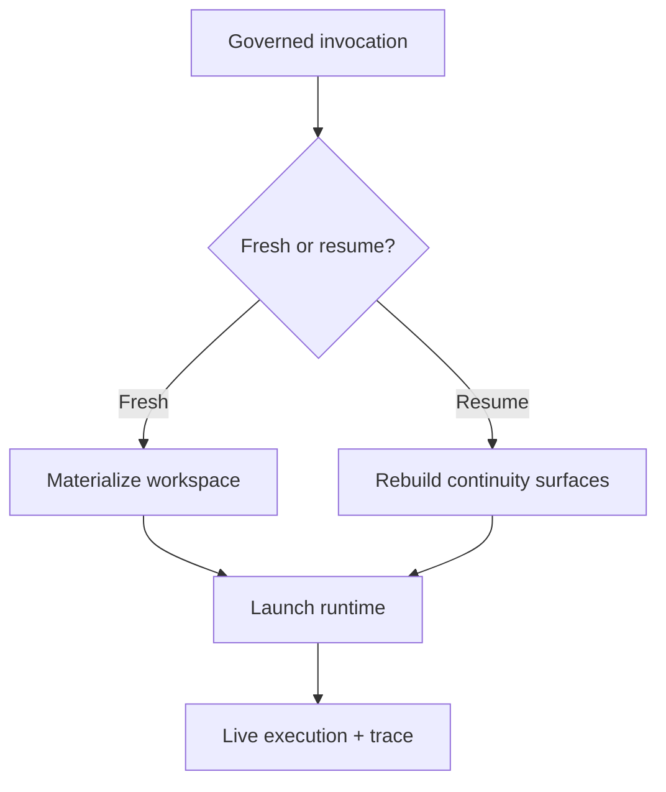

# Agent Execution Lifecycle

This page defines the lifecycle of one autokairos agent run.

It follows:

- [01-overview.md](01-overview.md)
- [../03-staged-evaluation.md](../specs/03-staged-evaluation.md)
- [../05-agent-execution-architecture.md](../historical/specs/05-agent-execution-architecture.md)
- [../specs/07-runtime-connector-contract.md](../specs/07-runtime-connector-contract.md)
- [../12-governed-execution-request-contract.md](../specs/12-governed-execution-request-contract.md)
- [../13-execution-attempt-contract.md](../specs/13-execution-attempt-contract.md)
- [../../sources/library/anthropic-managed-agents.md](../../sources/library/anthropic-managed-agents.md)
- [../../sources/library/openai-next-evolution-of-the-agents-sdk.md](../../sources/library/openai-next-evolution-of-the-agents-sdk.md)
- [../../sources/library/repo-anthropics-claude-code.md](../../sources/library/repo-anthropics-claude-code.md)
- [../../sources/library/repo-openclaw.md](../../sources/library/repo-openclaw.md)
- [../../sources/library/repo-multica.md](../../sources/library/repo-multica.md)

## Lifecycle Thesis

An autokairos run should be treated as a governed execution lifecycle, not as a single prompt sent
to a harness.

The lifecycle begins before the runtime is live and continues after the runtime stops.

That is the only way to keep:

- candidate truth outside the runtime
- stage semantics outside prompt text
- trace durability outside the workspace

## The Lifecycle

```mermaid
flowchart LR
    A["Governed request"] --> B["Stage resolution"]
    B --> C["Continuity preparation"]
    C --> D["Execution attempt record"]
    D --> E["Workspace materialization"]
    E --> F["Runtime attach or launch"]
    F --> G["Live execution loop"]
    G --> H["External trace emission"]
    H --> I["Completion or interruption"]
    I --> J["Resume or downstream evaluation"]
```

## Phase 1: Invocation

Execution begins with a governed request from the control plane.

That governed request should already exist as an `ExecutionRequest` record before any concrete
attempt is launched.

At this point the system should already know:

- which `AgentIdentity` is acting
- which `Candidate` is being advanced or examined
- which `Stage` the run belongs to
- which `Session` continuity surface is being used

This is intentionally different from an ad hoc prompt-first product posture.

The agent system should not begin with "here is some text, see what happens."

It should begin with: "here is the governed unit of work and the legitimacy level under which it
may run."

## Phase 2: Stage Resolution

Before the runtime starts, the system must resolve stage meaning into execution meaning.

This includes:

- which connectors are exposed
- what their semantics are
- what permission posture applies
- what instruction surfaces are mounted
- what trace metadata should be emitted

This resolution step is what prevents the runtime from becoming the place where stage semantics are
improvised.

## Phase 3: Continuity Preparation

The agent system should then prepare continuity state.

This does not mean keeping one long-lived process alive forever.

It means preparing the state surfaces needed to continue work coherently:

- `Session`
- current runtime references if a resumable runtime already exists
- any staged handoff artifacts that belong in the workspace
- trace destination and run identity

At the end of this phase, the system should be ready to create one concrete `ExecutionAttempt`
record.

This is where the source set is especially aligned:

- Anthropic emphasizes stable interfaces above changing harnesses.
- OpenAI distinguishes run state, session memory, and context.
- Claude Code distinguishes checkpoints and project memory from git truth.

## Phase 4: Execution Attempt Creation

Before workspace materialization becomes real, the control plane should create one durable
`ExecutionAttempt`.

This is where the system freezes the concrete run context:

- request reference
- candidate reference
- session reference
- stage binding reference
- execution mode
- primary trace reference

This keeps one concrete try at execution distinct from the broader invocation request.

## Phase 5: Workspace Materialization

The workspace should then be created or refreshed as the bounded execution surface.

The workspace must contain what the runtime needs to operate, including:

- task and repo materials
- instruction surfaces
- output locations
- mounted stage-local data or artifacts
- stage-bound tools and connectors

The workspace should not become:

- the evidence store
- the promotion record
- the control-plane state store

## Phase 6: Runtime Attach Or Launch

Once the workspace exists, the runtime connector should choose one of two paths.

### Fresh launch

Start a new execution attempt through the selected driver.

### Attach or resume

Reconnect to a live or resumable runtime session if the system supports it.

The key boundary here is that resume should be anchored in external continuity surfaces, not only
in one surviving container.

## Phase 7: Live Execution Loop

Once the runtime is active, the agent enters its normal operating loop:

- gather context
- act through tools or connectors
- inspect results
- continue until interruption, completion, or failure

The source set uses different words here:

- Anthropic often says `harness`
- OpenAI often says `harness` or `agent loop`
- Claude Code talks about the `agentic loop`
- OpenClaw talks about runtime sessions

autokairos should treat this loop as real, but local. It belongs to the live runtime surface, not
to the control plane.

## Phase 8: External Trace Emission

While the loop is running, the runtime must emit trace events outward.

This should happen continuously, not only at the end.

At minimum the trace should capture:

- status transitions
- model outputs
- tool and connector invocations
- failures and interruptions
- runtime-local approval events when they matter

This keeps the run externally inspectable even if the workspace or container is later destroyed.

## Phase 9: Completion, Interruption, Or Pause

A run should be able to end in more than one way.

### Completion

The runtime reached a natural stop and returned a final result.

### Interruption

The run stopped because of:

- user action
- runtime failure
- policy interruption
- timeout
- driver loss

### Pause

The run intentionally stopped in a resumable state.

This distinction matters because downstream evaluation and review should not treat all non-running
states as equivalent.

## Phase 10: Resume Or Downstream Evaluation

Once the runtime is no longer actively executing, the agent system has finished its part of the
lifecycle.

From here, one of two things happens.

### Resume path

The control plane decides to continue the same session and candidate-stage line of work.

### Downstream path

The control plane and evaluation system consume the trace and later produce:

- `EvidenceRecord`
- `ReviewItem`
- `PromotionDecision`

This phase is downstream of the agent system, which is exactly why the lifecycle has to be modeled
explicitly.

## Runtime Approval Is Part Of Execution, Not Promotion

The lifecycle should explicitly distinguish runtime-local approvals from progression governance.

Examples of runtime-local approvals:

- shell permission prompts
- connector-use confirmations
- side-effect gating inside a harness

These belong to the live execution phase.

Examples of progression governance:

- advance candidate from `backtesting` to `paper`
- pause candidate pending human review
- reject candidate after poor evidence

These belong after execution.

## Fresh Run And Resume Are Both First-Class

The lifecycle should not privilege fresh runs so heavily that resumed work looks like an exception.

The agent system should handle both cleanly.

That is especially important for long-running work, where continuity across runtime loss is part of
the design target rather than an afterthought.

## Summary

The agent execution lifecycle should be treated as:

1. invocation
2. stage resolution
3. continuity preparation
4. workspace materialization
5. launch or attach
6. live loop
7. external trace emission
8. completion or interruption
9. resume or downstream evaluation

That lifecycle is the operational heart of the agent system.
