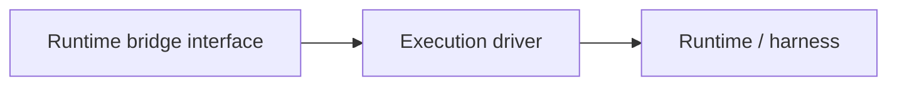

# Runtime Driver Model

This page defines how autokairos should think about runtimes, drivers, and execution modes inside
the agent system.

It follows:

- [01-overview.md](01-overview.md)
- [02-execution-lifecycle.md](02-execution-lifecycle.md)
- [../06-containerized-execution.md](../specs/06-containerized-execution.md)
- [../07-runtime-bridge-interface.md](../specs/07-runtime-bridge-interface.md)
- [../../sources/library/openai-next-evolution-of-the-agents-sdk.md](../../sources/library/openai-next-evolution-of-the-agents-sdk.md)
- [../../sources/library/repo-openclaw.md](../../sources/library/repo-openclaw.md)
- [../../sources/library/repo-multica.md](../../sources/library/repo-multica.md)
- [../../sources/library/repo-anthropics-claude-code.md](../../sources/library/repo-anthropics-claude-code.md)
- [../../sources/library/repo-safety-research-automated-w2s-research.md](../../sources/library/repo-safety-research-automated-w2s-research.md)

## Thesis

autokairos should separate:

- the stable runtime-bridge interface
- the concrete driver that executes one run
- the runtime or harness that actually performs the agent loop

Without this split, the system becomes locked to one provider or one operational posture.

## The Three Layers

### Runtime bridge interface

The stable autokairos contract.

It accepts governed execution intent and exposes:

- launch
- attach or resume
- liveness
- interrupt
- teardown
- trace streaming

### Execution driver

The implementation layer that knows how to start work in a particular environment.

Examples:

- local container driver
- remote container driver
- host-local runtime driver
- external-bridge driver

### Runtime or harness

The actual agent loop implementation.

Examples:

- a native autokairos runtime in the future
- Claude Code-like harness
- Codex-like harness
- ACP-backed external runtime through something OpenClaw-like

## Driver Matrix

| Driver posture | What it means | Strengths | Risks | autokairos posture |
| --- | --- | --- | --- | --- |
| `host-local` | runtime executes directly on the host machine | fast to develop, low setup friction | weak legitimacy boundary, host pollution | debug-only or convenience path |
| `containerized-local` | runtime executes in a local worker container | strong local isolation, reproducible workspace, good first serious mode | container orchestration complexity | preferred first serious candidate-run mode |
| `containerized-remote` | runtime executes in a remote container environment | stronger resource isolation, remote scale-out | higher ops complexity, remote coordination | later expansion path |
| external bridge | runtime is reached through another session bridge or gateway | flexible integration with external harness ecosystems | extra indirection, runtime semantics may vary | supported through the bridge interface, not as a default assumption |

## Container-Backed First Serious Path

The current architecture already chooses one starting point.

The first serious implementation should prefer:

- `execution_mode = containerized-local`
- one driver
- one runtime path
- one stage: `backtesting`

This follows the W2S execution posture, where containerization is part of legitimacy rather than
only local ops convenience.

## Native Versus External Runtime

The driver model must support both a future native runtime and external runtimes.

### Native runtime path

autokairos directly owns the loop implementation.

### External runtime path

autokairos governs an already-existing harness through the runtime bridge.

This distinction matters because:

- Anthropic and OpenAI both treat harnesses as real runtime systems
- OpenClaw shows that bridged external runtimes can be first-class
- Multica shows that a daemon or external launcher can supervise work without becoming the entire
  product

autokairos should support both postures eventually, even if the first real implementation chooses
only one concrete runtime path.

## Why The Bridge Must Stay Stable

The bridge should remain stable because everything above it is autokairos-owned:

- candidate identity
- session continuity
- stage semantics
- trace ownership
- evaluation and governance

If those things depend directly on one CLI or one ACP implementation, the architecture collapses.

The bridge keeps the runtime swappable while preserving the rest of the system.

## Driver Selection Rules

The agent system should choose drivers according to architectural posture, not convenience alone.

### Use `host-local` when

- validating developer ergonomics
- debugging the bridge itself
- iterating before serious stage legitimacy matters

### Use `containerized-local` when

- running serious local `backtesting`
- validating workspace shaping and trace durability
- checking that the runtime/control-plane split survives runtime loss

### Use `containerized-remote` when

- scaling execution beyond one local machine
- needing stronger infrastructure isolation
- using remote evaluators or shared runtime capacity

### Use an external bridge when

- the runtime is already packaged as a separate harness system
- session continuity must be delegated to that runtime surface
- interoperability matters more than owning the loop directly

## Compose Is Still Not The Driver Model

`docker compose` may help start supporting services.

It is not the conceptual driver model.

The driver model is per-run and execution-specific:

- which worker image
- which mounts
- which runtime process
- which trace stream
- which resume path

Compose belongs outside that boundary.

## How The Main Reference Systems Fit

| Reference | Most relevant driver lesson |
| --- | --- |
| Anthropic managed agents | stable interfaces above changing harnesses |
| OpenAI Agents SDK evolution | harness/compute split and workspace manifest posture |
| Claude Code | runtime-local permissions, checkpoints, hooks, and memory as execution-side surfaces |
| OpenClaw | bridged external runtime sessions as a first-class path |
| Multica | daemon-style runtime activation and supervision outside the harness |
| W2S repo | container-backed legitimacy and server-side truth outside the worker |

## Summary

The runtime driver model should keep three truths separate:

1. autokairos owns the bridge contract.
2. Drivers own environment-specific activation.
3. Runtimes own the live loop.

That split is what lets the agent system stay executable without becoming hostage to one runtime
implementation.
