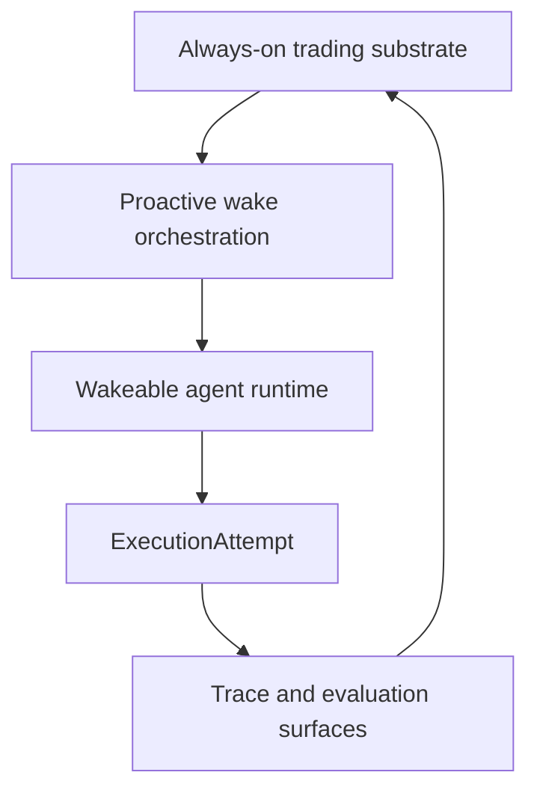

# Persistent Operations Model

This page defines how autokairos should think about persistent operation for a trading system.

It follows:

- [../trading-substrate/README.md](../trading-substrate/README.md)
- [../trading-substrate/01-overview.md](../trading-substrate/01-overview.md)
- [../proactive-operations/README.md](../proactive-operations/README.md)
- [01-overview.md](01-overview.md)
- [02-execution-lifecycle.md](02-execution-lifecycle.md)
- [04-runtime-driver-model.md](04-runtime-driver-model.md)
- [06-first-code-seam.md](06-first-code-seam.md)
- [../specs/15-persistent-operations-and-wake-policy.md](../specs/15-persistent-operations-and-wake-policy.md)
- [../specs/19-wake-orchestration-and-trigger-model.md](../specs/19-wake-orchestration-and-trigger-model.md)
- [../../sources/library/anthropic-managed-agents.md](../../sources/library/anthropic-managed-agents.md)
- [../../sources/library/openai-next-evolution-of-the-agents-sdk.md](../../sources/library/openai-next-evolution-of-the-agents-sdk.md)
- [../../sources/synthesis/proactive-operations-and-wake-orchestration.md](../../sources/synthesis/proactive-operations-and-wake-orchestration.md)

It is also informed by additional official documentation:

- [Anthropic: Managing context on the Claude Developer Platform](https://claude.com/blog/context-management)
- [Anthropic: Harness design for long-running application development](https://www.anthropic.com/engineering/harness-design-long-running-apps)
- [OpenAI Sessions](https://openai.github.io/openai-agents-js/guides/sessions/)
- [OpenAI Results](https://openai.github.io/openai-agents-js/guides/results/)
- [Docker restart policies](https://docs.docker.com/engine/containers/start-containers-automatically/)
- [Docker live restore](https://docs.docker.com/engine/daemon/live-restore/)

## Thesis

autokairos should operate as an always-on trading system with:

- an always-on trading substrate
- a proactive wake-orchestration layer
- a wakeable agent runtime

That is different from treating one runtime process or one container as immortal.

For trading, the requirement is not:

- one LLM loop that never dies

It is:

- a system that is always operational
- a runtime that can wake or resume fast enough for the current stage
- durable truth that survives runtime loss

## Why This Matters In Trading

Fast wake is a performance concern in most agent systems.

In trading, it is more than that.

Trading pressure comes from:

- ongoing market-data flow
- account and position changes
- risk-state changes
- order and connector events
- review or operator interruptions that must not take too long to recover from

That means the system cannot be designed around cold-starting the entire world every time the
agent needs to act.

At the same time, the source layer argues strongly against turning one running harness into the
source of truth. Anthropic keeps the `session` outside the `harness`; OpenAI keeps session memory
and resumable `state` outside the current run; Docker restart and live-restore features reduce
downtime, but they do not replace durable records or external truth.

## The Three-Layer Persistent Posture

autokairos should separate persistent operation into three layers.

### 1. Always-on trading substrate

This layer should remain continuously available or quickly self-healing.

Typical responsibilities:

- control-plane records
- market-data ingestion
- account and position state
- order / connector state
- risk and policy surfaces
- external trace and audit sinks

This is the part of the system that should feel always on.

### 2. Proactive wake orchestration

This layer decides how future work should wake.

Typical responsibilities:

- scheduler truth
- heartbeat and cron semantics
- event-trigger handling
- standing authority and escalation rules
- dedupe and catch-up policy
- governed self-scheduling evaluation

This is the layer that should own proactive behavior without turning the runtime into the
scheduler.

### 3. Wakeable agent runtime

This layer is the LLM-centered cognitive loop:

- runtime bridge
- workspace host
- container-backed execution
- live runtime session

This layer does not need to be immortal.

It does need to satisfy stage-appropriate wake expectations.

## Always-On Does Not Mean Immortal Process

The critical design rule is:

**persistent operation is a property of the system, not proof that one process has survived.**

Anthropic's managed-agents article is useful here because it explicitly separates:

- durable `session`
- replaceable `harness`
- replaceable `sandbox`

The same posture appears in OpenAI's session and resumable state model: the session persists across
turns, and the serializable `state` can resume paused work later.

So autokairos should prefer:

- durable session and execution records
- restartable runtime infrastructure
- fast wake or resume

over:

- one "special" container that must never die

## Wake Classes

autokairos should classify runtime readiness explicitly.

### Cold

Nothing execution-specific is currently live.

The system must:

- resolve the request
- create the execution attempt
- materialize the workspace
- start the host
- start the runtime

Use this when:

- cost matters more than latency
- broad search is acceptable
- stage legitimacy does not require immediate reaction

### Warm

The system is not actively running the full cognitive loop, but it has minimized wake latency.

Typical warm ingredients:

- prebuilt worker image
- ready container host or short path to launch one
- resolved stage-binding inputs
- durable session continuity already available
- trace sink and control-plane records already live

Warm is likely the default serious posture for:

- paper
- some live-adjacent monitoring

### Hot

The runtime session is already attached and heartbeating.

Typical hot properties:

- active execution context
- live runtime session
- already-mounted or already-materialized workspace
- immediate trace emission

Hot is the strongest latency posture, but also the most operationally expensive.

It should be used only when the stage and risk posture justify it.

## Stage-Specific Wake Expectations

Wake expectations should depend on stage, not on one global rule.

| Stage | Default wake posture | Why |
| --- | --- | --- |
| `backtesting` | `cold` by default | broad search is cheap; latency matters least |
| `paper` | `warm` by default | live-ish conditions matter; restart cost should be lower |
| `live` | `warm` minimum, `hot` when justified | real risk and real-time reaction matter most |

This means the system should not talk about "always-on" without also saying:

- for which stage
- for which operational surface
- at what wake class

## What Must Stay Hot Even If The Agent Does Not

For trading, some surfaces should remain hot or near-hot even when the LLM runtime is not.

Examples:

- market-data ingestion
- account / position state refresh
- risk limit tracking
- order and fill ingestion
- connector session supervision
- operator or review wake signals
- wake-policy evaluation and trigger delivery

This is the operational reason the always-on trading substrate must be separated from the wakeable
agent runtime, with proactive orchestration living in between.

If the model loop is the only hot surface, the system will be fragile.

## Restart Features Are Optimization, Not Truth

Docker restart policies and live restore are useful operational tools.

They can reduce downtime by:

- restarting stopped containers
- keeping containers alive across some daemon outages

But they do not replace:

- `Session`
- `ExecutionRequest`
- `ExecutionAttempt`
- `Trace`

So autokairos may use Docker restart or live-restore features to improve hot or warm posture, but
those features must not become the continuity model.

## Recovery Model

Persistent operation should degrade gracefully.

### Preferred downgrade path

- `hot` -> `warm` -> `cold`

Meaning:

- if the live runtime dies, keep the substrate alive and re-enter warm if possible
- if warm preparation is lost, fall back to a cold but still governed restart

### What must not happen

- candidate truth lost because one runtime died
- session continuity lost because one container disappeared
- trace history lost because one process crashed

## Relationship To The Rest Of The Section

- [04-runtime-driver-model.md](04-runtime-driver-model.md)
  explains bridge, driver, and runtime roles.
- [../proactive-operations/README.md](../proactive-operations/README.md)
  explains why trigger and wake-policy truth belong above the runtime.
- [06-first-code-seam.md](06-first-code-seam.md)
  explains why request, attempt, and trace come before provider integration.
- [../specs/15-persistent-operations-and-wake-policy.md](../specs/15-persistent-operations-and-wake-policy.md)
  defines the narrower policy contract behind this operational model.

## Summary

autokairos should not try to keep one agent process alive forever.

It should keep the trading substrate always on, keep durable truth outside the runtime, and give
the runtime explicit wake classes:

- `cold`
- `warm`
- `hot`

For trading, fast wake is a system requirement.

The right answer is an always-on substrate with proactive wake orchestration and a wakeable agent
runtime.
