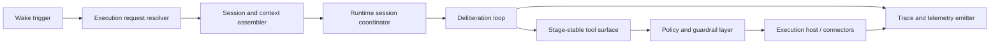

# Production Agent Design

This page defines the production-level autokairos agent that the next implementation phase should
actually build.

It follows:

- [../proactive-operations/README.md](../proactive-operations/README.md)
- [01-overview.md](01-overview.md)
- [02-execution-lifecycle.md](02-execution-lifecycle.md)
- [03-state-and-ownership.md](03-state-and-ownership.md)
- [04-runtime-driver-model.md](04-runtime-driver-model.md)
- [07-persistent-operations-model.md](07-persistent-operations-model.md)
- [../specs/12-governed-execution-request-contract.md](../specs/12-governed-execution-request-contract.md)
- [../specs/13-execution-attempt-contract.md](../specs/13-execution-attempt-contract.md)
- [../specs/15-persistent-operations-and-wake-policy.md](../specs/15-persistent-operations-and-wake-policy.md)
- [../specs/16-production-agent-state-machine.md](../specs/16-production-agent-state-machine.md)
- [../specs/17-production-agent-tool-surface-and-guardrails.md](../specs/17-production-agent-tool-surface-and-guardrails.md)
- [../specs/18-production-agent-observability-and-slos.md](../specs/18-production-agent-observability-and-slos.md)
- [../../sources/library/anthropic-managed-agents.md](../../sources/library/anthropic-managed-agents.md)
- [../../sources/library/anthropic-effective-harnesses-for-long-running-agents.md](../../sources/library/anthropic-effective-harnesses-for-long-running-agents.md)
- [../../sources/library/openai-next-evolution-of-the-agents-sdk.md](../../sources/library/openai-next-evolution-of-the-agents-sdk.md)
- [../../sources/library/openai-harness-engineering.md](../../sources/library/openai-harness-engineering.md)

It is also informed by additional official documentation:

- [Anthropic: Claude Code auto mode](https://www.anthropic.com/engineering/claude-code-auto-mode)
- [Anthropic: Beyond permission prompts](https://www.anthropic.com/engineering/claude-code-sandboxing)
- [Anthropic: Effective context engineering for AI agents](https://www.anthropic.com/engineering/effective-context-engineering-for-ai-agents)
- [Anthropic: Writing effective tools for AI agents](https://www.anthropic.com/engineering/writing-tools-for-agents)
- [OpenAI Agents SDK: Agents](https://openai.github.io/openai-agents-js/guides/agents/)
- [OpenAI Agents SDK: Guardrails](https://openai.github.io/openai-agents-js/guides/guardrails/)
- [OpenAI Agents SDK: Sessions](https://openai.github.io/openai-agents-js/guides/sessions/)
- [OpenAI Agents SDK: Results](https://openai.github.io/openai-agents-js/guides/results/)
- [OpenAI Agents SDK: Human-in-the-loop](https://openai.github.io/openai-agents-js/guides/human-in-the-loop/)

## Purpose

Define the production autokairos agent as a real long-running trading subsystem rather than as a
generic harness wrapper or a thin prompt runner.

## Scope And Non-Goals

This page covers:

- what the production agent is
- what it owns operationally
- how it should think, wake, act, and recover
- how it should relate to runtime, tools, trace, and guardrails
- what must be true before this agent counts as production-ready

This page does not cover:

- proactive trigger taxonomy
- standing-order semantics
- self-scheduling commitment rules
- candidate promotion semantics
- evidence sealing
- review routing
- the full control-plane record model
- detailed tool schemas

## Responsibilities

The production agent should:

- carry one persistent `AgentIdentity`
- accept governed execution work through `ExecutionRequest` and `ExecutionAttempt`
- attach to one `Session` line and one `StageBinding` at a time
- reconstruct enough context to act coherently without requiring one immortal process
- deliberate over market state, candidate context, and prior run history
- act through a stable, stage-aware trading tool surface
- emit self-scheduling intents when future observation or follow-up work is needed
- emit continuous external trace and operational telemetry
- pause, resume, degrade, and recover without turning runtime-local state into durable truth

The production agent should not:

- decide promotion
- treat runtime approvals as governance decisions
- treat workspace files or local memory as the canonical system record
- expose broad host-level mutation surfaces in live trading by default

## System Boundaries

The production agent sits between:

- the control plane that decides when governed work may run
- the proactive-operations layer that decides why and when work should wake
- the trading substrate that keeps market, account, order, and risk surfaces live
- the runtime bridge and execution host that make cognition possible
- the evaluation and progression system that judges what happened afterward

The agent is operationally central, but it is still only one subsystem.

## Primary Abstractions

The production agent should be understood through seven abstractions.

### 1. Persistent identity

The agent is not one container. It is one durable acting identity that may execute across many
attempts.

### 2. Governed execution

The production agent is never invoked by raw prompt text alone. It is invoked through governed
execution objects and explicit stage posture.

### 3. Operational state machine

The production agent needs an explicit operational state model so that pauses, approvals, recovery,
and degraded posture are first-class instead of incidental side effects.

### 4. Wake posture

The production agent must respect the `cold / warm / hot` posture from the persistent-operations
model. A trading agent that cannot explain its wake posture is not production-ready.

### 5. Stable tool surface

The production agent should see a stable domain-shaped interface whose schemas stay as consistent
as possible across stages while bindings change underneath.

### 6. External trace and telemetry

The production agent must be inspectable while running. Trace, heartbeats, approvals, and failures
must leave the runtime while the runtime is active.

### 7. Recovery discipline

The production agent must continue to make sense after:

- runtime loss
- container loss
- approval pauses
- transient connector failures
- operator intervention

## Production Properties

The production agent should satisfy all of these properties at the same time.

### Bounded autonomy

The agent should have room to search, reason, and act, but only within the currently resolved
stage binding and policy envelope.

### Fast wake

The agent must wake or resume fast enough for the current stage, especially in `paper` and `live`.

### Externalized truth

The agent may use local memory, checkpoints, and workspace notes, but durable truth stays outside
the runtime.

### Stage-stable semantics

The agent should not have to infer what stage it is in from prompt prose. Stage meaning should be
resolved before execution.

### Inspectability

An operator should be able to answer:

- what the agent is doing
- what it most recently observed
- which tool it is trying to use
- why it paused or degraded
- whether it is still healthy

without attaching to the container directly.

### Recoverability

The agent should recover from runtime loss by rebuilding execution from durable references rather
than by requiring one process to survive.

## Primary Flows

The production agent has four primary flows.

### 1. Wake flow

`wake trigger -> governed request -> stage resolution -> execution attempt -> runtime activation`

Wake triggers may come from:

- manual operator action
- proactive heartbeat or scheduled run
- market or risk event
- review-followup work

### 2. Deliberation flow

`observe -> retrieve context -> reason -> choose action -> emit trace`

The reasoning loop should be able to operate across multiple turns without assuming all relevant
state fits in one context window.

### 3. Action flow

`policy and guardrail checks -> tool invocation -> result interpretation -> trace and telemetry`

This is where the production agent most differs from a research-only harness. The agent may act,
but every action must stay inside explicit stage and guardrail boundaries.

### 4. Pause and recovery flow

`approval or failure -> pause or degrade -> recover or resume -> continue or stop`

The production agent should treat pause and recovery as normal operations, not as exceptional
design failures.

The production agent may request future follow-up work, but it should do so through governed
self-scheduling intents rather than direct scheduler mutation.

## Internal Component Model

The production agent should be decomposed like this.

### Execution request resolver

Turns governed intent into a concrete execution plan.

### Session and context assembler

Builds the minimal working context from:

- session continuity
- candidate context
- prior trace references
- stage binding
- runtime-local continuity aids when available

### Runtime session coordinator

Owns attach, resume, liveness, interruption, and recovery behavior.

### Deliberation loop

The live cognitive loop that decides what to inspect and what to do next.

### Stage-stable tool surface

Presents observation, trading, and control tools with stable schemas.

### Policy and guardrail layer

Blocks, routes, or escalates risky actions before they become side effects.

### Trace and telemetry emitter

Makes the agent inspectable outside the runtime.

## Production Agent Versus Research Harness

The production agent is not just the most autonomous version of a coding harness.

It differs in four ways.

### 1. The tool surface is domain-shaped

The production agent should prefer trading primitives over generic shell access.

### 2. Wake latency is a product concern

In trading, it matters how quickly the agent can resume under pressure.

### 3. Operational health is first-class

The production agent must expose heartbeats, guardrail events, and degradation states.

### 4. Side-effect discipline is stricter

Research harnesses can get away with broader exploratory powers. A production trading agent
cannot.

## Context And Memory Posture

The production agent should use layered continuity rather than one memory mechanism.

### Durable continuity

Lives outside the runtime:

- `Session`
- `ExecutionRequest`
- `ExecutionAttempt`
- `Trace`

### Runtime-local continuity

Lives near the runtime and may be reused opportunistically:

- workspace-local notes
- checkpoints
- short-term runtime state
- memory directories when the chosen runtime supports them

### Context assembly rule

The production agent should prefer just-in-time retrieval of relevant state over dragging all prior
history back into the context window every turn.

## Guardrails And Approval Model

The production agent should assume that production autonomy is impossible without layered
guardrails.

At minimum there should be:

- input or context-screening surfaces for untrusted external data
- policy checks before side-effecting tools run
- optional approval interruption for stage- or risk-sensitive actions
- post-execution validation or tripwire behavior for tool outcomes that violate constraints

The production agent must never collapse:

- runtime-local approvals
- policy gating
- promotion governance

into one fuzzy "approval" concept.

## Failure And Recovery Model

The production agent should expect all of these failure modes in normal operation.

- runtime process crash
- container loss
- approval pause that lasts hours
- connector timeouts
- prompt-injection attempts from fetched data
- partial trace delivery
- stale local continuity artifacts

Recovery therefore requires:

- durable execution records
- resumable state where available
- explicit operational states
- explicit degraded posture
- no reliance on one immortal runtime process

## Dependencies On Other Subsystems

The production agent depends on:

- foundation for naming, doctrine, primitives, and hard boundaries
- control plane for governed invocation, durable records, and operator surfaces
- evaluation and progression for downstream judgment
- the trading substrate for market, account, order, and risk surfaces

## What Is Still Delegated To Specs / ADRs

- [../specs/16-production-agent-state-machine.md](../specs/16-production-agent-state-machine.md)
  defines the operational state model.
- [../specs/17-production-agent-tool-surface-and-guardrails.md](../specs/17-production-agent-tool-surface-and-guardrails.md)
  defines tool families, stage-stable semantics, and guardrail rules.
- [../specs/18-production-agent-observability-and-slos.md](../specs/18-production-agent-observability-and-slos.md)
  defines the minimum operational telemetry and readiness expectations.
- [../adrs/0004-production-agent-posture.md](../adrs/0004-production-agent-posture.md)
  records the key decision to treat the next implementation target as a production agent, not a
  generic harness wrapper.

## Summary

The production autokairos agent should be:

- one persistent acting identity
- stage-aware
- event-driven
- wake-class aware
- externally observable
- guarded at the tool boundary
- recoverable without one immortal process

That is the agent worth implementing next.
