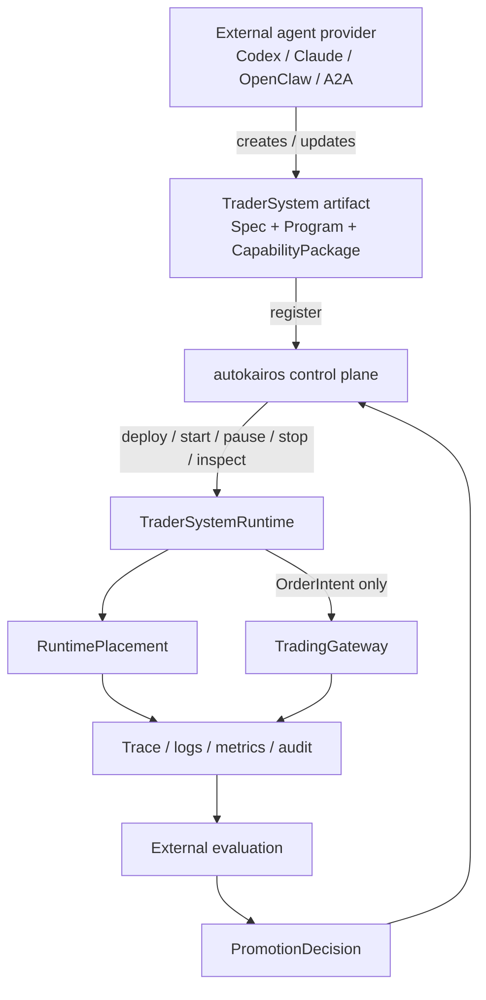

# Control-Plane Overview

This page defines the control plane as the durable ownership layer of autokairos.

It follows:

- [../00-system-map.md](../00-system-map.md)
- [../08-runtime-authority-model.md](../08-runtime-authority-model.md)
- [../09-trader-system-runtime-operating-model.md](../09-trader-system-runtime-operating-model.md)
- [../specs/02-core-primitives.md](../specs/02-core-primitives.md)
- [../specs/04-boundaries.md](../specs/04-boundaries.md)
- [../specs/15-runtime-operating-policy-contract.md](../specs/15-runtime-operating-policy-contract.md)
- [../../sources/synthesis/agent-runtime-and-harness-principles.md](../../sources/synthesis/agent-runtime-and-harness-principles.md)
- [../../sources/synthesis/evaluation-governance-and-promotion.md](../../sources/synthesis/evaluation-governance-and-promotion.md)

## Thesis

The control plane is the subsystem that keeps autokairos legible when the trader-system runtime,
container, provider session, or remote harness changes.

It owns:

- durable identity
- lifecycle control
- placement history
- trace and audit linkage
- evidence sealing
- promotion decisions
- live authority boundaries

It does not own:

- the trader-system's internal decision loop
- provider-private memory
- sandbox-local scratch state
- exchange credentials inside runtime context

## Control Plane In The Whole System



The important boundary is simple:

```text
TraderSystem owns internal trading behavior.
autokairos owns lifecycle, placement, trace, evaluation, gateway, and audit.
```

## Core Responsibilities

### 1. Register artifact truth

The control plane records which `TraderSystemCandidate`, `CandidateVersion`, `TraderSystemSpec`,
`TraderSystemProgram`, and `CapabilityPackage` exist.

### 2. Deploy and control runtime lifecycle

The control plane records `RuntimeControlDecision` and `RuntimeLifecycleEvent` history for
`register`, `deploy`, `start`, `pause`, `resume`, `stop`, `inspect`, `override`, and `kill`.

### 3. Preserve placement without making placement truth

`RuntimePlacement` records where a runtime was physically placed: process, container, provider
session, or endpoint. Placement is replaceable; `TraderSystemRuntime` identity is durable.

### 4. Preserve trace and audit

Provider output, program events, tool requests, gateway decisions, and execution attempts must
become traceable outside one sandbox or provider session.

### 5. Seal evidence separately

Raw trace and evaluator output are not evidence until the evaluation/sealing boundary creates an
`EvidenceRecord`.

### 6. Own promotion and live gate decisions

Promotion is a committed governance decision. It is not a runtime-local success state and not a
provider self-report.

### 7. Bound live authority

Live trader systems emit `OrderIntent`. The `TradingGateway` owns accept/reject/clip decisions and
venue submission.

## One Sentence Summary

The control plane turns agent-built trader-system artifacts and runtime history into durable,
reviewable, policy-constrained system truth.
