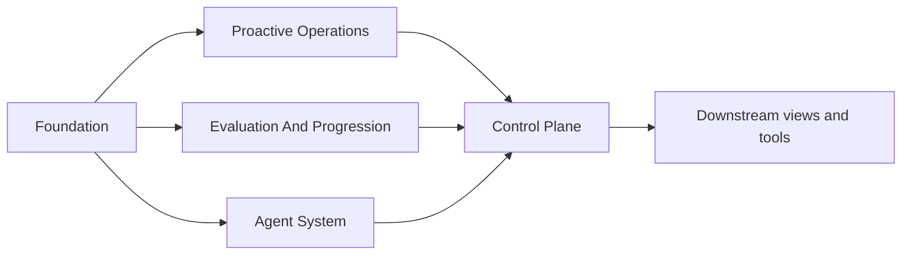

# Control-Plane Overview

This page defines what the control plane is as a subsystem of autokairos.

It follows:

- [../00-first-principles-architecture-thesis.md](../specs/00-first-principles-architecture-thesis.md)
- [../02-core-primitives.md](../specs/02-core-primitives.md)
- [../04-boundaries.md](../specs/04-boundaries.md)
- [../agent-system/01-overview.md](../agent-system/01-overview.md)
- [../proactive-operations/01-overview.md](../proactive-operations/01-overview.md)
- [../evaluation-and-progression/01-overview.md](../evaluation-and-progression/01-overview.md)
- [../specs/12-governed-execution-request-contract.md](../specs/12-governed-execution-request-contract.md)
- [../specs/13-execution-attempt-contract.md](../specs/13-execution-attempt-contract.md)
- [../specs/21-wake-policy-contract.md](../specs/21-wake-policy-contract.md)
- [../specs/22-standing-order-contract.md](../specs/22-standing-order-contract.md)
- [../../sources/library/anthropic-managed-agents.md](../../sources/library/anthropic-managed-agents.md)
- [../../sources/library/repo-anthropics-claude-code.md](../../sources/library/repo-anthropics-claude-code.md)
- [../../sources/library/repo-multica.md](../../sources/library/repo-multica.md)
- [../../sources/library/repo-openclaw.md](../../sources/library/repo-openclaw.md)
- [../../sources/library/repo-paperclip.md](../../sources/library/repo-paperclip.md)
- [../../sources/synthesis/reference-systems-and-product-postures.md](../../sources/synthesis/reference-systems-and-product-postures.md)

## Thesis

The control plane is the durable ownership layer of autokairos.

It is the subsystem that should continue to make sense even when:

- no runtime is currently active
- a workspace has been torn down
- a container has been replaced
- a session has been resumed through a different runtime path

The control plane therefore exists to own and interpret durable system truth outside active
execution.

It should not be treated as:

- a dashboard
- a wrapper around runtime state
- a UI-first admin shell
- a hidden table set behind the runtime

It should be treated as the subsystem that owns:

- durable records
- governance surfaces
- policy constraints
- wake authority and proactive policy truth
- review work
- audit-visible decisions

## Why This Subsystem Exists

The source set converges on the same need from different directions.

- Anthropic's `Managed Agents` separates durable `session` from the active `harness` and
  `sandbox`, which implies that system truth must outlive the currently running loop.
- Claude Code exposes server-managed settings, permissions, monitoring, and security as explicit
  administrative surfaces above the active coding loop.
- Claude Code, Codex, and OpenClaw all expose proactive work through scheduling or automation
  surfaces whose configurations and histories outlive one active foreground turn.
- OpenClaw centralizes session ownership and routing in the `Gateway`, not in transient clients or
  runtime processes.
- Multica treats runtimes, tasks, daemon heartbeats, and autopilot runs as managed records above
  underlying agent CLIs.
- Paperclip treats governance, budgets, approvals, rollback, and tickets as first-class product
  surfaces rather than incidental tooling.

The shared lesson is:

**execution can be delegated, but durable truth and governance still need a clearly owned
subsystem.**

## What The Control Plane Owns

The control plane owns durable interpretation and governance.

It does not own the internals of one active runtime loop.

At a high level, it owns:

- persistent identities and lineage references
- continuity references such as sessions
- governed execution requests and execution attempts
- proactive wake-policy and standing-authority records
- runtime inventory and execution references
- judged artifacts such as evidence
- pending governance work such as review items
- committed governance acts such as promotion decisions
- policy records and audit history

## What The Control Plane Does Not Own

The control plane does not own:

- the inside of a running harness
- ephemeral workspace-local files as authoritative truth
- raw runtime cognition or internal planning state
- UI rendering concerns

Those belong to:

- the agent system
- bounded execution workspaces
- downstream presentation surfaces

## System Placement

The important part of this placement is not the arrows by themselves.

It is the fact that the control plane sits:

- above active execution
- above raw evaluation output
- below no one when durable governance truth is concerned

## Core Responsibilities

The control plane should answer these questions explicitly.

### 1. What durable lines of work exist?

This is where candidate identity, lineage references, and stage standing become inspectable.

### 2. What execution continuity exists?

This is where the system preserves the relationship between candidates, sessions, runtimes, and
recent execution references without mistaking them for the same thing.

That now explicitly includes:

- governed execution requests
- concrete execution attempts
- their associated traces and workspace hosts

### 3. What future work is currently authorized?

This is where the system preserves:

- active wake policy
- standing authority
- self-scheduling history
- trigger history worth auditing later

### 4. What was judged to matter?

This is where `EvidenceRecord` becomes durable and reviewable.

### 5. What governance question is now pending?

This is where `ReviewItem` exists as a first-class control-plane work object.

### 6. What decision was committed?

This is where `PromotionDecision` becomes part of visible system truth.

### 7. Under what policy constraints?

This is where the rule layer lives above raw evidence and below decision commitment.

### 8. How can the whole sequence be audited later?

This is where supersession, rollback, policy changes, and review history remain visible.

## Control Plane In One Sentence

The control plane is the subsystem that turns execution-adjacent artifacts into durable,
reviewable, policy-constrained system truth.
