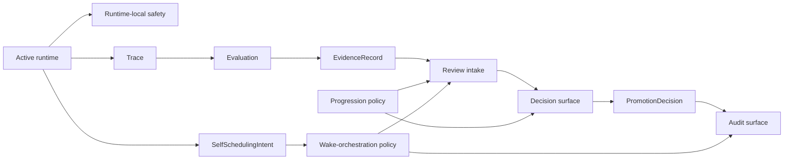

# Governance Surfaces

This page defines the distinct governance surfaces that make up the control plane.

It follows:

- [01-overview.md](01-overview.md)
- [../04-boundaries.md](../specs/04-boundaries.md)
- [../evaluation-and-progression/02-evaluation-flow.md](../evaluation-and-progression/02-evaluation-flow.md)
- [../evaluation-and-progression/04-review-and-decision-path.md](../evaluation-and-progression/04-review-and-decision-path.md)
- [../../sources/library/anthropic-building-effective-agents.md](../../sources/library/anthropic-building-effective-agents.md)
- [../../sources/library/anthropic-managed-agents.md](../../sources/library/anthropic-managed-agents.md)
- [../../sources/library/repo-anthropics-claude-code.md](../../sources/library/repo-anthropics-claude-code.md)
- [../../sources/library/repo-paperclip.md](../../sources/library/repo-paperclip.md)
- [../../sources/synthesis/evaluation-governance-and-promotion.md](../../sources/synthesis/evaluation-governance-and-promotion.md)

## Thesis

autokairos should not have one vague thing called `governance`.

It should have several distinct governance surfaces, each answering a different control question.

The main mistake this section tries to prevent is collapsing:

- runtime-local permission checks
- proactive wake authority
- evaluation
- policy
- review intake
- decision commitment
- audit

into one fuzzy approval layer.

## Why This Separation Matters

The source set keeps drawing a line between open-ended agent activity and explicit surrounding
workflow.

- Anthropic's `Building effective agents` says predictable paths should stay explicit.
- Claude Code shows that permissions, sandboxing, checkpoints, and security controls are real but
  local to active execution.
- Paperclip shows that review, approval, governance, and rollback can be first-class product
  surfaces.
- OpenAI's HITL and evaluation guidance shows interruption, grading, and final interpretation are
  different system moments.

Taken together, the lesson is:

**governance is not one event. It is a layered system of surfaces around execution.**

## Governance Surface Map

This is a logical decomposition, not a UI claim.

## Surface Comparison

| Surface | Main question | Typical inputs | Typical outputs | Must not be confused with |
| --- | --- | --- | --- | --- |
| Runtime-local safety | may this active run do this now? | tool call, connector request, command intent | allow, ask, deny, interrupt | promotion governance |
| Wake-orchestration policy | what future wakes are allowed or blocked? | signal family, wake policy, standing order, self-scheduling intent | accepted change, clamped change, suppressed trigger, review-required change | runtime approval or promotion policy |
| Evaluation | what counted and why? | trace, metrics, eval results | evidence | runtime permissions |
| Progression policy | what candidate-stage outcomes are allowed? | stage, evidence class, risk rules, freshness rules | constraints, required checks, hard blocks | evidence or wake policy |
| Review intake | what governance question is now pending? | evidence packet, candidate stage context | review item | evaluation itself |
| Decision surface | what standing should now change? | review item, policy constraints, evidence basis | promotion decision | runtime approval |
| Audit | how is the whole chain preserved? | committed records, supersession links, policy changes | audit-visible history | mutable status fields only |

## 1. Runtime-Local Safety

This surface lives closest to active execution.

It answers:

> may the active run do this right now?

Examples:

- filesystem or network permissions
- tool-use confirmation
- connector-side effect confirmation
- sandbox rules
- interruption or stop

This is where Claude Code is the strongest reference.

The key boundary is:

**runtime-local safety can stop or permit an action, but it does not promote a candidate.**

## 2. Wake-Orchestration Policy

This surface governs proactive authority.

It answers:

> what future work is allowed to wake, under what standing authority, and which runtime proposals
> may auto-apply?

Examples:

- allow a tighter cadence only during market hours
- prevent disabling a mandatory risk trigger
- require review before adding a new event-watch family
- suppress a duplicate burst of event triggers

Its output is not candidate progression.

Its output is:

- accepted or rejected wake-policy change
- emitted or suppressed wake trigger
- review-required orchestration question when needed

## 3. Evaluation

This surface turns raw run output into judged artifacts.

It answers:

> what counted, by what method, and with what legitimacy?

Examples:

- backtesting metric computation
- paper-stage performance review
- risk analysis pass
- trace grading

Its output is not a promotion decision.

Its output is `EvidenceRecord`.

## 4. Progression Policy

This surface constrains what decisions are even available.

It answers:

> under what rules may the system accept or reject advancement?

Examples:

- live advancement forbidden from host-local execution
- stale evidence requires re-evaluation
- live-stage candidates require sealed risk review
- certain stage transitions require human review

Policy is not evidence.

Policy is not decision.

Policy is the rule layer that narrows or blocks decision space.

## 5. Review Intake

This surface turns evidence into an explicit governance question.

It answers:

> what candidate-stage question is now pending because of this evidence?

This is where the system should create or update a `ReviewItem`.

Without this surface, evidence accumulates with no explicit downstream question.

## 6. Decision Surface

This surface commits candidate standing changes.

It answers:

> given this evidence packet, policy context, and pending review question, what governance action
> should be committed?

Its output is `PromotionDecision`.

Possible deciders include:

- human operator
- scheduled review workflow
- hybrid policy-constrained reviewer

The key boundary is:

**decision commitment is not the same thing as runtime approval.**

## 7. Audit

This surface preserves the history of governance itself.

It answers:

> how can the system later reconstruct what was decided, by whom, under which rules, and from
> which evidence basis?

Examples:

- committed decisions
- rollback and supersession links
- policy changes
- review history
- runtime inventory changes that matter for legitimacy

This surface exists so that candidate standing is not reducible to one mutable status field.

## Stable Rules

If this architecture is implemented correctly:

- runtime-local safety never silently substitutes for promotion governance
- wake-orchestration policy never silently substitutes for runtime-local approval
- evaluation never silently substitutes for decision commitment
- progression policy never silently substitutes for evidence
- review intake never silently substitutes for decision
- audit never depends on operator memory
