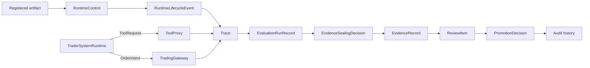

# Governance Surfaces

This page defines the distinct governance surfaces that make up the control plane.

It follows:

- [01-overview.md](01-overview.md)
- [../specs/04-boundaries.md](../specs/04-boundaries.md)
- [../specs/15-runtime-operating-policy-contract.md](../specs/15-runtime-operating-policy-contract.md)
- [../specs/17-evaluation-comparability-and-sealing-contract.md](../specs/17-evaluation-comparability-and-sealing-contract.md)
- [../../sources/synthesis/evaluation-governance-and-promotion.md](../../sources/synthesis/evaluation-governance-and-promotion.md)

## Thesis

autokairos should not have one vague approval layer.

It should separate:

- runtime lifecycle control
- runtime-local safety
- tool and credential access
- live trading gateway authority
- evaluation sealing
- review intake
- promotion decisions
- audit history

## Governance Surface Map

## Surface Comparison

| Surface | Main question | Output | Must not be confused with |
| --- | --- | --- | --- |
| Runtime lifecycle control | should this runtime be registered, deployed, started, paused, resumed, stopped, overridden, or killed? | `RuntimeControlDecision`, `RuntimeLifecycleEvent` | trader-system internal strategy |
| Runtime-local safety | may this active process/tool action proceed now? | allow, deny, interrupt, fail-safe | promotion governance |
| Tool and credential access | what can this runtime access under this stage binding? | tool proxy decision, credential binding result | capability package declaration |
| Live gateway authority | may this order intent become an order request? | `GatewayDecision` | agent/program confidence |
| Evaluation sealing | what counted, by what method, under what comparison set? | `EvidenceRecord` | trace or evaluator raw output |
| Review intake | what governance question is pending? | `ReviewItem` | evidence itself |
| Promotion decision | what candidate standing changes? | `PromotionDecision` | runtime success state |
| Audit | how can the chain be reconstructed later? | durable history | mutable status fields |

## RuntimeControl Is Not Internal Orchestration

`RuntimeControl` is an external lifecycle and governance surface.

It can start, pause, resume, stop, inspect, override, or kill a deployed trader-system runtime. It
does not choose the trader-system's next market action and does not call internal handlers.

## One Sentence Summary

Governance is the set of external lifecycle, access, evaluation, promotion, live-authority, and
audit surfaces around a trader-system runtime, not a step-by-step execution engine inside it.
