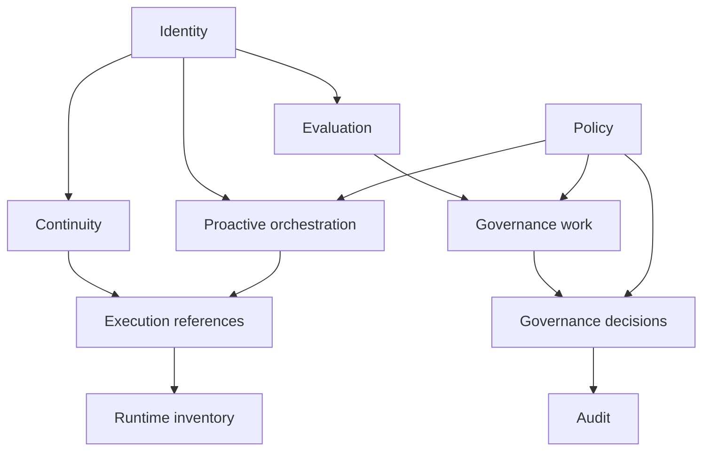

# Control-Plane Record Model

This page defines the durable record families the control plane should own.

It follows:

- [01-overview.md](01-overview.md)
- [02-governance-surfaces.md](02-governance-surfaces.md)
- [../02-core-primitives.md](../specs/02-core-primitives.md)
- [../../sources/library/anthropic-managed-agents.md](../../sources/library/anthropic-managed-agents.md)
- [../../sources/library/repo-anthropics-claude-code.md](../../sources/library/repo-anthropics-claude-code.md)
- [../../sources/library/repo-multica.md](../../sources/library/repo-multica.md)
- [../../sources/library/repo-openclaw.md](../../sources/library/repo-openclaw.md)
- [../../sources/library/repo-paperclip.md](../../sources/library/repo-paperclip.md)

## Thesis

The control plane should have an explicit durable record model.

It should not be reduced to:

- a dashboard over runtime state
- a loose set of tables
- an API layer that mirrors whichever runtime happened to be active last

Instead, it should own the durable records that make system truth reconstructable outside:

- active execution
- mutable workspace state
- operator memory

That durable model should not be read as "one mutable table per object."

At the architectural level, the safer posture is:

- append-only history where chronology matters
- explicit current-state projections where fast operational reads matter
- backend-specific storage decisions only after those two layers are clear

These record families should also not be read as a permanently frozen product schema.

The invariant is:

- what kinds of truth the control plane must own
- what provenance and authority it must preserve

not one forever-closed list of kinds, tables, or projection shapes.

## Why Record Families Matter

The main architectural risk is that durable truth drifts back into the wrong place.

Examples:

- session truth drifting into one runtime process
- candidate standing drifting into a mutable workspace artifact
- review status drifting into human memory
- legitimacy drifting into undocumented operator assumptions

An explicit record model prevents that drift by making durable ownership visible.

## Record Family Map

## Record Families

## 1. Identity Records

These records define stable named entities in the system.

### Examples

- candidate records
- agent identity records

### Why they matter

Identity should not be inferred from the last active runtime or workspace.

## 2. Continuity Records

These records preserve continuity across runs without becoming the candidate itself.

### Examples

- session records

### Why they matter

Anthropic's `session` abstraction is the strongest source-level reminder that continuity needs its
own durable surface outside a transient harness instance.

## 3. Runtime Inventory Records

These records describe what execution infrastructure exists and in what condition.

### Examples

- runtime driver records
- runtime host or device records
- worker image references
- health and liveness records

### Why they matter

Multica is the clearest reference here. Its daemon, runtime device, and heartbeat posture shows
that runtime inventory belongs in a managed record layer above the underlying CLI.

## 4. Execution Reference Records

These records tie durable work objects to concrete attempts at execution.

### Examples

- execution-request records
- execution-attempt references
- workspace-host references
- trace references
- primary wake-cause linkage on execution-request records
- last-active runtime association

### Why they matter

The control plane must know what happened and where without promoting one workspace or container
into the center of truth.

This family must also preserve the bridge between proactive history and execution history.

In practice that means an `ExecutionRequest` should be able to point back to:

- one originating `ProactiveEvaluationRecord` directly or through durable wake provenance
- one primary `WakeTriggerRecord` when work was proactively emitted
- any coalesced wake-origin records that materially contributed to the same request

## 5. Proactive-Orchestration Records

These records define and explain future-work authority outside the runtime.

### Examples

- wake-policy records
- standing-order records
- self-scheduling-intent records
- wake-trigger history
- proactive-evaluation records
- current proactive standing views
- standing watermark and reconciliation posture

### Why they matter

Without this family:

- scheduler truth drifts into one service process
- standing authority lives only in prose or operator habit
- accepted or rejected self-scheduling changes cannot be reconstructed
- "why did the system wake?" becomes a log-forensics problem

## 6. Evaluation Records

These records preserve what was judged to matter.

### Examples

- evidence records

### Why they matter

This family is the main boundary against governance by anecdote or self-report.

## 7. Governance Work Records

These records preserve pending or active governance work.

### Examples

- review-item records

### Why they matter

Without this family, the system has evidence but no durable object representing the question now
awaiting review.

## 8. Governance Decision Records

These records preserve committed standing changes.

### Examples

- promotion-decision records

### Why they matter

Candidate standing should be derivable from explicit governance history, not only from one mutable
status field.

## 9. Policy Records

These records define the rule layer that constrains what decisions are allowed.

### Examples

- stage-transition policies
- wake-orchestration policies
- freshness requirements
- legitimacy requirements
- risk thresholds
- mandatory review classes

### Why they matter

Policy should not be hidden in prompts or inferred from ad hoc operator habits.

## 10. Audit Records

These records preserve the history of control-plane mutation itself.

### Examples

- policy changes
- supersession and rescission links
- review history
- decision audit logs
- runtime-inventory changes relevant to legitimacy

### Why they matter

Paperclip and Claude Code's administrative posture both point to the same lesson:
the governance layer should itself be inspectable.

## Ownership Rules

The control plane should own these records as durable truth.

The agent system may read many of them.

The runtime bridge may consume many of them.

But the runtime side should not silently become their primary owner.

## Stable Invariants

The record model is doing its job if these statements remain true:

- candidate identity is not inferred from a workspace
- session continuity is not inferred from a container
- wake authority is not inferred from one scheduler process
- execution-request provenance is not inferred from a generic scheduler label or one surviving
  scheduler log
- evidence is not reconstructed from memory after the fact
- review state is not an implicit inbox convention
- decisions are not reducible to runtime approvals
- audit history does not depend on one mutable current-state view
