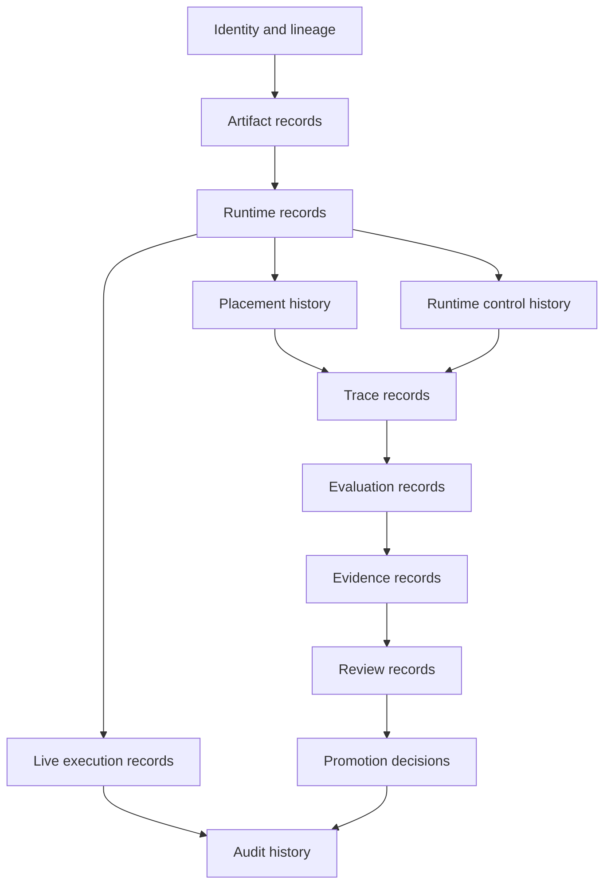

# Control-Plane Record Model

This page defines the durable record families the control plane owns.

It follows:

- [01-overview.md](01-overview.md)
- [02-governance-surfaces.md](02-governance-surfaces.md)
- [../specs/02-core-primitives.md](../specs/02-core-primitives.md)
- [../specs/09-trace-contract.md](../specs/09-trace-contract.md)
- [../specs/17-evaluation-comparability-and-sealing-contract.md](../specs/17-evaluation-comparability-and-sealing-contract.md)

## Thesis

The control plane should have explicit durable record families so runtime state never becomes
product truth by accident.

At the architecture level, the safe posture is:

- append-only history where chronology matters
- explicit current-state projections where fast operational reads matter
- replaceable storage implementation after record ownership is clear

## Record Family Map

## Record Families

### 1. Identity And Lineage Records

Stable identities that do not depend on the currently running process:

- `TraderSystemCandidate`
- `CandidateVersion`
- `TraderSystemSpec`
- `TraderSystemProgram`
- `CapabilityPackage`

### 2. Runtime Records

The deployed logical runtime:

- `TraderSystemRuntime`
- `RuntimeOperatingPolicy`
- `RuntimeStatus`

The runtime is durable. Its physical placement is not.

### 3. Placement Records

Physical launch or attachment history:

- `RuntimePlacement`
- `HandsEnvironment`
- provider-backed `AgentSession`
- connector/adapter refs

Placement can fail, detach, or be recreated without changing runtime identity.

### 4. Runtime Control Records

External lifecycle decisions and resulting state:

- `RuntimeControlDecision`
- `RuntimeLifecycleEvent`
- pause/resume/stop/override/kill audit refs

These records describe what autokairos controlled, not what the trader system decided internally.

### 5. Trace Records

Recoverable runtime history:

- provider `AgentEvent`
- `ProgramEvent`
- tool request/result refs
- gateway decision refs
- placement events
- control events

Trace is not evidence until evaluated and sealed.

### 6. Evaluation And Evidence Records

Records that preserve how trace became judgment:

- `EvaluationRunRecord`
- `EvaluationComparisonSet`
- `EvidenceSealingDecision`
- `EvidenceRecord`

### 7. Review And Promotion Records

Governance work and committed standing changes:

- `ReviewItem`
- `PromotionDecision`

### 8. Live Execution Records

Live authority chain:

- `GovernedExecutionRequest`
- `OrderIntent`
- `GatewayDecision`
- `ExecutionAttempt`

The runtime proposes; the gateway decides.

### 9. Audit Records

The audit family ties together lifecycle, placement, trace, evidence, promotion, intervention, and
live execution so the operator can reconstruct what happened later.

## One Sentence Summary

The record model preserves durable identity, lifecycle, placement, trace, evidence, promotion, live
authority, and audit without treating runtime internals as control-plane truth.
