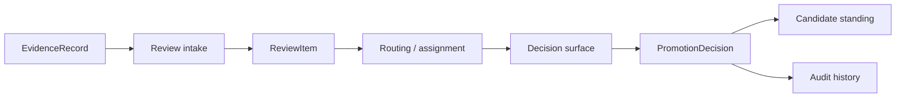

# Review Operations And Audit

This page defines how the control plane should operationalize review work and preserve auditability.

It follows:

- [02-governance-surfaces.md](02-governance-surfaces.md)
- [03-record-model.md](03-record-model.md)
- [../evaluation-and-progression/04-review-and-decision-path.md](../evaluation-and-progression/04-review-and-decision-path.md)
- [../10-evidence-record-contract.md](../specs/10-evidence-record-contract.md)
- [../11-promotion-decision-contract.md](../specs/11-promotion-decision-contract.md)
- [../14-review-item-contract.md](../specs/14-review-item-contract.md)
- [../../sources/library/repo-paperclip.md](../../sources/library/repo-paperclip.md)
- [../../sources/library/repo-multica.md](../../sources/library/repo-multica.md)
- [../../sources/library/repo-anthropics-claude-code.md](../../sources/library/repo-anthropics-claude-code.md)
- [../../sources/synthesis/evaluation-governance-and-promotion.md](../../sources/synthesis/evaluation-governance-and-promotion.md)

## Thesis

The control plane should treat review as an explicit operational loop, not as ad hoc human cleanup.

That loop should make four things durable:

- what question is pending
- what evidence packet is attached
- who or what must resolve it
- what audit-visible outcome was committed

## Why This Operational Layer Matters

Without explicit review operations, the architecture degrades in familiar ways.

- evidence accumulates but no review question becomes visible
- reviewers act from memory instead of from a durable packet
- runtime-local approvals get mistaken for promotion
- rollback becomes a special-case patch instead of a first-class governance move

This page keeps the operational layer explicit between abstract governance surfaces and lower-level
contracts.

The same operational machinery may also resolve proactive-orchestration questions when:

- a self-scheduling intent exceeds standing authority
- a wake-policy change would widen scope or cadence beyond policy bounds
- a mandatory trigger would be disabled or suppressed

## Operational Flow

## Review Operations

## 1. Intake

The review loop starts when evidence becomes governance-relevant.

The system should explicitly decide whether new evidence means:

- no review needed yet
- an existing review item should be updated
- a new review item should be created

The output of intake is not a decision.

The output of intake is a clearly defined `ReviewItem`.

## 2. Packaging

Once intake occurs, the control plane should package a reviewable case.

That package should make these questions answerable without hunting through logs:

- what candidate is under review?
- at what stage?
- what is the actual question?
- what evidence records are attached?
- what policy constraints already apply?

This is where the system should resist turning review into a free-form inbox note.

## 3. Routing

After packaging, the item should be routed to the correct decision surface.

Possible routing modes:

- human operator review
- scheduled review pass
- policy-constrained hybrid review

Routing should remain durable and inspectable.

It should not live only in operator convention.

## 4. Blocking

Not every review item is immediately resolvable.

The control plane should preserve blocked state explicitly.

Examples:

- freshness requirement not met
- missing risk review
- insufficient legitimacy for the current stage
- required human reviewer unavailable

Blocked review is different from empty review.

## 5. Decision Commitment

When a review item is resolved, the committed result should be a `PromotionDecision`.

The control plane should preserve:

- which review item was resolved
- which decision surface resolved it
- which evidence basis was cited
- whether the result was promote, stay, pause, demote, reject, or rollback

This is the moment where candidate standing changes or is explicitly preserved.

## 6. Audit Preservation

Once a decision exists, the system should preserve more than a current status field.

The audit layer should keep:

- decision history
- evidence links
- supersession links
- rollback links
- relevant policy context
- review-item history

That is the only way to support later diagnosis, dispute, and legitimacy checks.

## Review Operations Versus Runtime Operations

This distinction must remain sharp.

| Concern | Runtime-side question | Control-plane review question |
| --- | --- | --- |
| approval | may this active run do this action now? | should this candidate advance, stay, pause, or roll back? |
| scope | one active run | one candidate-stage governance question |
| output | allow, deny, interrupt | review item, decision, audit history |
| owner | runtime-local control | control plane |

## Audit Rules

The audit posture should satisfy these rules.

### 1. Decisions are citeable

Every committed decision should point back to explicit evidence.

### 2. Review work is reconstructable

The system should preserve how a question moved through intake, routing, blocking, and resolution.

### 3. Supersession is visible

If a decision is replaced or rolled back, the relation should be explicit.

### 4. Policy context is inspectable

It should be possible to tell whether a decision was constrained by a hard policy requirement.

### 5. Audit is external

Audit history should not depend on the continued existence of one runtime process or workspace.

## One Sentence Summary

The control plane should run review as explicit governance work and preserve every committed
outcome as audit-visible history.
