# Review Operations And Audit

This page defines how the control plane operationalizes review and preserves auditability.

It follows:

- [02-governance-surfaces.md](02-governance-surfaces.md)
- [03-record-model.md](03-record-model.md)
- [../specs/10-evidence-record-contract.md](../specs/10-evidence-record-contract.md)
- [../specs/11-promotion-decision-contract.md](../specs/11-promotion-decision-contract.md)
- [../specs/14-review-item-contract.md](../specs/14-review-item-contract.md)
- [../specs/17-evaluation-comparability-and-sealing-contract.md](../specs/17-evaluation-comparability-and-sealing-contract.md)
- [../../sources/synthesis/evaluation-governance-and-promotion.md](../../sources/synthesis/evaluation-governance-and-promotion.md)

## Thesis

Review is explicit governance work. It is not ad hoc operator cleanup and it is not runtime-local
approval.

The review loop makes four things durable:

- what question is pending
- what sealed evidence packet is attached
- who or what may resolve it
- what audit-visible outcome was committed

## Operational Flow

```mermaid
flowchart LR
    TRACE["Trace"] --> ERUN["EvaluationRunRecord"]
    ERUN --> SEAL["EvidenceSealingDecision"]
    SEAL --> EV["EvidenceRecord"]
    EV --> REVIEW["ReviewItem"]
    REVIEW --> ROUTE["Routing / assignment"]
    ROUTE --> DECIDE["Decision surface"]
    DECIDE --> PROMO["PromotionDecision"]
    PROMO --> AUDIT["Audit history"]
```

## Review Operations

### 1. Intake

The system decides whether sealed evidence creates, updates, or does not require a `ReviewItem`.

### 2. Packaging

The review item must show:

- candidate and version
- stage context
- evidence records
- comparison set
- policy constraints
- unresolved questions

### 3. Routing

The control plane routes the review item to a human operator, policy-constrained reviewer, or later
designed review surface. Routing is durable and inspectable.

### 4. Blocking

Blocked review state is explicit.

Examples:

- missing risk review
- stale evaluation window
- non-comparable results
- required operator unavailable

### 5. Decision Commitment

A resolved review item may create a `PromotionDecision`.

The decision must cite evidence and policy context. It cannot rely on provider confidence, memory
summary, raw trace, or operator satisfaction alone.

### 6. Audit Preservation

Audit history preserves:

- lifecycle control decisions
- placement history
- trace refs
- evidence refs
- review transitions
- promotion decisions
- live gateway decisions
- override/stop/kill actions

## Review Operations Versus Runtime Operations

| Concern | Runtime-side question | Control-plane review question |
| --- | --- | --- |
| Lifecycle | should this deployed runtime continue? | did this lifecycle action preserve auditability? |
| Action | may this tool or order intent proceed? | does the result count toward standing? |
| Evidence | what happened in trace? | what was sealed as counted or non-counted evidence? |
| Promotion | not owned by runtime | should candidate standing change? |

## One Sentence Summary

The control plane keeps review and audit external to the trader-system runtime, so runtime behavior
can be powerful without becoming its own judge.
