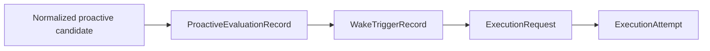
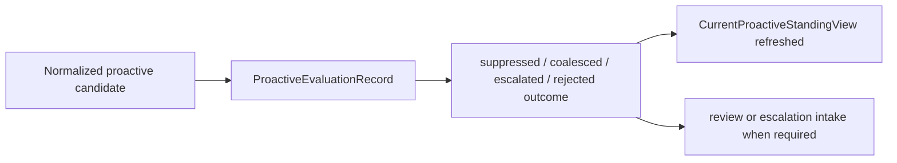

# Proactive Causality And Standing Reconciliation

This page defines how proactive chronology should remain causally linked into execution chronology,
and how current proactive standing should remain trustworthy without becoming the only proactive
truth.

It follows:

- [07-history-and-projection-model.md](07-history-and-projection-model.md)
- [08-proactive-evaluation-history-and-standing.md](08-proactive-evaluation-history-and-standing.md)
- [../proactive-operations/07-policy-evaluation-and-resolution.md](../proactive-operations/07-policy-evaluation-and-resolution.md)
- [../specs/23-wake-trigger-record-contract.md](../specs/23-wake-trigger-record-contract.md)
- [../specs/36-proactive-evaluation-record-contract.md](../specs/36-proactive-evaluation-record-contract.md)
- [../specs/37-current-proactive-standing-view-contract.md](../specs/37-current-proactive-standing-view-contract.md)
- [../specs/38-proactive-evaluation-to-execution-linkage-contract.md](../specs/38-proactive-evaluation-to-execution-linkage-contract.md)
- [../specs/39-proactive-standing-watermark-and-reconciliation-contract.md](../specs/39-proactive-standing-watermark-and-reconciliation-contract.md)

It is also informed by additional official documentation:

- [OpenClaw: Automation & Tasks](https://docs.openclaw.ai/automation)
- [OpenClaw: Standing Orders](https://docs.openclaw.ai/automation/standing-orders)
- [Claude Code: Run prompts on a schedule](https://code.claude.com/docs/en/scheduled-tasks)
- [Claude Code: Automate work with routines](https://code.claude.com/docs/en/web-scheduled-tasks)
- [OpenAI Agents SDK: Results](https://openai.github.io/openai-agents-js/guides/results/)
- [OpenAI Agents SDK: Tracing](https://openai.github.io/openai-agents-python/tracing/)

## Purpose

Explain two adjacent control-plane requirements:

- how proactive evaluation history should stay causally connected to emitted work
- how current proactive standing should remain operationally readable without hiding freshness,
  lag, or rebuild posture

## Scope And Non-Goals

This page covers:

- the proactive causal spine from evaluation into execution
- the boundary between durable chronology and current proactive standing
- watermark and reconciliation posture for live proactive reads

This page does not cover:

- one storage backend
- one projection engine
- one scheduler implementation
- one UI for proactive status

## Responsibilities

- preserve one explainable path from proactive authority evaluation into emitted execution work
- prevent `ExecutionRequest` creation from severing proactive provenance
- require current proactive standing to advertise freshness and reconciliation state
- keep current standing rebuildable from durable history and active authority

## System Boundaries

This layer sits between:

- proactive authority evaluation
- emitted wake-trigger history
- governed execution issuance

And downstream of:

- current operator and runtime-facing proactive reads

## Primary Abstractions

- proactive causal spine
- primary versus coalesced wake origin
- standing watermark posture
- standing reconciliation posture

## Primary Flows

The emitted path should be read as:

The non-emitted path should still remain durable:

## Failure And Recovery Model

This layer has failed when:

- an `ExecutionRequest` exists but its proactive cause can only be recovered from logs
- coalesced origins survive only as prose
- current proactive standing looks current but exposes no watermark or drift posture
- a damaged standing view cannot be rebuilt from authority and durable history

Recovery means:

- walking back through explicit `ProactiveEvaluationRecord -> WakeTriggerRecord -> ExecutionRequest`
  linkage
- rebuilding current proactive standing from durable history plus active authority
- downgrading trust when watermark coverage or reconciliation coverage is incomplete

## Dependencies On Other Subsystems

- depends on proactive operations for normalized candidates, clause evaluation, and overlap rules
- depends on control-plane history/projection doctrine
- feeds the agent system through governed execution issuance

## What Is Still Delegated To Specs / ADRs

- narrow linkage rules remain in
  [../specs/38-proactive-evaluation-to-execution-linkage-contract.md](../specs/38-proactive-evaluation-to-execution-linkage-contract.md)
- standing freshness and rebuild rules remain in
  [../specs/39-proactive-standing-watermark-and-reconciliation-contract.md](../specs/39-proactive-standing-watermark-and-reconciliation-contract.md)
- the durable decision remains in
  [../adrs/0014-proactive-causality-and-reconciliation.md](../adrs/0014-proactive-causality-and-reconciliation.md)

## Core Rule

autokairos should preserve proactive truth at three adjacent levels:

- append-only proactive evaluation chronology
- append-only wake-trigger and execution chronology
- rebuildable current proactive standing with explicit watermark and reconciliation posture

These three levels must remain linked, but not collapsed.

## Why Causal Linkage Matters

The system should always be able to answer:

- which proactive evaluation produced this wake?
- which wake produced this execution request?
- which additional wake candidates were coalesced into the same request?
- which evaluations did not emit work, and why?

If those answers disappear at the request boundary, then proactive evaluation becomes durable on
paper but operationally useless.

## Why Watermarks Matter

The system should also always be able to answer:

- what authority and history horizon does the current standing view reflect?
- is this standing view fresh enough for a live operational read?
- is it lagging, rebuilding, drifted, or in sync?

Without that posture, `CurrentProactiveStandingView` becomes a convenient but unsafe mutable row.

## One Sentence Summary

autokairos should keep proactive evaluation causally linked into emitted execution work and keep
current proactive standing trustworthy only when its watermark and reconciliation posture are
explicit.
