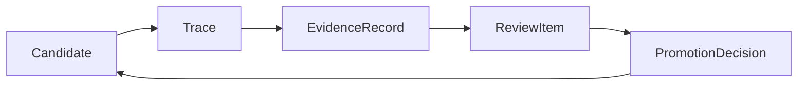
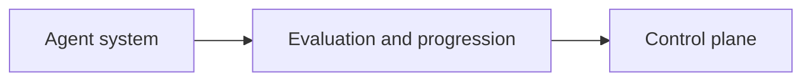

# Evaluation And Progression Overview

This page defines what the evaluation-and-progression subsystem is in autokairos.

It is the first page to read inside this section.

It is grounded in:

- [../../sources/synthesis/evaluation-governance-and-promotion.md](../../sources/synthesis/evaluation-governance-and-promotion.md)
- [../../sources/library/anthropic-automated-alignment-researchers.md](../../sources/library/anthropic-automated-alignment-researchers.md)
- [../../sources/library/anthropic-automated-w2s-researcher.md](../../sources/library/anthropic-automated-w2s-researcher.md)
- [../../sources/library/repo-safety-research-automated-w2s-research.md](../../sources/library/repo-safety-research-automated-w2s-research.md)
- [../../sources/library/repo-paperclip.md](../../sources/library/repo-paperclip.md)
- [../../sources/library/openai-next-evolution-of-the-agents-sdk.md](../../sources/library/openai-next-evolution-of-the-agents-sdk.md)

And it follows:

- [../00-first-principles-architecture-thesis.md](../historical/specs/00-first-principles-architecture-thesis.md)
- [../02-core-primitives.md](../specs/02-core-primitives.md)
- [../04-boundaries.md](../specs/04-boundaries.md)

## Thesis

The evaluation-and-progression subsystem is where autokairos decides what counted and whether a
candidate may advance.

Its job is not to run the agent. Its job is to transform raw execution history into:

- judged evidence
- pending review questions
- explicit progression decisions

That is the subsystem that makes autokairos a governed search system rather than merely a runtime
shell.

## Why This Subsystem Exists

The source set is unusually consistent here.

- AAR and W2S show that once search scales, evaluation becomes the bottleneck.
- The W2S repo shows that execution legitimacy depends on where truth and scoring live.
- OpenAI's eval posture separates raw traces from grading and eval runs.
- Paperclip shows that durable work still needs an explicit governance layer above active work.

Taken together, this means autokairos needs a subsystem that is neither:

- the runtime loop, nor
- the broad control plane as a whole.

It needs a narrower layer concerned specifically with:

- candidate standing
- stage progression
- evidence
- review
- progression decisions

## The Core Flow

This is the central meaning flow of the subsystem.

- `Candidate` is the thing under judgment
- `Trace` records what happened
- `EvidenceRecord` captures what counted
- `ReviewItem` captures what governance question is pending
- `PromotionDecision` commits what changed

## Where This Sits In The Whole System

This diagram is intentionally asymmetrical.

- the agent system produces execution history
- evaluation and progression interpret that history
- the control plane stores and governs the durable records around it

The evaluation-and-progression subsystem therefore sits between execution and durable governance.

## What This Subsystem Owns

It should own the logic and semantics of:

- stage ladder meaning
- what counts as evidence
- what outcomes are possible at a stage
- what review-worthy questions exist
- how advancement and non-advancement are expressed

It should not own:

- runtime launch and workspace execution
- generic policy precedence for the whole product
- broad audit and record families outside progression concerns

## The Four Questions This Section Must Answer

1. What is the evaluation flow from trace to decision?
2. How does staged progression actually work?
3. What work object carries pending governance questions?
4. What exactly changes when a candidate advances, pauses, demotes, rejects, or rolls back?

Those are answered by:

- [02-evaluation-flow.md](02-evaluation-flow.md)
- [03-progression-model.md](03-progression-model.md)
- [04-review-and-decision-path.md](04-review-and-decision-path.md)

The lower-level contract pages remain supporting specifications.
