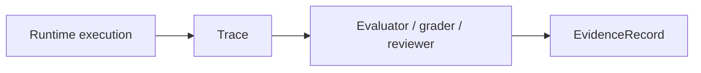

# Evaluation Flow

This page defines the evaluation flow inside autokairos.

It follows:

- [01-overview.md](01-overview.md)
- [../03-staged-evaluation.md](../specs/03-staged-evaluation.md)
- [../09-trace-contract.md](../specs/09-trace-contract.md)
- [../10-evidence-record-contract.md](../specs/10-evidence-record-contract.md)
- [../../sources/library/openai-next-evolution-of-the-agents-sdk.md](../../sources/library/openai-next-evolution-of-the-agents-sdk.md)
- [../../sources/library/anthropic-automated-w2s-researcher.md](../../sources/library/anthropic-automated-w2s-researcher.md)
- [../../sources/library/repo-safety-research-automated-w2s-research.md](../../sources/library/repo-safety-research-automated-w2s-research.md)

## Thesis

The evaluation flow should transform runtime history into judged artifacts without letting raw
runtime output count as progression truth by itself.

That means the flow must preserve three distinct layers:

- raw record
- judged evidence
- committed governance

This page covers only the first two. The governance handoff comes later in the section.

## The Evaluation Flow

This is the minimal trusted flow.

The runtime may produce a lot of data, but only some of it becomes stage-relevant evidence.

## Step 1: Execution Produces Trace

The runtime emits a `Trace`.

This is the external raw record of:

- model activity
- tool and connector activity
- failures and interruptions
- relevant stage-bound runtime metadata

The important rule is:

**the trace is external, but it is still raw.**

It is not yet what "counts."

## Step 2: Evaluation Interprets The Trace

Evaluation then acts on the trace through one or more explicit methods.

Examples:

- metric aggregation
- grader output
- remote evaluation service
- human review
- hybrid review

The source base strongly supports keeping this layer explicit.

- OpenAI separates traces from grading.
- W2S keeps labels and key truth outside the worker environment.
- AAR treats evaluation design as the hard part once search gets cheaper.

## Step 3: Evaluation Produces EvidenceRecord

The evaluation step produces an `EvidenceRecord`.

This is the judged artifact that says:

- what was evaluated
- under which stage
- by which method
- with which findings
- with which freshness and legitimacy limits

That is what makes it suitable for later review and progression.

## The Three Evaluation Layers

| Layer | Main question | Canonical object |
| --- | --- | --- |
| runtime history | what happened? | `Trace` |
| judged evaluation | what counted? | `EvidenceRecord` |
| progression governance | what changed? | `PromotionDecision` |

This page stops at the second layer.

## Why Raw Trace Is Not Enough

If the system skips the evidence layer and uses traces directly for advancement:

- raw logs become promotable facts
- methodology gets hidden
- legitimacy gets blurred
- progression becomes hard to audit

That is exactly the failure mode the source base warns against.

## Why Evaluation Must Stay Stage-Scoped

Evidence must always remain stage-scoped.

The same candidate may have:

- strong backtesting evidence
- weak paper evidence
- paused live evidence

Those are not interchangeable.

So the evaluation flow must always preserve:

- candidate scope
- stage scope
- method scope
- freshness

## Evaluation Methods Are Not All Equivalent

The system should allow different evaluator kinds without flattening them.

Examples:

- `trace_grade`
- `eval_run_summary`
- `human_review`
- `risk_review`
- `market_performance_summary`
- `regression_comparison`

These may all produce `EvidenceRecord`, but they should still remain distinguishable.

This is how autokairos can later compare:

- model-judged evidence
- metric-derived evidence
- human-judged evidence

without pretending they are the same thing.

## Runtime Approval Still Does Not Belong Here

OpenAI's HITL guide is useful mainly as a contrast.

It shows that a run can pause on approval, serialize `RunState`, and resume later.

That is an execution-time interruption surface.

It is not yet the evaluation flow described here.

So the subsystem should preserve this distinction:

- runtime approvals affect whether execution can continue
- evaluation affects what counted from execution

## Minimal Evaluation Contract

Before any promotion can happen, the subsystem should be able to answer:

1. Which traces were evaluated?
2. Under which stage?
3. By which method?
4. What were the findings?
5. Is the resulting evidence still fresh and legitimate enough to count?

If those cannot be answered, progression should stop here.

## Summary

The evaluation flow should be read as:

1. execution emits `Trace`
2. evaluators interpret that trace
3. evaluators produce `EvidenceRecord`

That is the minimum structure needed before review and progression can become legitimate.
