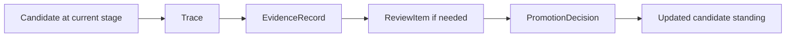

# Progression Model

This page defines how candidates move, pause, stay, demote, reject, or roll back across stages.

It follows:

- [01-overview.md](01-overview.md)
- [02-evaluation-flow.md](02-evaluation-flow.md)
- [../03-staged-evaluation.md](../specs/03-staged-evaluation.md)
- [../08-candidate-contract.md](../specs/08-candidate-contract.md)
- [../11-promotion-decision-contract.md](../specs/11-promotion-decision-contract.md)
- [../../sources/library/anthropic-automated-alignment-researchers.md](../../sources/library/anthropic-automated-alignment-researchers.md)
- [../../sources/library/anthropic-automated-w2s-researcher.md](../../sources/library/anthropic-automated-w2s-researcher.md)
- [../../sources/library/repo-paperclip.md](../../sources/library/repo-paperclip.md)

## Thesis

Progression in autokairos is not just "passing to the next environment."

It is the explicit change of candidate standing across a staged legitimacy ladder.

That is why progression has to be richer than:

- pass
- fail

## The Stage Ladder

The initial ladder remains:

1. `backtesting`
2. `paper`
3. `live`

Each stage changes:

- side-effect legitimacy
- evaluator expectations
- review burden
- operational risk

The progression model is how the system moves across that ladder without confusing experimentation
with advancement.

## What Progression Operates On

Progression operates on `Candidate`, not on:

- one session
- one workspace
- one execution attempt
- one trace

The candidate is the unit whose standing changes.

## Progression Outcomes

autokairos should use the following outcome set.

### `promote`

Advance to the next stage because explicit evidence justifies it.

### `stay`

Remain in the current stage because evidence is incomplete, mixed, or not yet strong enough.

### `pause`

Stop active progression while preserving lineage and stage context.

### `demote`

Move a candidate back to a lower stage because later evidence reduced trust.

### `reject`

Terminate the candidate line because evidence shows it should not continue.

### `rollback`

Reverse a prior advancement or live standing because the system needs to unwind to a previously
trusted position.

## Why The Outcome Set Must Be Rich

The source set pushes against binary thinking here.

- W2S-style systems accumulate evidence iteratively.
- AAR-style systems show that promising work still needs scrutiny.
- Paperclip-like governance postures require pause, rollback, and constrained advancement.

So progression must be able to represent:

- incomplete confidence
- loss of confidence
- reversible confidence

## Progression Rules

The progression model should enforce these rules.

### Rule 1: progression must cite evidence

No candidate should advance or regress without explicit evidence references.

### Rule 2: progression is stage-aware

The same evidence does not automatically justify the same outcome at every stage.

### Rule 3: progression is candidate-level

Session success does not equal candidate advancement.

### Rule 4: progression is explicit

Standing changes only through `PromotionDecision`, not through runtime-local status drift.

## The Progression Loop

The point of the model is not that every case needs heavy review.

The point is that every standing change still flows through explicit progression logic.

## Promotion Is Harder Than Generation

This remains the main rule that ties the subsystem together.

Generation may be cheap.

Progression should not be.

That means:

- search may branch widely in `backtesting`
- `paper` should already narrow trust
- `live` should be the strictest stage, not the loosest

## Demotion And Rollback Matter

The system must not treat `live` as an irreversible terminal success state.

Once real-world risk exists, the system needs two downward moves:

- `demote`
  reduce trust and move back down the stage ladder
- `rollback`
  explicitly reverse or supersede an earlier decision

This is the minimum needed to keep progression reversible rather than theatrical.

## Summary

The progression model should be understood as:

- candidate-level
- evidence-citing
- stage-aware
- explicitly committed
- richer than pass/fail

That is what makes staged progression a governance system rather than just routing logic.
