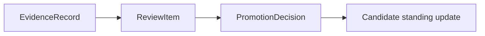

# Review And Decision Path

This page defines how autokairos turns judged evidence into explicit progression decisions.

It follows:

- [01-overview.md](01-overview.md)
- [02-evaluation-flow.md](02-evaluation-flow.md)
- [03-progression-model.md](03-progression-model.md)
- [../10-evidence-record-contract.md](../specs/10-evidence-record-contract.md)
- [../11-promotion-decision-contract.md](../specs/11-promotion-decision-contract.md)
- [../14-review-item-contract.md](../specs/14-review-item-contract.md)
- [../../sources/library/openai-next-evolution-of-the-agents-sdk.md](../../sources/library/openai-next-evolution-of-the-agents-sdk.md)
- [../../sources/library/repo-paperclip.md](../../sources/library/repo-paperclip.md)
- [../../sources/library/anthropic-building-effective-agents.md](../../sources/library/anthropic-building-effective-agents.md)

## Thesis

The review-and-decision path is the bridge from judged evidence to committed governance.

It exists so the system can distinguish:

- what counted
- what question is now pending
- what action was finally committed

Without this path, the architecture will drift toward either:

- evidence with no explicit governance intake
- or ad hoc decisions with no durable question object

## The Review And Decision Flow

This is the narrowest valid path.

## Step 1: Evidence Creates A Review-Worthy Question

Not every piece of evidence implies the same next question.

Examples:

- should this candidate promote to the next stage?
- should it stay?
- should it pause?
- should it be demoted?
- should live standing be rolled back?

The review layer exists so that these questions become explicit work objects rather than implicit
operator memory.

## Step 2: ReviewItem Packages The Pending Question

`ReviewItem` should carry:

- candidate scope
- stage scope
- question kind
- evidence packet
- routing metadata
- current review status

This is where the subsystem becomes workflow-shaped rather than purely evaluative.

Anthropic's workflow guidance matters here: this is the kind of predictable path that should be
explicitly modeled instead of left to open-ended agent behavior.

## Step 3: PromotionDecision Resolves The Question

`PromotionDecision` is the committed governance act.

It does not merely describe a preference. It changes or preserves candidate standing.

That is why the decision must always preserve:

- evidence basis
- outcome
- stage relationship
- governing surface
- rationale

## Why Review Is Not Optional In The Model

The system does not need a heavy human queue for every case.

But it does need an explicit conceptual review layer so that:

- evidence can exist before a final decision
- different questions can be routed differently
- pending governance work can be visible

This is why `ReviewItem` exists even if some decisions later become automated.

## Runtime HITL Is Not This Layer

OpenAI's HITL guidance and Claude Code permission surfaces are useful contrasts.

They show how a run may:

- pause on tool approval
- serialize state
- resume later

That belongs to execution-time control.

The review-and-decision path described here is different:

- it acts on judged evidence
- it changes candidate standing
- it belongs to progression governance

So autokairos must keep these distinct:

- runtime interruption and approval
- review and progression decision

## Decision Surfaces May Vary

The path should allow different decision surfaces, such as:

- human operator review
- scheduled policy review
- hybrid decision logic

What must stay stable is not who decides every time.

What must stay stable is the shape of the path:

`EvidenceRecord -> ReviewItem -> PromotionDecision`

## Summary

The review-and-decision path is the subsystem's governance bridge.

- evidence says what counted
- review says what question is pending
- decision says what changed

If those three collapse together, progression becomes opaque again.
