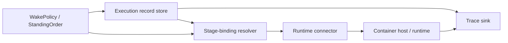

# First Code Seam

This page turns the agent-system implementation plan into one concrete implementation decision:

what should be coded first.

It follows:

- [05-implementation-plan.md](05-implementation-plan.md)
- [04-runtime-driver-model.md](04-runtime-driver-model.md)
- [../historical/proactive-operations/03-governed-self-scheduling.md](../historical/proactive-operations/03-governed-self-scheduling.md)
- [../specs/07-runtime-connector-contract.md](../specs/07-runtime-connector-contract.md)
- [../specs/12-governed-execution-request-contract.md](../specs/12-governed-execution-request-contract.md)
- [../specs/13-execution-attempt-contract.md](../specs/13-execution-attempt-contract.md)
- [../specs/23-wake-trigger-record-contract.md](../specs/23-wake-trigger-record-contract.md)
- [../historical/specs/28-wake-policy-precedence-and-overlap-contract.md](../historical/specs/28-wake-policy-precedence-and-overlap-contract.md)
- [../specs/21-wake-policy-contract.md](../specs/21-wake-policy-contract.md)
- [../historical/specs/22-standing-order-contract.md](../historical/specs/22-standing-order-contract.md)
- [07-persistent-operations-model.md](07-persistent-operations-model.md)
- [08-production-agent-design.md](08-production-agent-design.md)
- [../historical/specs/15-persistent-operations-and-wake-policy.md](../historical/specs/15-persistent-operations-and-wake-policy.md)
- [../../sources/library/anthropic-managed-agents.md](../../sources/library/anthropic-managed-agents.md)
- [../../sources/library/openai-next-evolution-of-the-agents-sdk.md](../../sources/library/openai-next-evolution-of-the-agents-sdk.md)
- [../../sources/library/repo-multica.md](../../sources/library/repo-multica.md)
- [../../sources/library/repo-safety-research-automated-w2s-research.md](../../sources/library/repo-safety-research-automated-w2s-research.md)

It is also informed by additional official documentation:

- [OpenAI Sessions](https://openai.github.io/openai-agents-js/guides/sessions)
- [OpenAI Running Agents](https://openai.github.io/openai-agents-js/guides/running-agents/)
- [OpenAI Human-in-the-loop](https://openai.github.io/openai-agents-js/guides/human-in-the-loop/)
- [Docker Running Containers](https://docs.docker.com/engine/containers/run/)
- [Docker Bind Mounts](https://docs.docker.com/engine/storage/bind-mounts/)

## Thesis

The first code seam should not be the runtime driver itself.

It should be the smallest autokairos-owned execution shell that can survive any one runtime
process, container, or CLI disappearing.

That means the first code seam is:

- a durable wake-policy and standing-authority store
- a durable wake-trigger history
- a governed execution request shape
- a durable execution-attempt record
- an external trace sink

Only after those exist should the first real runtime connector and container host become executable.

## Why This Comes First

The source set points in one direction.

- Anthropic's managed-agents model keeps `session` outside the currently running `harness` and
  `sandbox`.
- OpenAI's newer agent posture separates `harness` from `compute`, and treats `session` and
  resumable `RunState` as explicit surfaces.
- Multica externalizes daemon liveness, runtime inventory, and task progress rather than trusting
  one underlying CLI to be the whole system.
- The W2S research system treats the worker container as disposable while the evaluator, findings,
  and experiment state remain outside it.

Taken together, these references imply that autokairos should not start implementation by wrapping
one CLI and calling that the system.

If the first code seam is the runtime driver, the project will drift toward:

- harness-local truth
- stdout as trace
- workspace files as the run record
- accidental coupling between continuity and one surviving container

That would violate the architecture before the first serious run.

## What The First Code Seam Actually Is

The first code seam is the boundary where durable proactive authority and governed execution become
autokairos-owned state before any live runtime starts.

The important point is that `A`, `B`, and `C` exist before `E` and `F`.

## Scope Of The First Seam

### 0. Durable wake authority and wake history

Before one request is created, the system should already be able to persist:

- `WakePolicy`
- `StandingOrder`
- accepted or rejected `SelfSchedulingIntent`s
- `WakeTriggerRecord`

This is what keeps "living work" from collapsing into hidden runtime timers and scheduler-only
memory.

### 1. Governed execution request

There should be one explicit request object for starting a run.

At minimum it should carry:

- `agent_identity_ref`
- `candidate_ref`
- `session_ref`
- `stage`
- request origin such as `manual`, `scheduler`, or `review-followup`
- objective or task payload reference
- one primary wake-trigger linkage when the request came from proactive orchestration
- coalesced wake-origin linkage when overlap resolution merged several candidates into one request

This is the system's invocation boundary, not a raw prompt string.

### 2. Durable execution records

Before launch, the system should be able to persist:

- that a run was requested
- the request object itself
- the concrete execution-attempt object once launch preparation starts
- which agent, candidate, session, and stage it targets
- what runtime mode was selected
- whether the run is pending, active, interrupted, completed, or failed

This record family is intentionally smaller than the full control plane.

It is just enough to prevent the runtime from becoming the source of truth.

### 3. External trace sink

The first serious runtime should never need to invent the trace model.

The trace sink should already exist and be able to accept:

- runtime status transitions
- model output chunks or normalized message events
- tool or connector calls
- failures
- interruption markers
- completion markers

If this sink does not exist first, the runtime connector will inevitably improvise its own truth
surface.

### 4. Stage-binding resolution stub

Even with only one stage at first, the request should still be resolved through an explicit
`StageBinding` step.

That keeps:

- stage semantics
- connector exposure
- permission shape
- execution-mode choice

outside prompt text and outside the runtime binary.

## What Should Not Be First

### Not the runtime connector alone

The runtime connector is critical, but it should not be the first coded seam.

Without durable request and trace surfaces, the bridge becomes another opaque wrapper around a
runtime.

### Not the container host alone

The container host is also necessary, but implementing it first only proves that a container can be
started.

It does not prove that autokairos owns continuity, trace, or stage semantics.

### Not candidate or promotion workflows first

Those are important, but they sit above the first runnable execution shell.

The system first needs a trustworthy execution record and trace boundary before richer progression
logic becomes real.

## First Implementation Slice

The first code slice should therefore be built in this order.

1. durable wake-policy and standing-order store
2. durable wake-trigger history and self-scheduling disposition store
3. `ExecutionRequest` shape
4. `ExecutionAttempt` shape
5. external trace sink
6. stage-binding resolver
7. wake-policy classification surface
8. workspace materializer
9. container host
10. runtime connector implementation

This order preserves the architecture's main invariants from day one.

## Success Condition

The first seam is correct if all of these are true.

1. A governed request can be persisted before any runtime starts.
2. The system can explain which primary wake trigger emitted that request.
3. The system can explain which wake policy and standing authority shaped that request.
4. If overlap resolution coalesced several wake candidates, the non-primary origins remain
   durably visible.
5. A run can fail before runtime launch without losing its record.
6. A live runtime can emit trace into an external sink while it is still running.
7. A container can disappear without erasing the run's durable identity and trace history.
8. Stage semantics remain resolved outside the runtime process.

## Relationship To The Rest Of The Section

- [05-implementation-plan.md](05-implementation-plan.md)
  defines the overall build order for the agent subsystem.
- This page identifies the first code seam inside that order.
- [../specs/12-governed-execution-request-contract.md](../specs/12-governed-execution-request-contract.md)
  defines the governed invocation object above any concrete run.
- [../specs/13-execution-attempt-contract.md](../specs/13-execution-attempt-contract.md)
  defines the durable record for one concrete execution try.
- [../specs/21-wake-policy-contract.md](../specs/21-wake-policy-contract.md)
  defines the durable wake authority that should exist before request creation.
- [../historical/specs/22-standing-order-contract.md](../historical/specs/22-standing-order-contract.md)
  defines the durable authority program that constrains future-work changes.
- [../specs/23-wake-trigger-record-contract.md](../specs/23-wake-trigger-record-contract.md)
  defines the durable history object that must survive from wake evaluation into request creation.
- [../historical/specs/28-wake-policy-precedence-and-overlap-contract.md](../historical/specs/28-wake-policy-precedence-and-overlap-contract.md)
  defines how overlapping wake candidates resolve before one primary request is emitted.
- [../specs/07-runtime-connector-contract.md](../specs/07-runtime-connector-contract.md)
  remains the lower-level spec for the bridge once the first seam exists.
- [../historical/specs/15-persistent-operations-and-wake-policy.md](../historical/specs/15-persistent-operations-and-wake-policy.md)
  constrains how the first runtime path should classify `cold`, `warm`, and `hot`.
- [08-production-agent-design.md](08-production-agent-design.md)
  defines the production trading agent that this first seam is supposed to serve.

## Summary

autokairos should not start by coding "the agent."

It should start by coding the smallest execution shell that keeps:

- invocation governed
- trace external
- continuity durable
- stage semantics outside the runtime

That is the first implementation seam worth trusting.
