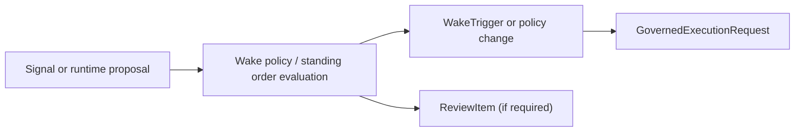

# Proactive Policy And Wake Records

This page defines the durable control-plane records that support proactive operations.

It follows:

- [01-overview.md](01-overview.md)
- [03-record-model.md](03-record-model.md)
- [../proactive-operations/01-overview.md](../proactive-operations/01-overview.md)
- [../historical/proactive-operations/02-trigger-model.md](../historical/proactive-operations/02-trigger-model.md)
- [../historical/proactive-operations/03-governed-self-scheduling.md](../historical/proactive-operations/03-governed-self-scheduling.md)
- [../historical/specs/19-wake-orchestration-and-trigger-model.md](../historical/specs/19-wake-orchestration-and-trigger-model.md)
- [../historical/specs/20-governed-self-scheduling-contract.md](../historical/specs/20-governed-self-scheduling-contract.md)
- [../specs/21-wake-policy-contract.md](../specs/21-wake-policy-contract.md)
- [../historical/specs/22-standing-order-contract.md](../historical/specs/22-standing-order-contract.md)
- [../specs/23-wake-trigger-record-contract.md](../specs/23-wake-trigger-record-contract.md)
- [../historical/specs/28-wake-policy-precedence-and-overlap-contract.md](../historical/specs/28-wake-policy-precedence-and-overlap-contract.md)
- [../../sources/library/repo-anthropics-claude-code.md](../../sources/library/repo-anthropics-claude-code.md)
- [../../sources/library/repo-openai-codex.md](../../sources/library/repo-openai-codex.md)
- [../../sources/library/repo-openclaw.md](../../sources/library/repo-openclaw.md)
- [../../sources/synthesis/proactive-operations-and-runtime-control.md](../../sources/synthesis/proactive-operations-and-runtime-control.md)

## Purpose

Define where proactive authority and wake history become durable control-plane truth.

## Scope And Non-Goals

This page covers:

- durable wake-policy ownership
- durable standing-authority ownership
- durable self-scheduling-intent history
- durable wake-trigger history

This page does not cover:

- semantic attention construction itself
- runtime wake classes such as `cold`, `warm`, and `hot`
- detailed scheduler implementation

## Responsibilities

The control plane should:

- own the durable records that define future wake authority
- preserve why a wake policy exists and how it changed
- preserve standing programs that constrain self-scheduling
- preserve whether a self-scheduling proposal was accepted, clamped, or rejected
- preserve enough wake-trigger history to explain why a run happened

## System Boundaries

These records sit between proactive orchestration and governed execution.

They should not:

- live only inside one scheduler process
- be reducible to runtime-local timers
- be hidden in prompt prose or operator memory

## Primary Abstractions

- `WakePolicy`
  durable orchestration truth for future wake behavior
- `StandingOrder`
  durable authority program that constrains what wakes and self-scheduling changes are allowed
- `SelfSchedulingIntent`
  durable proposal record emitted by runtime but owned as history by the control plane
- `WakeTrigger`
  durable or reconstructable record of one detected wake event and its disposition

## Primary Flows

## Failure And Recovery Model

This record family exists because proactive systems fail in repeatable ways:

- the agent wakes too often and no one can explain why
- a critical trigger was disabled and the history is gone
- standing authority widened over time without audit
- the runtime proposed a schedule change and the system cannot reconstruct whether it was accepted

Recovery requires durable history for:

- what authority existed
- what changed
- what fired
- what was suppressed

## Dependencies On Other Subsystems

- Depends on proactive-operations for wake semantics and self-scheduling behavior.
- Feeds the agent system through governed execution requests.
- Feeds control-plane review and audit when wake-policy changes require explicit approval.

## What Is Still Delegated To Specs / ADRs

- object-level contracts belong in
  [../specs/21-wake-policy-contract.md](../specs/21-wake-policy-contract.md) and
  [../historical/specs/22-standing-order-contract.md](../historical/specs/22-standing-order-contract.md) plus
  [../specs/23-wake-trigger-record-contract.md](../specs/23-wake-trigger-record-contract.md) and
  [../historical/specs/28-wake-policy-precedence-and-overlap-contract.md](../historical/specs/28-wake-policy-precedence-and-overlap-contract.md)
- self-scheduling proposal semantics remain in
  [../historical/specs/20-governed-self-scheduling-contract.md](../historical/specs/20-governed-self-scheduling-contract.md)
- the architectural decision to keep wake truth outside runtime remains in the proactive-operations ADRs

## Record Family Breakdown

### 1. WakePolicy Records

These records answer:

> what future wake behavior is currently authorized for this scope?

Examples:

- periodic observation every 5 minutes during market hours
- event watch for drawdown threshold crossing
- one-time follow-up wake after a pending order settles
- paper-stage reconciliation cadence

### 2. StandingOrder Records

These records answer:

> under what durable authority program may future wakes, escalations, and self-scheduling changes occur?

Examples:

- monitor BTC and ETH only during specific market hours
- require review before widening cadence below a threshold
- never disable mandatory risk triggers automatically
- allow one-time follow-up wakes but not indefinite hot monitoring

### 3. SelfSchedulingIntent History

These records answer:

> what future-work change did the runtime propose, and how was it resolved?

Examples:

- tighten cadence because volatility increased
- add a fill-event watch for the next hour
- pause an optional noisy trigger
- request a one-time follow-up after a risk snapshot refreshes

### 4. WakeTrigger History

These records answer:

> what actually fired, was it suppressed or emitted, and what execution request did it produce?

Examples:

- scheduled run fired and created one detached request
- event burst was deduped and suppressed
- heartbeat turn was skipped because the active window was closed
- follow-up trigger produced a new governed request tied to a prior execution line

## Core Claim

autokairos should not treat proactive work as "some scheduler somewhere."

It should treat proactive authority as durable control-plane truth:

- wake policy says what future wakes are allowed
- standing order says under what authority they are allowed
- self-scheduling intent says what the runtime proposed
- wake-trigger history says what actually happened
