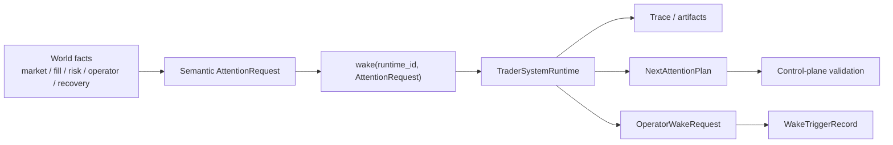

# Proactive Operations Overview

This page defines why autokairos needs a dedicated proactive-operations subsystem.

It follows:

- [README.md](README.md)
- [../foundation/01-naming-and-vocabulary.md](../foundation/01-naming-and-vocabulary.md)
- [../specs/04-boundaries.md](../specs/04-boundaries.md)
- [../trading-substrate/01-overview.md](../trading-substrate/01-overview.md)
- [../control-plane/05-proactive-policy-and-wake-records.md](../control-plane/05-proactive-policy-and-wake-records.md)
- [../../sources/synthesis/proactive-operations-and-runtime-control.md](../../sources/synthesis/proactive-operations-and-runtime-control.md)

## Purpose

Define proactive operations as a subsystem above the cognitive runtime.

## Scope And Non-Goals

This page covers:

- why proactive operations are distinct from the agent runtime
- what work belongs in this layer
- the main abstractions and boundaries

This page does not cover:

- broad trigger-taxonomy schemas
- standing-order or scheduler-program details
- the internal agent loop

## Responsibilities

The proactive-operations subsystem should:

- construct semantic attention for runtime activation
- keep wake-policy truth outside the runtime
- rely on the control plane to preserve wake authority as durable truth
- distinguish runtime attention from operator wake
- keep urgency, authority, and audit explicit

## System Boundaries

This subsystem sits above the agent runtime and below the broader control plane.

It should not:

- become the control plane itself
- become the runtime itself
- silently mutate candidate standing or promotion state

## Primary Abstractions

- `WakePolicy`
  durable control-plane rule that says when operator attention is meaningful
- `AttentionRequest`
  semantic packet delivered through `wake(runtime_id, AttentionRequest)`
- `NextAttentionPlan`
  runtime proposal for future attention, validated outside the runtime
- `WakeTriggerRecord`
  durable operator-facing wake or suppression history

## Primary Flows

## Failure And Recovery Model

This subsystem should assume:

- relevant facts can be missed
- repeated context can arrive
- observations can arrive out of order
- the runtime may propose future attention that must be validated outside the runtime
- some operator wakes should be suppressed because policy, stage, or risk posture says so

## Dependencies On Other Subsystems

- It depends on the always-on trading substrate for observed facts and context refs.
- It depends on the control plane for durable policy truth.
- It activates runtimes through semantic `AttentionRequest` payloads.

## What Is Still Delegated To Specs

- semantic attention is defined in [02-semantic-attention-and-wake.md](02-semantic-attention-and-wake.md)
- durable wake-authority contract lives in
  [../specs/21-wake-policy-contract.md](../specs/21-wake-policy-contract.md)
- durable wake-history contract lives in
  [../specs/23-wake-trigger-record-contract.md](../specs/23-wake-trigger-record-contract.md)
- runtime autonomy and next-attention validation live in
  [../specs/15-runtime-autonomy-contract.md](../specs/15-runtime-autonomy-contract.md)

## Core Claim

autokairos should not treat "persistent agent" as a synonym for "one runtime that stays alive."

The stronger source-grounded model is:

- always-on trading substrate
- semantic attention construction
- wakeable trader-system runtime
- operator-visible wake/control

Historical standing-order, precedence, and trigger-taxonomy material remains preserved under
[../historical/proactive-operations/](../historical/proactive-operations/), but it is not active
MLP-01 guidance.
