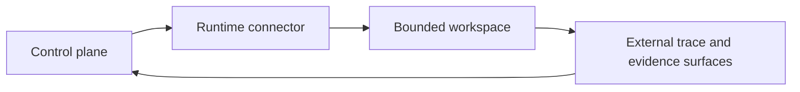
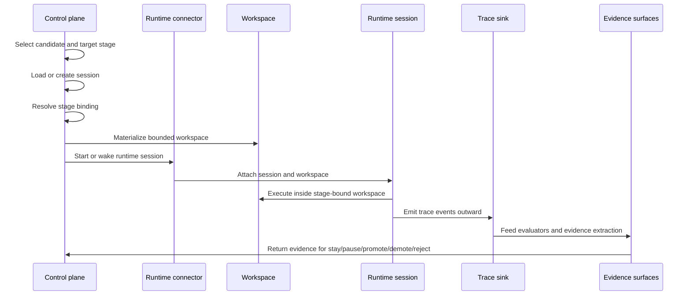

# Agent Execution Architecture

This page defines how autokairos should execute one persistent agent without collapsing execution,
truth, and governance into the same layer.

It does not define every storage schema yet. Its job is to answer a prior question:

**what is the execution structure that lets the agent actually run while preserving the boundaries
already established in the architecture spine?**

This page follows:

- [00-first-principles-architecture-thesis.md](00-first-principles-architecture-thesis.md)
- [02-core-primitives.md](../../specs/02-core-primitives.md)
- [03-staged-evaluation.md](../../specs/03-staged-evaluation.md)
- [04-boundaries.md](../../specs/04-boundaries.md)
- [../sources/synthesis/agent-runtime-and-harness-principles.md](../../../sources/synthesis/agent-runtime-and-harness-principles.md)
- [../sources/synthesis/evaluation-governance-and-promotion.md](../../../sources/synthesis/evaluation-governance-and-promotion.md)

And is especially grounded in:

- [../sources/library/anthropic-managed-agents.md](../../../sources/library/anthropic-managed-agents.md)
- [../sources/library/anthropic-effective-harnesses-for-long-running-agents.md](../../../sources/library/anthropic-effective-harnesses-for-long-running-agents.md)
- [../sources/library/openai-next-evolution-of-the-agents-sdk.md](../../../sources/library/openai-next-evolution-of-the-agents-sdk.md)
- [../sources/library/repo-anthropics-claude-code.md](../../../sources/library/repo-anthropics-claude-code.md)
- [../sources/library/repo-openclaw.md](../../../sources/library/repo-openclaw.md)
- [../sources/library/repo-multica.md](../../../sources/library/repo-multica.md)

## Thesis

autokairos should execute an agent through a four-part structure:

1. `control plane`
2. `runtime connector`
3. `bounded workspace`
4. `external trace and evidence surfaces`

The active agent loop lives only in the middle of that structure.

This matters because the source set is consistent on one point:

- the active harness is necessary
- the active harness is not the whole system

Anthropic separates `session`, `harness`, and `sandbox`. OpenAI separates `harness` from
`compute`. Claude Code distinguishes interactive execution, checkpointing, hooks, and project
instruction surfaces. OpenClaw separates its Gateway-owned session/control plane from ACP-backed
external runtime sessions. Multica separates its daemon/runtime connector from higher-level runtime,
agent, task, and autopilot records.

autokairos should preserve that same posture.

## Why This Spec Exists

This spec exists to answer one question:

**what execution structure lets one persistent agent run without collapsing runtime, truth, and
governance into the same layer?**

## What This Document Decides

This document fixes the following architectural decisions.

### 1. Execution starts from control-plane state, not from an ad hoc prompt

The runtime should not be launched as the primary source of truth.

Execution starts from:

- an `AgentIdentity`
- a `Candidate`
- a target `Stage`
- a resolved `StageBinding`
- a `Session` continuity surface

That means the runtime is invoked because the system already knows *what line of work is being
advanced* and *under what legitimacy level it is allowed to run*.

### 2. Stage binding is resolved before the runtime runs

The same agent-facing action surface may remain stable across stages, but its concrete semantics
must be resolved before the loop starts.

This is the point of `StageBinding`.

The runtime should not infer from prompt text whether a run is `backtesting`, `paper`, or `live`.
The execution environment should already encode that.

### 3. The workspace is curated execution state, not the source of truth

The workspace should be materialized as the bounded surface the runtime sees:

- files
- instructions
- local artifacts
- stage-specific tools and connectors
- task-local runtime outputs

But the workspace should not decide whether the run is promotable or even legitimate.

### 4. The runtime may be native or external

autokairos should not assume it owns the agent loop implementation.

The execution structure must support both:

- a native runtime path
- an external runtime connector path

This follows directly from the source layer:

- Anthropic's managed-agents interfaces are deliberately harness-agnostic
- OpenAI's newer harness posture assumes explicit harness/compute boundaries
- OpenClaw models ACP as an external runtime session path rather than the native default

### 5. Trace must be external while execution is active

Execution should emit a `Trace` to an external sink while the runtime is still live.

This is necessary so that:

- a crashed workspace does not erase the run record
- runtime-local recovery does not become the system of record
- evidence extraction can happen without trusting the workspace

### 6. Evidence and promotion remain downstream of execution

Execution may produce the facts that later matter, but it should not directly decide:

- that a candidate succeeded
- that a stage transition is justified
- that promotable evidence exists

Those remain downstream surfaces.

## The Four Execution Zones

At runtime, the system should be understood as four zones.

This loop is intentional.

- the control plane decides what is allowed to run
- the runtime connector turns that decision into a live runtime session
- the workspace hosts execution
- traces and evidence flow back outward for later control-plane decisions

The workspace is part of the loop, but not the place where the loop is governed.

## Zone 1: Control Plane

The control plane should own the long-lived execution facts.

### It should own

- `AgentIdentity`
- `Candidate`
- `Session`
- current `Stage`
- resolved `StageBinding`
- run supervision state
- external `Trace` storage
- derived `EvidenceRecord` storage
- `PromotionDecision` surfaces

### It should decide

- which candidate is running
- under which stage
- with which permissions and connectors
- against which evaluator expectations
- whether the current run should continue, pause, or stop

### It should not own

- inner-loop token-by-token reasoning
- workspace-local scratch artifacts
- provider-specific harness implementation details

This is the layer closest to OpenClaw's Gateway posture and furthest from a "the CLI process is
the product" posture. It is also where Multica is useful as a reference: runtime inventory, task
supervision, daemon liveness, and scheduling should live outside the harness loop.

## Zone 2: Runtime Bridge

The runtime connector is the layer that turns a governed run request into a live agent loop.

This is the most important execution-specific layer in autokairos.

### Runtime connector responsibilities

- wake or create the runtime session
- attach it to the correct `Session`
- mount or point it at the materialized `Workspace`
- expose the stage-bound capability surface
- capture runtime events into the external `Trace`
- report interruptions, failures, and completion back to the control plane

### Runtime connector non-responsibilities

- it is not the candidate registry
- it is not the promotion surface
- it is not the ultimate evidence store

### Why this layer matters

Without a distinct runtime connector, autokairos would be forced into one of two bad designs:

1. a native-only runtime assumption
2. an external-harness-as-whole-system assumption

The source set argues for neither.

Multica is especially useful here because it names this layer clearly in product form:

- a daemon detects available runtimes
- the daemon creates an isolated workspace
- the daemon starts the chosen external CLI
- the platform keeps task state and progress outside that CLI

autokairos should take the bridge lesson without importing Multica's full product metaphor.

autokairos should be able to govern:

- Codex-like runtime sessions
- Claude Code-like runtime sessions
- OpenClaw/ACP-like bridged sessions
- any future native runtime

without moving candidate truth into those systems.

## Zone 3: Bounded Workspace

The bounded workspace is where the agent actually works.

This is the surface shaped by:

- stage-specific bindings
- instruction and rule surfaces
- tool and connector exposure
- local files and artifacts
- stage-local execution semantics

### Workspace responsibilities

- provide the working filesystem surface
- provide repo/task guidance files
- host local outputs
- host task-local checkpoints or temporary recovery aids if the runtime supports them

### Workspace non-responsibilities

- it is not the durable session log
- it is not the final trace store
- it is not the evidence store
- it is not the promotion record

### Checkpointing is convenience, not truth

This boundary is worth naming explicitly.

Claude Code's checkpointing model is useful, but it is session-local recovery. OpenAI's run
`state` is useful, but it is resumable execution state. Anthropic's progress-file patterns are
useful, but they are workspace aids.

autokairos may use all of these ideas.

But none of them should replace:

- external trace capture
- external evidence
- external promotion history

## Zone 4: External Trace And Evidence Surfaces

Execution should generate records that survive the run.

The first external record is `Trace`.

The next record derived from that is `EvidenceRecord`.

### Trace capture should happen during execution

The system should not wait until the workspace exits and then inspect files as if that were the
full run record.

Instead, the runtime connector should emit external trace data as execution proceeds:

- model interactions
- tool and connector invocations
- stage and workspace references
- interruptions
- errors
- approvals and denials
- outputs relevant to later evaluation

### Evidence extraction happens after or alongside trace capture

Evidence can be derived from:

- trace summaries
- evaluator results
- backtest metrics
- paper outcomes
- live outcomes
- policy or approval annotations

But evidence still remains outside the workspace and outside the active runtime loop.

## What This Spec Is Not

This spec is not:

- the runtime-connector method signature document
- the candidate schema
- the trace schema
- the promotion-decision schema
- the container image build guide

## The End-To-End Execution Flow

autokairos should execute an agent through the following flow.

## Execution Lifecycle

The execution lifecycle should have seven phases.

### 1. Selection

The control plane selects:

- the `AgentIdentity`
- the `Candidate`
- the target `Stage`

This is where the system answers *what is being worked on and under what legitimacy level?*

### 2. Continuity loading

The control plane loads or creates the `Session`.

This is where the system answers *what continuity and prior run history should this execution
inherit?*

### 3. Stage binding resolution

The control plane resolves `StageBinding`.

This is where the system decides:

- permissions
- concrete execution semantics
- connector bindings
- evaluator expectations
- approval posture

### 4. Workspace materialization

The bounded workspace is prepared.

This is where the system shapes:

- local files
- instruction surfaces
- rule surfaces
- local task artifacts
- runtime-visible capability surfaces

### 5. Runtime activation

The runtime connector starts or wakes the agent loop.

This is where the system chooses whether the run uses:

- a native runtime session
- an external bridged runtime session

This phase should also be where the system records bridge-level execution facts such as:

- selected runtime path
- launch parameters
- bridge liveness
- active execution-attempt status

### 6. Active execution

The runtime performs the work.

This is the only phase where the agent is actually searching, planning, tool-calling, or acting.

### 7. External record update

Trace and evidence are updated outside the workspace.

This is what makes execution legible and promotable later.

## Resume, Retry, And Failure

The execution structure should assume failure.

### Resume

Resume should be anchored in:

- `Session`
- external `Trace`
- the control-plane view of the current `Candidate` and `Stage`

Resume should not depend solely on the previous workspace surviving intact.

### Retry

A retry should be able to:

- keep the same candidate
- keep the same session if that continuity still matters
- materialize a fresh workspace
- attach to the same or a new runtime session path

This is why `Session` and `Workspace` cannot collapse into one object.

### Failure

A workspace failure, runtime crash, or bridge failure should degrade into:

- traceable failure state
- resumable or retryable control-plane state
- preserved candidate lineage

not silent loss of the run history.

## Stable Interface, Changing Semantics

autokairos should prefer a stable agent-facing capability surface where possible.

But "stable interface" must not mean "same real-world risk."

The execution structure should support:

- one action surface presented to the agent
- different stage bindings underneath
- different evaluator strictness outside

This means the same high-level action can remain recognizable while its semantics differ:

- simulated in `backtesting`
- mock/live-ish in `paper`
- real in `live`

The runtime connector and stage binding layers are what make that possible without asking the prompt
alone to carry the distinction.

## What The Execution Structure Must Preserve

If this document is implemented correctly, the following statements remain true at runtime.

1. The agent can keep working across time without making the workspace the source of truth.
2. The same agent identity can run across stages without turning stages into mere prompt labels.
3. Runtime-local recovery can exist without becoming the durable system of record.
4. External harnesses can be used without surrendering candidate, trace, and promotion ownership.
5. Evidence remains downstream of execution, not embedded inside self-report.

## Failure Modes / Invariants

The key invariants are:

- execution begins from governed control-plane context
- stage binding resolves before runtime semantics are live
- the workspace is bounded execution state, not durable truth
- trace leaves execution while execution is still active

The design is failing if:

- the runtime process becomes the control plane
- trace is reconstructed only after workspace exit
- stage is inferred from prompt text alone
- evidence or promotion is decided inside the live loop

## Design Consequence

The next contract-level documents should now be written under this execution structure.

The most natural next contracts are:

1. `Candidate`
2. `Trace`
3. `EvidenceRecord`
4. `PromotionDecision`
5. runtime-connector interfaces

Those contracts should now be written against this execution architecture rather than as isolated
schemas.

## Relationship To Adjacent Specs

This spec depends on:

- [03-staged-evaluation.md](../../specs/03-staged-evaluation.md)
- [04-boundaries.md](../../specs/04-boundaries.md)

It is refined by:

- [06-containerized-execution.md](../../specs/06-containerized-execution.md)
- [07-runtime-connector-contract.md](../../specs/07-runtime-connector-contract.md)
- [09-trace-contract.md](../../specs/09-trace-contract.md)
