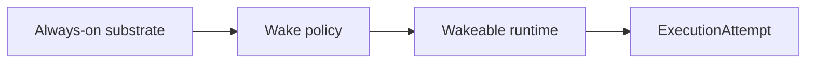

# Persistent Operations And Wake Policy

This page defines the canonical policy boundary between the always-on trading substrate and the
wakeable agent runtime.

It follows:

- [05-agent-execution-architecture.md](05-agent-execution-architecture.md)
- [06-containerized-execution.md](../../specs/06-containerized-execution.md)
- [12-governed-execution-request-contract.md](../../specs/12-governed-execution-request-contract.md)
- [13-execution-attempt-contract.md](../../specs/13-execution-attempt-contract.md)
- [../agent-system/07-persistent-operations-model.md](../../agent-system/07-persistent-operations-model.md)
- [24-always-on-trading-substrate-contract.md](../../specs/24-always-on-trading-substrate-contract.md)
- [21-wake-policy-contract.md](../../specs/21-wake-policy-contract.md)

It is informed by:

- [Anthropic: Scaling Managed Agents](https://www.anthropic.com/engineering/managed-agents)
- [Anthropic: Managing context on the Claude Developer Platform](https://claude.com/blog/context-management)
- [OpenAI Sessions](https://openai.github.io/openai-agents-js/guides/sessions/)
- [OpenAI Results](https://openai.github.io/openai-agents-js/guides/results/)
- [Docker restart policies](https://docs.docker.com/engine/containers/start-containers-automatically/)
- [Docker live restore](https://docs.docker.com/engine/daemon/live-restore/)

## Thesis

autokairos must separate:

- the operational surfaces that stay continuously available
- the runtime surfaces that wake, attach, pause, or restart according to stage and cost posture

This policy exists so the system can be always on without requiring one immortal runtime process.

## Why This Spec Exists

This spec exists to answer one question:

**what exactly must stay continuously available, and what may be hot, warm, or cold while still
meeting trading requirements?**

Without this boundary:

- the system may keep too much expensive runtime alive
- or it may cold-start too much of the system for live trading needs
- or it may push durable truth into one lucky surviving runtime process

## Canonical Boundary

The policy boundary is:

The always-on substrate owns operational continuity.

The control plane owns durable wake policy truth.

The wakeable runtime owns cognitive execution readiness.

## Required Fields Or Required Behaviors

## 1. Always-On Substrate Requirements

The system must define a substrate that remains continuously available or self-healing enough for
the stage being served.

At minimum this substrate should include:

- control-plane records
- trace and audit sinks
- market / account / position state ingestion
- risk and policy surfaces
- scheduler, heartbeat, or review wake surfaces

## 2. Wake Class Classification

The runtime side must classify readiness with explicit wake classes.

### Required classes

- `cold`
- `warm`
- `hot`

### Required meaning

- `cold`
  no active runtime session or prepared host is assumed
- `warm`
  continuity and environment preparation reduce wake latency, but the full loop is not yet active
- `hot`
  the runtime session is already attached and active

## 3. Stage-Aware Default Policy

The policy must define a default wake posture by stage.

### Minimum default policy

- `backtesting` -> `cold`
- `paper` -> `warm`
- `live` -> `warm` minimum

Optional escalation to `hot` must be explicit rather than implicit.

## 4. Downgrade And Recovery Policy

The system must define what happens when a hot or warm runtime surface is lost.

### Required behavior

- prefer `hot -> warm -> cold` degradation
- preserve `ExecutionRequest`, `ExecutionAttempt`, `Session`, and `Trace` across downgrade
- never treat runtime loss as automatic candidate loss

## 5. Runtime Optimization Features

The policy may use runtime optimizations such as:

- Docker restart policy
- Docker live restore
- cached images
- pooled hosts

### Required rule

These optimizations may improve wake latency, but they must not become the source of continuity or
durable truth.

## 6. Execution Ownership

The runtime wake policy must remain below governance.

### Required rule

Wake posture can affect:

- latency
- cost
- operational resilience

It must not directly decide:

- candidate standing
- evidence validity by itself
- promotion outcome

## Lifecycle Or State Model

The wake policy should support these operational states.

1. `cold`
2. `warming`
3. `warm`
4. `hot`
5. `degraded`
6. `recovering`

### Meaning

- `cold`
  no prepared runtime readiness
- `warming`
  host or runtime preparation is in progress
- `warm`
  ready for low-latency activation
- `hot`
  active runtime attached
- `degraded`
  the target posture was lost, but durable records remain intact
- `recovering`
  the system is trying to re-enter the target posture

## What This Spec Is Not

This spec is not:

- a container orchestration manual
- a market-data architecture spec
- the always-on trading-substrate boundary contract itself
- a full connector session spec
- the durable `WakePolicy` record contract
- a guarantee that the LLM runtime never restarts

## Failure Modes / Invariants

The key invariants are:

- always-on is a system property, not proof of one immortal process
- durable truth must outlive runtime wake posture
- wake class must be explicit and stage-aware
- the system must know how to degrade from hot to warm to cold without losing truth

The design is failing if:

- one container becomes the only way continuity survives
- live trading depends on cold-starting the entire world every time
- wake posture is undocumented and chosen ad hoc
- restart features are treated as a substitute for durable records

## Relationship To Adjacent Specs

This spec depends on:

- [12-governed-execution-request-contract.md](../../specs/12-governed-execution-request-contract.md)
- [13-execution-attempt-contract.md](../../specs/13-execution-attempt-contract.md)
- [07-runtime-connector-contract.md](../../specs/07-runtime-connector-contract.md)
- [24-always-on-trading-substrate-contract.md](../../specs/24-always-on-trading-substrate-contract.md)
- [21-wake-policy-contract.md](../../specs/21-wake-policy-contract.md)

It constrains:

- [06-containerized-execution.md](../../specs/06-containerized-execution.md)
- [../agent-system/04-runtime-driver-model.md](../../agent-system/04-runtime-driver-model.md)
- [../agent-system/07-persistent-operations-model.md](../../agent-system/07-persistent-operations-model.md)
