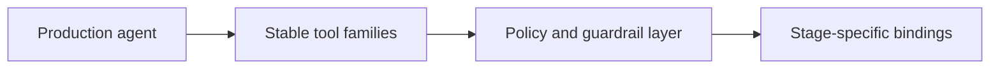

# Production Agent Tool Surface And Guardrails

This page defines the canonical tool families and guardrail posture for the production autokairos
agent.

It follows:

- [15-persistent-operations-and-wake-policy.md](15-persistent-operations-and-wake-policy.md)
- [16-production-agent-state-machine.md](16-production-agent-state-machine.md)
- [../agent-system/08-production-agent-design.md](../../agent-system/08-production-agent-design.md)

It is informed by:

- [Anthropic: Writing effective tools for AI agents](https://www.anthropic.com/engineering/writing-tools-for-agents)
- [Anthropic: Claude Code auto mode](https://www.anthropic.com/engineering/claude-code-auto-mode)
- [Anthropic: Beyond permission prompts](https://www.anthropic.com/engineering/claude-code-sandboxing)
- [OpenAI Agents SDK: Guardrails](https://openai.github.io/openai-agents-js/guides/guardrails/)
- [OpenAI Agents SDK: Human-in-the-loop](https://openai.github.io/openai-agents-js/guides/human-in-the-loop/)

## Thesis

The production trading agent should operate through a stable domain-shaped tool surface with
explicit guardrails, rather than through broad generic execution surfaces.

This is what makes the agent production-grade instead of merely powerful.

## Why This Spec Exists

This spec exists to answer two linked questions:

1. what tools should the production agent actually see?
2. where should the production safety boundary live during action?

## Canonical Object / Interface / Boundary

The canonical boundary is:

The agent sees stable tool families.

The stage binding and policy layer decide what those tools mean and whether they may execute.

## Required Fields Or Required Behaviors

## 1. Stable Tool Families

The production agent should operate through four tool families.

### A. Observation tools

These are read-only tools for situational awareness.

Examples:

- `get_market_snapshot`
- `get_order_book`
- `get_account_state`
- `get_positions`
- `get_open_orders`
- `get_risk_state`
- `get_candidate_context`

### B. Analysis tools

These help the agent compute or compare without directly creating market side effects.

Examples:

- `simulate_order_impact`
- `evaluate_signal_window`
- `compare_current_state_to_plan`
- `summarize_recent_trace`

### C. Execution tools

These produce trading-side effects or side-effect-like intents.

Examples:

- `place_order`
- `cancel_order`
- `amend_order`
- `reduce_position`

### D. Control and escalation tools

These let the agent yield rather than improvise.

Examples:

- `request_review`
- `raise_risk_alert`
- `pause_current_line`
- `record_operator_note`

## 2. Stage-Stable Semantics

Tool schemas should stay as stable as possible across stages.

Required rule:

- the agent-facing tool name and input shape should remain stable when the action concept is the
  same
- stage should change the binding underneath, not the top-level concept exposed to the agent

Example:

- `place_order` in `backtesting` means simulated placement
- `place_order` in `paper` means mock placement against live-ish conditions
- `place_order` in `live` means real venue placement

## 3. Default Production Restriction

The production agent should not receive broad raw host mutation tools by default in `paper` or
`live`.

Required default rule:

- no broad shell access in the live runtime execution surface
- no arbitrary patch or edit surface in the live runtime execution surface
- no blanket interpreter escape rules in the live runtime execution surface

Narrow execution helpers may exist in lower-risk stages if explicitly justified.

## 4. Guardrail Layers

The production agent should use multiple guardrail layers.

### Input/context screening

Purpose:

- detect prompt-injection-like or policy-corrupting content in fetched external material

### Pre-tool policy checks

Purpose:

- reject actions that violate stage posture, risk posture, or configured policy before execution

### Approval interruptions

Purpose:

- pause the run and ask for approval when a stage or policy says autonomy should stop here

### Post-tool validation

Purpose:

- ensure tool results did not violate assumptions or produce disallowed outputs

### Tripwire or halt behavior

Purpose:

- immediately stop or degrade the run when a severe guardrail condition is hit

## 5. Guardrail Transparency

If a tool is blocked, the system should record:

- which guardrail layer blocked it
- which tool was affected
- whether the block was recoverable
- what next action is expected: retry, request approval, or stop

## 6. Live-Path Discipline

In `live`, execution tools should be the most tightly governed.

Required behavior:

- every live side effect must pass through stage binding, policy, and trace emission
- the agent must have a non-side-effecting escalation path when uncertain
- risk-sensitive tools may require approval interruption even if lower-risk tools do not

## Lifecycle Or State Model

The tool surface itself is stable, but invocation posture varies by stage.

| Tool family | `backtesting` | `paper` | `live` |
| --- | --- | --- | --- |
| Observation | fully available by default | fully available by default | fully available by default |
| Analysis | fully available by default | fully available by default | fully available by default |
| Execution | simulated binding | mock binding | real binding with strongest policy posture |
| Control or escalation | available | available | available and important |

## What This Spec Is Not

This spec is not:

- the detailed connector API schema
- the market-data service design
- the candidate progression model
- the full policy engine

## Failure Modes / Invariants

The key invariants are:

- the production agent should prefer domain tools over broad host mutation
- tool names should not drift by stage when the concept is the same
- guardrails should be layered, not monolithic
- the agent must always have a safe escalation path

The design is failing if:

- `live` still depends on generic shell as a primary action surface
- stage meaning changes only through prompt wording
- blocked tool calls disappear without trace
- runtime approvals and promotion decisions are treated as the same mechanism

## Relationship To Adjacent Specs

This spec depends on:

- [15-persistent-operations-and-wake-policy.md](15-persistent-operations-and-wake-policy.md)
- [16-production-agent-state-machine.md](16-production-agent-state-machine.md)

It constrains:

- [../agent-system/08-production-agent-design.md](../../agent-system/08-production-agent-design.md)
- [18-production-agent-observability-and-slos.md](18-production-agent-observability-and-slos.md)
- [03-staged-evaluation.md](../../specs/03-staged-evaluation.md)
