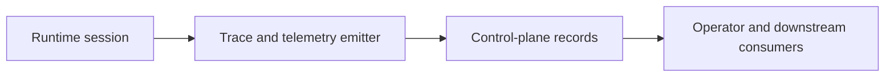

# Production Agent Observability And SLOs

This page defines the minimum observability and readiness expectations for the production
autokairos agent.

It follows:

- [13-execution-attempt-contract.md](../../specs/13-execution-attempt-contract.md)
- [15-persistent-operations-and-wake-policy.md](15-persistent-operations-and-wake-policy.md)
- [16-production-agent-state-machine.md](16-production-agent-state-machine.md)
- [17-production-agent-tool-surface-and-guardrails.md](17-production-agent-tool-surface-and-guardrails.md)
- [../agent-system/08-production-agent-design.md](../../agent-system/08-production-agent-design.md)

It is informed by:

- [OpenAI Agents SDK: Results](https://openai.github.io/openai-agents-js/guides/results/)
- [OpenAI Agents SDK: Human-in-the-loop](https://openai.github.io/openai-agents-js/guides/human-in-the-loop/)
- [Anthropic: Harness design for long-running application development](https://www.anthropic.com/engineering/harness-design-long-running-apps)
- [OpenAI: Harness engineering](https://openai.com/index/harness-engineering/)

## Thesis

A trading agent is not production-ready unless it is externally observable while it is running,
while it is blocked, and while it is recovering.

## Why This Spec Exists

This spec exists to answer one question:

**what must operators and downstream systems be able to see in order to trust the production
agent?**

## Canonical Object / Interface / Boundary

The observability boundary is:

The runtime may own live local detail, but production trust depends on what exits the runtime.

## Required Fields Or Required Behaviors

## 1. Required Event Families

The production agent must emit these event families externally.

### Execution lifecycle events

- request accepted
- attempt created
- runtime attached
- runtime resumed
- runtime completed
- runtime interrupted
- runtime failed

### Operational state events

- `idle`
- `waking`
- `active`
- `waiting_on_approval`
- `paused`
- `recovering`
- `degraded`

### Tool and guardrail events

- tool invocation started
- tool invocation finished
- tool invocation blocked
- approval requested
- approval resolved
- tripwire or halt raised

### Wake and recovery events

- wake class chosen
- wake latency measured
- recovery started
- recovery succeeded or failed

## 2. Required Correlation Fields

Every production event should be attributable.

At minimum, emitted events should be linkable to:

- `agent_identity_ref`
- `session_ref`
- `candidate_ref`
- `execution_request_ref`
- `execution_attempt_ref`
- `stage`
- timestamp

## 3. Required Telemetry Dimensions

The production agent should expose telemetry on:

- wake latency
- time to first trace event
- active loop duration
- approval wait duration
- tool failure rate
- guardrail trigger rate
- recovery success rate
- trace-delivery lag

## 4. Required Operational Answers

The observability surface should let an operator answer:

- Is the agent healthy right now?
- Is it active, waiting, paused, or degraded?
- What stage is it operating under?
- What was the last meaningful action?
- Is it blocked on approval?
- Has recovery already been attempted?
- Are traces still arriving?

## 5. Stage-Specific Readiness Targets

The system should define readiness targets by stage.

Required rule:

- stage-specific wake and visibility objectives must exist before that stage is considered
  production-ready

Minimum interpretation:

- `backtesting`
  slower wake is acceptable, but trace completeness still matters
- `paper`
  warm wake and clear approval or health visibility matter
- `live`
  warm minimum, rapid diagnosis, and no silent degradation paths

## 6. No Silent Failure Paths

The production agent should never fail in a way that leaves operators blind.

Required rule:

- if runtime execution is lost, some external event must indicate disruption or recovery attempt

## Lifecycle Or State Model

Observability must cover the full operational loop.

1. request accepted
2. waking
3. active execution
4. approval wait or pause if applicable
5. completion or recovery
6. idle or degraded

## What This Spec Is Not

This spec is not:

- a full metrics backend design
- a dashboard design
- a log-storage vendor choice
- the trace schema itself

## Failure Modes / Invariants

The key invariants are:

- production runs must be externally inspectable while active
- blocked and degraded states must be visible
- no stage should be considered production-ready without explicit wake/readiness expectations
- trace and telemetry should outlive one runtime process

The design is failing if:

- the only way to understand the run is to attach to the container
- approvals happen but are not externally visible
- degraded posture is inferred only after the fact from missing logs
- wake latency is treated as an implementation detail rather than an operating property

## Relationship To Adjacent Specs

This spec depends on:

- [13-execution-attempt-contract.md](../../specs/13-execution-attempt-contract.md)
- [15-persistent-operations-and-wake-policy.md](15-persistent-operations-and-wake-policy.md)
- [16-production-agent-state-machine.md](16-production-agent-state-machine.md)
- [17-production-agent-tool-surface-and-guardrails.md](17-production-agent-tool-surface-and-guardrails.md)

It constrains:

- [../agent-system/07-persistent-operations-model.md](../../agent-system/07-persistent-operations-model.md)
- [../agent-system/08-production-agent-design.md](../../agent-system/08-production-agent-design.md)
- [../control-plane/03-record-model.md](../../control-plane/03-record-model.md)
