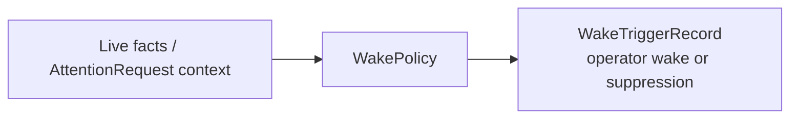

# Wake Policy Contract

This page defines the minimum `WakePolicy` contract needed by the current MLP-01 baseline.

It follows:

- [../04-pr4-live-runtime-remains-controllable-design.md](../04-pr4-live-runtime-remains-controllable-design.md)

## Thesis

`WakePolicy` is the durable control-plane policy that defines when one live runtime may wake the
operator.

It is where autokairos says:

- which live scope is being watched
- which attention conditions are operator-wake-worthy
- how urgency should be interpreted
- what should be suppressed or deduped

Without this object, wake authority drifts into runtime heuristics and noisy monitoring.

## Current Active Applicability

This spec is currently active for PR4.

Its job is to make meaningful operator wake authority durable before individual wake events happen.

## What This Is Not

`WakePolicy` is not:

- one fired wake
- one operator action
- one execution attempt
- a broad scheduler platform

Most importantly:

- policy defines wake authority
- wake trigger record preserves one evaluated event
- operator action comes afterward

## Canonical Role In The System

## Minimum Contract

A `WakePolicy` must carry at least:

| Field | Meaning |
| --- | --- |
| `wake_policy_id` | Stable durable identity |
| `governed_scope_ref` | One live candidate or live runtime scope |
| `attention_condition_description` | Semantic description of conditions that may justify operator attention |
| `context_ref_requirements` | Required context refs for an operator-visible wake decision |
| `urgency_rules` | How urgency should be classified |
| `suppression_posture` | What gets deduped, delayed, or suppressed |
| `delivery_surface` | Where the operator wake should appear |
| `authority_basis` | Why the policy is allowed to wake |
| `provenance` | Who or what created or updated the policy |
| `status` | `enabled`, `paused`, `superseded`, `expired`, or `revoked` |
| `updated_at` | Latest durable policy change time |

## Required Interpretation

The current active baseline is rigid about:

- governed scope
- attention-condition meaning
- context refs required for inspection
- urgency rules
- suppression posture
- authority basis
- status

This is the minimum needed to keep wake meaning explicit and non-noisy.

## Boundary Rules

- wake policy truth must remain outside the runtime
- one governed live runtime should have one inspectable current wake policy posture
- a paused or revoked policy must not continue waking the operator
- meaningful operator wake should be defined by explicit policy, not by incidental log volume
- policy may classify context for operator attention; it must not become a runtime event-handler map
- wake policy may evaluate `AttentionRequest` context for operator attention, but it does not own
  runtime activation or `NextAttentionPlan` validation
- runtime attention can occur without waking the operator

## Not In The Active Baseline

The current active baseline does not require:

- broad scheduler-program families
- governed self-scheduling surfaces
- general-purpose cadence registries
- trigger-taxonomy dispatch

If later work needs those, it should add them deliberately rather than broadening this contract by
default.
