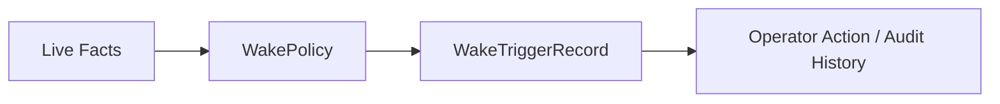

# Wake Trigger Record Contract

This page defines the minimum `WakeTriggerRecord` contract needed by the current MLP-01 baseline.

It follows:

- [21-wake-policy-contract.md](21-wake-policy-contract.md)
- [../04-pr4-live-runtime-remains-controllable-design.md](../04-pr4-live-runtime-remains-controllable-design.md)

## Thesis

`WakeTriggerRecord` is the durable history object for one evaluated wake event.

It is where autokairos says:

- what live fact was evaluated
- why it did or did not wake the operator
- what urgency posture applied
- what operator action, if any, followed

Without this record, wake behavior becomes a log-forensics problem and intervention loses audit
meaning.

## Current Active Applicability

This spec is currently active for PR4.

Its job is to make one wake event durable whether it was emitted or suppressed.

## What This Is Not

`WakeTriggerRecord` is not:

- the `WakePolicy`
- a runtime `AttentionRequest`
- a `NextAttentionPlan`
- the substrate signal itself
- the operator action itself
- an execution request

Most importantly:

- the policy authorizes evaluation
- the trigger record preserves one evaluated event
- operator action is a later linked outcome
- runtime attention may happen many times without producing a wake trigger record

## Canonical Role In The System

## Minimum Contract

A `WakeTriggerRecord` must carry at least:

| Field | Meaning |
| --- | --- |
| `wake_trigger_record_id` | Stable durable identity |
| `wake_policy_ref` | Policy consulted during evaluation |
| `candidate_ref` | Live candidate whose situation was evaluated |
| `execution_attempt_ref` | Current live attempt involved when relevant |
| `trigger_family` | Type of wake-worthy condition observed |
| `detected_fact_refs` | Supporting substrate or execution facts |
| `wake_disposition` | `emitted` or `suppressed` |
| `urgency` | Urgency posture for the event |
| `wake_reason_summary` | Operator-readable explanation of why this matters now |
| `evaluated_at` | When the evaluation finished |
| `linked_operator_action_refs` | Resulting operator actions when they occurred |

## Required Interpretation

The record must preserve enough meaning to answer:

- what happened?
- why was it wake-worthy or suppressible?
- was the operator actually interrupted?
- what action happened afterward, if any?

Suppressed triggers still matter.

They must remain durable enough to explain why the system did not wake the operator.

## Boundary Rules

- wake-trigger history must remain outside the runtime
- a trigger record must preserve meaningful explanation, not just a raw event code
- emitted and suppressed outcomes are both first-class durable outcomes
- `WakeTriggerRecord` is operator-facing wake history; it is not the generic runtime activation log
- attention-quality review and wake-trigger evaluation are related but distinct
- intervention history may link back to the wake trigger record rather than living only in chat or
  logs

## Not In The Active Baseline

The current active baseline does not require:

- broader proactive-evaluation linkage families
- overlap/coalescing pipelines
- scheduler-deep causal metadata

If later work needs those, it should add them deliberately rather than broadening this contract by
default.
