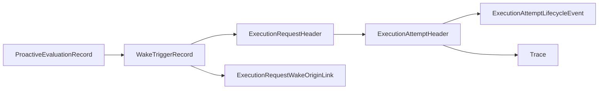

# Execution Record Store Contract

This page defines the first persisted record-store shape for governed execution.

It follows:

- [12-governed-execution-request-contract.md](../../specs/12-governed-execution-request-contract.md)
- [13-execution-attempt-contract.md](../../specs/13-execution-attempt-contract.md)
- [23-wake-trigger-record-contract.md](../../specs/23-wake-trigger-record-contract.md)
- [36-proactive-evaluation-record-contract.md](36-proactive-evaluation-record-contract.md)
- [38-proactive-evaluation-to-execution-linkage-contract.md](38-proactive-evaluation-to-execution-linkage-contract.md)
- [28-wake-policy-precedence-and-overlap-contract.md](28-wake-policy-precedence-and-overlap-contract.md)
- [../agent-system/06-first-code-seam.md](../../agent-system/06-first-code-seam.md)
- [../control-plane/03-record-model.md](../../control-plane/03-record-model.md)
- [../../sources/library/anthropic-managed-agents.md](../../../sources/library/anthropic-managed-agents.md)
- [../../sources/library/openai-next-evolution-of-the-agents-sdk.md](../../../sources/library/openai-next-evolution-of-the-agents-sdk.md)
- [../../sources/library/repo-multica.md](../../../sources/library/repo-multica.md)

It is also informed by additional official documentation:

- [OpenAI Sessions](https://openai.github.io/openai-agents-js/guides/sessions/)
- [OpenAI Results](https://openai.github.io/openai-agents-js/guides/results/)
- [OpenAI Running Agents](https://openai.github.io/openai-agents-js/guides/running-agents/)
- [OpenClaw Automation](https://docs.openclaw.ai/automation)
- [Claude Code Scheduled Tasks](https://code.claude.com/docs/en/scheduled-tasks)

## Thesis

The first execution store should not persist governed work as one opaque run blob.

It should persist a small normalized record family that keeps:

- request truth
- wake provenance
- concrete attempt truth
- attempt lifecycle history

durable outside the runtime.

## Why This Spec Exists

The higher-level contracts already define what `ExecutionRequest` and `ExecutionAttempt` mean.

Implementation still needs one more decision:

**how should these objects actually be stored so wake provenance, attempt history, and control-plane
truth survive runtime loss, overlap coalescing, and retries?**

Without that decision, the first implementation will drift toward one of the wrong defaults:

- one giant JSON run blob
- stdout and logs as the only history
- scheduler memory as the source of wake provenance
- mutable request rows that overwrite coalesced-origins history

## Canonical Object / Interface / Boundary

This spec defines the first-cut persisted execution-record family:

1. `ExecutionRequestHeader`
2. `ExecutionRequestWakeOriginLink`
3. `ExecutionAttemptHeader`
4. `ExecutionAttemptLifecycleEvent`

Operationally:

The intended storage posture is:

- request and attempt headers are current-state snapshots
- wake-origin links preserve request provenance
- attempt lifecycle events preserve transition history
- trace remains adjacent but separate

## Required Fields Or Required Behaviors

## 1. ExecutionRequestHeader

This is the durable current-state snapshot for one governed invocation.

### Required fields

| Field | Notes |
| --- | --- |
| `execution_request_id` | Primary durable request identifier |
| `agent_identity_ref` | Who is being invoked |
| `candidate_ref` | What promotable lineage the request advances |
| `session_ref` | Which continuity line the request belongs to |
| `requested_stage` | Requested legitimacy level |
| `origin_kind` | `manual`, `scheduler`, `review_followup`, `retry`, or another explicit system origin |
| `objective_text` or `objective_payload_ref` | Why the run is being asked for |
| `request_status` | Current request state |
| `created_at` | Request creation timestamp |

### Strongly recommended nullable fields

| Field | Notes |
| --- | --- |
| `requested_by_ref` | Human or system caller reference |
| `reason` | Human-readable reason |
| `preferred_execution_mode` | Hint, not binding |
| `runtime_family_hint` | Hint, not binding |
| `priority_class` | Scheduling and queueing hint |
| `timeout_profile_ref` | Duration or timeout policy |
| `idempotency_key` | Replay protection |
| `supersedes_execution_request_ref` | Explicit replacement chain |
| `review_item_ref` | Governance work source when applicable |
| `evidence_record_ref` | Evidence source when applicable |
| `promotion_decision_ref` | Promotion source when applicable |
| `wake_origin_posture` | `single_trigger`, `overlap_primary`, or `not_applicable` |
| `primary_wake_trigger_record_ref` | Canonical proactive wake cause when emitted by orchestration |
| `originating_proactive_evaluation_record_ref` | Optional denormalized helper for the primary proactive cause |
| `originating_wake_policy_ref` | Active policy that justified the emitted request |
| `originating_standing_order_ref` | Standing authority that constrained the request |
| `accepted_at` | Control plane accepted it as runnable |
| `fulfilled_at` | At least one attempt was created |
| `canceled_at` | Canceled before or after acceptance |
| `superseded_at` | Replaced by a newer request |

### Required behavior

`ExecutionRequestHeader` must remain the canonical current-state owner of:

- request identity
- target context
- current request status
- primary wake cause

It must not hide coalesced wake origins inside one free-form text field.

## 2. ExecutionRequestWakeOriginLink

This is the persisted provenance link family between a request and the wake-trigger records that
materially contributed to it.

### Required fields

| Field | Notes |
| --- | --- |
| `execution_request_wake_origin_link_id` | Durable link identifier |
| `execution_request_ref` | Owning request |
| `wake_trigger_record_ref` | Contributing trigger record |
| `link_role` | `primary` or `coalesced` |
| `precedence_rank` | Deterministic ordering, with `0` for the primary cause |
| `created_at` | Link creation time |

### Strongly recommended nullable fields

| Field | Notes |
| --- | --- |
| `precedence_reason` | Why this trigger became primary or was coalesced |
| `originating_proactive_evaluation_record_ref` | Durable pointer back to the proactive evaluation that emitted this wake candidate |
| `suppression_summary` | Optional carry-forward summary when a candidate was merged rather than emitted independently |

### Required behavior

This link family must make it possible to answer:

- which wake-trigger record actually emitted the request?
- which additional wake candidates were coalesced into it?
- in what deterministic order were those origins resolved?

The request header may duplicate the primary wake reference for fast joins, but the link family is
the durable home of one-to-many wake provenance.

## 3. ExecutionAttemptHeader

This is the durable current-state snapshot for one concrete try to run one request.

### Required fields

| Field | Notes |
| --- | --- |
| `execution_attempt_id` | Primary attempt identifier |
| `execution_request_ref` | Owning request |
| `agent_identity_ref` | Denormalized for joins |
| `candidate_ref` | Denormalized for joins |
| `session_ref` | Denormalized for joins |
| `stage` | Resolved stage actually run |
| `stage_binding_ref` | Resolved stage binding |
| `execution_mode` | `host-local`, `containerized-local`, or `containerized-remote` |
| `execution_driver_kind` | Which bridge/driver family ran it |
| `workspace_ref` | Materialized workspace |
| `trace_ref` | Primary raw trace stream |
| `attempt_status` | Current attempt status |
| `created_at` | Attempt row creation time |

### Strongly recommended nullable fields

| Field | Notes |
| --- | --- |
| `worker_image_ref` | Container image when relevant |
| `runtime_host_ref` | Host/device/container reference |
| `runtime_handle_ref` | Live runtime session or driver handle |
| `primary_wake_trigger_record_ref` | Denormalized join helper copied from the request |
| `accepted_at` | Attempt accepted as concrete work |
| `started_at` | Runtime launch actually began |
| `last_heartbeat_at` | Last liveness heartbeat |
| `completed_at` | Clean completion |
| `failed_at` | Explicit failure |
| `abandoned_at` | Lost or non-clean end |
| `canceled_at` | Intentional stop |
| `failure_code` | Structured failure category |
| `failure_summary` | Human-readable failure summary |
| `interrupt_reason` | Why it stopped in a resumable way |
| `resumable` | Whether explicit resume is expected |

### Required behavior

`ExecutionAttemptHeader` must remain the canonical current-state owner of:

- resolved execution posture
- current attempt status
- current runtime/workspace/trace association

It may copy the primary wake reference for joins, but it must not become the canonical owner of:

- overlap resolution
- coalesced wake provenance
- wake-authority interpretation

## 4. ExecutionAttemptLifecycleEvent

This is the append-only event family for attempt state transitions.

### Required fields

| Field | Notes |
| --- | --- |
| `execution_attempt_lifecycle_event_id` | Durable lifecycle-event identifier |
| `execution_attempt_ref` | Owning attempt |
| `to_status` | New attempt status |
| `event_kind` | `accepted`, `preparing`, `launching`, `active`, `heartbeat`, `interrupted`, `completed`, `failed`, `abandoned`, or `canceled` |
| `event_time` | When the transition or heartbeat happened |

### Strongly recommended nullable fields

| Field | Notes |
| --- | --- |
| `from_status` | Previous status when known |
| `emitted_by_surface` | `control_plane`, `runtime_bridge`, `runtime_host`, `operator`, or similar |
| `reason_code` | Structured reason code |
| `reason_summary` | Human-readable explanation |

### Required behavior

The first store should preserve attempt transition history as append-only events rather than only
overwriting one mutable status field.

This is what keeps the system explainable when an attempt:

- flaps between `launching` and `interrupted`
- recovers after partial failure
- emits heartbeats for a long time
- becomes `abandoned` after container loss

## 5. Required Query Surfaces

Whatever concrete database is chosen first, the record store should support these queries without
falling back to log-forensics.

### Request-side queries

- active requests by `candidate_ref` and `requested_stage`
- requests emitted by one `primary_wake_trigger_record_ref`
- requests descended from one `originating_proactive_evaluation_record_ref`
- requests linked to one `review_item_ref`
- requests superseded from one prior request

### Attempt-side queries

- attempts for one `execution_request_ref`
- latest active attempt for one `candidate_ref`
- attempts by `session_ref`
- attempts by `attempt_status`
- attempts linked to one `trace_ref`

### Provenance-side queries

- wake-trigger records that coalesced into one request
- requests created from one standing order or wake policy
- all attempts descended from one primary wake trigger

## Lifecycle Or State Model

The store shape should follow this layered model:

1. request header created
2. zero or more wake-origin links attached
3. request accepted or superseded
4. one or more attempt headers created from the request
5. append-only attempt lifecycle events record state transitions
6. request header eventually becomes fulfilled, canceled, or superseded

The important point is that request identity, wake provenance, and attempt history remain separate
but joinable.

## What This Is Not

This spec is not:

- a runtime-connector API definition
- a trace schema
- a full SQL DDL file
- a generic graph database model for every future control-plane relation
- a UI read model

It is the first narrow persisted shape for execution records.

## Failure Modes / Invariants

### Invariants

- every proactively emitted request has exactly one primary wake-origin link
- a request may have zero or more coalesced wake-origin links
- the request header is the current-state owner of primary wake cause
- the attempt header is the current-state owner of concrete execution posture
- attempt lifecycle history is append-only
- retries create new attempt headers rather than mutating one old attempt into many tries

### Failure modes

- coalesced wake origins exist only in logs or prose
- request provenance is reduced to a generic `scheduler` label
- attempt history is only the latest mutable status value
- one opaque JSON blob becomes the only durable execution record
- overlap precedence can no longer be reconstructed from persisted records
- runtime-local handles become the only durable identifier for a live attempt

## Relationship To Adjacent Specs

- [12-governed-execution-request-contract.md](../../specs/12-governed-execution-request-contract.md)
  defines the canonical invocation object above these stored shapes.
- [13-execution-attempt-contract.md](../../specs/13-execution-attempt-contract.md)
  defines the canonical concrete-try object above these stored shapes.
- [23-wake-trigger-record-contract.md](../../specs/23-wake-trigger-record-contract.md)
  defines the durable proactive history linked into request provenance.
- [38-proactive-evaluation-to-execution-linkage-contract.md](38-proactive-evaluation-to-execution-linkage-contract.md)
  defines the stricter causal rule that keeps proactive evaluation, wake history, and execution
  issuance joinable.
- [28-wake-policy-precedence-and-overlap-contract.md](28-wake-policy-precedence-and-overlap-contract.md)
  defines how one primary wake cause and coalesced origins are chosen.
- [../agent-system/06-first-code-seam.md](../../agent-system/06-first-code-seam.md)
  explains why this store shape belongs ahead of runtime-connector implementation.
- [../control-plane/03-record-model.md](../../control-plane/03-record-model.md)
  places this store family inside control-plane durable truth.
