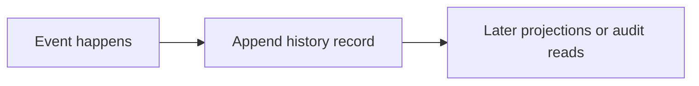

# History Record Families Contract

This page defines what kinds of autokairos records must remain append-only durable history.

It follows:

- [30-event-log-first-durable-truth-posture.md](30-event-log-first-durable-truth-posture.md)
- [23-wake-trigger-record-contract.md](../../specs/23-wake-trigger-record-contract.md)
- [29-execution-record-store-contract.md](29-execution-record-store-contract.md)
- [09-trace-contract.md](../../specs/09-trace-contract.md)
- [11-promotion-decision-contract.md](../../specs/11-promotion-decision-contract.md)
- [../control-plane/07-history-and-projection-model.md](../../control-plane/07-history-and-projection-model.md)

It is also informed by additional official documentation:

- [OpenAI Results](https://openai.github.io/openai-agents-js/guides/results/)
- [Claude Code Scheduled Tasks](https://code.claude.com/docs/en/scheduled-tasks)
- [MongoDB Change Streams](https://www.mongodb.com/docs/manual/changestreams/)

## Thesis

Some autokairos records are facts about what happened and should therefore remain append-only
history.

They should not be rewritten into one mutable "latest status" surface.

## Why This Spec Exists

The event-log-first posture is too vague unless it says which record families are actually history.

Without that distinction:

- lifecycle events drift into status overwrites
- proactive wake history drifts into scheduler state only
- governance history drifts into prose summaries
- traces drift into ephemeral logs

## Canonical Object / Interface / Boundary

This spec defines `HistoryRecordFamily`.

A history record family is authoritative for chronology and causality.

## Required Fields Or Required Behaviors

## 1. Core history properties

Every history family should preserve:

- durable identifier
- occurrence time
- recorded time when distinct
- emitting or observing surface
- causal references when they exist
- structured reason or event kind

## 2. Canonical history families now

The current architecture already implies these history families.

### Proactive history

- `WakeTriggerRecord`
- `ProactiveEvaluationRecord`
- self-scheduling intent history and disposition history

### Execution history

- `ExecutionAttemptLifecycleEvent`
- trace event history or stable trace references

### Governance history

- `PromotionDecision`
- future review-lifecycle history when it is split out explicitly
- future policy supersession history when it is split out explicitly

## 3. Append-only rule

History records should be appended, not updated in place, except for narrow remediation metadata
such as:

- ingest annotations
- backfill provenance
- corruption repair markers

The thing that happened should not be silently replaced by a new version.

## 4. Causality rule

Where autokairos already has explicit causal links, history should preserve them.

Examples:

- a wake-trigger record that emitted an execution request
- a lifecycle event that changed an attempt to `failed`
- a promotion decision that changed candidate standing

## 5. Audit rule

History must remain explainable without requiring one mutable projection row to tell the story.

That means an audit reader should be able to answer:

- what happened?
- why did it happen?
- what changed because of it?

from history itself plus stable references.

## Lifecycle Or State Model

History families do not usually have a mutable lifecycle of their own.

Their lifecycle is mostly:

1. emitted
2. stored durably
3. referenced by projections, audit, or downstream interpretation

They may later be:

- compacted for storage
- archived
- replayed into projections

But not rewritten as if a different event happened.

## What This Is Not

This spec is not saying:

- every object in autokairos is an event
- every read must replay the full log
- history must always be stored in one event-store product

It is saying something narrower:

**some record families are authoritative because they capture chronology, and those families must
remain append-only durable history.**

## Failure Modes / Invariants

### Invariants

- wake and execution chronology remain reconstructable
- governance history remains inspectable
- history is not reducible to the latest projection

### Failure modes

- lifecycle arrays rewritten in place
- only the latest request or attempt status remains
- traces exist only in stdout or runtime-local files
- decisions are only visible through current candidate status

## Relationship To Adjacent Specs

This spec works with:

- [30-event-log-first-durable-truth-posture.md](30-event-log-first-durable-truth-posture.md)
- [32-current-state-projection-families-contract.md](32-current-state-projection-families-contract.md)

It sharpens the interpretation of:

- [23-wake-trigger-record-contract.md](../../specs/23-wake-trigger-record-contract.md)
- [29-execution-record-store-contract.md](29-execution-record-store-contract.md)
- [09-trace-contract.md](../../specs/09-trace-contract.md)
- [11-promotion-decision-contract.md](../../specs/11-promotion-decision-contract.md)
